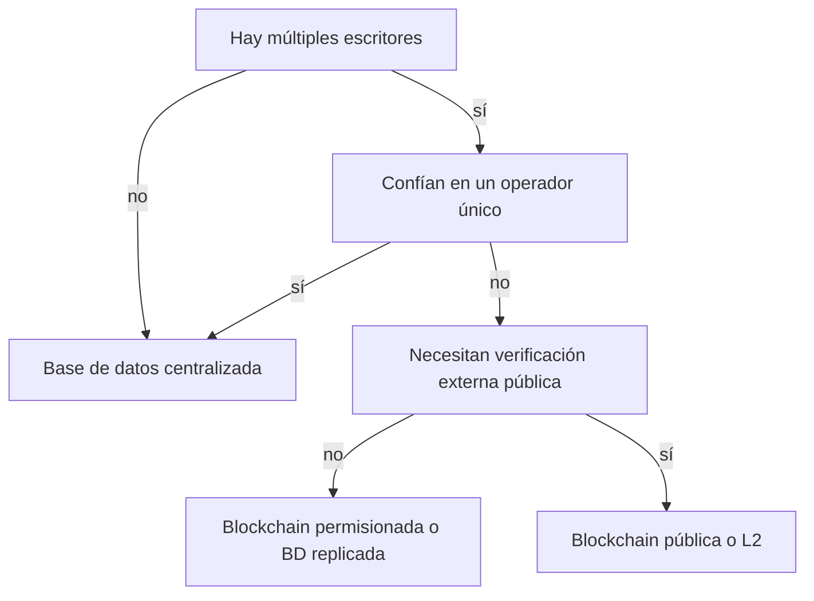

# ADR-001 · ¿Blockchain o base de datos?

> **Estado:** guía educativa · **Ámbito:** arquitectura de datos · [⬅️ Índice de ADRs](README.md)

## Contexto

Varios participantes necesitan registrar y consultar cambios sobre un mismo conjunto de datos. La pregunta de fondo no es "¿podemos usar blockchain?" sino "¿está justificado el costo del consenso compartido?". Una blockchain replica cada escritura en todos los nodos, sacrifica rendimiento y privacidad, y complica la corrección de errores; a cambio elimina la necesidad de confiar en un operador único. Si esa confianza ya existe (o puede establecerse por contrato legal), una base de datos tradicional es casi siempre la respuesta correcta.

Este ADR formaliza el árbol de decisión que el programa presenta en el módulo 00: la mayoría de los proyectos que evalúan blockchain terminan, correctamente, en una base de datos.

## Opciones

| Criterio | BD centralizada | BD replicada multi-org | Blockchain permisionada | Blockchain pública / L2 |
| --- | --- | --- | --- | --- |
| Confianza requerida | Total en un operador | Alta entre organizaciones | Media: consorcio conocido | Mínima: reglas del protocolo |
| Verificabilidad externa | Nula (auditoría a posteriori) | Baja | Media: solo miembros | Alta: cualquiera verifica |
| Corrección de errores | Trivial (UPDATE) | Coordinada | Posible por gobernanza | Muy difícil o imposible |
| Privacidad | Total | Alta | Configurable | Baja por defecto |
| Costo por escritura | Muy bajo | Bajo | Medio (operación de nodos) | Variable: consúltalo en vivo |

## Criterios de decisión

- ¿Hay **múltiples escritores** que no confían plenamente entre sí ni en un tercero neutral?
- ¿Necesitan actores **externos** (usuarios, reguladores, competidores) verificar el registro sin pedir permiso?
- ¿Es aceptable que los **errores no puedan corregirse** con un simple UPDATE, sino con transacciones compensatorias?
- ¿Los datos pueden ser **públicos o seudónimos**, o hay información sensible que jamás debería replicarse?
- ¿El valor de eliminar al intermediario **supera el costo** en rendimiento, operación y gestión de claves?

Si respondes "no" a las dos primeras preguntas, la decisión ya está tomada: base de datos.

## Decisión educativa

El programa recomienda por defecto **una base de datos tradicional** (con firmas digitales y logs de auditoría si hace falta integridad demostrable). Solo cuando se cumplen simultáneamente los criterios de múltiples escritores sin confianza plena y verificabilidad externa se justifica una blockchain; y en ese caso, pública o L2 antes que permisionada (ver [ADR-002](002-publica-vs-permisionada.md)).

La razón pedagógica: aprender a decir "aquí no hace falta blockchain" es la primera competencia de un arquitecto serio en este campo.

## Consecuencias

Positivas:

- Se evita complejidad accidental: consenso, gas, wallets y gobernanza solo cuando aportan valor.
- Los proyectos que sí usan blockchain lo hacen con una justificación defendible ante negocio y auditoría.

Negativas:

- Se renuncia a la verificabilidad pública en los casos "grises", donde podría aportar confianza de marca.
- Migrar después de una BD a una blockchain es costoso: hay que diseñar la salida de datos desde el inicio si el caso puede evolucionar.

## Señales para reconsiderar

- Aparecen nuevos escritores externos que no aceptan al operador actual como árbitro.
- Un regulador o cliente exige pruebas de integridad verificables por terceros en tiempo real.
- El costo de transacción en L2 baja tanto (post EIP-4844 ya cayó de forma drástica) que anclar hashes públicos se vuelve marginal.

## Referencias

- NIST, *Blockchain Technology Overview* (NISTIR 8202): <https://nvlpubs.nist.gov/nistpubs/ir/2018/NIST.IR.8202.pdf>
- Wüst y Gervais, *Do you need a Blockchain?*: <https://eprint.iacr.org/2017/375.pdf>
- Ethereum.org, *What is Ethereum?*: <https://ethereum.org/en/what-is-ethereum/>
