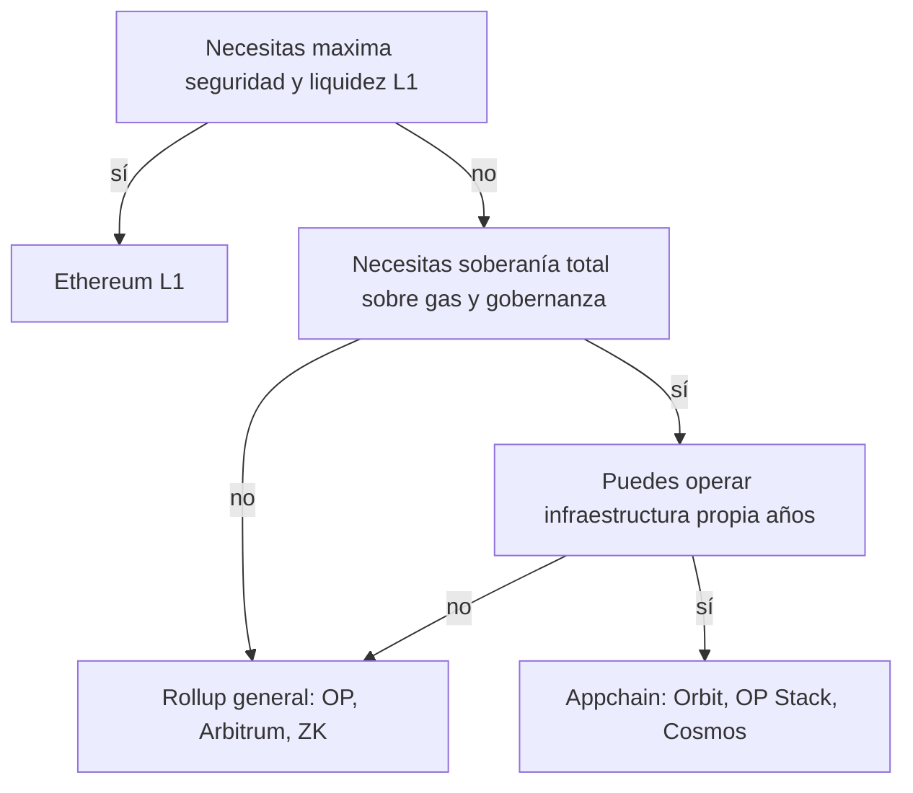

# ADR-005 · ¿L1, L2 o appchain?

> **Estado:** guía educativa · **Ámbito:** capa de despliegue · [⬅️ Índice de ADRs](README.md)

## Contexto

Elegida una red pública ([ADR-002](002-publica-vs-permisionada.md)), falta decidir la capa: desplegar en la L1 de Ethereum, en un rollup de propósito general (Arbitrum, OP Mainnet, zkSync y similares), levantar una appchain propia (Cosmos SDK, Arbitrum Orbit, OP Stack) o usar una sidechain con su propia seguridad. Desde EIP-4844 (2024) los rollups publican sus datos en blobs y el costo por transacción en L2 cayó drásticamente (a menudo a centavos o menos; el valor exacto: consúltalo en vivo), lo que desplazó el defecto razonable de L1 a L2 para casi cualquier aplicación nueva.

El error clásico es decidir solo por TPS. Los criterios que de verdad separan las opciones son la seguridad heredada, la disponibilidad de datos, quién opera el secuenciador, la calidad del puente y del mecanismo de escape, y cuánta carga operativa asume tu equipo.

## Opciones

| Criterio | L1 Ethereum | L2 rollup general | Appchain propia | Sidechain |
| --- | --- | --- | --- | --- |
| Seguridad | Máxima (validadores de Ethereum) | Heredada de L1 vía pruebas | La que tú construyas | Propia, usualmente menor |
| Costo por tx | Alto en congestión | Bajo post EIP-4844 | Marginal, pero pagas la infraestructura | Bajo |
| Soberanía (gas, gobernanza, MEV) | Nula | Baja | Total | Alta |
| Liquidez y composabilidad | Máxima | Alta y creciente | Aislada: depende de puentes | Media |
| Carga operativa | Ninguna | Ninguna | Validadores/secuenciador propios, upgrades, monitoreo | Alta |
| Madurez verificable | N/A | Etapas 0-2 de L2BEAT | Depende de ti | Variable |

## Criterios de decisión

- ¿Cuánto vale cada transacción? Liquidaciones de alto valor toleran fees de L1; interacciones frecuentes no.
- ¿Necesitas **composabilidad síncrona** con protocolos existentes (DeFi, stablecoins)? Eso ancla a L1 o a una L2 grande.
- ¿Requieres **soberanía real**: tu token como gas, ordenamiento propio, gobernanza independiente? Solo la appchain la da.
- ¿Tu equipo puede **operar infraestructura** (secuenciador, nodos, upgrades) durante años, o es distracción del producto?
- ¿Qué etapa L2BEAT tiene el rollup candidato (Stage 0/1/2)? ¿Existe salida forzada (*escape hatch*) si el secuenciador censura?

## Decisión educativa

El programa recomienda por defecto **desplegar en una L2 rollup de propósito general** con buena posición en L2BEAT: seguridad heredada de Ethereum, costos bajos, herramientas idénticas a L1 y cero carga operativa. L1 queda para lo que exige máxima seguridad o composabilidad con liquidez profunda; la appchain, solo cuando la soberanía es requisito de producto y hay equipo para sostenerla. Las sidechains sin herencia de seguridad se estudian, pero no se recomiendan para valor significativo.

## Consecuencias

Positivas:

- Los proyectos del programa se despliegan con costos de centavos sin renunciar a la seguridad de Ethereum.
- Se aprende una sola toolchain (EVM) reutilizable en L1, L2 y OP Stack/Orbit.

Negativas:

- Dependencia del secuenciador (hoy centralizado en casi todas las L2) y de la gobernanza del rollup.
- Fragmentación: liquidez y usuarios repartidos entre L2s, con puentes como superficie de riesgo.

## Señales para reconsiderar

- El rollup elegido se estanca en Stage 0 o su hoja de descentralización no avanza.
- Los costos o límites de la L2 general se vuelven el cuello de botella del producto (señal de appchain).
- Cambios en la disponibilidad de datos (más blobs, danksharding completo) que reordenen los costos: consúltalo en vivo.

## Referencias

- L2BEAT (riesgo y etapas de rollups): <https://l2beat.com/>
- Ethereum.org, rollups: <https://ethereum.org/en/developers/docs/scaling/>
- Vitalik Buterin, *The different types of layer 2s*: <https://vitalik.eth.limo/general/2023/10/31/l2types.html>
- EIP-4844: <https://eips.ethereum.org/EIPS/eip-4844>
