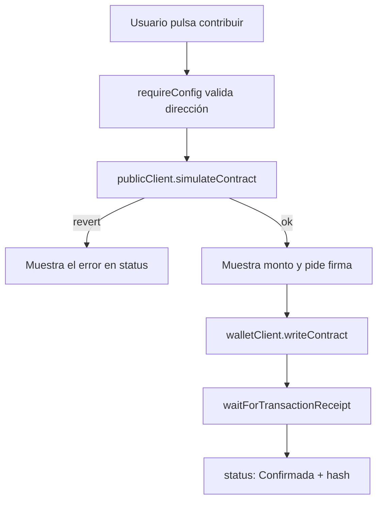

# Interfaz web · Community Funding

> Navegación: [Inicio](../../README.md) · [Currículo](../../curriculum/README.md) · [Módulo 07 · dApps](../../curriculum/07-dapps/README.md) · [Despliegue local](../../docs/despliegue-local.md)

Interfaz mínima construida con [viem](https://viem.sh/) y [Vite](https://vitejs.dev/) que interactúa con el contrato `CommunityFunding`. Demuestra el flujo profesional de una dApp: **leer estado por RPC, conectar una wallet EIP-1193, simular la llamada, solicitar la firma y esperar la confirmación**. No hay framework de UI ni librería de wallets: todo el código es legible en un solo archivo para entender qué ocurre en cada paso.

## Qué es y qué no es

| Es | No es |
|---|---|
| Un cliente `viem` en TypeScript/JS sobre HTML plano | Una dApp de producción con diseño pulido |
| Un ejemplo de UX segura antes de firmar | Un gestor o custodio de claves |
| Material para el módulo 07 y el proyecto transversal | Un contrato desplegado en mainnet |

La interfaz **nunca solicita ni almacena claves privadas**: delega la firma en la wallet del navegador (`window.ethereum`).

## Requisitos previos

- Node.js 20 o superior y `pnpm` instalado en la raíz del monorepo.
- Un nodo local ([Anvil](https://book.getfoundry.sh/anvil/)) o una testnet accesible por RPC.
- El contrato `CommunityFunding` desplegado (ver [`projects/community-funding`](../../projects/community-funding/README.md) y la guía de [despliegue local](../../docs/despliegue-local.md)).
- Una wallet EIP-1193 en el navegador conectada a la misma red (`chainId`) que la interfaz.

## Variables de entorno

Copia la plantilla y ajusta los valores tras desplegar el contrato:

```bash
cp .env.example .env
```

| Variable | Ejemplo | Rol |
|---|---|---|
| `VITE_CONTRACT_ADDRESS` | `0x5FbDB…` | Dirección del contrato `CommunityFunding` desplegado. La app rechaza la dirección cero. |
| `VITE_CHAIN_ID` | `31337` | Identificador de la red esperada (Anvil por defecto). |
| `VITE_RPC_URL` | `http://127.0.0.1:8545` | Endpoint RPC de solo lectura para el `publicClient`. |

Las variables se leen mediante `import.meta.env`, por lo que **deben** llevar el prefijo `VITE_` para que Vite las exponga al cliente.

## Cómo ejecutarla

Desde la raíz del repositorio:

```bash
# desarrollo con recarga en caliente
pnpm --filter @blockchain-course/community-funding-web dev

# build de producción (genera dist/)
pnpm build:web
```

`pnpm build:web` es un alias de raíz equivalente a `pnpm --filter @blockchain-course/community-funding-web build`.

Salida esperada de `dev`:

```text
  VITE v8.x  ready in 320 ms

  ➜  Local:   http://localhost:5173/
  ➜  press h + enter to show help
```

Abre `http://localhost:5173/`, confirma la red mostrada arriba, conecta la wallet y opera contra tu contrato local.

## Arquitectura

| Componente | Archivo | Rol |
|---|---|---|
| `publicClient` | `src/main.js` | Cliente `viem` de solo lectura sobre HTTP: lee `campaigns` y simula la contribución. |
| `walletClient` | `src/main.js` | Cliente de firma sobre `custom(window.ethereum)`: solicita direcciones y envía la transacción. |
| `localChain` | `src/main.js` | Cadena definida con `defineChain` a partir de `VITE_CHAIN_ID` y `VITE_RPC_URL`. |
| ABI | `src/abi.js` | Fragmento mínimo del ABI: solo `campaigns` (view) y `contribute` (payable). |
| Vista | `index.html` + `src/style.css` | Secciones para conectar, consultar y contribuir; el `<output id="status">` refleja cada estado. |
| Guardas | `requireConfig()` | Bloquea la operación si la dirección no está configurada o es la dirección cero. |

## Flujo de una contribución

El botón "Simular y solicitar firma" ejecuta esta secuencia. La simulación ocurre **antes** de pedir la firma, de modo que un revert se detecta sin gastar gas ni exponer al usuario a firmar algo que fallará.



## Seguridad de UX

- **Muestra la red esperada** (`chainId`) y la dirección del contrato antes de cualquier acción; una red equivocada es la causa más común de fondos perdidos.
- **Simula antes de firmar**: `simulateContract` revierte con el error tipado del contrato (por ejemplo `CampaignEnded`) y el usuario ve el mensaje sin firmar.
- **Comunica el valor exacto**: el estado indica cuántos ETH de prueba se solicitarán antes de abrir la wallet.
- **Estados de transacción explícitos**: `Simulando…`, `Pendiente: 0x…`, `Confirmada: 0x…`. Nunca se deja al usuario sin saber qué ocurre.
- **Solo entornos de prueba**: usa Anvil o una testnet. La interfaz no está pensada para fondos reales.

## Ejercicios sugeridos

1. Añade el flujo de `refund` y `claim` reutilizando el patrón simular → firmar → esperar.
2. Muestra un aviso si el `chainId` de la wallet no coincide con `VITE_CHAIN_ID`.
3. Decodifica y presenta los errores tipados del contrato con un mensaje humano por cada `error`.
