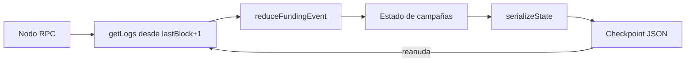

# Indexador de eventos

> Navegación: [Inicio](../../README.md) · [Currículo](../../curriculum/README.md) · [Módulo 10 · Oráculos e indexación](../../curriculum/10-oraculos-indexacion/README.md)

Indexador mínimo en Node.js que reconstruye una vista de campañas de `CommunityFunding` a partir de sus **logs de eventos**, y guarda un **checkpoint** (último bloque procesado) para reanudar sin releer toda la cadena. Es la contraparte del [contrato](../../projects/community-funding/README.md) y de la [interfaz web](../community-funding-web/README.md): un patrón que aparece en todo backend serio de dApp.

## Por qué un indexador y no leer la cadena por clic

Leer el estado con `readContract` en cada interacción no escala: cada consulta paga una latencia de red, no permite ordenar ni filtrar por criterios propios y multiplica la carga sobre el nodo RPC. Un indexador **lee los eventos una vez**, los reduce a una vista consultable localmente y solo pide a la cadena el rango de bloques nuevos desde el último checkpoint.

| Enfoque | Latencia por consulta | Historial | Coste RPC |
|---|---|---|---|
| Leer la cadena por clic | Alta (una llamada por dato) | No lo tienes; solo el estado actual | Crece con cada usuario |
| Indexador con checkpoint | Baja (lee tu vista local) | Reconstruido desde eventos | Acotado al rango nuevo |

## Cómo se ejecuta

Desde la raíz del monorepo, la suite de pruebas del reducer:

```bash
pnpm test:indexer
```

Salida esperada:

```text
✔ reconstruye una campaña desde eventos (Xms)
ℹ tests 1
ℹ pass 1
ℹ fail 0
```

Para correr el proceso completo contra un nodo real (Anvil o testnet):

```bash
cp .env.example .env
set -a; source .env; set +a
pnpm --filter @blockchain-course/event-indexer start
```

Salida esperada tras un ciclo:

```text
Indexado hasta bloque 128. Campañas: 3
```

## Variables de entorno

| Variable | Ejemplo | Rol |
|---|---|---|
| `RPC_URL` | `http://127.0.0.1:8545` | Endpoint RPC del que se leen los logs. |
| `CONTRACT_ADDRESS` | `0x5FbDB…` | Dirección de `CommunityFunding`; se normaliza con `getAddress`. |
| `START_BLOCK` | `0` | Primer bloque a indexar cuando no existe checkpoint previo. |
| `CHECKPOINT_PATH` | `event-indexer-state.json` | Archivo donde se persiste `{ lastBlock, campaigns }`. |

## Arquitectura

| Pieza | Archivo | Rol |
|---|---|---|
| Reducer | `src/reducer.mjs` | Función pura `reduceFundingEvent(state, event)`: aplica un evento y devuelve el nuevo estado sin mutar el anterior (`structuredClone`). |
| Serialización | `src/reducer.mjs` | `serializeState` convierte los `bigint` a texto para poder persistir en JSON. |
| Bucle de ingesta | `src/index.mjs` | Carga el checkpoint, calcula `fromBlock`, pide los logs por evento y aplica el reducer. |
| Checkpoint | `event-indexer-state.json` | Guarda `lastBlock` y el mapa de campañas; permite reanudar de forma incremental. |
| Pruebas | `src/reducer.test.mjs` | Verifica que una campaña se reconstruye a partir de `CampaignCreated` + `Contributed`. |

Eventos que se reducen: `CampaignCreated`, `Contributed`, `Claimed` y `Refunded`.

## Pipeline evento → reducer → estado



## Reducer como función pura

Separar la reducción del bucle de red tiene dos ventajas: se prueba sin nodo (ver `reducer.test.mjs`) y el mismo evento aplicado dos veces produce el mismo resultado, base de un diseño **idempotente**. El estado nunca se muta en sitio: cada evento devuelve una copia nueva.

## Limitaciones que el estudiante debe resolver

El indexador es deliberadamente ingenuo. Convertirlo en robusto exige:

| Limitación | Qué falta | Riesgo si se ignora |
|---|---|---|
| Orden entre eventos | Ordenar por `blockNumber` y `logIndex` al mezclar eventos distintos | Estado inconsistente |
| Reorganizaciones | Esperar N confirmaciones y poder revertir bloques huérfanos | Contabilizar logs que desaparecen |
| Paginación | Trocear rangos grandes de `getLogs` | El nodo rechaza rangos amplios |
| Persistencia transaccional | Escribir estado y checkpoint de forma atómica | Checkpoint adelantado al estado |
| Verificación de red | Validar `chainId` y dirección esperados | Indexar la cadena o el contrato equivocado |

## Relación con el currículo

Este laboratorio concreta las ideas del [módulo 10 · Oráculos e indexación](../../curriculum/10-oraculos-indexacion/README.md): cómo el dato on-chain se transforma en una vista consultable y por qué la seguridad ante reorgs es parte del diseño, no un extra.
