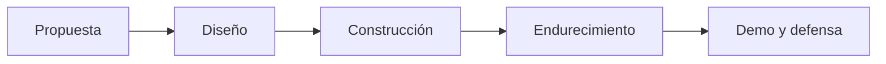

# Proyecto final (capstone)

## Objetivo y qué demuestra

Construye un protocolo pequeño que resuelva un problema real y permita demostrar dominio integral del programa: diseño con criterio, contratos probados con rigor, una interfaz utilizable, datos accesibles y una defensa técnica honesta. El capstone no busca originalidad absoluta, sino evidencia de que sabes tomar decisiones, justificarlas y verificar que el sistema hace lo que afirmas.

Un capstone aprobado demuestra que puedes: elegir blockchain solo cuando corresponde, escribir contratos que resisten fuzzing e invariantes, razonar sobre amenazas antes de que ocurran y comunicar todo eso a un evaluador escéptico.

## Requisitos mínimos

1. **Protocolo con contratos probados con Foundry**, incluyendo pruebas unitarias, de integración, fuzzing e invariantes sobre las propiedades críticas del sistema. Contratos documentados con NatSpec.
2. **dApp o interfaz** accesible que permita ejercitar los flujos principales (no hace falta diseño pulido; sí estados de transacción claros y manejo de errores).
3. **Indexador o estrategia de datos** explícita: subgraph, indexador propio, eventos + consultas RPC o equivalente, con justificación de la elección.
4. **Documento de arquitectura** estilo módulo [18-implementacion-empresarial](../curriculum/18-implementacion-empresarial/README.md): contexto, ADR "¿por qué blockchain y qué alternativa se descartó?", diagrama de componentes y límites de confianza.
5. **Threat model**: actores, superficies de ataque, privilegios administrativos declarados, plan de incidentes. Puedes apoyarte en `docs/threat-model-project.md`.
6. **Despliegue reproducible** local y en testnet mediante scripts (quien clona el repositorio debe poder levantar todo con instrucciones de un solo documento).
7. **Estimación de gas y operación**: costos aproximados de las funciones principales y qué implica operar el sistema.
8. **Plan de infraestructura** estilo módulo [16-infraestructura-nodos](../curriculum/16-infraestructura-nodos/README.md): nodos requeridos, disponibilidad, monitoreo y respaldo, y cómo se opera el sistema en el tiempo.
9. **Caso de negocio** estilo módulo [17-blockchain-en-la-empresa](../curriculum/17-blockchain-en-la-empresa/README.md): problema, usuarios, propuesta de valor y viabilidad; por qué el proyecto justifica su costo y mantenimiento.

## Ideas de proyecto con alcance acotado

Además del protocolo de financiamiento comunitario que sirve de hilo conductor del repositorio, estas tres ideas tienen un alcance realista para un capstone individual:

### 1. Registro de certificados verificables

- Una institución emite credenciales ancladas on-chain (hash + Merkle root), con revocación y verificación pública.
- **Incluye:** emisión por lotes, revocación, verificación sin wallet desde la interfaz.
- **Queda fuera:** identidad soberana completa, estándares de credenciales verificables W3C, integración con sistemas reales.
- **Ejercita:** Merkle proofs, control de acceso, diseño de datos off-chain/on-chain.

### 2. Mercado de escrow con árbitro opcional

- Compraventa entre pares con depósito en garantía, disputa con timelock y árbitro designado.
- **Incluye:** máquina de estados completa del trato, disputa, expiración y reembolso.
- **Queda fuera:** reputación, catálogo de productos, pagos con múltiples tokens.
- **Ejercita:** máquinas de estados, invariantes de conservación de fondos, análisis de incentivos.

### 3. Tesorería con gobernanza mínima

- Bóveda multifirma con propuestas, votación ponderada y timelock de ejecución.
- **Incluye:** ciclo propuesta → votación → cola → ejecución, con quórum y cancelación.
- **Queda fuera:** token de gobernanza propio, delegación líquida, gobernanza cross-chain.
- **Ejercita:** patrones del módulo [11-dao-gobernanza](../curriculum/11-dao-gobernanza/README.md) y ataques de gobernanza en el threat model.

Cualquier otra idea es válida si cabe en las fases siguientes y el instructor aprueba la propuesta. Regla práctica de alcance: si no puedes enumerar las invariantes críticas en cinco líneas, el proyecto es demasiado grande.

## Fases y entregables

| Fase | Entregable | Criterio de salida |
|---|---|---|
| 1. Propuesta | Problema, usuarios, criterios de éxito y ADR inicial | El instructor confirma que el alcance es realista |
| 2. Diseño | Documento de arquitectura, threat model v1, esquema de datos | Límites de confianza y privilegios declarados |
| 3. Construcción | Contratos + pruebas, interfaz, indexación, scripts de despliegue | Suite verde con fuzzing e invariantes |
| 4. Endurecimiento | Análisis estático, revisión del threat model, informe de auditoría propio | Hallazgos corregidos o justificados por escrito |
| 5. Demo y defensa | Demo funcional en testnet + defensa de 10 minutos | Responde la rúbrica sin depender de la suerte |

## Rúbrica de defensa técnica

| Qué se pregunta | Qué se espera |
|---|---|
| ¿Por qué blockchain y no una base de datos? | ADR con alternativa concreta descartada y trade-offs honestos |
| ¿Cuáles son las invariantes críticas y cómo las pruebas? | Invariantes formuladas como propiedades y verificadas con Foundry |
| ¿Qué puede hacer el administrador y qué pasa si su clave se compromete? | Privilegios enumerados, mitigaciones (multisig, timelock) y plan de incidentes |
| ¿Cómo falla el sistema? (oráculo caído, reorg, front-running) | Modos de falla identificados en el threat model con respuesta definida |
| ¿Cuánto cuesta usarlo y operarlo? | Estimación de gas por función y análisis de operación |
| Muestra el peor bug que encontraste y cómo lo detectaste | Evidencia de proceso: prueba que falló, causa raíz, corrección |

### Preparación de la demo y defensa

- Ensaya la demo de punta a punta en un entorno limpio; una demo que solo funciona en tu máquina no cuenta.
- Prepara datos de ejemplo que muestren también un camino de error (transacción revertida, disputa, revocación).
- Ten a mano la salida de la suite de pruebas y del análisis estático: te las van a pedir.
- La defensa dura 10 minutos: dos de contexto, cinco de demo, tres de preguntas de la rúbrica.

## Criterios de excelencia

- Invariantes no triviales encontradas por fuzzing antes que por lectura.
- Threat model que condicionó decisiones de diseño (y lo documenta).
- Interfaz que comunica estados intermedios de transacción y errores con lenguaje humano.
- Despliegue reproducible en un comando por entorno.
- Defensa que reconoce límites del sistema en lugar de ocultarlos.

## Qué NO hace falta

- **No mainnet**: local y testnet bastan; usar fondos reales es causa de reprobación.
- **No auditoría pagada**: el informe de auditoría lo elaboras tú con las técnicas del módulo [09-seguridad](../curriculum/09-seguridad/README.md).
- **No token propio**: solo incluye un token si el problema lo exige y el análisis de tokenomics lo respalda.
- No frontend de producción ni marca comercial: la evaluación es técnica.

## Puertas de calidad

No se aprueba si usa fondos reales, expone secretos, oculta privilegios administrativos o carece de pruebas para invariantes críticas.

## Cómo presentarlo en el portafolio

- README propio del proyecto con problema, demo (capturas o video corto), decisiones clave y cómo reproducirlo.
- Enlaza el documento de arquitectura, el threat model y el informe de auditoría: son lo que diferencia tu repositorio de un tutorial.
- Describe qué harías distinto con más tiempo; la autocrítica fundada es señal de seniority.

## Navegación

- [Inicio del programa](../README.md) · [Currículo](../curriculum/README.md)
- [Catálogo de laboratorios](../labs/CATALOG.md) · [Evaluación](../docs/evaluacion.md)
- [Checkpoints](../assessments/checkpoints.md)
