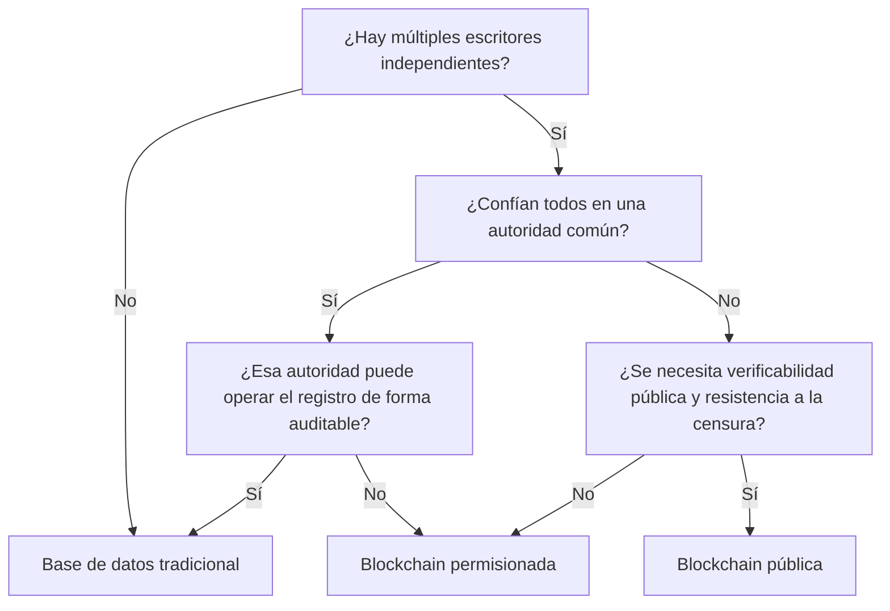

# 00 · Orientación

> **Nivel:** Inicial · ⏱️ **Duración estimada:** 90 min · **Fuente:** *Mastering Blockchain* (Bashir) y *The Blockchain and the New Architecture of Trust* (Werbach)
> [⬅️ Currículo](../README.md) · [📚 Bibliografía](../../docs/bibliografia.md)

---

## 🎯 Objetivos

- Distinguir con precisión los conceptos de blockchain, DLT, criptomoneda y contrato inteligente.
- Situar la descentralización como un espectro (técnico, político y arquitectónico), no como un valor binario.
- Aplicar un conjunto de preguntas de diseño para decidir si un problema justifica una blockchain.
- Reconocer cuándo una base de datos tradicional es la opción más adecuada.
- Documentar una decisión técnica con criterios explícitos y trazables.

## 📚 Resultados de aprendizaje

Al finalizar, el estudiante podrá:

1. **Diferenciar** blockchain, DLT, criptomoneda y contrato inteligente con ejemplos propios.
2. **Clasificar** un sistema según su grado de descentralización en varias dimensiones.
3. **Evaluar** un caso de uso con seis preguntas de decisión estructuradas.
4. **Justificar** por qué una base de datos centralizada suele bastar cuando una sola organización controla la escritura.
5. **Producir** una matriz de decisión defendible para tres casos reales.

## 🗺️ Temas

| # | Tema | Por qué importa |
|---|------|-----------------|
| 1 | Blockchain vs. DLT | Toda blockchain es un DLT, pero no todo DLT encadena bloques con hash. |
| 2 | Criptomoneda vs. token vs. contrato | Separar el activo del programa evita confusiones frecuentes. |
| 3 | Descentralización como espectro | Permite medir en vez de etiquetar "descentralizado". |
| 4 | Permisionadas vs. públicas | Define quién puede leer, escribir y validar. |
| 5 | Modelo de confianza | La blockchain reubica la confianza, no la elimina. |
| 6 | Cuándo NO usar blockchain | Evita sobreingeniería y costos innecesarios. |
| 7 | Costos y compensaciones | La redundancia y el consenso tienen un precio real. |

## 🧠 Modelo mental

Piensa en una blockchain como un libro contable compartido que muchas partes que no se conocen mantienen simultáneamente, donde cada página nueva referencia criptográficamente la anterior. Nadie es dueño del cuaderno y cambiar una página pasada obligaría a reescribir todas las siguientes ante la vista de todos. Esta analogía explica bien la inmutabilidad y la ausencia de un administrador único.

El límite de la analogía es importante: un cuaderno compartido no dice por sí mismo qué versión es la verdadera cuando dos personas escriben a la vez, ni impide que alguien registre un dato falso pero bien formado. Resolver "cuál historia es la válida" es trabajo del consenso (módulo 03), y garantizar que el dato de entrada sea cierto es un problema externo que la cadena no resuelve.

## 🧩 Esquema visual

El siguiente árbol de decisión resume las preguntas clave para determinar si un problema justifica una blockchain o si basta con una base de datos tradicional.



## 📖 Conceptos y definiciones

- **Blockchain**: estructura de datos de bloques enlazados por hash y replicada entre nodos; ejemplo: Bitcoin, Ethereum.
- **DLT (Distributed Ledger Technology)**: categoría amplia de registros distribuidos; no todos usan cadena de bloques (por ejemplo, los DAG).
- **Criptomoneda**: activo digital nativo de una red usado para transferir valor y pagar comisiones; ejemplo: ether (ETH).
- **Token**: unidad de valor definida por un contrato sobre una red existente, no nativa del protocolo base.
- **Contrato inteligente**: programa determinista que se ejecuta en la red y automatiza reglas sin intermediario.
- **Descentralización**: distribución del control entre múltiples partes independientes; se mide, no se afirma.
- **Red permisionada**: solo participantes autorizados validan o escriben; útil en consorcios.
- **Inmutabilidad**: dificultad práctica y económica de alterar el historial ya confirmado.
- **Resistencia a la censura**: propiedad de que ninguna parte pueda impedir transacciones válidas.
- **Oráculo (adelanto)**: mecanismo que introduce datos externos; la cadena no verifica su veracidad.

## 🔬 Profundización

### El espectro de descentralización y el coeficiente de Nakamoto

Decir "esta red es descentralizada" no es medir nada. El **coeficiente de Nakamoto**, propuesto por Balaji Srinivasan y Leland Lee en 2017, ofrece una métrica concreta: es el número mínimo de entidades independientes que tendrían que coludirse para comprometer un subsistema crítico de la red (producción de bloques, stake, clientes de software, hosting, gobernanza).

Ejemplo numérico: imagina una red PoS con 10 validadores cuyos pesos de stake son 30, 20, 15, 10, 8, 7, 4, 3, 2 y 1 (total = 100). Si comprometer el consenso requiere controlar más del 33 % del stake, basta con que coludan los dos mayores validadores (30 + 20 = 50 > 33). El coeficiente de Nakamoto de ese subsistema es **2**, por muchos que sean los nodos totales. La lección: el número de nodos no mide descentralización; la distribución del poder sí. Además, el coeficiente debe calcularse por subsistema — una red puede tener miles de validadores y depender de 2 o 3 proveedores de nube o de un único equipo de desarrollo del cliente mayoritario.

### Taxonomía de DLT más allá de la blockchain

No todo registro distribuido encadena bloques. La siguiente tabla resume las familias principales:

| Familia | Estructura de datos | Ejemplo | Rasgo distintivo |
|---------|--------------------|---------|------------------|
| Blockchain | Cadena lineal de bloques enlazados por hash | Bitcoin, Ethereum | Un solo historial canónico; bifurcaciones se resuelven por consenso |
| DAG | Grafo acíclico dirigido de transacciones | IOTA, Kaspa | Varias transacciones pueden confirmarse en paralelo sin bloques estrictos |
| Hashgraph | Grafo de eventos con "gossip sobre gossip" | Hedera | Consenso por timestamp virtual; patentado y con consejo de gobierno permisionado |
| Ledger permisionado sin cadena global | Canales o subledgers entre pares | Corda | Solo las partes de una transacción la ven; no hay difusión global |

Todas comparten replicación y verificación criptográfica, pero difieren en el modelo de consenso, la privacidad y quién puede participar. "Es un DLT" no implica "es una blockchain pública".

### Mini-caso real: TradeLens y el fracaso por gobernanza

**TradeLens**, la plataforma de blockchain permisionada para logística marítima creada por IBM y Maersk (lanzada en 2018), anunció su cierre en noviembre de 2022 y cesó operaciones a inicios de 2023. La tecnología funcionaba: procesaba documentos de embarque y eventos logísticos reales. El fallo fue de **gobernanza y de incentivos**: las navieras competidoras de Maersk tenían pocos motivos para volcar sus datos operativos en una plataforma cofundada y percibida como controlada por su mayor rival, por mucho que la infraestructura fuera "neutral" sobre el papel. Sin la masa crítica de escritores independientes — justamente la primera pregunta del árbol de decisión — el registro compartido no aportaba más valor que una base de datos bien administrada. Moraleja verificable: antes de evaluar la tecnología, evalúa si los participantes que deben escribir tienen incentivos reales para hacerlo bajo esa gobernanza (véase el anuncio oficial de Maersk: <https://www.maersk.com/news/articles/2022/11/29/maersk-and-ibm-to-discontinue-tradelens>).

## 🧪 Laboratorio guiado

> 🧪 Estas prácticas están catalogadas y **resueltas paso a paso** en el [catálogo de laboratorios](../../labs/CATALOG.md).

Este módulo es de análisis: no ejecuta código. Construirás una matriz de decisión para tres casos.

1. Para cada caso responde las seis preguntas de decisión: (a) ¿hay múltiples escritores independientes?, (b) ¿existe una autoridad confiable disponible?, (c) ¿se necesita resistencia a la censura?, (d) ¿quién corrige errores?, (e) ¿qué datos jamás deberían ser públicos?, (f) ¿el beneficio supera el costo de operar una red distribuida?
2. Aplica las preguntas al **registro académico** de una universidad.
3. Aplica las preguntas a los **pagos internacionales** entre entidades sin confianza mutua.
4. Aplica las preguntas a un programa de **puntos de fidelidad** de una sola empresa.
5. Registra tu veredicto por caso en una tabla como la siguiente:

```text
Caso | Escritores | Autoridad | Censura | Corrige | Datos privados | Veredicto
-----|------------|-----------|---------|---------|----------------|----------
...  | ...        | ...       | ...     | ...     | ...            | BD / Blockchain
```

6. Concluye para cada caso si una base de datos tradicional es preferible o si se justifica una blockchain.

## 📝 Reto verificable

Redacta una recomendación de una página por cada uno de los tres casos, respondiendo las seis preguntas y cerrando con una decisión.

**Criterio de aceptación:** para el caso de puntos de fidelidad la recomendación debe ser una base de datos tradicional, con la justificación explícita de que una sola organización controla la escritura y no requiere resistencia a la censura ni múltiples escritores independientes.

## ⚠️ Errores frecuentes

| Síntoma | Causa y cómo comprobarlo |
|---------|--------------------------|
| "Todo problema mejora con blockchain" | Falta el análisis de escritores/autoridad; revísalo con las seis preguntas. |
| Confundir blockchain con base de datos | No distingues replicación sin confianza vs. control único; contrasta quién valida. |
| Igualar criptomoneda con blockchain | La moneda es un uso; la cadena es la infraestructura. Sepáralos con ejemplos. |
| Asumir que "descentralizado" es binario | No mides dimensiones; clasifícalo en técnico, político y arquitectónico. |
| Creer que la cadena garantiza datos verdaderos | Ignoras el problema del oráculo; comprueba de dónde viene el dato. |

## 🛡️ Seguridad y ética

- Trabaja siempre en entorno local o testnet; en este módulo no se usan claves ni fondos reales.
- No introduzcas datos personales reales en los ejercicios de análisis.
- Reconoce que registrar datos inmutables puede entrar en conflicto con el derecho al olvido y la privacidad.
- Evalúa el costo energético y operativo como parte de la ética de la decisión técnica.
- Documenta tus supuestos: una recomendación honesta expone sus límites.

## 🔗 Referencias

- Imran Bashir, *Mastering Blockchain* — <https://www.packtpub.com/>
- Kevin Werbach, *The Blockchain and the New Architecture of Trust*, MIT Press — <https://mitpress.mit.edu/>
- Arvind Narayanan et al., *Bitcoin and Cryptocurrency Technologies* — <https://bitcoinbook.cs.princeton.edu/>
- Fuente primaria: Satoshi Nakamoto, *Bitcoin: A Peer-to-Peer Electronic Cash System* — <https://bitcoin.org/bitcoin.pdf>

## ✅ Criterio de dominio

- Entregas la matriz de decisión de los tres casos con veredicto justificado.
- Explicas sin ambigüedad la diferencia entre blockchain, DLT, criptomoneda y contrato inteligente.
- Argumentas al menos un escenario en el que una base de datos tradicional es superior.

---

## 🧭 Navegación

[📚 Índice del currículo](../README.md) · ➡️ [Módulo 01 · Criptografía aplicada](../01-criptografia/README.md)
