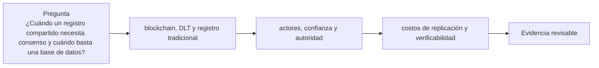

# Clase 1 · Qué problema intenta resolver blockchain

> **Clase independiente 1 de 66** · **Nivel:** Inicial · **Fuente base:** *Mastering Blockchain* (Bashir) y *The Blockchain and the New Architecture of Trust* (Werbach)
>
> [⬅️ Clase anterior](../../README.md) · [📚 Índice de las 66 clases](../README.md) · [🗂️ Mapa del tema](README.md) · [➡️ Clase siguiente](../00-orientacion/clase-02-decidir-y-comunicar-sin-vender-humo.md)

## Punto de partida

**Pregunta guía:** ¿Cuándo un registro compartido necesita consenso y cuándo basta una base de datos?

**Caso que abre la clase:** Una cadena de suministro con tres empresas que discrepan sobre el estado de una orden.

La clase parte de una orden compartida entre organizaciones y obliga a identificar quién escribe, corrige y resuelve disputas antes de nombrar una tecnología. El contraste entre hoja compartida, base administrada y registro consensuado convierte blockchain en una decisión justificable, no en una consigna.

## Fundamentos que sostienen la respuesta

1. **blockchain, DLT y registro tradicional.** En esta clase delimita qué objeto o relación estamos observando antes de sacar conclusiones. Localízalo explícitamente en «Una cadena de suministro con tres empresas que discrepan sobre el estado de una orden.» y anota qué dato faltaría para refutar tu lectura.
2. **actores, confianza y autoridad.** En esta clase explica el mecanismo que conecta la situación inicial con el cambio observable. Localízalo explícitamente en «Una cadena de suministro con tres empresas que discrepan sobre el estado de una orden.» y anota qué dato faltaría para refutar tu lectura.
3. **costos de replicación y verificabilidad.** En esta clase permite contrastar el resultado y formular el límite de la evidencia. Localízalo explícitamente en «Una cadena de suministro con tres empresas que discrepan sobre el estado de una orden.» y anota qué dato faltaría para refutar tu lectura.

### Taxonomía de DLT más allá de la blockchain

No todo registro distribuido encadena bloques. La siguiente tabla resume las familias principales:

| Familia | Estructura de datos | Ejemplo | Rasgo distintivo |
|---------|--------------------|---------|------------------|
| Blockchain | Cadena lineal de bloques enlazados por hash | Bitcoin, Ethereum | Un solo historial canónico; bifurcaciones se resuelven por consenso |
| DAG | Grafo acíclico dirigido de transacciones | IOTA, Kaspa | Varias transacciones pueden confirmarse en paralelo sin bloques estrictos |
| Hashgraph | Grafo de eventos con "gossip sobre gossip" | Hedera | Consenso por timestamp virtual; patentado y con consejo de gobierno permisionado |
| Ledger permisionado sin cadena global | Canales o subledgers entre pares | Corda | Solo las partes de una transacción la ven; no hay difusión global |

Todas comparten replicación y verificación criptográfica, pero difieren en el modelo de consenso, la privacidad y quién puede participar. "Es un DLT" no implica "es una blockchain pública".

### Mini-caso real: TradeLens y el fracaso por gobernanza

**TradeLens**, la plataforma de blockchain permisionada para logística marítima creada por IBM y Maersk (lanzada en 2018), anunció su cierre en noviembre de 2022 y cesó operaciones a inicios de 2023. La tecnología funcionaba: procesaba documentos de embarque y eventos logísticos reales. El fallo fue de **gobernanza y de incentivos**: las navieras competidoras de Maersk tenían pocos motivos para volcar sus datos operativos en una plataforma cofundada y percibida como controlada por su mayor rival, por mucho que la infraestructura fuera "neutral" sobre el papel. Sin la masa crítica de escritores independientes — justamente la primera pregunta del árbol de decisión — el registro compartido no aportaba más valor que una base de datos bien administrada. Moraleja verificable: antes de evaluar la tecnología, evalúa si los participantes que deben escribir tienen incentivos reales para hacerlo bajo esa gobernanza (véase el anuncio oficial de Maersk: <https://www.maersk.com/news/articles/2022/11/29/maersk-and-ibm-to-discontinue-tradelens>).

### El árbol de decisión, aplicado a tres casos reales

Las seis preguntas de la unidad se vuelven útiles cuando se aplican a casos concretos y **la respuesta sale "no" la mayoría de las veces**. Eso no es un fallo del ejercicio: es el resultado honesto.

La cadena de decisión, en orden. Basta un "no" para detenerse:

1. ¿Hay **varias organizaciones** que escriben, no solo que leen?
2. ¿**Desconfían** entre sí lo suficiente como para no aceptar la base de datos de una de ellas?
3. ¿Es **inaceptable** poner a un tercero neutral (un notario, una cámara de compensación) en medio?
4. ¿El dato es **nativo digital**, o depende de que alguien afirme algo del mundo físico?
5. ¿Se puede vivir con **latencia y coste** mayores que los de una base de datos?
6. ¿Existe **presupuesto continuo** para operar, auditar y cumplir normativa?

| Caso | Dónde se detiene | Veredicto |
|---|---|---|
| **Historial médico de un hospital** | Pregunta 1: escribe una sola organización | Base de datos con auditoría y firma. Blockchain no aporta nada y añade riesgo de privacidad con datos irreversibles |
| **Trazabilidad de café de origen** | Pregunta 4: el dato entra cuando alguien escanea un saco | La cadena garantiza que el registro no se alteró, no que el saco contenga lo que dice. El problema real es el oráculo humano, y eso no lo resuelve la tecnología |
| **Liquidación entre bancos que no se fían** | Llega al final | Candidato legítimo: varios escritores, desconfianza mutua, dato nativo digital y presupuesto |

**El error de razonamiento más común** es responder que sí a la 1 confundiendo *leer* con *escribir*. Que diez empresas consulten un sistema no las convierte en escritoras; si una sola decide qué se guarda, hay una autoridad central y la pregunta ya está respondida.

**Y el segundo:** dar por hecha la 6. Un piloto lo paga un presupuesto de innovación; la operación continua —nodos, auditorías, cumplimiento— necesita una línea permanente. La mayoría de los proyectos que se abandonan no fracasan técnicamente: se quedan sin quien pague el mantenimiento.

> 💡 **En una frase:** la pregunta correcta no es "¿puedo usar blockchain?" sino "¿quién escribe, y por qué no aceptan la base de datos de otro?". Casi siempre la respuesta cierra el caso en el primer paso.

<strong>🎓 Si ya dominas esto</strong> — el matiz que separa el análisis serio del entusiasmo

- **"Descentralizado" tiene al menos tres ejes** (Buterin): arquitectónico (cuántas máquinas), político (cuántas personas deciden) y lógico (si el sistema se comporta como una unidad). Una red con 10 000 nodos y tres desarrolladores que controlan las actualizaciones es arquitectónicamente descentralizada y políticamente centralizada. Sin especificar el eje, la palabra no informa.
- **Una permisionada suele ser una base de datos replicada con pasos extra.** Si los participantes están autorizados y se conocen, el problema bizantino casi desaparece y el argumento se apoya en la trazabilidad compartida — que puede lograrse con logs firmados y un tercero neutral. El caso a favor existe, pero hay que defenderlo, no asumirlo.
- **La inmutabilidad choca de frente con el derecho al olvido.** El RGPD reconoce el derecho de supresión; un dato personal on-chain no se puede borrar. Por eso el patrón correcto es guardar compromisos (hashes) on-chain y los datos fuera, donde sí se pueden eliminar.
- **El coste de coordinación es el que decide de verdad.** Montar un consorcio exige acordar gobernanza, reparto de costes y responsabilidad legal entre competidores. Ese trabajo, no el técnico, es donde mueren la mayoría de los proyectos empresariales — la lección de TradeLens que se estudia en las clases 35–36.

## Gráfico pedagógico

Recorre el gráfico en voz alta: identifica supuestos, transformaciones y el punto exacto donde aparece evidencia.

## Trabajo práctico

**Método propio:** diagnóstico guiado desde el problema.

**Actividad:** Dibujar actores, escrituras, lecturas y conflictos antes de elegir tecnología.

Trabaja en entorno local, regtest, signet o testnet según corresponda. Conserva entradas, comandos, salidas y bloque o instante de corte. Una captura aislada no demuestra reproducibilidad.

## Demostración de aprendizaje

**Entregable:** Matriz de decisión que justifique blockchain o descarte su uso con criterios explícitos.

**Comprobación formativa:** ¿Qué condición concreta haría preferible una base de datos administrada frente a un registro con consenso?

Para aprobar debes conectar el hecho observado con el concepto correcto, descartar al menos una interpretación alternativa y redactar una conclusión cuyo alcance no exceda la prueba.

## Errores que esta clase corrige

- Tratar **blockchain, DLT y registro tradicional** como una etiqueta suficiente, sin identificar actores, dato y frontera.
- Usar **actores, confianza y autoridad** como explicación aunque el caso no aporte la evidencia necesaria.
- Dar por respondido «¿Cuándo un registro compartido necesita consenso y cuándo basta una base de datos?» sin contrastar **costos de replicación y verificabilidad**.

Vuelve al caso inicial, elige el error más peligroso y describe una comprobación concreta que lo detectaría.

## Fuentes para comprobar y ampliar

- Imran Bashir, *Mastering Blockchain* — <https://www.packtpub.com/>
- Kevin Werbach, *The Blockchain and the New Architecture of Trust*, MIT Press — <https://mitpress.mit.edu/>
- Arvind Narayanan et al., *Bitcoin and Cryptocurrency Technologies* — <https://bitcoinbook.cs.princeton.edu/>
- Fuente primaria: Satoshi Nakamoto, *Bitcoin: A Peer-to-Peer Electronic Cash System* — <https://bitcoin.org/bitcoin.pdf>

Consulta además la [bibliografía razonada](../../docs/bibliografia.md), que declara procedencia y uso.

## Cierre de la clase

Responde otra vez la pregunta guía sin mirar notas. Si tu respuesta no menciona evidencia, supuesto y límite, todavía describe el tema pero no lo domina. Continúa solo cuando otra persona pueda reproducir tu entregable.
