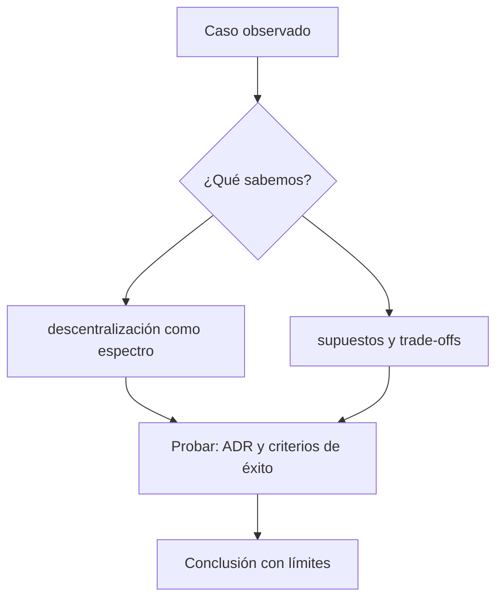

# Clase 2 · Decidir y comunicar sin vender humo

> **Clase independiente 2 de 66** · **Nivel:** Inicial · **Fuente base:** *Mastering Blockchain* (Bashir) y *The Blockchain and the New Architecture of Trust* (Werbach)
>
> [⬅️ Clase anterior](../00-orientacion/clase-01-que-problema-intenta-resolver-blockchain.md) · [📚 Índice de las 66 clases](../README.md) · [🗂️ Mapa del tema](README.md) · [➡️ Clase siguiente](../01-criptografia/clase-03-hashes-integridad-y-compromisos.md)

## Punto de partida

**Pregunta guía:** ¿Cómo se defiende una decisión técnica ante personas no técnicas?

**Caso que abre la clase:** Un equipo propone tokenizar puntos de fidelidad sin explicar qué confianza elimina.

Producto, finanzas, seguridad y legal examinan la misma propuesta desde incentivos distintos. Tres arquitecturas se comparan con criterios visibles y el ADR obliga a comunicar supuestos, renuncias y condición de abandono sin vender descentralización como una propiedad binaria.

## Gráfico pedagógico

Recorre el gráfico en voz alta: identifica supuestos, transformaciones y el punto exacto donde aparece evidencia.

## Fundamentos que sostienen la respuesta

1. **descentralización como espectro.** En esta clase delimita qué objeto o relación estamos observando antes de sacar conclusiones. Localízalo explícitamente en «Un equipo propone tokenizar puntos de fidelidad sin explicar qué confianza elimina.» y anota qué dato faltaría para refutar tu lectura.
2. **supuestos y trade-offs.** En esta clase explica el mecanismo que conecta la situación inicial con el cambio observable. Localízalo explícitamente en «Un equipo propone tokenizar puntos de fidelidad sin explicar qué confianza elimina.» y anota qué dato faltaría para refutar tu lectura.
3. **ADR y criterios de éxito.** En esta clase permite contrastar el resultado y formular el límite de la evidencia. Localízalo explícitamente en «Un equipo propone tokenizar puntos de fidelidad sin explicar qué confianza elimina.» y anota qué dato faltaría para refutar tu lectura.

### El espectro de descentralización y el coeficiente de Nakamoto

Decir "esta red es descentralizada" no es medir nada. El **coeficiente de Nakamoto**, propuesto por Balaji Srinivasan y Leland Lee en 2017, ofrece una métrica concreta: es el número mínimo de entidades independientes que tendrían que coludirse para comprometer un subsistema crítico de la red (producción de bloques, stake, clientes de software, hosting, gobernanza).

Ejemplo numérico: imagina una red PoS con 10 validadores cuyos pesos de stake son 30, 20, 15, 10, 8, 7, 4, 3, 2 y 1 (total = 100). Si comprometer el consenso requiere controlar más del 33 % del stake, basta con que coludan los dos mayores validadores (30 + 20 = 50 > 33). El coeficiente de Nakamoto de ese subsistema es **2**, por muchos que sean los nodos totales. La lección: el número de nodos no mide descentralización; la distribución del poder sí. Además, el coeficiente debe calcularse por subsistema — una red puede tener miles de validadores y depender de 2 o 3 proveedores de nube o de un único equipo de desarrollo del cliente mayoritario.

### De la comparación a una decisión defendible

Un ADR no premia la arquitectura más novedosa: registra el contexto, las fuerzas en tensión, la decisión y sus consecuencias. Para comparar una base administrada, una DLT permisionada y una red pública se mantienen constantes el proceso y los actores; luego se cambia una variable por vez: autoridad para corregir, visibilidad, reversibilidad, costo operativo y salida de un participante. La recomendación incluye una condición de abandono. Si el piloto no reduce el tiempo de conciliación o si la gobernanza concentra el mismo poder con mayor costo, continuar sería una decisión política, no una conclusión técnica.

Comunicar sin vender humo significa traducir el mecanismo. En lugar de decir «elimina confianza», indica qué tercero deja de ordenar el registro y qué nuevos supuestos aparecen en software, claves, validadores y gobierno. La audiencia puede entonces disentir del riesgo sin discutir eslóganes.

## Trabajo práctico

**Método propio:** clínica de decisiones con juego de roles.

**Actividad:** Comparar tres arquitecturas y exponer la recomendación en noventa segundos.

Trabaja en entorno local, regtest, signet o testnet según corresponda. Conserva entradas, comandos, salidas y bloque o instante de corte. Una captura aislada no demuestra reproducibilidad.

## Errores que esta clase corrige

- Tratar **descentralización como espectro** como una etiqueta suficiente, sin identificar actores, dato y frontera.
- Usar **supuestos y trade-offs** como explicación aunque el caso no aporte la evidencia necesaria.
- Dar por respondido «¿Cómo se defiende una decisión técnica ante personas no técnicas?» sin contrastar **ADR y criterios de éxito**.

Vuelve al caso inicial, elige el error más peligroso y describe una comprobación concreta que lo detectaría.

## Demostración de aprendizaje

**Entregable:** ADR breve con alternativa elegida, rechazada, riesgos y métrica de validación.

**Comprobación formativa:** Explica la recomendación sin usar las palabras innovación, revolución ni confianza.

Para aprobar debes conectar el hecho observado con el concepto correcto, descartar al menos una interpretación alternativa y redactar una conclusión cuyo alcance no exceda la prueba.

## Fuentes para comprobar y ampliar

- Imran Bashir, *Mastering Blockchain* — <https://www.packtpub.com/>
- Kevin Werbach, *The Blockchain and the New Architecture of Trust*, MIT Press — <https://mitpress.mit.edu/>
- Arvind Narayanan et al., *Bitcoin and Cryptocurrency Technologies* — <https://bitcoinbook.cs.princeton.edu/>
- Fuente primaria: Satoshi Nakamoto, *Bitcoin: A Peer-to-Peer Electronic Cash System* — <https://bitcoin.org/bitcoin.pdf>

Consulta además la [bibliografía razonada](../../docs/bibliografia.md), que declara procedencia y uso.

## Cierre de la clase

Responde otra vez la pregunta guía sin mirar notas. Si tu respuesta no menciona evidencia, supuesto y límite, todavía describe el tema pero no lo domina. Continúa solo cuando otra persona pueda reproducir tu entregable.
