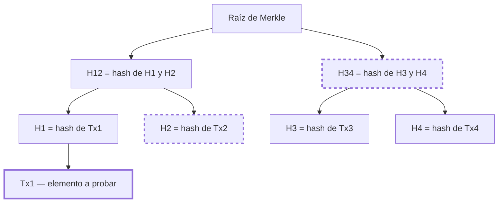
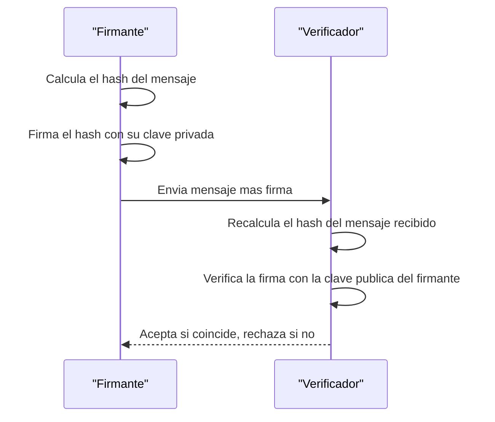

# 01 · Criptografía aplicada

> **Nivel:** Inicial · ⏱️ **Duración estimada:** 120 min · **Fuente:** *Serious Cryptography* (Aumasson) y *Introduction to Modern Cryptography* (Katz, Lindell)
> [⬅️ Currículo](../README.md) · [📚 Bibliografía](../../docs/bibliografia.md)
> 🧭 ⬅️ **Anterior:** [00 · Orientación](../00-orientacion/README.md) · [📚 Índice](../README.md) · ➡️ **Siguiente:** [02 · Sistemas distribuidos y redes P2P](../02-sistemas-distribuidos/README.md)
> 📖 [Glosario de términos](../../docs/glosario.md) · 🌱 [¿Nuevo en esto? Empieza aquí](../../docs/empieza-aqui.md)
> 👛 La versión de usuario de la custodia de claves está en la unidad transversal [Wallets desde cero](../../docs/wallets-desde-cero.md).

---

## 🎯 Objetivos

- Explicar las propiedades de una función hash: resistencia a preimagen, a colisiones y efecto avalancha.
- Diferenciar cifrado (confidencialidad) de firma digital (autenticación e integridad).
- Construir y verificar una prueba de inclusión sobre un árbol de Merkle.
- Identificar los riesgos operativos de la gestión de claves privadas.
- Justificar por qué un hash rápido es inadecuado para almacenar contraseñas.

## 📚 Resultados de aprendizaje

Al finalizar, el estudiante podrá:

1. **Describir** qué garantiza y qué no garantiza una función hash criptográfica.
2. **Distinguir** una firma digital de un cifrado, y clave pública de clave privada.
3. **Generar** una raíz de Merkle y **verificar** una prueba de inclusión.
4. **Diagnosticar** vulnerabilidades por reutilización de claves o aleatoriedad débil.
5. **Seleccionar** la primitiva adecuada (SHA-256, Keccak-256, ECDSA, Argon2) según el objetivo.

## 🗺️ Temas

| # | Tema | Por qué importa |
|---|------|-----------------|
| 1 | Funciones hash | Detectan cualquier cambio en los datos y anclan la integridad. |
| 2 | Preimagen y colisiones | Definen la seguridad real de un hash frente a ataques. |
| 3 | Criptografía asimétrica | Permite firmar y verificar sin compartir secretos. |
| 4 | Firmas ECDSA (secp256k1) | Es el esquema de firma usado por Bitcoin y Ethereum. |
| 5 | Árboles de Merkle | Resumen muchos elementos con pruebas pequeñas y verificables. |
| 6 | Derivación de contraseñas | Un hash rápido es inseguro; se necesitan funciones lentas. |
| 7 | Gestión de claves | La mayoría de los incidentes reales nacen de claves mal manejadas. |

## 🧠 Modelo mental

Imagina un sello de lacre sobre un sobre. El hash es como una huella del contenido: si alguien altera una sola letra, la huella cambia por completo (efecto avalancha) y se nota la manipulación. La firma digital es como un sello personal imposible de falsificar sin tu anillo (clave privada), que cualquiera puede reconocer con la impronta pública. El árbol de Merkle es como un índice que permite probar que una carta está dentro de un archivo enorme mostrando solo unos pocos sellos, sin abrir todas las cajas.

El límite de la analogía es que ninguna de estas primitivas decide qué historia es la verdadera. El hash detecta cambios pero no dice cuál versión debe prevalecer; la firma prueba quién autorizó un mensaje pero no si ese mensaje es la transacción correcta del sistema. Ordenar y validar el historial es tarea del consenso (módulo 03), no de la criptografía por sí sola.

## 🧩 Esquema visual

Árbol de Merkle de cuatro hojas: para probar que Tx1 está incluida basta con revelar H2 y H34 (la ruta de prueba, resaltada) y recomputar hacia la raíz.



Flujo de firma y verificación: la clave privada nunca viaja; el verificador solo necesita el mensaje, la firma y la clave pública.



## 📖 Conceptos y definiciones

- **Función hash criptográfica**: transforma datos de longitud arbitraria en un valor fijo; ejemplo: SHA-256, Keccak-256.
- **Resistencia a preimagen**: dado un hash, es inviable hallar una entrada que lo produzca.
- **Resistencia a colisiones**: es inviable hallar dos entradas distintas con el mismo hash.
- **Efecto avalancha**: un cambio mínimo en la entrada altera radicalmente la salida.
- **Clave pública / privada**: par asimétrico; la privada firma y descifra, la pública verifica y cifra.
- **Firma digital**: prueba de que el poseedor de una clave privada autorizó un mensaje concreto; ejemplo: ECDSA sobre secp256k1.
- **Cifrado**: protege la confidencialidad; no garantiza por sí solo autenticidad.
- **Árbol de Merkle**: árbol binario de hashes cuya raíz resume todo el conjunto de hojas.
- **Prueba de inclusión**: conjunto mínimo de hashes que demuestra que un elemento pertenece al árbol.
- **KDF (Argon2, bcrypt)**: función lenta y con sal para derivar claves de contraseñas y frenar la fuerza bruta.

## 🔬 Profundización

### De clave pública a dirección Ethereum: Keccak-256 y checksum EIP-55

Una dirección Ethereum no es la clave pública, sino un resumen de ella. El proceso exacto:

1. De la clave privada (32 bytes) se deriva por multiplicación en la curva secp256k1 la clave pública sin comprimir: 64 bytes (coordenadas X e Y, sin el prefijo `0x04`).
2. Se calcula **Keccak-256** de esos 64 bytes (ojo: Keccak-256 original, no el SHA-3 estandarizado por NIST en FIPS 202, que difiere en el padding).
3. Se toman los **últimos 20 bytes** del hash: esa es la dirección.
4. Para el formato con checksum **EIP-55** se calcula Keccak-256 de la dirección en hexadecimal minúscula y se pone en mayúscula cada letra cuyo nibble correspondiente del hash sea ≥ 8.

Ejemplo verificable (vector de prueba del propio EIP-55): la dirección en minúsculas `0x5aaeb6053f3e94c9b9a09f33669435e7ef1beaed` se convierte con checksum en `0x5aAeb6053F3E94C9b9A09f33669435E7Ef1BeAed`. Un error de tipeo en una sola letra hace que el patrón de mayúsculas no cuadre, y cualquier wallet moderna rechaza la dirección: el checksum detecta erratas sin necesitar ningún registro central. Especificación: <https://eips.ethereum.org/EIPS/eip-55>.

### Aleatoriedad débil en ECDSA: el caso Sony PlayStation 3

Cada firma ECDSA requiere un número efímero secreto, el **nonce k**, que debe ser único e impredecible por firma. Si k se repite en dos firmas con la misma clave, un observador puede plantear dos ecuaciones con dos incógnitas (k y la clave privada) y **despejar la clave privada con álgebra elemental**.

Caso real: en diciembre de 2010, el grupo fail0verflow mostró en el congreso 27C3 que Sony firmaba el software de la PlayStation 3 usando un k **constante** en todas las firmas. Con dos firmas cualesquiera bastó para recuperar la clave privada maestra de la consola, lo que permitió firmar software arbitrario como si fuera oficial. El mismo fallo ha drenado fondos reales en Bitcoin y Ethereum cuando wallets generaron nonces con mala entropía.

La defensa estándar es **RFC 6979**: derivar k de forma determinista a partir de la clave privada y del hash del mensaje mediante HMAC. Así, k es único por mensaje, reproducible y no depende de la calidad del generador aleatorio del dispositivo. Especificación: <https://www.rfc-editor.org/rfc/rfc6979>.

### Hashes rápidos vs. KDF: cada primitiva tiene su propósito

Que SHA-256 sea velocísimo es una virtud para integridad y una catástrofe para contraseñas: un atacante con GPU prueba miles de millones de candidatos por segundo. Las KDF modernas se diseñan deliberadamente lentas y con consumo de memoria configurable.

| Propiedad | Hash rápido (SHA-256, Keccak-256) | KDF (Argon2id, scrypt, bcrypt) |
|-----------|-----------------------------------|--------------------------------|
| Objetivo | Integridad, punteros, Merkle, PoW | Derivar claves desde contraseñas |
| Velocidad deseada | Máxima | Deliberadamente lenta y ajustable |
| Uso de memoria | Mínimo | Alto y configurable (Argon2id, scrypt) para frenar GPU y ASIC |
| Sal | No aplica de serie | Obligatoria y única por usuario |
| Uso en blockchain | Bloques, transacciones, direcciones | Cifrado de keystores de wallets (scrypt en los keystore de Ethereum) |

Regla práctica: si la entrada es de baja entropía (una contraseña humana), nunca un hash rápido a secas; siempre una KDF con sal y parámetros de costo actualizados (OWASP publica recomendaciones vigentes para Argon2id).

### Por qué "inviable" no significa "imposible"

Cuando este módulo dice que encontrar una colisión de SHA-256 es *inviable*, no está diciendo que sea imposible: está diciendo que **cuesta más energía de la que hay disponible**. Conviene ver el número, porque es lo que convierte un acto de fe en un argumento.

Por la paradoja del cumpleaños, encontrar una colisión en un hash de *n* bits no cuesta 2ⁿ intentos sino aproximadamente **2^(n/2)**. Para SHA-256:

```text
2^128 ≈ 3,4 × 10^38 intentos
```

Pongamos ese número en perspectiva con el hardware más rápido que existe para hashear: toda la red de Bitcoin junta, que ronda los 10^21 hashes por segundo.

```text
3,4 × 10^38 ÷ 10^21 hashes/s ≈ 3,4 × 10^17 segundos
                              ≈ 10 800 millones de años
```

Casi **cien veces la edad del universo**, usando todo el hardware de minería del planeta y sin parar. Por eso "inviable" es una afirmación económica y física, no una promesa matemática de imposibilidad.

**Y por eso mismo el tamaño importa tanto.** Cada bit que se le quita al hash divide el trabajo por la raíz cuadrada de dos:

| Hash | Bits | Colisión (2^(n/2)) | Estado |
|---|---:|---|---|
| MD5 | 128 | 2^64 | **Roto**: colisiones en segundos en un portátil |
| SHA-1 | 160 | 2^80 | **Roto**: colisión real demostrada en 2017 (SHAttered) |
| SHA-256 | 256 | 2^128 | Sin ataques prácticos conocidos |

SHA-1 no cayó porque apareciera un fallo repentino: cayó porque 2^80 dejó de ser inalcanzable cuando el hardware avanzó y alguien decidió pagar el cómputo. **La criptografía no se rompe de golpe; se erosiona.** Esa es la razón de que los protocolos serios prevean cómo migrar de algoritmo antes de necesitarlo.

> 💡 **En una frase:** "seguro" en criptografía significa "demasiado caro de romper hoy". Es una afirmación con fecha, no una garantía permanente.

<details>
<summary><strong>🎓 Si ya dominas esto</strong> — precisiones que importan al implementar</summary>

- **Resistencia a colisiones ≠ resistencia a preimagen.** Encontrar *dos* entradas con el mismo hash cuesta 2^(n/2); encontrar una entrada para *un hash dado* cuesta 2^n. SHA-1 está roto para colisiones y no para preimagen — por eso `git` sobrevivió a SHAttered, aunque migró igualmente.
- **Bitcoin usa SHA-256d (doble) por precaución ante ataques de extensión de longitud**, a los que las construcciones Merkle–Damgård como SHA-256 son vulnerables. Ethereum usa Keccak-256, de construcción esponja, inmune a ese ataque por diseño. No son intercambiables: el mismo dato da hashes distintos.
- **La cuántica no afecta igual a todo.** Grover reduce la búsqueda de preimagen de 2^n a 2^(n/2), lo que deja SHA-256 en una seguridad efectiva de 128 bits: incómodo pero no roto. Shor, en cambio, **rompe ECDSA por completo**. El riesgo cuántico real está en las firmas, no en los hashes.
- **Comparar hashes o MAC con `==` filtra información.** Una comparación que sale antes al primer byte distinto revela cuántos bytes acertaste, y con suficientes intentos se reconstruye el valor. Se usa comparación en tiempo constante.
- **La segunda preimagen en árboles de Merkle tiene una trampa conocida.** Si no se distinguen nodos hoja de nodos internos (prefijando un byte distinto), un atacante puede presentar un árbol distinto con la misma raíz. Bitcoin arrastra una variante de este problema por duplicar la última hoja cuando el número es impar.

</details>

## 🧪 Laboratorio guiado

> 🧪 Estas prácticas están catalogadas y **resueltas paso a paso** en el [catálogo de laboratorios](../../labs/CATALOG.md).

1. Ejecuta el laboratorio de hashing y observa el efecto avalancha al cambiar un byte:

```bash
pnpm lab:hash
```

2. Ejecuta el laboratorio de árboles de Merkle para construir una raíz y una prueba de inclusión:

```bash
pnpm lab:merkle
```

3. Modifica una transacción de una hoja y vuelve a calcular la raíz; anota cómo cambia respecto de la original.
4. Verifica que una prueba de inclusión válida deja de serlo tras la modificación.
5. Ejecuta la batería de pruebas del repositorio para confirmar tu implementación:

```bash
pnpm test
```

## 📝 Reto verificable

Toma un conjunto de transacciones, construye su raíz de Merkle, altera una transacción y documenta el cambio de raíz junto con una prueba de inclusión antes y después.

**Criterio de aceptación:** demuestras que al modificar una transacción cambia la raíz de Merkle y que la prueba de inclusión original ya no valida contra la nueva raíz; `pnpm test` pasa sin errores.

## ⚠️ Errores frecuentes

| Síntoma | Causa y cómo comprobarlo |
|---------|--------------------------|
| Confundir cifrar con firmar | Usas la primitiva equivocada; verifica si buscas confidencialidad o autenticación. |
| Contraseñas con SHA-256 "a secas" | Hash rápido sin sal; comprueba tiempo de cómputo y adopta Argon2/bcrypt. |
| Firmar bytes distintos a lo mostrado | La interfaz muestra algo y firmas otra cosa; compara el mensaje real byte a byte. |
| Reutilizar el nonce en ECDSA | Aleatoriedad débil filtra la clave privada; revisa la fuente de entropía. |
| Tratar una dirección como identidad legal | Una dirección es un pseudónimo; no prueba quién es la persona. |

## 🛡️ Seguridad y ética

- Trabaja solo en local o testnet; nunca uses claves privadas ni fondos reales en el laboratorio.
- Genera claves de práctica desechables y no las reutilices fuera del ejercicio.
- Nunca subas claves privadas, semillas ni archivos `.env` al control de versiones.
- Usa siempre aleatoriedad criptográficamente segura para generar claves y nonces.
- Recuerda que la seudonimia no es anonimato: las direcciones son trazables en cadena.

## 🔗 Referencias

- Jean-Philippe Aumasson, *Serious Cryptography*, 2.ª ed. — <https://nostarch.com/serious-cryptography-2nd-edition>
- Jonathan Katz y Yehuda Lindell, *Introduction to Modern Cryptography* — <https://www.cs.umd.edu/~jkatz/imc.html>
- Ferguson, Schneier y Kohno, *Cryptography Engineering* — <https://www.schneier.com/books/cryptography-engineering/>
- Fuente primaria: NIST, FIPS 180-4 *Secure Hash Standard (SHA)* — <https://csrc.nist.gov/>

## ✅ Criterio de dominio

- Construyes y verificas una prueba de Merkle y explicas cómo cambia la raíz ante una alteración.
- Distingues correctamente cifrado de firma y justificas la primitiva elegida.
- Argumentas por qué las contraseñas requieren una KDF lenta en lugar de un hash rápido.

---

## 🧭 Navegación

⬅️ [Módulo 00 · Orientación](../00-orientacion/README.md) · [📚 Índice del currículo](../README.md) · ➡️ [Módulo 02 · Sistemas distribuidos y redes P2P](../02-sistemas-distribuidos/README.md)
