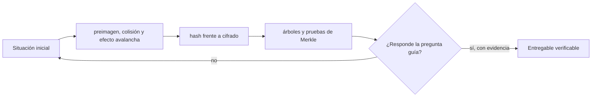

# Clase 3 · Hashes, integridad y compromisos

> **Clase independiente 3 de 66** · **Nivel:** Inicial · **Fuente base:** *Serious Cryptography* (Aumasson) y *Introduction to Modern Cryptography* (Katz, Lindell)
>
> [⬅️ Clase anterior](../00-orientacion/clase-02-decidir-y-comunicar-sin-vender-humo.md) · [📚 Índice de las 66 clases](../README.md) · [🗂️ Mapa del tema](README.md) · [➡️ Clase siguiente](../01-criptografia/clase-04-firmas-claves-y-ciclo-de-vida.md)

## Punto de partida

**Pregunta guía:** ¿Cómo se detecta una alteración sin ocultar necesariamente el dato?

**Caso que abre la clase:** Verificar que un lote de documentos contables no cambió desde el cierre.

Se alteran mensajes casi idénticos para observar el efecto avalancha y luego se compara hash, cifrado y MAC. La clase avanza desde lo visible hacia las propiedades formales, sin presentar una huella como prueba de verdad.

## Fundamentos que sostienen la respuesta

1. **preimagen, colisión y efecto avalancha.** En esta clase delimita qué objeto o relación estamos observando antes de sacar conclusiones. Localízalo explícitamente en «Verificar que un lote de documentos contables no cambió desde el cierre.» y anota qué dato faltaría para refutar tu lectura.
2. **hash frente a cifrado.** En esta clase explica el mecanismo que conecta la situación inicial con el cambio observable. Localízalo explícitamente en «Verificar que un lote de documentos contables no cambió desde el cierre.» y anota qué dato faltaría para refutar tu lectura.
3. **árboles y pruebas de Merkle.** En esta clase permite contrastar el resultado y formular el límite de la evidencia. Localízalo explícitamente en «Verificar que un lote de documentos contables no cambió desde el cierre.» y anota qué dato faltaría para refutar tu lectura.

### Hashes rápidos vs. KDF: cada primitiva tiene su propósito

Que SHA-256 sea velocísimo es una virtud para integridad y una catástrofe para contraseñas: un atacante con GPU prueba miles de millones de candidatos por segundo. Las KDF modernas se diseñan deliberadamente lentas y con consumo de memoria configurable.

| Propiedad | Hash rápido (SHA-256, Keccak-256) | KDF (Argon2id, scrypt, bcrypt) |
|-----------|-----------------------------------|--------------------------------|
| Objetivo | Integridad, punteros, Merkle, PoW | Derivar claves desde contraseñas |
| Velocidad deseada | Máxima | Deliberadamente lenta y ajustable |
| Uso de memoria | Mínimo | Alto y configurable (Argon2id, scrypt) para frenar GPU y ASIC |
| Sal | No aplica de serie | Obligatoria y única por usuario |
| Uso en blockchain | Bloques, transacciones, direcciones | Cifrado de keystores de wallets (scrypt en los keystore de Ethereum) |

Regla práctica: si la entrada es de baja entropía (una contraseña humana), nunca un hash rápido a secas; siempre una KDF con sal y parámetros de costo actualizados (OWASP publica recomendaciones vigentes para Argon2id).

### Por qué "inviable" no significa "imposible"

Cuando esta unidad de clases dice que encontrar una colisión de SHA-256 es *inviable*, no está diciendo que sea imposible: está diciendo que **cuesta más energía de la que hay disponible**. Conviene ver el número, porque es lo que convierte un acto de fe en un argumento.

Por la paradoja del cumpleaños, encontrar una colisión en un hash de *n* bits no cuesta 2ⁿ intentos sino aproximadamente **2^(n/2)**. Para SHA-256:

```text
2^128 ≈ 3,4 × 10^38 intentos
```

Pongamos ese número en perspectiva con el hardware más rápido que existe para hashear: toda la red de Bitcoin junta, que ronda los 10^21 hashes por segundo.

```text
3,4 × 10^38 ÷ 10^21 hashes/s ≈ 3,4 × 10^17 segundos
                              ≈ 10 800 millones de años
```

Casi **cien veces la edad del universo**, usando todo el hardware de minería del planeta y sin parar. Por eso "inviable" es una afirmación económica y física, no una promesa matemática de imposibilidad.

**Y por eso mismo el tamaño importa tanto.** Cada bit que se le quita al hash divide el trabajo por la raíz cuadrada de dos:

| Hash | Bits | Colisión (2^(n/2)) | Estado |
|---|---:|---|---|
| MD5 | 128 | 2^64 | **Roto**: colisiones en segundos en un portátil |
| SHA-1 | 160 | 2^80 | **Roto**: colisión real demostrada en 2017 (SHAttered) |
| SHA-256 | 256 | 2^128 | Sin ataques prácticos conocidos |

SHA-1 no cayó porque apareciera un fallo repentino: cayó porque 2^80 dejó de ser inalcanzable cuando el hardware avanzó y alguien decidió pagar el cómputo. **La criptografía no se rompe de golpe; se erosiona.** Esa es la razón de que los protocolos serios prevean cómo migrar de algoritmo antes de necesitarlo.

> 💡 **En una frase:** "seguro" en criptografía significa "demasiado caro de romper hoy". Es una afirmación con fecha, no una garantía permanente.

<details>
<summary><strong>🎓 Si ya dominas esto</strong> — precisiones que importan al implementar</summary>

- **Resistencia a colisiones ≠ resistencia a preimagen.** Encontrar *dos* entradas con el mismo hash cuesta 2^(n/2); encontrar una entrada para *un hash dado* cuesta 2^n. SHA-1 está roto para colisiones y no para preimagen — por eso `git` sobrevivió a SHAttered, aunque migró igualmente.
- **Bitcoin usa SHA-256d (doble) por precaución ante ataques de extensión de longitud**, a los que las construcciones Merkle–Damgård como SHA-256 son vulnerables. Ethereum usa Keccak-256, de construcción esponja, inmune a ese ataque por diseño. No son intercambiables: el mismo dato da hashes distintos.
- **La cuántica no afecta igual a todo.** Grover reduce la búsqueda de preimagen de 2^n a 2^(n/2), lo que deja SHA-256 en una seguridad efectiva de 128 bits: incómodo pero no roto. Shor, en cambio, **rompe ECDSA por completo**. El riesgo cuántico real está en las firmas, no en los hashes.
- **Comparar hashes o MAC con `==` filtra información.** Una comparación que sale antes al primer byte distinto revela cuántos bytes acertaste, y con suficientes intentos se reconstruye el valor. Se usa comparación en tiempo constante.
- **La segunda preimagen en árboles de Merkle tiene una trampa conocida.** Si no se distinguen nodos hoja de nodos internos (prefijando un byte distinto), un atacante puede presentar un árbol distinto con la misma raíz. Bitcoin arrastra una variante de este problema por duplicar la última hoja cuando el número es impar.

</details>

## Trabajo práctico

**Método propio:** demostración con contraejemplos.

**Actividad:** Construir hashes encadenados y una prueba de inclusión con datos pequeños.

Trabaja en entorno local, regtest, signet o testnet según corresponda. Conserva entradas, comandos, salidas y bloque o instante de corte. Una captura aislada no demuestra reproducibilidad.

## Gráfico pedagógico

Recorre el gráfico en voz alta: identifica supuestos, transformaciones y el punto exacto donde aparece evidencia.



## Demostración de aprendizaje

**Entregable:** Script reproducible y explicación de qué demuestra y qué no demuestra el hash.

**Comprobación formativa:** Explica por qué conocer el hash de un contrato no demuestra que su contenido sea correcto.

Para aprobar debes conectar el hecho observado con el concepto correcto, descartar al menos una interpretación alternativa y redactar una conclusión cuyo alcance no exceda la prueba.

## Errores que esta clase corrige

- Tratar **preimagen, colisión y efecto avalancha** como una etiqueta suficiente, sin identificar actores, dato y frontera.
- Usar **hash frente a cifrado** como explicación aunque el caso no aporte la evidencia necesaria.
- Dar por respondido «¿Cómo se detecta una alteración sin ocultar necesariamente el dato?» sin contrastar **árboles y pruebas de Merkle**.

Vuelve al caso inicial, elige el error más peligroso y describe una comprobación concreta que lo detectaría.

## Fuentes para comprobar y ampliar

- Jean-Philippe Aumasson, *Serious Cryptography*, 2.ª ed. — <https://nostarch.com/serious-cryptography-2nd-edition>
- Jonathan Katz y Yehuda Lindell, *Introduction to Modern Cryptography* — <https://www.cs.umd.edu/~jkatz/imc.html>
- Ferguson, Schneier y Kohno, *Cryptography Engineering* — <https://www.schneier.com/books/cryptography-engineering/>
- Fuente primaria: NIST, FIPS 180-4 *Secure Hash Standard (SHA)* — <https://csrc.nist.gov/>

Consulta además la [bibliografía razonada](../../docs/bibliografia.md), que declara procedencia y uso.

## Cierre de la clase

Responde otra vez la pregunta guía sin mirar notas. Si tu respuesta no menciona evidencia, supuesto y límite, todavía describe el tema pero no lo domina. Continúa solo cuando otra persona pueda reproducir tu entregable.
