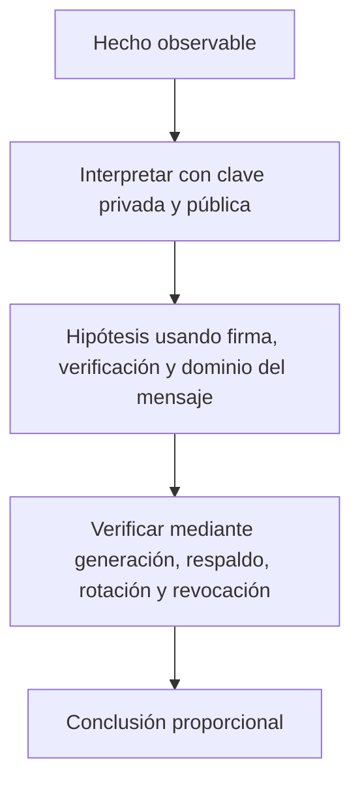

# Clase 4 · Firmas, claves y ciclo de vida

> **Clase independiente 4 de 66** · **Nivel:** Inicial · **Fuente base:** *Serious Cryptography* (Aumasson) y *Introduction to Modern Cryptography* (Katz, Lindell)
>
> [⬅️ Clase anterior](../01-criptografia/clase-03-hashes-integridad-y-compromisos.md) · [📚 Índice de las 66 clases](../README.md) · [🗂️ Mapa del tema](README.md) · [➡️ Clase siguiente](../02-sistemas-distribuidos/clase-05-replicacion-latencia-y-fallas.md)

## Punto de partida

**Pregunta guía:** ¿Qué prueba una firma y cómo se gobierna la clave que la produce?

**Caso que abre la clase:** Una clave de tesorería sigue activa después de que su responsable deja la empresa.

Cada participante asume un rol en generación, firma, respaldo, rotación o revocación. Una pérdida y una filtración obligan a distinguir disponibilidad de confidencialidad y a diseñar recuperación antes del incidente.

## Trabajo práctico

**Método propio:** ceremonia de claves simulada.

**Actividad:** Firmar y verificar mensajes, luego diseñar controles para pérdida y compromiso.

Trabaja en entorno local, regtest, signet o testnet según corresponda. Conserva entradas, comandos, salidas y bloque o instante de corte. Una captura aislada no demuestra reproducibilidad.

## Fundamentos que sostienen la respuesta

1. **clave privada y pública.** En esta clase delimita qué objeto o relación estamos observando antes de sacar conclusiones. Localízalo explícitamente en «Una clave de tesorería sigue activa después de que su responsable deja la empresa.» y anota qué dato faltaría para refutar tu lectura.
2. **firma, verificación y dominio del mensaje.** En esta clase explica el mecanismo que conecta la situación inicial con el cambio observable. Localízalo explícitamente en «Una clave de tesorería sigue activa después de que su responsable deja la empresa.» y anota qué dato faltaría para refutar tu lectura.
3. **generación, respaldo, rotación y revocación.** En esta clase permite contrastar el resultado y formular el límite de la evidencia. Localízalo explícitamente en «Una clave de tesorería sigue activa después de que su responsable deja la empresa.» y anota qué dato faltaría para refutar tu lectura.

### De clave pública a dirección Ethereum: Keccak-256 y checksum EIP-55

Una dirección Ethereum no es la clave pública, sino un resumen de ella. El proceso exacto:

1. De la clave privada (32 bytes) se deriva por multiplicación en la curva secp256k1 la clave pública sin comprimir: 64 bytes (coordenadas X e Y, sin el prefijo `0x04`).
2. Se calcula **Keccak-256** de esos 64 bytes (ojo: Keccak-256 original, no el SHA-3 estandarizado por NIST en FIPS 202, que difiere en el padding).
3. Se toman los **últimos 20 bytes** del hash: esa es la dirección.
4. Para el formato con checksum **EIP-55** se calcula Keccak-256 de la dirección en hexadecimal minúscula y se pone en mayúscula cada letra cuyo nibble correspondiente del hash sea ≥ 8.

Ejemplo verificable (vector de prueba del propio EIP-55): la dirección en minúsculas `0x5aaeb6053f3e94c9b9a09f33669435e7ef1beaed` se convierte con checksum en `0x5aAeb6053F3E94C9b9A09f33669435E7Ef1BeAed`. Un error de tipeo en una sola letra hace que el patrón de mayúsculas no cuadre, y cualquier wallet moderna rechaza la dirección: el checksum detecta erratas sin necesitar ningún registro central. Especificación: <https://eips.ethereum.org/EIPS/eip-55>.

### Aleatoriedad débil en ECDSA: el caso Sony PlayStation 3

Cada firma ECDSA requiere un número efímero secreto, el **nonce k**, que debe ser único e impredecible por firma. Si k se repite en dos firmas con la misma clave, un observador puede plantear dos ecuaciones con dos incógnitas (k y la clave privada) y **despejar la clave privada con álgebra elemental**.

Caso real: en diciembre de 2010, el grupo fail0verflow mostró en el congreso 27C3 que Sony firmaba el software de la PlayStation 3 usando un k **constante** en todas las firmas. Con dos firmas cualesquiera bastó para recuperar la clave privada maestra de la consola, lo que permitió firmar software arbitrario como si fuera oficial. El mismo fallo ha drenado fondos reales en Bitcoin y Ethereum cuando wallets generaron nonces con mala entropía.

La defensa estándar es **RFC 6979**: derivar k de forma determinista a partir de la clave privada y del hash del mensaje mediante HMAC. Así, k es único por mensaje, reproducible y no depende de la calidad del generador aleatorio del dispositivo. Especificación: <https://www.rfc-editor.org/rfc/rfc6979>.

### Wallets dentro del problema

La wallet aparece desde su raíz: no es una caja que guarda monedas, sino software y procedimientos que administran claves y construyen firmas. Seed phrase, respaldo y derivación pertenecen al ciclo de vida de la clave.

## Gráfico pedagógico

Recorre el gráfico en voz alta: identifica supuestos, transformaciones y el punto exacto donde aparece evidencia.

## Errores que esta clase corrige

- Tratar **clave privada y pública** como una etiqueta suficiente, sin identificar actores, dato y frontera.
- Usar **firma, verificación y dominio del mensaje** como explicación aunque el caso no aporte la evidencia necesaria.
- Dar por respondido «¿Qué prueba una firma y cómo se gobierna la clave que la produce?» sin contrastar **generación, respaldo, rotación y revocación**.

Vuelve al caso inicial, elige el error más peligroso y describe una comprobación concreta que lo detectaría.

## Demostración de aprendizaje

**Entregable:** Diagrama del ciclo de vida de una clave con responsables y puntos de control.

**Comprobación formativa:** ¿Qué puede verificar una firma y qué hecho sobre la identidad del firmante necesita evidencia externa?

Para aprobar debes conectar el hecho observado con el concepto correcto, descartar al menos una interpretación alternativa y redactar una conclusión cuyo alcance no exceda la prueba.

## Fuentes para comprobar y ampliar

- Jean-Philippe Aumasson, *Serious Cryptography*, 2.ª ed. — <https://nostarch.com/serious-cryptography-2nd-edition>
- Jonathan Katz y Yehuda Lindell, *Introduction to Modern Cryptography* — <https://www.cs.umd.edu/~jkatz/imc.html>
- Ferguson, Schneier y Kohno, *Cryptography Engineering* — <https://www.schneier.com/books/cryptography-engineering/>
- Fuente primaria: NIST, FIPS 180-4 *Secure Hash Standard (SHA)* — <https://csrc.nist.gov/>

Consulta además la [bibliografía razonada](../../docs/bibliografia.md), que declara procedencia y uso.

## Cierre de la clase

Responde otra vez la pregunta guía sin mirar notas. Si tu respuesta no menciona evidencia, supuesto y límite, todavía describe el tema pero no lo domina. Continúa solo cuando otra persona pueda reproducir tu entregable.
