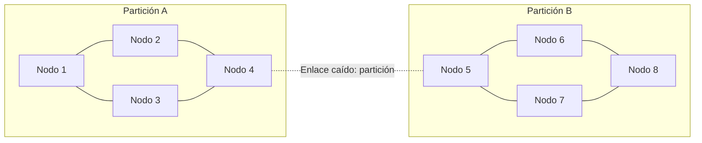
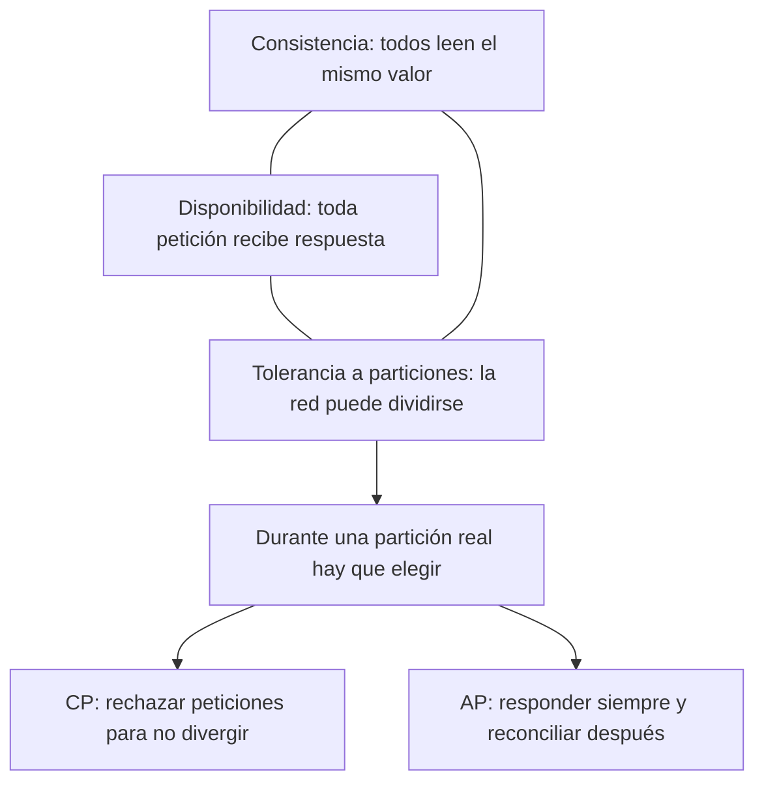

# 02 · Sistemas distribuidos y redes P2P

> **Nivel:** Inicial-Intermedio · ⏱️ **Duración estimada:** 120 min · **Fuente:** *Introduction to Reliable and Secure Distributed Programming* (Cachin, Guerraoui, Rodrigues) y *Distributed Systems* (Tanenbaum, van Steen)
> [⬅️ Currículo](../README.md) · [📚 Bibliografía](../../docs/bibliografia.md)

---

## 🎯 Objetivos

- Explicar los efectos de la latencia, las particiones de red y la replicación en un sistema distribuido.
- Diferenciar tolerancia a fallos por caída de la tolerancia a fallos bizantinos.
- Relacionar los teoremas CAP y FLP con las decisiones de diseño de una red P2P.
- Distinguir finalidad probabilística de finalidad económica.
- Analizar la propagación por gossip, el mempool y la resistencia Sybil.

## 📚 Resultados de aprendizaje

Al finalizar, el estudiante podrá:

1. **Definir** seguridad (safety) y vivacidad (liveness) y dar un ejemplo de cada una.
2. **Explicar** la compensación del teorema CAP ante una partición de red.
3. **Justificar** por qué el resultado FLP limita el consenso determinista en redes asíncronas.
4. **Simular** el comportamiento de una red de cinco nodos ante fallos y desórdenes.
5. **Comparar** finalidad probabilística y económica con casos concretos.

## 🗺️ Temas

| # | Tema | Por qué importa |
|---|------|-----------------|
| 1 | Latencia y asincronía | Los mensajes tardan y no llegan en orden; el diseño debe tolerarlo. |
| 2 | Particiones de red | La red puede dividirse; CAP obliga a elegir consistencia o disponibilidad. |
| 3 | Replicación y relojes | Sin reloj global, ordenar eventos requiere relojes lógicos. |
| 4 | Tolerancia bizantina | Los nodos pueden mentir, no solo caerse. |
| 5 | Mempool y gossip | Las transacciones se difunden por propagación entre pares. |
| 6 | Resistencia Sybil | Sin costo por identidad, un atacante crea nodos falsos ilimitados. |
| 7 | Finalidad | Determina cuándo una transacción se considera irreversible. |

## 🧠 Modelo mental

Imagina una red de corresponsales que se envían cartas por correo postal sin un reloj compartido: las cartas se cruzan, algunas se pierden, otras llegan en desorden y alguno podría enviar versiones contradictorias a distintos destinatarios. Para ponerse de acuerdo sobre "qué pasó y en qué orden" no basta con esperar; hacen falta reglas que funcionen aunque haya cartas perdidas (particiones) y aunque algún corresponsal mienta (fallo bizantino). Esta imagen explica por qué el acuerdo distribuido es difícil incluso sin adversarios.

El límite de la analogía es que los corresponsales humanos pueden llamarse por teléfono para desempatar; en un sistema abierto no existe ese canal privilegiado ni una autoridad central. Además, "descentralizado" no significa ausencia de gobierno: siempre hay reglas de protocolo, incentivos y procesos sociales que gobiernan el sistema, aunque no haya un administrador único.

## 🧩 Esquema visual

Propagación por gossip en una red de ocho nodos: cada nodo reenvía a sus pares, pero el enlace caído entre los nodos 4 y 5 parte la red en dos mitades que dejan de verse.



El triángulo CAP: las tres propiedades deseables y la elección forzada cuando la partición ocurre de verdad.



## 📖 Conceptos y definiciones

- **Seguridad (safety)**: nada malo ocurre; nunca se acepta un estado inválido o contradictorio.
- **Vivacidad (liveness)**: algo bueno acaba ocurriendo; el sistema sigue progresando.
- **Teorema CAP**: ante una partición hay que elegir entre consistencia y disponibilidad.
- **Resultado FLP**: en un sistema asíncrono no hay consenso determinista garantizado si puede fallar un proceso.
- **Fallo bizantino**: un nodo se comporta de forma arbitraria o maliciosa, no solo cae.
- **Mempool**: conjunto de transacciones pendientes que cada nodo mantiene antes de incluirlas.
- **Gossip**: protocolo de difusión en el que cada nodo reenvía a sus pares.
- **Ataque Sybil**: un atacante crea muchas identidades falsas para ganar influencia.
- **Finalidad probabilística**: la reversión es cada vez menos probable con el tiempo (Bitcoin).
- **Finalidad económica**: revertir implica una pérdida económica prohibitiva (Ethereum PoS).

## 🔬 Profundización

### ¿Qué elige una blockchain en términos CAP?

Una blockchain pública de tipo Nakamoto elige, en la práctica, **disponibilidad con consistencia eventual**: durante una partición, cada mitad de la red sigue produciendo bloques sobre su propia vista, y al reunificarse la regla de elección de cadena descarta una de las ramas — eso es un **reorg**. Los nodos que consideraban confirmadas las transacciones de la rama perdedora ven cómo vuelven al mempool. Por eso la finalidad de Bitcoin es probabilística: más profundidad, menos probabilidad de reversión, pero nunca cero.

Caso real verificable: el 25 de mayo de 2022, la Beacon Chain de Ethereum sufrió un **reorg de 7 bloques** — siete bloques ya propuestos fueron descartados de la cadena canónica. No hubo ataque: fue una consecuencia de la propagación desigual entre clientes actualizados y no actualizados en la implementación del boost del fork choice. La lección de sistemas distribuidos es doble: (1) incluso sin adversarios, la latencia y la heterogeneidad de clientes bastan para producir divergencias temporales; (2) el protocolo se diseña para que esas divergencias se resuelvan solas — la capa de finalidad (checkpoints de Casper FFG, módulo 03) marca el punto tras el cual un reorg ya no es una molestia sino una catástrofe económica. Análisis técnico: <https://barnabe.substack.com/p/pos-ethereum-reorg>.

### Modelos de sincronía y por qué FLP no condena el consenso

El resultado FLP (Fischer, Lynch y Paterson, 1985) prueba que en un sistema **asíncrono puro** — sin ninguna cota en los retrasos de mensajes — no existe un algoritmo determinista que garantice consenso si un solo proceso puede fallar. Suena letal, pero se aplica a un modelo extremo. Los tres modelos habituales:

| Modelo | Supuesto sobre los retrasos | Consecuencia práctica |
|--------|----------------------------|----------------------|
| Síncrono | Existe una cota conocida para todo retraso | Protocolos simples, pero el supuesto es irreal en Internet |
| Parcialmente síncrono | La cota existe pero se desconoce, o rige solo tras un instante GST | El estándar de diseño real: PBFT, Tendermint y Gasper operan aquí |
| Asíncrono | Ningún límite en los retrasos | Aplica FLP: imposibilidad de consenso determinista |

Las salidas de la trampa FLP son tres, y todas se usan: **sincronía parcial** (esperar timeouts y reintentar rondas, como PBFT), **aleatorización** (el sorteo del líder en PoW y PoS rompe la simetría que FLP explota) y **relajar la garantía** (aceptar finalidad probabilística en vez de acuerdo instantáneo). FLP dice que no puedes tener siempre terminación garantizada en el peor caso adversarial; no dice que el consenso falle en las redes reales, donde los periodos de buen comportamiento abundan.

### Resistencia Sybil: qué recurso encarece las identidades

Crear una identidad en una red P2P abierta es gratis; por eso el voto "un nodo, un voto" es inviable. Cada mecanismo anti-Sybil ancla el peso del voto a un recurso costoso:

| Mecanismo | Recurso escaso | Costo de ataque | Límite práctico |
|-----------|---------------|-----------------|-----------------|
| Proof of Work | Cómputo y energía | Adquirir u alquilar más hash que la red honesta, de forma sostenida | Hardware y electricidad tienen mercados observables; el costo es externo y recurrente |
| Proof of Stake | Capital bloqueado en el protocolo | Comprar y arriesgar una fracción grande del stake, expuesta a slashing | El propio ataque destruye el valor del capital atacante; costo interno |
| Identidad (PoA, consorcios) | Autorización verificada fuera de cadena | Corromper o suplantar a los miembros autorizados | No sirve para redes abiertas; reintroduce una autoridad de admisión |

La conclusión conecta con el módulo 03: el mecanismo de consenso no "elige al mejor", solo hace que fingir ser muchos resulte más caro que el beneficio esperado del ataque.

## 🧪 Laboratorio guiado

Este módulo es un ejercicio de diseño y simulación en papel; no requiere código específico. Puedes usar `pnpm test` para correr las pruebas del repositorio si tu diseño incluye un componente verificable.

1. Dibuja una red de cinco nodos conectados como pares (P2P) e indica sus canales.
2. Simula un **nodo desconectado**: describe cómo el resto continúa y cómo se reincorpora luego.
3. Simula **dos mensajes válidos que llegan en distinto orden** en diferentes nodos y anota el conflicto.
4. Simula un **nodo malicioso** que envía información contradictoria a distintos pares.
5. Simula una **partición temporal** que divide la red en dos mitades y su posterior reunificación.
6. Para cada escenario registra qué propiedades priorizas en una tabla:

```text
Escenario           | Safety | Liveness | Finalidad | Disponibilidad
--------------------|--------|----------|-----------|---------------
Nodo desconectado   | ...    | ...      | ...       | ...
Desorden de mensajes| ...    | ...      | ...       | ...
Nodo malicioso      | ...    | ...      | ...       | ...
Partición temporal  | ...    | ...      | ...       | ...
```

## 📝 Reto verificable

Entrega el diseño de la red de cinco nodos con los cuatro escenarios simulados y la tabla de propiedades priorizadas por escenario.

**Criterio de aceptación:** en el escenario de partición de red identificas explícitamente la compensación del teorema CAP (elegir consistencia o disponibilidad) y justificas cuál propiedad sacrificas y por qué.

## ⚠️ Errores frecuentes

| Síntoma | Causa y cómo comprobarlo |
|---------|--------------------------|
| Suponer entrega ordenada y confiable | Ignoras la asincronía; revisa qué pasa si un mensaje llega tarde o nunca. |
| Creer que se puede tener CAP completo | Confundes el enunciado; comprueba qué cedes durante una partición. |
| Igualar fallo por caída con fallo bizantino | Un nodo caído no miente; un bizantino sí. Distingue el modelo de fallo. |
| Confiar en relojes del sistema para ordenar | Sin reloj global hay deriva; usa relojes lógicos o el orden del protocolo. |
| Pensar que descentralizado es sin gobierno | Siempre hay reglas e incentivos; identifica quién decide los cambios. |

## 🛡️ Seguridad y ética

- Realiza las simulaciones en local; no despliegues nodos con fondos ni claves reales.
- No uses datos personales reales en los mensajes simulados.
- Considera que la resistencia Sybil tiene un costo: entiende quién lo paga y cómo.
- Reflexiona sobre el gobierno del protocolo: la descentralización técnica no elimina el poder, lo distribuye.
- Documenta los supuestos de red (síncrona, parcialmente síncrona o asíncrona) de cada escenario.

## 🔗 Referencias

- Cachin, Guerraoui y Rodrigues, *Introduction to Reliable and Secure Distributed Programming* — <https://link.springer.com/book/10.1007/978-3-642-15260-3>
- Tanenbaum y van Steen, *Distributed Systems* — <https://www.distributed-systems.net/>
- Martin Kleppmann, *Designing Data-Intensive Applications* — <https://dataintensive.net/>
- Fuente primaria: Leslie Lamport, *The Part-Time Parliament* (Paxos) — <https://lamport.azurewebsites.net/pubs/lamport-paxos.pdf>

## ✅ Criterio de dominio

- Entregas el diseño de la red y los cuatro escenarios con su tabla de propiedades.
- Explicas la compensación CAP y la limitación FLP con tus propias palabras.
- Diferencias correctamente finalidad probabilística de finalidad económica.

---

## 🧭 Navegación

⬅️ [Módulo 01 · Criptografía aplicada](../01-criptografia/README.md) · [📚 Índice del currículo](../README.md) · ➡️ [Módulo 03 · Consenso](../03-consenso/README.md)
