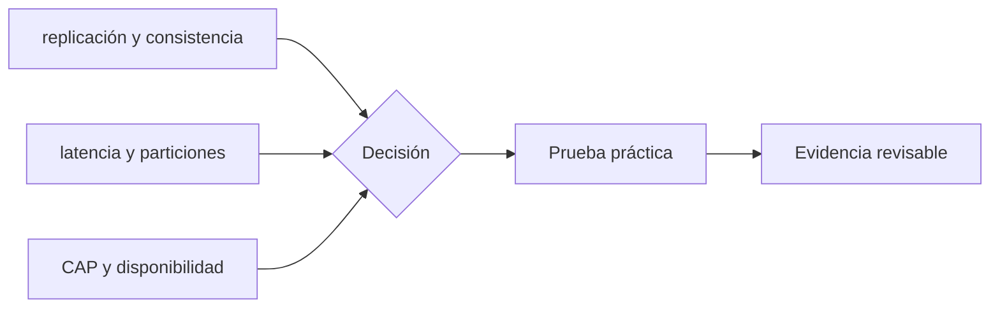

# Clase 5 · Replicación, latencia y fallas

> **Clase independiente 5 de 66** · **Nivel:** Inicial-Intermedio · **Fuente base:** *Introduction to Reliable and Secure Distributed Programming* (Cachin, Guerraoui, Rodrigues) y *Distributed Systems* (Tanenbaum, van Steen)
>
> [⬅️ Clase anterior](../01-criptografia/clase-04-firmas-claves-y-ciclo-de-vida.md) · [📚 Índice de las 66 clases](../README.md) · [🗂️ Mapa del tema](README.md) · [➡️ Clase siguiente](../02-sistemas-distribuidos/clase-06-redes-p2p-y-adversarios.md)

## Punto de partida

**Pregunta guía:** ¿Qué significa mantener una verdad compartida cuando la red se parte?

**Caso que abre la clase:** Dos regiones aceptan operaciones durante una interrupción de conectividad.

Los equipos reciben mensajes con retrasos, duplicados y particiones. Al reconstruir el orden descubren por experiencia por qué consistencia y disponibilidad entran en tensión.

## Gráfico pedagógico

Recorre el gráfico en voz alta: identifica supuestos, transformaciones y el punto exacto donde aparece evidencia.



## Trabajo práctico

**Método propio:** simulación de red con eventos.

**Actividad:** Simular mensajes retrasados, duplicados y fuera de orden entre nodos.

Trabaja en entorno local, regtest, signet o testnet según corresponda. Conserva entradas, comandos, salidas y bloque o instante de corte. Una captura aislada no demuestra reproducibilidad.

## Fundamentos que sostienen la respuesta

1. **replicación y consistencia.** En esta clase delimita qué objeto o relación estamos observando antes de sacar conclusiones. Localízalo explícitamente en «Dos regiones aceptan operaciones durante una interrupción de conectividad.» y anota qué dato faltaría para refutar tu lectura.
2. **latencia y particiones.** En esta clase explica el mecanismo que conecta la situación inicial con el cambio observable. Localízalo explícitamente en «Dos regiones aceptan operaciones durante una interrupción de conectividad.» y anota qué dato faltaría para refutar tu lectura.
3. **CAP y disponibilidad.** En esta clase permite contrastar el resultado y formular el límite de la evidencia. Localízalo explícitamente en «Dos regiones aceptan operaciones durante una interrupción de conectividad.» y anota qué dato faltaría para refutar tu lectura.

### ¿Qué elige una blockchain en términos CAP?

Una blockchain pública de tipo Nakamoto elige, en la práctica, **disponibilidad con consistencia eventual**: durante una partición, cada mitad de la red sigue produciendo bloques sobre su propia vista, y al reunificarse la regla de elección de cadena descarta una de las ramas — eso es un **reorg**. Los nodos que consideraban confirmadas las transacciones de la rama perdedora ven cómo vuelven al mempool. Por eso la finalidad de Bitcoin es probabilística: más profundidad, menos probabilidad de reversión, pero nunca cero.

Caso real verificable: el 25 de mayo de 2022, la Beacon Chain de Ethereum sufrió un **reorg de 7 bloques** — siete bloques ya propuestos fueron descartados de la cadena canónica. No hubo ataque: fue una consecuencia de la propagación desigual entre clientes actualizados y no actualizados en la implementación del boost del fork choice. La lección de sistemas distribuidos es doble: (1) incluso sin adversarios, la latencia y la heterogeneidad de clientes bastan para producir divergencias temporales; (2) el protocolo se diseña para que esas divergencias se resuelvan solas — la capa de finalidad (checkpoints de Casper FFG, clases 7–8) marca el punto tras el cual un reorg ya no es una molestia sino una catástrofe económica. Análisis técnico: <https://barnabe.substack.com/p/pos-ethereum-reorg>.

### CAP con un ejemplo que se puede seguir a mano

CAP suena abstracto hasta que se ve el instante de la decisión. Dos centros de datos, uno en Santiago y otro en Madrid, replican el mismo saldo: **100 €**. Se corta el enlace entre ambos y siguen recibiendo peticiones.

Llega una retirada de 80 € a cada lado, casi a la vez. Los dos caminos posibles:

**Opción CP (priorizar consistencia):** cada centro se pregunta si puede confirmar con la mitad de la red incomunicada. La respuesta es no.

```text
Santiago → "no puedo confirmar" → el cliente no puede sacar dinero
Madrid   → "no puedo confirmar" → el cliente no puede sacar dinero
Saldo al reconectar: 100 €. Correcto, pero el servicio estuvo caído.
```

**Opción AP (priorizar disponibilidad):** cada centro responde con lo que sabe.

```text
Santiago → entrega 80 € → apunta saldo 20 €
Madrid   → entrega 80 € → apunta saldo 20 €
Al reconectar: se entregaron 160 € de una cuenta que tenía 100.
```

Ese descubierto de 60 € **no es un bug del código**: es el precio explícito de haber elegido responder durante la partición. Alguien lo asumirá —el banco, el comercio o el cliente—, y esa decisión se toma en el diseño, no en el incidente.

Aquí es donde encaja una blockchain pública: **elige CP**. Durante una partición no confirma nada de forma definitiva, y de ahí sale la recomendación de esperar confirmaciones. Cuando alguien dice "la transacción tarda", en realidad está describiendo el precio de no permitir jamás un doble gasto.

> 💡 **En una frase:** en una partición no eliges entre bueno y malo, sino entre negarte a responder o arriesgarte a contradecirte. No hay tercera opción, y elegir por omisión es elegir igual.

<details>
<summary><strong>🎓 Si ya dominas esto</strong> — las precisiones que suelen faltar</summary>

- **CAP está mal enunciado en su versión popular.** No se eligen dos de tres: la P no es opcional en una red real, así que la elección solo aparece *durante* una partición. Brewer lo matizó doce años después y el modelo **PACELC** lo completa: si hay partición (P) eliges entre A y C, y si no la hay (E, "else") eliges entre latencia (L) y consistencia (C). La segunda mitad describe el día a día, que es el 99,9 % del tiempo.
- **FLP es un resultado más fuerte y menos citado.** Dice que en un sistema **asíncrono** ningún algoritmo determinista garantiza consenso si un solo proceso puede fallar. Los sistemas reales lo esquivan añadiendo supuestos: temporizadores (sincronía parcial) o aleatoriedad. Bitcoin usa lo segundo: la lotería del PoW es lo que rompe la simetría que FLP demuestra irrompible de forma determinista.
- **"Eventualmente consistente" no dice cuándo.** Sin una cota temporal es una promesa sin contenido operativo. Los CRDT convierten la reconciliación en algo automático y sin conflictos, pero solo para operaciones conmutativas: "sumar 5" se puede reconciliar, "poner el saldo a 20" no.
- **La finalidad económica de Ethereum es una cota, no una certeza.** Revertir un bloque finalizado exige que se destruya al menos un tercio del ETH depositado. Eso hace la reversión ruinosa, no imposible — y por eso se habla de finalidad *económica* y no *absoluta*.

</details>

## Demostración de aprendizaje

**Entregable:** Línea temporal que identifique estados divergentes y política de resolución.

**Comprobación formativa:** Indica qué decisión tomaría cada réplica durante una partición y qué costo tendrá al reconectar.

Para aprobar debes conectar el hecho observado con el concepto correcto, descartar al menos una interpretación alternativa y redactar una conclusión cuyo alcance no exceda la prueba.

## Errores que esta clase corrige

- Tratar **replicación y consistencia** como una etiqueta suficiente, sin identificar actores, dato y frontera.
- Usar **latencia y particiones** como explicación aunque el caso no aporte la evidencia necesaria.
- Dar por respondido «¿Qué significa mantener una verdad compartida cuando la red se parte?» sin contrastar **CAP y disponibilidad**.

Vuelve al caso inicial, elige el error más peligroso y describe una comprobación concreta que lo detectaría.

## Fuentes para comprobar y ampliar

- Cachin, Guerraoui y Rodrigues, *Introduction to Reliable and Secure Distributed Programming* — <https://link.springer.com/book/10.1007/978-3-642-15260-3>
- Tanenbaum y van Steen, *Distributed Systems* — <https://www.distributed-systems.net/>
- Martin Kleppmann, *Designing Data-Intensive Applications* — <https://dataintensive.net/>
- Fuente primaria: Leslie Lamport, *The Part-Time Parliament* (Paxos) — <https://lamport.azurewebsites.net/pubs/lamport-paxos.pdf>

Consulta además la [bibliografía razonada](../../docs/bibliografia.md), que declara procedencia y uso.

## Cierre de la clase

Responde otra vez la pregunta guía sin mirar notas. Si tu respuesta no menciona evidencia, supuesto y límite, todavía describe el tema pero no lo domina. Continúa solo cuando otra persona pueda reproducir tu entregable.
