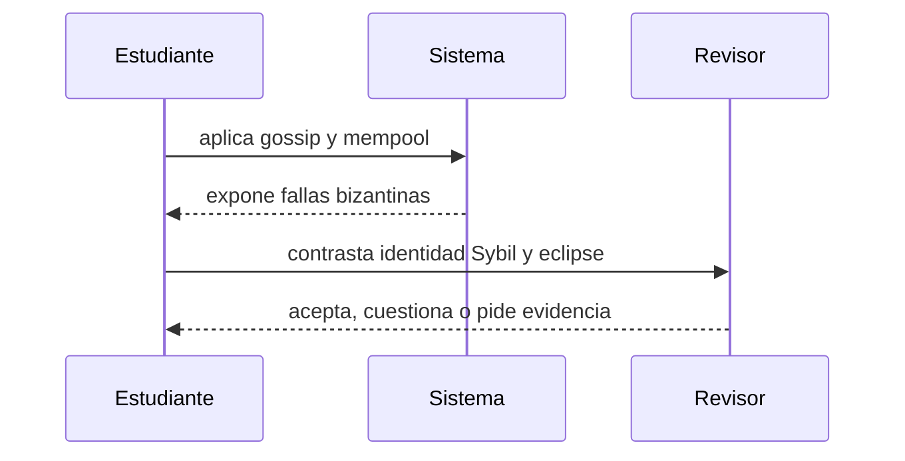

# Clase 6 · Redes P2P y adversarios

> **Clase independiente 6 de 66** · **Nivel:** Inicial-Intermedio · **Fuente base:** *Introduction to Reliable and Secure Distributed Programming* (Cachin, Guerraoui, Rodrigues) y *Distributed Systems* (Tanenbaum, van Steen)
>
> [⬅️ Clase anterior](../02-sistemas-distribuidos/clase-05-replicacion-latencia-y-fallas.md) · [📚 Índice de las 66 clases](../README.md) · [🗂️ Mapa del tema](README.md) · [➡️ Clase siguiente](../03-consenso/clase-07-elegir-un-historial-valido.md)

## Punto de partida

**Pregunta guía:** ¿Cómo se propaga información sin confiar en cada participante?

**Caso que abre la clase:** Un nodo nuevo recibe una visión sesgada de la red por vecinos controlados.

Una parte del grupo propaga información y otra intenta aislar nodos o crear identidades. El aprendizaje se centra en cómo la topología y el costo de identidad cambian la seguridad.

## Fundamentos que sostienen la respuesta

1. **gossip y mempool.** En esta clase delimita qué objeto o relación estamos observando antes de sacar conclusiones. Localízalo explícitamente en «Un nodo nuevo recibe una visión sesgada de la red por vecinos controlados.» y anota qué dato faltaría para refutar tu lectura.
2. **fallas bizantinas.** En esta clase explica el mecanismo que conecta la situación inicial con el cambio observable. Localízalo explícitamente en «Un nodo nuevo recibe una visión sesgada de la red por vecinos controlados.» y anota qué dato faltaría para refutar tu lectura.
3. **identidad Sybil y eclipse.** En esta clase permite contrastar el resultado y formular el límite de la evidencia. Localízalo explícitamente en «Un nodo nuevo recibe una visión sesgada de la red por vecinos controlados.» y anota qué dato faltaría para refutar tu lectura.

### Modelos de sincronía y por qué FLP no condena el consenso

El resultado FLP (Fischer, Lynch y Paterson, 1985) prueba que en un sistema **asíncrono puro** — sin ninguna cota en los retrasos de mensajes — no existe un algoritmo determinista que garantice consenso si un solo proceso puede fallar. Suena letal, pero se aplica a un modelo extremo. Los tres modelos habituales:

| Modelo | Supuesto sobre los retrasos | Consecuencia práctica |
|--------|----------------------------|----------------------|
| Síncrono | Existe una cota conocida para todo retraso | Protocolos simples, pero el supuesto es irreal en Internet |
| Parcialmente síncrono | La cota existe pero se desconoce, o rige solo tras un instante GST | El estándar de diseño real: PBFT, Tendermint y Gasper operan aquí |
| Asíncrono | Ningún límite en los retrasos | Aplica FLP: imposibilidad de consenso determinista |

Las salidas de la trampa FLP son tres, y todas se usan: **sincronía parcial** (esperar timeouts y reintentar rondas, como PBFT), **aleatorización** (el sorteo del líder en PoW y PoS rompe la simetría que FLP explota) y **relajar la garantía** (aceptar finalidad probabilística en vez de acuerdo instantáneo). FLP dice que no puedes tener siempre terminación garantizada en el peor caso adversarial; no dice que el consenso falle en las redes reales, donde los periodos de buen comportamiento abundan.

### Resistencia Sybil: qué recurso encarece las identidades

Crear una identidad en una red P2P abierta es gratis; por eso el voto "un nodo, un voto" es inviable. Cada mecanismo anti-Sybil ancla el peso del voto a un recurso costoso:

| Mecanismo | Recurso escaso | Costo de ataque | Límite práctico |
|-----------|---------------|-----------------|-----------------|
| Proof of Work | Cómputo y energía | Adquirir u alquilar más hash que la red honesta, de forma sostenida | Hardware y electricidad tienen mercados observables; el costo es externo y recurrente |
| Proof of Stake | Capital bloqueado en el protocolo | Comprar y arriesgar una fracción grande del stake, expuesta a slashing | El propio ataque destruye el valor del capital atacante; costo interno |
| Identidad (PoA, consorcios) | Autorización verificada fuera de cadena | Corromper o suplantar a los miembros autorizados | No sirve para redes abiertas; reintroduce una autoridad de admisión |

La conclusión conecta con las clases 7–8: el mecanismo de consenso no "elige al mejor", solo hace que fingir ser muchos resulte más caro que el beneficio esperado del ataque.

## Gráfico pedagógico

Recorre el gráfico en voz alta: identifica supuestos, transformaciones y el punto exacto donde aparece evidencia.

## Demostración de aprendizaje

**Entregable:** Informe con amenaza, supuesto de red y mitigación medible.

**Comprobación formativa:** Diferencia un fallo por caída, uno bizantino y un ataque Sybil usando el mismo escenario.

Para aprobar debes conectar el hecho observado con el concepto correcto, descartar al menos una interpretación alternativa y redactar una conclusión cuyo alcance no exceda la prueba.

## Trabajo práctico

**Método propio:** juego adversarial de topologías.

**Actividad:** Modelar topologías y observar cómo cambia la propagación al retirar nodos.

Trabaja en entorno local, regtest, signet o testnet según corresponda. Conserva entradas, comandos, salidas y bloque o instante de corte. Una captura aislada no demuestra reproducibilidad.

## Errores que esta clase corrige

- Tratar **gossip y mempool** como una etiqueta suficiente, sin identificar actores, dato y frontera.
- Usar **fallas bizantinas** como explicación aunque el caso no aporte la evidencia necesaria.
- Dar por respondido «¿Cómo se propaga información sin confiar en cada participante?» sin contrastar **identidad Sybil y eclipse**.

Vuelve al caso inicial, elige el error más peligroso y describe una comprobación concreta que lo detectaría.

## Fuentes para comprobar y ampliar

- Cachin, Guerraoui y Rodrigues, *Introduction to Reliable and Secure Distributed Programming* — <https://link.springer.com/book/10.1007/978-3-642-15260-3>
- Tanenbaum y van Steen, *Distributed Systems* — <https://www.distributed-systems.net/>
- Martin Kleppmann, *Designing Data-Intensive Applications* — <https://dataintensive.net/>
- Fuente primaria: Leslie Lamport, *The Part-Time Parliament* (Paxos) — <https://lamport.azurewebsites.net/pubs/lamport-paxos.pdf>

Consulta además la [bibliografía razonada](../../docs/bibliografia.md), que declara procedencia y uso.

## Cierre de la clase

Responde otra vez la pregunta guía sin mirar notas. Si tu respuesta no menciona evidencia, supuesto y límite, todavía describe el tema pero no lo domina. Continúa solo cuando otra persona pueda reproducir tu entregable.
