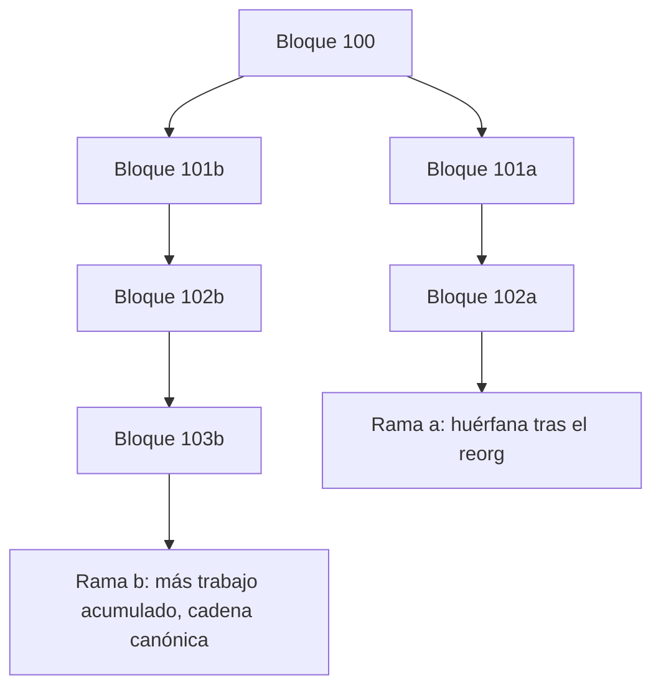

# 03 · Consenso

> **Nivel:** Intermedio · ⏱️ **Duración estimada:** 120 min · **Fuente:** whitepaper de Bitcoin (Nakamoto) y *Practical Byzantine Fault Tolerance* (Castro, Liskov)
> [⬅️ Currículo](../README.md) · [📚 Bibliografía](../../docs/bibliografia.md)

---

## 🎯 Objetivos

- Comparar Proof of Work, Proof of Stake, BFT y Proof of Authority más allá de energía y velocidad.
- Explicar la regla de la cadena más larga de Nakamoto y su finalidad probabilística.
- Describir el consenso de Ethereum tras The Merge (Casper FFG + LMD-GHOST, Gasper) y el slashing.
- Relacionar la cota 3f+1 de PBFT con la tolerancia a fallos bizantinos.
- Distinguir el recurso anti-Sybil de cada mecanismo y su tipo de finalidad.

## 📚 Resultados de aprendizaje

Al finalizar, el estudiante podrá:

1. **Comparar** cuatro mecanismos de consenso según recurso anti-Sybil, finalidad y uso típico.
2. **Explicar** por qué la regla de la cadena más larga ofrece finalidad probabilística.
3. **Describir** cómo el slashing genera finalidad económica en Ethereum PoS.
4. **Justificar** la cota 3f+1 de PBFT para tolerar f nodos bizantinos.
5. **Interpretar** un laboratorio de PoW sin confundirlo con la seguridad de una red real.

## 🗺️ Temas

| # | Tema | Por qué importa |
|---|------|-----------------|
| 1 | Problema del consenso | Acordar un único historial entre partes que no confían entre sí. |
| 2 | Proof of Work | Ancla la seguridad en cómputo y energía; base de Bitcoin. |
| 3 | Cadena más larga (Nakamoto) | Define cómo se resuelven las bifurcaciones sin autoridad. |
| 4 | Proof of Stake (Ethereum) | Ancla la seguridad en capital bloqueado y penalizaciones. |
| 5 | Casper FFG + LMD-GHOST (Gasper) | Combina elección de cadena con finalidad periódica. |
| 6 | PBFT y cota 3f+1 | Da finalidad rápida en conjuntos conocidos de validadores. |
| 7 | Proof of Authority | Consenso por identidades autorizadas en redes permisionadas. |

## 🧠 Modelo mental

Piensa en el consenso como el modo en que una multitud sin líder decide cuál de dos relatos contradictorios es el oficial. En Proof of Work la multitud "vota" gastando trabajo real: la versión respaldada por más esfuerzo acumulado gana, y rehacerla costaría repetir todo ese esfuerzo. En Proof of Stake los validadores ponen un depósito y firman la historia; si mienten pierden su depósito (slashing), de modo que la honestidad es la opción económicamente racional. En PBFT un grupo conocido vota en rondas y basta que más de dos tercios sean honestos para fijar el resultado de inmediato.

El límite de la analogía del "voto" es que no se trata de personas iguales: el peso proviene del recurso escaso (cómputo, capital o pertenencia autorizada), que es justamente el mecanismo anti-Sybil. Además, no todos los mecanismos dan el mismo tipo de garantía: la cadena más larga ofrece finalidad probabilística (cada bloque adicional reduce la probabilidad de reversión), mientras que Gasper y PBFT ofrecen finalidad explícita una vez alcanzado el quórum.

## 🧩 Esquema visual

Elección de cadena por regla longest-chain: dos mineros hallan bloque a la vez y la red se bifurca; cuando la rama b acumula más trabajo, la rama a se descarta (reorg) y sus transacciones vuelven al mempool.



Pipeline del Proof of Stake de Ethereum: de la propuesta en un slot a la finalización del checkpoint, dos épocas después.


## 📖 Conceptos y definiciones

- **Mecanismo de consenso**: reglas para que nodos independientes acuerden un mismo historial.
- **Recurso anti-Sybil**: bien escaso que da peso a un participante (cómputo, capital o identidad autorizada).
- **Proof of Work (PoW)**: se compite resolviendo un puzle de hash; el ganador propone el bloque.
- **Regla de la cadena más larga**: se sigue la cadena con más trabajo acumulado; base de la finalidad probabilística.
- **Proof of Stake (PoS)**: los validadores depositan capital y son elegidos para proponer y atestiguar bloques.
- **Slashing**: penalización que confisca parte del depósito ante conductas maliciosas; sostiene la finalidad económica.
- **Gasper**: combinación de Casper FFG (finalidad) y LMD-GHOST (elección de cadena) usada por Ethereum.
- **PBFT**: protocolo que tolera f nodos bizantinos con al menos 3f+1 participantes y da finalidad inmediata.
- **Proof of Authority (PoA)**: validadores identificados y autorizados firman bloques; típico en redes permisionadas.
- **The Merge (2022)**: transición de Ethereum de PoW a PoS; desde entonces Ethereum es Proof of Stake.

## 🔬 Profundización

### Economía de la seguridad: qué cuesta atacar cada mecanismo

En PoW, un ataque del 51 % exige controlar la mayoría del hashrate de forma sostenida. Contra Bitcoin es hoy inviable en la práctica: su hashrate se mide en cientos de exahashes por segundo (el valor exacto es volátil — consúltalo en vivo), y no existe mercado de alquiler capaz de suministrar esa capacidad; habría que fabricar y alimentar millones de ASIC. El riesgo real lo sufren las cadenas PoW pequeñas cuyo hashrate sí cabe en los mercados de alquiler: **Ethereum Classic sufrió ataques del 51 % verificados en enero de 2019 y tres veces en agosto de 2020**, con dobles gastos que en un solo incidente superaron los 5 millones de dólares. La seguridad PoW no es una propiedad del algoritmo sino del tamaño económico de la red concreta.

En PoS los umbrales son distintos: con **1/3 del stake** un atacante puede impedir la finalización (ataque a la vivacidad), y revertir un checkpoint ya finalizado exige que al menos **2/3 del stake** firme historias contradictorias — lo que implica que como mínimo 1/3 queda probadamente equivocado y es **slasheable**. En Ethereum hay decenas de millones de ETH en stake (la cifra exacta y su valor en dólares son volátiles — consúltalos en vivo, por ejemplo en <https://beaconcha.in/>); el costo de romper la finalidad no es alquilar un recurso externo, sino comprar y luego **destruir** una fracción enorme de ese capital. La diferencia clave de orden de magnitud no está solo en el precio de entrada, sino en que en PoW el hardware sobrevive al ataque y en PoS el capital atacante se quema.

### Ataques clásicos a PoS y sus mitigaciones

- **Nothing-at-stake**: en un PoS ingenuo, votar por todas las ramas de una bifurcación no cuesta nada (no hay energía que dividir), así que la estrategia racional sería apoyar todo a la vez y cobrar en la rama ganadora. Mitigación: el **slashing** convierte la firma de bloques contradictorios en una conducta cara — en Ethereum, un validador que firma dos cabeceras en conflicto pierde parte de su depósito y es expulsado.
- **Long-range**: un atacante que controló claves de validadores antiguos (o las compró baratas una vez retirado su stake) puede reescribir la historia desde un punto lejano del pasado, porque firmar bloques antiguos no cuesta nada hoy. Mitigación: **checkpoints de subjetividad débil** — los nodos nuevos o largamente desconectados no aceptan reorganizaciones que crucen un checkpoint reciente obtenido de una fuente confiable, y los clientes incorporan estos puntos de anclaje al sincronizar.
- **Ataques de corto alcance al fork choice** (balancing, bouncing): intentan mantener a la red dividida entre dos ramas manipulando el momento de publicación de atestaciones. Mitigación: el **proposer boost** y los refinamientos sucesivos de LMD-GHOST tras incidentes como el reorg de 7 bloques de mayo de 2022.

### Gasper: dos protocolos complementarios

| Componente | Pregunta que responde | Mecanismo | Garantía que aporta |
|------------|----------------------|-----------|--------------------|
| LMD-GHOST | ¿Sobre qué cabeza de cadena construyo y atestiguo ahora? | Sigue la rama con más peso de últimas atestaciones válidas | Vivacidad: la cadena avanza cada slot aunque no haya finalidad |
| Casper FFG | ¿Qué historia es ya irreversible? | Votos de checkpoint por épocas; justificación y finalización con 2/3 del stake | Seguridad económica: revertir lo finalizado cuesta al menos 1/3 del stake slasheado |

La separación importa: si más de 1/3 del stake se desconecta, LMD-GHOST mantiene la cadena viva pero Casper FFG deja de finalizar; el protocolo activa entonces la **fuga de inactividad** (inactivity leak), que drena el depósito de los validadores ausentes hasta que los activos vuelven a superar los 2/3 y la finalidad se recupera. Especificación y análisis: Buterin et al., *Combining GHOST and Casper* — <https://arxiv.org/abs/2003.03052>.

## 🧪 Laboratorio guiado

> 🧪 Estas prácticas están catalogadas y **resueltas paso a paso** en el [catálogo de laboratorios](../../labs/CATALOG.md).

1. Ejecuta el laboratorio pedagógico de Proof of Work:

```bash
pnpm lab:pow
```

2. Observa cuántos intentos (nonces) se requieren para hallar un hash bajo el objetivo con la dificultad inicial.
3. Aumenta la dificultad un nivel y vuelve a ejecutar; registra intentos y tiempo transcurrido.
4. Repite con varios niveles y tabula la relación entre dificultad, intentos y tiempo:

```text
Dificultad | Intentos promedio | Tiempo (s)
-----------|-------------------|-----------
1          | ...               | ...
2          | ...               | ...
3          | ...               | ...
```

5. Concluye cómo escala el costo con la dificultad, recordando que este laboratorio es pedagógico y no representa la seguridad real de una red en producción.

## 📝 Reto verificable

Completa la tabla de dificultad frente a intentos y tiempo con al menos tres niveles y redacta una breve interpretación del crecimiento observado.

**Criterio de aceptación:** muestras que al aumentar la dificultad crece de forma marcada el número de intentos y el tiempo esperado, y declaras explícitamente que el laboratorio no modela la seguridad de una red real (número de mineros, hashrate global ni incentivos).

## ⚠️ Errores frecuentes

| Síntoma | Causa y cómo comprobarlo |
|---------|--------------------------|
| Reducir el consenso a "energía vs. velocidad" | Ignoras recurso anti-Sybil y finalidad; compara las tres dimensiones. |
| Creer que Ethereum sigue en PoW | Desde The Merge (2022) es PoS; verifica en la documentación oficial. |
| Confundir finalidad probabilística con inmediata | En PoW la reversión disminuye con el tiempo; en Gasper/PBFT hay finalidad explícita. |
| Pensar que el laboratorio mide seguridad real | Es pedagógico; no incluye hashrate global ni incentivos económicos. |
| Suponer que PoS elimina toda centralización | El capital puede concentrarse; analiza la distribución de validadores. |

## 🛡️ Seguridad y ética

- Ejecuta el laboratorio solo en local; no uses claves ni fondos reales ni conectes a redes de producción.
- No presentes resultados del laboratorio como evidencia de la seguridad de una red pública.
- Reconoce las compensaciones de cada mecanismo (costo energético, concentración de capital, permisos).
- Evita el fraude de simplificación: comunica los supuestos y límites de cualquier comparación.
- Considera el impacto ambiental y de gobernanza al recomendar un mecanismo.

## 🔗 Referencias

- Fuente primaria: Satoshi Nakamoto, *Bitcoin: A Peer-to-Peer Electronic Cash System* — <https://bitcoin.org/bitcoin.pdf>
- Miguel Castro y Barbara Liskov, *Practical Byzantine Fault Tolerance*, OSDI 1999 — <https://pmg.csail.mit.edu/papers/osdi99.pdf>
- Buterin y Griffith, *Casper the Friendly Finality Gadget* — <https://arxiv.org/abs/1710.09437>
- ethereum.org, documentación sobre Proof of Stake — <https://ethereum.org/developers/docs/consensus-mechanisms/pos/>

## ✅ Criterio de dominio

- Entregas la tabla de dificultad e interpretas el crecimiento del costo.
- Comparas los cuatro mecanismos por recurso anti-Sybil, finalidad y uso típico.
- Explicas la diferencia entre finalidad probabilística y económica con ejemplos actuales.

---

## 🧭 Navegación

⬅️ [Módulo 02 · Sistemas distribuidos y redes P2P](../02-sistemas-distribuidos/README.md) · [📚 Índice del currículo](../README.md) · ➡️ [Módulo 04 · Bitcoin](../04-bitcoin/README.md)
