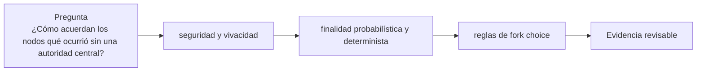

# Clase 7 · Elegir un historial válido

> **Clase independiente 7 de 66** · **Nivel:** Intermedio · **Fuente base:** whitepaper de Bitcoin (Nakamoto) y *Practical Byzantine Fault Tolerance* (Castro, Liskov)
>
> [⬅️ Clase anterior](../02-sistemas-distribuidos/clase-06-redes-p2p-y-adversarios.md) · [📚 Índice de las 66 clases](../README.md) · [🗂️ Mapa del tema](README.md) · [➡️ Clase siguiente](../03-consenso/clase-08-pow-pos-y-bft-bajo-amenaza.md)

## Punto de partida

**Pregunta guía:** ¿Cómo acuerdan los nodos qué ocurrió sin una autoridad central?

**Caso que abre la clase:** Dos bloques válidos compiten temporalmente por ser la cabeza de la cadena.

Se entregan bloques fuera de orden y cada equipo aplica la regla de selección. La finalidad aparece como una propiedad gradual o protocolaria, no como sinónimo de ‘visto en un explorador’.

## Fundamentos que sostienen la respuesta

1. **seguridad y vivacidad.** En esta clase delimita qué objeto o relación estamos observando antes de sacar conclusiones. Localízalo explícitamente en «Dos bloques válidos compiten temporalmente por ser la cabeza de la cadena.» y anota qué dato faltaría para refutar tu lectura.
2. **finalidad probabilística y determinista.** En esta clase explica el mecanismo que conecta la situación inicial con el cambio observable. Localízalo explícitamente en «Dos bloques válidos compiten temporalmente por ser la cabeza de la cadena.» y anota qué dato faltaría para refutar tu lectura.
3. **reglas de fork choice.** En esta clase permite contrastar el resultado y formular el límite de la evidencia. Localízalo explícitamente en «Dos bloques válidos compiten temporalmente por ser la cabeza de la cadena.» y anota qué dato faltaría para refutar tu lectura.

### Economía de la seguridad: qué cuesta atacar cada mecanismo

En PoW, un ataque del 51 % exige controlar la mayoría del hashrate de forma sostenida. Contra Bitcoin es hoy inviable en la práctica: su hashrate se mide en cientos de exahashes por segundo (el valor exacto es volátil — consúltalo en vivo), y no existe mercado de alquiler capaz de suministrar esa capacidad; habría que fabricar y alimentar millones de ASIC. El riesgo real lo sufren las cadenas PoW pequeñas cuyo hashrate sí cabe en los mercados de alquiler: **Ethereum Classic sufrió ataques del 51 % verificados en enero de 2019 y tres veces en agosto de 2020**, con dobles gastos que en un solo incidente superaron los 5 millones de dólares. La seguridad PoW no es una propiedad del algoritmo sino del tamaño económico de la red concreta.

En PoS los umbrales son distintos: con **1/3 del stake** un atacante puede impedir la finalización (ataque a la vivacidad), y revertir un checkpoint ya finalizado exige que al menos **2/3 del stake** firme historias contradictorias — lo que implica que como mínimo 1/3 queda probadamente equivocado y es **slasheable**. En Ethereum hay decenas de millones de ETH en stake (la cifra exacta y su valor en dólares son volátiles — consúltalos en vivo, por ejemplo en <https://beaconcha.in/>); el costo de romper la finalidad no es alquilar un recurso externo, sino comprar y luego **destruir** una fracción enorme de ese capital. La diferencia clave de orden de magnitud no está solo en el precio de entrada, sino en que en PoW el hardware sobrevive al ataque y en PoS el capital atacante se quema.

### Ataques clásicos a PoS y sus mitigaciones

- **Nothing-at-stake**: en un PoS ingenuo, votar por todas las ramas de una bifurcación no cuesta nada (no hay energía que dividir), así que la estrategia racional sería apoyar todo a la vez y cobrar en la rama ganadora. Mitigación: el **slashing** convierte la firma de bloques contradictorios en una conducta cara — en Ethereum, un validador que firma dos cabeceras en conflicto pierde parte de su depósito y es expulsado.
- **Long-range**: un atacante que controló claves de validadores antiguos (o las compró baratas una vez retirado su stake) puede reescribir la historia desde un punto lejano del pasado, porque firmar bloques antiguos no cuesta nada hoy. Mitigación: **checkpoints de subjetividad débil** — los nodos nuevos o largamente desconectados no aceptan reorganizaciones que crucen un checkpoint reciente obtenido de una fuente confiable, y los clientes incorporan estos puntos de anclaje al sincronizar.
- **Ataques de corto alcance al fork choice** (balancing, bouncing): intentan mantener a la red dividida entre dos ramas manipulando el momento de publicación de atestaciones. Mitigación: el **proposer boost** y los refinamientos sucesivos de LMD-GHOST tras incidentes como el reorg de 7 bloques de mayo de 2022.

### Gasper: dos protocolos complementarios

| Componente | Pregunta que responde | Mecanismo | Garantía que aporta |
|------------|----------------------|-----------|--------------------|
| LMD-GHOST | ¿Sobre qué cabeza de cadena construyo y atestiguo ahora? | Sigue la rama con más peso de últimas atestaciones válidas | Vivacidad: la cadena avanza cada slot aunque no haya finalidad |
| Casper FFG | ¿Qué historia es ya irreversible? | Votos de checkpoint por épocas; justificación y finalización con 2/3 del stake | Seguridad económica: revertir lo finalizado cuesta al menos 1/3 del stake slasheado |

La separación importa: si más de 1/3 del stake se desconecta, LMD-GHOST mantiene la cadena viva pero Casper FFG deja de finalizar; el protocolo activa entonces la **fuga de inactividad** (inactivity leak), que drena el depósito de los validadores ausentes hasta que los activos vuelven a superar los 2/3 y la finalidad se recupera. Especificación y análisis: Buterin et al., *Combining GHOST and Casper* — <https://arxiv.org/abs/2003.03052>.

## Gráfico pedagógico

Recorre el gráfico en voz alta: identifica supuestos, transformaciones y el punto exacto donde aparece evidencia.

## Trabajo práctico

**Método propio:** reconstrucción de una bifurcación.

**Actividad:** Reconstruir una bifurcación y aplicar una regla de selección paso a paso.

Trabaja en entorno local, regtest, signet o testnet según corresponda. Conserva entradas, comandos, salidas y bloque o instante de corte. Una captura aislada no demuestra reproducibilidad.

## Demostración de aprendizaje

**Entregable:** Explicación causal de cuándo una operación se considera suficientemente final.

**Comprobación formativa:** ¿Qué dato adicional necesitas antes de afirmar que una operación ya no puede revertirse?

Para aprobar debes conectar el hecho observado con el concepto correcto, descartar al menos una interpretación alternativa y redactar una conclusión cuyo alcance no exceda la prueba.

## Errores que esta clase corrige

- Tratar **seguridad y vivacidad** como una etiqueta suficiente, sin identificar actores, dato y frontera.
- Usar **finalidad probabilística y determinista** como explicación aunque el caso no aporte la evidencia necesaria.
- Dar por respondido «¿Cómo acuerdan los nodos qué ocurrió sin una autoridad central?» sin contrastar **reglas de fork choice**.

Vuelve al caso inicial, elige el error más peligroso y describe una comprobación concreta que lo detectaría.

## Fuentes para comprobar y ampliar

- Fuente primaria: Satoshi Nakamoto, *Bitcoin: A Peer-to-Peer Electronic Cash System* — <https://bitcoin.org/bitcoin.pdf>
- Miguel Castro y Barbara Liskov, *Practical Byzantine Fault Tolerance*, OSDI 1999 — <https://www.usenix.org/conference/osdi-99/practical-byzantine-fault-tolerance>
- Buterin y Griffith, *Casper the Friendly Finality Gadget* — <https://arxiv.org/abs/1710.09437>
- ethereum.org, documentación sobre Proof of Stake — <https://ethereum.org/developers/docs/consensus-mechanisms/pos/>

Consulta además la [bibliografía razonada](../../docs/bibliografia.md), que declara procedencia y uso.

## Cierre de la clase

Responde otra vez la pregunta guía sin mirar notas. Si tu respuesta no menciona evidencia, supuesto y límite, todavía describe el tema pero no lo domina. Continúa solo cuando otra persona pueda reproducir tu entregable.
