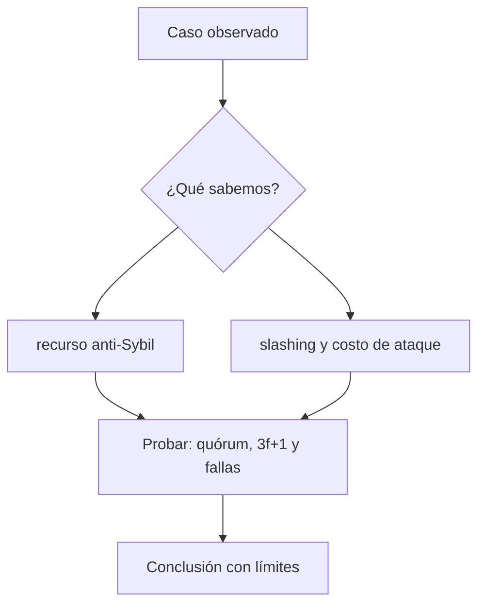

# Clase 8 · PoW, PoS y BFT bajo amenaza

> **Clase independiente 8 de 66** · **Nivel:** Intermedio · **Fuente base:** whitepaper de Bitcoin (Nakamoto) y *Practical Byzantine Fault Tolerance* (Castro, Liskov)
>
> [⬅️ Clase anterior](../03-consenso/clase-07-elegir-un-historial-valido.md) · [📚 Índice de las 66 clases](../README.md) · [🗂️ Mapa del tema](README.md) · [➡️ Clase siguiente](../04-bitcoin/clase-09-utxo-y-anatomia-de-una-transaccion.md)

## Punto de partida

**Pregunta guía:** ¿Qué recurso impide identidades gratuitas y qué ocurre si el actor miente?

**Caso que abre la clase:** Un conjunto de validadores pierde conectividad mientras otro intenta equivocar firmas.

Todos los mecanismos enfrentan el mismo conjunto de fallas para evitar comparaciones publicitarias. El grupo identifica recurso anti-Sybil, umbral, penalización y recuperación.

## Gráfico pedagógico

Recorre el gráfico en voz alta: identifica supuestos, transformaciones y el punto exacto donde aparece evidencia.



## Fundamentos que sostienen la respuesta

1. **recurso anti-Sybil.** En esta clase delimita qué objeto o relación estamos observando antes de sacar conclusiones. Localízalo explícitamente en «Un conjunto de validadores pierde conectividad mientras otro intenta equivocar firmas.» y anota qué dato faltaría para refutar tu lectura.
2. **slashing y costo de ataque.** En esta clase explica el mecanismo que conecta la situación inicial con el cambio observable. Localízalo explícitamente en «Un conjunto de validadores pierde conectividad mientras otro intenta equivocar firmas.» y anota qué dato faltaría para refutar tu lectura.
3. **quórum, 3f+1 y fallas.** En esta clase permite contrastar el resultado y formular el límite de la evidencia. Localízalo explícitamente en «Un conjunto de validadores pierde conectividad mientras otro intenta equivocar firmas.» y anota qué dato faltaría para refutar tu lectura.

### Cuánto cuesta de verdad un ataque del 51 %

"Con la mayoría del poder se puede reescribir la cadena" es cierto y poco útil sin el número. Pongámoslo, porque el resultado explica por qué unas redes se atacan y otras no.

**Lo que un atacante puede y no puede hacer.** Es más limitado de lo que sugiere el titular:

| Puede | No puede |
|---|---|
| Excluir transacciones (censurar) | Robar monedas de otras direcciones: no tiene las claves |
| Revertir sus **propias** transacciones recientes (doble gasto) | Crear monedas de la nada: las reglas las validan todos los nodos |
| Reordenar transacciones dentro de su ventana | Alterar bloques antiguos y profundos |

El ataque real, entonces, es concreto: **depositar en un exchange, cambiar por otra moneda, retirar, y luego reescribir la cadena para recuperar el depósito**.

**Qué lo hace rentable.** Su viabilidad depende de una relación:

```text
beneficio  =  lo que consigues retirar antes de que lo detecten
coste      =  alquiler de hashrate × horas  +  hardware  +  reputación
```

Y aquí está la clave que decide todo: **si existe un mercado donde alquilar hashrate, el coste del hardware desaparece de la ecuación**. Por eso las cadenas pequeñas que comparten algoritmo con una grande son las que se atacan: hay potencia de sobra apuntando a otra cadena, y desviarla un rato es barato. Ethereum Classic sufrió varias reorganizaciones profundas en 2019 y 2020 exactamente así, mientras Bitcoin —cuyo hashrate no se puede alquilar en volumen suficiente— nunca lo ha sufrido.

**La defensa real no es solo técnica.** Un exchange que exige 100 confirmaciones para una cadena barata está subiendo el coste del ataque de forma lineal: revertir 100 bloques cuesta cien veces más que revertir uno. Por eso los requisitos de confirmación varían tanto entre monedas: no es arbitrario, es una función del coste de atacarlas.

> 💡 **En una frase:** el consenso no hace imposible el ataque; lo hace más caro que el beneficio. Cuando esa desigualdad se invierte —cadena pequeña, hashrate alquilable— el ataque ocurre.

<details>
<summary><strong>🎓 Si ya dominas esto</strong> — donde el modelo simple se queda corto</summary>

- **La minería egoísta baja el umbral por debajo del 50 %.** Eyal y Sirer demostraron que reteniendo bloques y publicándolos estratégicamente, un minero con menos de la mitad puede obtener una fracción de recompensas superior a su hashrate. El 51 % es el umbral del ataque garantizado, no el de la ganancia anómala.
- **En PoS el ataque cambia de naturaleza.** No se alquila hashrate: hay que **adquirir** una fracción enorme del capital depositado, con la salvedad de que atacar destruye tu propio depósito vía slashing. El coste pasa de ser operativo (electricidad) a ser de capital en riesgo, y esa diferencia es el argumento central a favor de PoS.
- **La finalidad de Gasper tiene dos niveles.** Justificado (una época con 2/3 de atestaciones) y finalizado (dos épocas consecutivas justificadas). Un bloque finalizado solo se revierte destruyendo al menos un tercio del ETH depositado, lo que sitúa el coste en el orden de decenas de miles de millones.
- **PBFT no escala por su coste de mensajes.** Requiere O(n²) comunicación por ronda, lo que lo hace impracticable con miles de validadores y perfecto para consorcios de decenas. HotStuff lo reduce a O(n) con un líder rotatorio, que es la línea que siguen los BFT modernos.
- **El "nothing at stake" original quedó resuelto.** La objeción clásica a PoS —que apostar en todas las bifurcaciones sale gratis— la cierra el slashing por doble voto: firmar dos cadenas es una infracción detectable y castigada. Citarla hoy como problema abierto es citar el estado del arte de 2014.

</details>

## Trabajo práctico

**Método propio:** mesa comparativa bajo ataque.

**Actividad:** Comparar mecanismos con una misma matriz de amenaza y recuperación.

Trabaja en entorno local, regtest, signet o testnet según corresponda. Conserva entradas, comandos, salidas y bloque o instante de corte. Una captura aislada no demuestra reproducibilidad.

## Errores que esta clase corrige

- Tratar **recurso anti-Sybil** como una etiqueta suficiente, sin identificar actores, dato y frontera.
- Usar **slashing y costo de ataque** como explicación aunque el caso no aporte la evidencia necesaria.
- Dar por respondido «¿Qué recurso impide identidades gratuitas y qué ocurre si el actor miente?» sin contrastar **quórum, 3f+1 y fallas**.

Vuelve al caso inicial, elige el error más peligroso y describe una comprobación concreta que lo detectaría.

## Demostración de aprendizaje

**Entregable:** Tabla argumentada de garantías, límites y supuestos de PoW, PoS y BFT.

**Comprobación formativa:** Explica por qué bajo consumo energético no implica por sí mismo menor seguridad.

Para aprobar debes conectar el hecho observado con el concepto correcto, descartar al menos una interpretación alternativa y redactar una conclusión cuyo alcance no exceda la prueba.

## Fuentes para comprobar y ampliar

- Fuente primaria: Satoshi Nakamoto, *Bitcoin: A Peer-to-Peer Electronic Cash System* — <https://bitcoin.org/bitcoin.pdf>
- Miguel Castro y Barbara Liskov, *Practical Byzantine Fault Tolerance*, OSDI 1999 — <https://www.usenix.org/conference/osdi-99/practical-byzantine-fault-tolerance>
- Buterin y Griffith, *Casper the Friendly Finality Gadget* — <https://arxiv.org/abs/1710.09437>
- ethereum.org, documentación sobre Proof of Stake — <https://ethereum.org/developers/docs/consensus-mechanisms/pos/>

Consulta además la [bibliografía razonada](../../docs/bibliografia.md), que declara procedencia y uso.

## Cierre de la clase

Responde otra vez la pregunta guía sin mirar notas. Si tu respuesta no menciona evidencia, supuesto y límite, todavía describe el tema pero no lo domina. Continúa solo cuando otra persona pueda reproducir tu entregable.
