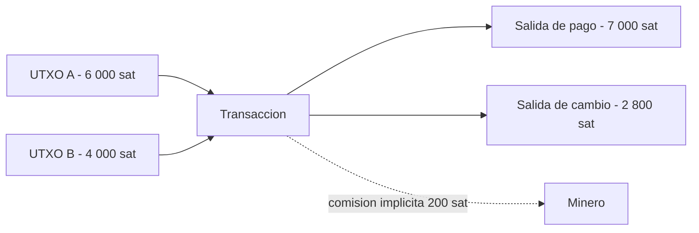
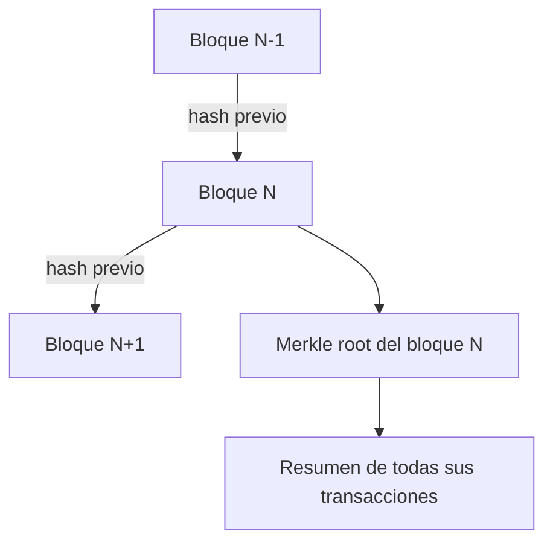

# 04 · Bitcoin

> **Nivel:** Intermedio · ⏱️ **Duración estimada:** 150 min · **Fuente:** *Mastering Bitcoin* (Antonopoulos) y *Mastering the Lightning Network* (Antonopoulos, Osuntokun, Pickhardt)
> [⬅️ Currículo](../README.md) · [📚 Bibliografía](../../docs/bibliografia.md)

---

## 🎯 Objetivos

- Explicar el modelo UTXO identificando entradas, salidas, scripts y firmas en una transacción real.
- Calcular la comisión de una transacción y su tasa en sat/vB a partir de datos de un explorador público.
- Distinguir el papel de un full node frente a un cliente SPV en la verificación.
- Describir la política de emisión (halving) y su efecto sobre la oferta a lo largo del tiempo.
- Diferenciar custodia propia y custodia delegada, y el rol de la seed phrase (BIP-39).

## 📚 Resultados de aprendizaje

Al finalizar, el estudiante podrá:

1. **Descomponer** una transacción de Bitcoin en los UTXO que consume y las salidas que crea.
2. **Estimar** comisión y tasa efectiva marcando explícitamente cualquier inferencia sobre el cambio.
3. **Comparar** confirmaciones, profundidad de bloque y el riesgo de reorganización.
4. **Justificar** por qué una dirección no equivale a una persona ni a una identidad.
5. **Seleccionar** UTXO de una cartera aplicando criterios de coste y privacidad.
6. **Relacionar** Lightning con la capa base como red de pagos fuera de cadena.

## 🗺️ Temas

| # | Tema | Por qué importa |
|---|---|---|
| 1 | Modelo UTXO | Es la unidad contable de Bitcoin; sin él no se entiende ninguna transacción. |
| 2 | Scripts y firmas | Definen las condiciones de gasto y quién puede reclamar una salida. |
| 3 | Mempool y comisiones | Determinan cuándo y a qué coste se confirma una transacción. |
| 4 | Minería y confirmaciones | Explican la finalidad probabilística y el riesgo de reorganización. |
| 5 | Full nodes y SPV | Marcan la diferencia entre verificar y confiar. |
| 6 | Emisión y halving | Fijan la política monetaria y la oferta futura. |
| 7 | Lightning Network | Habilita pagos rápidos y baratos fuera de la cadena base. |
| 8 | Custodia y BIP-39 | La gestión de claves decide quién controla realmente los fondos. |

## 🧠 Modelo mental

Piensa en los UTXO como billetes físicos en una billetera: cada uno tiene un valor fijo y solo puedes gastarlo entero. Para pagar 7 usando dos billetes de 5, entregas ambos (entradas por 10), pagas los 7 y recibes 3 de vuelta como cambio, menos una pequeña propina para el minero (la comisión). No existe un saldo único: tu balance es la suma de todos los billetes que puedes gastar.

La analogía tiene límites. Los billetes no llevan condiciones de gasto programables, mientras que un UTXO se bloquea con un script que puede exigir una firma, varias firmas o una condición temporal. Además, el cambio no vuelve mágicamente a "tu bolsillo": va a una nueva salida que tú controlas, y confundirla con un pago real es una fuente clásica de errores de análisis.

## 🧩 Esquema visual

El flujo típico de una transacción UTXO: dos entradas se consumen por completo, se crea una salida de pago y otra de cambio, y la diferencia no asignada es la comisión que cobra el minero.



Cada bloque referencia el hash del anterior y resume sus transacciones en una raíz de Merkle, lo que encadena la historia y permite pruebas de inclusión eficientes.



## 📖 Conceptos y definiciones

- **UTXO**: salida de transacción no gastada; representa fondos disponibles con una condición de gasto asociada.
- **Entrada (input)**: referencia a un UTXO previo que se consume, acompañada de los datos que satisfacen su script.
- **Salida (output)**: nuevo UTXO creado, con un valor y un script que fija quién podrá gastarlo.
- **Comisión (fee)**: diferencia entre el valor total de entradas y salidas; retribuye al minero. Ejemplo: entradas 10 000 sat, salidas 9 800 sat → comisión 200 sat.
- **Tasa de comisión**: comisión dividida por el tamaño virtual, expresada en sat/vB; guía la prioridad en el mempool.
- **Confirmación**: inclusión de la transacción en un bloque; cada bloque adicional aumenta la profundidad y reduce el riesgo de reorganización.
- **Reorganización (reorg)**: sustitución de bloques recientes por una cadena competidora más trabajada; puede revertir confirmaciones poco profundas.
- **Full node**: nodo que valida por sí mismo todas las reglas de consenso; no delega confianza.
- **SPV**: verificación de pago simplificada; confía en cabeceras y pruebas de inclusión sin validar toda la cadena.
- **Seed phrase (BIP-39)**: lista de palabras que codifica la semilla de la que derivan todas las claves; quien la posee controla los fondos.
- **Taproot/Schnorr (2021)**: actualización que introdujo firmas Schnorr y scripts más privados y eficientes.

## 🔬 Profundización

### Evolución de los tipos de script

Los formatos de salida de Bitcoin han evolucionado para reducir tamaño, mejorar la privacidad y habilitar nuevas criptografías, siempre mediante soft forks compatibles hacia atrás.

| Tipo | Año | Qué aportó |
|---|---|---|
| P2PKH | 2009 | Pago a hash de clave pública; el formato "clásico" con direcciones que empiezan por 1. |
| P2SH | 2012 (BIP-16) | Pago a hash de script; permite multisig y condiciones complejas sin revelarlas hasta el gasto. |
| P2WPKH | 2017 (SegWit, BIP-141) | Mueve las firmas al *witness*, corrige la maleabilidad y abarata el peso de la transacción. |
| P2TR | 2021 (Taproot, BIP-341) | Firmas Schnorr agregables; un gasto cooperativo multisig se ve idéntico a uno simple, ganando privacidad. |

Con Schnorr, una multifirma agregada ocupa lo mismo que una firma individual (64 bytes), mientras que un multisig ECDSA tradicional publica todas las firmas por separado.

### El mercado de comisiones: vbytes, RBF y CPFP

Desde SegWit el tamaño relevante es el **tamaño virtual** (vbytes): los datos de witness pesan una cuarta parte que el resto. La prioridad en el mempool se mide en **sat/vB**.

Ejemplo numérico orientativo: una transacción con 1 entrada P2WPKH y 2 salidas P2WPKH ocupa ≈ 141 vB (≈ 10,5 vB de estructura + ≈ 68 vB la entrada + ≈ 31 vB cada salida). Si el mercado pide 20 sat/vB:

```text
comisión ≈ 141 vB × 20 sat/vB = 2 820 sat
```

Si la transacción queda atascada hay dos salidas estándar:

- **RBF (BIP-125)**: el emisor la reemplaza por otra con el mismo UTXO de entrada y mayor tasa.
- **CPFP**: el receptor gasta la salida sin confirmar con una transacción hija de tasa alta; el minero debe incluir ambas y evalúa la tasa del paquete completo.

Las tasas de mercado cambian por hora: consúltalo en vivo en un estimador de comisiones antes de emitir.

### Emisión: halvings y el límite de 21 millones

El subsidio por bloque se reduce a la mitad cada 210 000 bloques (≈ 4 años): 50 BTC en 2009, 25 tras el halving de noviembre de 2012, 12,5 en julio de 2016, 6,25 en mayo de 2020 y **3,125 BTC desde abril de 2024**, el subsidio vigente. El siguiente halving se espera hacia 2028.

Como cada término de la serie es la mitad del anterior, la suma converge: 210 000 × 50 × (1 + 1/2 + 1/4 + …) ≈ 21 millones de BTC, que nunca se alcanzan exactamente por el redondeo a satoshis. Más del 94 % del suministro ya fue emitido; la emisión restante se extiende hasta aproximadamente el año 2140, cuando la seguridad dependerá solo de las comisiones.

## 🧪 Laboratorio guiado

> 🧪 Estas prácticas están catalogadas y **resueltas paso a paso** en el [catálogo de laboratorios](../../labs/CATALOG.md).

1. Ejecuta la selección de UTXO del repositorio para observar cómo se eligen entradas ante distintos objetivos de pago.

```bash
pnpm lab:utxo
```

2. Elige una transacción pública en un explorador de bloques de tu preferencia y anota su identificador.
3. Lista los UTXO que consume (entradas) y las salidas que crea, con sus valores.
4. Identifica cuál salida parece cambio y **marca esa afirmación como inferencia**, no como hecho.
5. Calcula la comisión (suma de entradas menos suma de salidas) y la tasa en sat/vB usando el tamaño virtual.
6. Escribe dos limitaciones del análisis, incluyendo por qué no puedes vincular la dirección a una persona.

## 📝 Reto verificable

Documenta el análisis de una transacción pública en un texto breve: identificador, entradas consumidas, salidas creadas, comisión, tasa en sat/vB y la salida que infieres como cambio.

**Criterio de aceptación:** el documento marca explícitamente la inferencia de cambio, muestra el cálculo de la comisión con sus cifras y no afirma en ningún punto que una dirección corresponda a una identidad concreta.

## ⚠️ Errores frecuentes

| Síntoma | Causa y cómo comprobarlo |
|---|---|
| La comisión "no cuadra" | Olvidaste que la comisión es entradas menos salidas; súmalas por separado y resta. |
| Confundes el cambio con un pago | Asumiste una salida sin marcar la inferencia; verifica qué dirección controla la cartera emisora. |
| Crees que una confirmación es definitiva | Ignoras el riesgo de reorg; consulta la profundidad y espera más bloques para montos altos. |
| Atribuyes una dirección a una persona | Confundes seudónimo con identidad; recuerda que el análisis solo observa flujos on-chain. |
| Comparas tasas sin normalizar | Usaste el tamaño en bytes en vez del virtual; calcula sat/vB con el tamaño virtual. |

## 🛡️ Seguridad y ética

- Trabaja siempre en local o testnet; nunca uses fondos ni claves reales en los ejercicios.
- No introduzcas seed phrases reales en ninguna herramienta del laboratorio.
- El análisis de cadena observa seudónimos: no deanonymices ni atribuyas transacciones a personas.
- Trata la custodia propia con responsabilidad; una seed phrase perdida es dinero perdido y una filtrada es robo.
- Las cifras de comisiones y dificultad cambian constantemente: consúltalo en vivo antes de concluir.

## 🔗 Referencias

- Antonopoulos, *Mastering Bitcoin*, 3.ª ed., cap. sobre transacciones y UTXO — <https://github.com/bitcoinbook/bitcoinbook>
- Antonopoulos, Osuntokun y Pickhardt, *Mastering the Lightning Network*, cap. introductorio — <https://github.com/lnbook/lnbook>
- Narayanan et al., *Bitcoin and Cryptocurrency Technologies*, caps. sobre mecánica de Bitcoin.
- Fuente primaria: whitepaper de Bitcoin — <https://bitcoin.org/bitcoin.pdf>
- Fuente primaria: repositorio de BIPs — <https://github.com/bitcoin/bips>

## ✅ Criterio de dominio

- Explicas de memoria el ciclo entrada → salida → cambio de una transacción real.
- Calculas comisión y tasa en sat/vB y justificas la incertidumbre de la inferencia de cambio.
- Argumentas la diferencia entre verificar con un full node y confiar en SPV.

---

## 🧭 Navegación

⬅️ [Módulo 03 · Consenso](../03-consenso/README.md) · [📚 Índice del currículo](../README.md) · ➡️ [Módulo 05 · Ethereum y EVM](../05-ethereum-evm/README.md)
