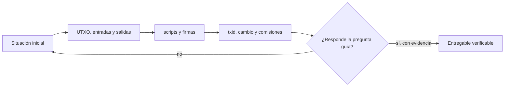

# Clase 9 · UTXO y anatomía de una transacción

> **Clase independiente 9 de 66** · **Nivel:** Intermedio · **Fuente base:** *Mastering Bitcoin* (Antonopoulos) y *Mastering the Lightning Network* (Antonopoulos, Osuntokun, Pickhardt)
>
> [⬅️ Clase anterior](../03-consenso/clase-08-pow-pos-y-bft-bajo-amenaza.md) · [📚 Índice de las 66 clases](../README.md) · [🗂️ Mapa del tema](README.md) · [➡️ Clase siguiente](../04-bitcoin/clase-10-verificacion-mineria-y-operacion-segura.md)

## Punto de partida

**Pregunta guía:** ¿Dónde está el saldo de Bitcoin y qué autoriza realmente una entrada?

**Caso que abre la clase:** Una wallet gasta un UTXO grande y devuelve el remanente a una dirección de cambio.

Se sigue cada entrada y salida con cantidades concretas hasta que el saldo deja de parecer un número de cuenta. El cambio y la comisión se deducen, no se memorizan.

## Fundamentos que sostienen la respuesta

1. **UTXO, entradas y salidas.** En esta clase delimita qué objeto o relación estamos observando antes de sacar conclusiones. Localízalo explícitamente en «Una wallet gasta un UTXO grande y devuelve el remanente a una dirección de cambio.» y anota qué dato faltaría para refutar tu lectura.
2. **scripts y firmas.** En esta clase explica el mecanismo que conecta la situación inicial con el cambio observable. Localízalo explícitamente en «Una wallet gasta un UTXO grande y devuelve el remanente a una dirección de cambio.» y anota qué dato faltaría para refutar tu lectura.
3. **txid, cambio y comisiones.** En esta clase permite contrastar el resultado y formular el límite de la evidencia. Localízalo explícitamente en «Una wallet gasta un UTXO grande y devuelve el remanente a una dirección de cambio.» y anota qué dato faltaría para refutar tu lectura.

### Evolución de los tipos de script

Los formatos de salida de Bitcoin han evolucionado para reducir tamaño, mejorar la privacidad y habilitar nuevas criptografías, siempre mediante soft forks compatibles hacia atrás.

| Tipo | Año | Qué aportó |
|---|---|---|
| P2PKH | 2009 | Pago a hash de clave pública; el formato "clásico" con direcciones que empiezan por 1. |
| P2SH | 2012 (BIP-16) | Pago a hash de script; permite multisig y condiciones complejas sin revelarlas hasta el gasto. |
| P2WPKH | 2017 (SegWit, BIP-141) | Mueve las firmas al *witness*, corrige la maleabilidad y abarata el peso de la transacción. |
| P2TR | 2021 (Taproot, BIP-341) | Firmas Schnorr agregables; un gasto cooperativo multisig se ve idéntico a uno simple, ganando privacidad. |

Con Schnorr, una multifirma agregada ocupa lo mismo que una firma individual (64 bytes), mientras que un multisig ECDSA tradicional publica todas las firmas por separado.

### El mercado de comisiones: vbytes, RBF y CPFP

Desde SegWit el tamaño relevante es el **tamaño virtual** (vbytes): los datos de witness pesan una cuarta parte que el resto. La prioridad en el mempool se mide en **sat/vB**.

Ejemplo numérico orientativo: una transacción con 1 entrada P2WPKH y 2 salidas P2WPKH ocupa ≈ 141 vB (≈ 10,5 vB de estructura + ≈ 68 vB la entrada + ≈ 31 vB cada salida). Si el mercado pide 20 sat/vB:

```text
comisión ≈ 141 vB × 20 sat/vB = 2 820 sat
```

Si la transacción queda atascada hay dos salidas estándar:

- **RBF (BIP-125)**: el emisor la reemplaza por otra con el mismo UTXO de entrada y mayor tasa.
- **CPFP**: el receptor gasta la salida sin confirmar con una transacción hija de tasa alta; el minero debe incluir ambas y evalúa la tasa del paquete completo.

Las tasas de mercado cambian por hora: consúltalo en vivo en un estimador de comisiones antes de emitir.

### Una comisión calculada de principio a fin

La mayoría de las dudas con Bitcoin se resuelven haciendo el cálculo una vez completo. Supongamos que quieres pagar **17 000 sat** y tu cartera tiene tres UTXOs P2WPKH: 8 000, 12 000 y 30 000 sat.

**Paso 1 — elegir entradas.** Con 8 000 no llega. Con 8 000 + 12 000 = 20 000 sí. La transacción queda con **2 entradas** y **2 salidas** (el pago y el cambio).

**Paso 2 — estimar el tamaño virtual.** Aquí hay que parar un momento, porque es donde se pierde la gente.

En un bloque de Bitcoin no cabe valor: cabe **espacio**. Por eso lo que pagas depende de cuánto ocupa tu transacción, no de cuánto mueves. Y ese "cuánto ocupa" no se cuenta en bytes normales sino en **vbytes** (bytes virtuales), una unidad que da menos peso a la parte de la firma. La razón es una decisión de diseño de SegWit: separó las firmas del resto de la transacción y les puso descuento, para abaratar el uso de bloques.

> Regla práctica: **más entradas y más salidas = más vbytes = más caro**, independientemente del monto.

Cifras estándar por componente para direcciones P2WPKH (las que empiezan por `bc1q`):

| Componente | vB cada uno | Cantidad | Total |
|---|---:|---:|---:|
| Sobrecarga (versión, contadores, locktime) | 10,5 | 1 | 10,5 |
| Entrada P2WPKH | 68 | 2 | 136 |
| Salida P2WPKH | 31 | 2 | 62 |
| **Total** | | | **≈ 209 vB** |

**Paso 3 — aplicar la tasa.** Si el mempool pide 12 sat/vB para entrar en los próximos bloques:

```text
comisión = 209 vB × 12 sat/vB = 2 508 sat
```

**Paso 4 — repartir el valor.** Aquí está el punto que casi nadie ve la primera vez: **la comisión no se declara en ningún campo**. Es lo que sobra entre entradas y salidas, así que el cambio se despeja, no se elige.

```text
cambio = entradas − pago − comisión
       = 20 000 − 17 000 − 2 508
       = 492 sat

entradas           20 000 sat
salida de pago    −17 000 sat
salida de cambio     −492 sat
                   ──────────
sobra               2 508 sat   ← la comisión; se la queda el minero
```

**Paso 5 — el polvo.** Una salida de 492 sat es *dust*: gastarla en el futuro costaría más de lo que vale (una entrada P2WPKH son 68 vB, que a 12 sat/vB ya son 816 sat). Las carteras, ante esto, hacen una de dos cosas: **omitir la salida de cambio** y regalar esos 492 sat al minero (comisión efectiva 3 000 sat), o **bajar la tasa** para que el cambio supere el umbral de polvo.

**El error que cuesta dinero.** Si construyes la transacción a mano y olvidas la salida de cambio con los tres UTXOs seleccionados (50 000 sat de entradas, 17 000 de pago), la comisión no es de 2 500 sat: es de **33 000 sat**. El protocolo no te avisa, no hay error, y el minero se lo queda. No existe forma de recuperarlo. Es la razón por la que las prácticas de esta unidad de clases exigen comprobar que entradas = salidas + comisión antes de firmar nada.

> 💡 **En una frase:** la comisión no se escribe, se despeja — es lo que sobra entre lo que entra y lo que sale. Suma siempre ambos lados antes de firmar.

### Por qué el tamaño manda más que el monto

Consecuencia contraintuitiva del modelo UTXO: **mover 1 BTC puede costar más que mover 100**. Lo que se paga es el espacio en el bloque, no el valor transferido.

| Escenario | Entradas | vB aprox. | A 12 sat/vB |
|---|---:|---:|---:|
| Una entrada grande → 100 BTC | 1 | 141 | 1 692 sat |
| Cien entradas pequeñas → 1 BTC | 100 | 6 873 | 82 476 sat |

*(Ambas con dos salidas: pago y cambio.)*

Por eso las carteras hacen *consolidación*: juntar muchos UTXOs pequeños en uno grande cuando las tasas están bajas, para no pagarlo caro cuando haya prisa. Y por eso recibir muchos pagos diminutos tiene un coste futuro que no se ve en el momento de recibirlos.

> 💡 **En una frase:** en Bitcoin pagas por ocupar espacio, no por mover valor. Recibir muchos pagos pequeños te deja una factura futura que no ves al recibirlos.

<details>
<summary><strong>🎓 Si ya dominas esto</strong> — el detalle fino que cambia decisiones reales</summary>

- **El descuento de SegWit es 4×, no una tarifa aparte.** `weight = base×3 + total` y `vsize = weight/4`. Los 68 vB de una entrada P2WPKH salen de ahí: sus ~41 bytes base pesan completos y sus ~108 bytes de testigo pesan un cuarto.
- **Taproot (P2TR) baja la entrada a ~57,5 vB** en gasto por clave, y con firmas Schnorr agregadas un multisig n-de-n ocupa lo mismo que una firma simple. Para una tesorería con multisig frecuente, migrar a Taproot no es estética: es un recorte estructural de comisiones.
- **El umbral de polvo no es una constante del protocolo**, es política de retransmisión de cada nodo (`dustRelayFee`, por defecto 3 000 sat/kvB en Bitcoin Core). Una salida por debajo no es inválida: simplemente los nodos no la propagan.
- **La selección de monedas es un problema de optimización con privacidad dentro.** Branch-and-bound busca un match exacto para evitar generar cambio — que además de ahorrar 31 vB, elimina la heurística de "la salida rara es el cambio" que usa el análisis de cadena.

</details>

### Wallets dentro del problema

La wallet de Bitcoin selecciona UTXO, crea salidas, calcula cambio y propone una comisión. Esas funciones sustituyen la imagen incorrecta de un saldo alojado dentro de una dirección.

## Trabajo práctico

**Método propio:** autopsia de una transacción.

**Actividad:** Leer y construir una transacción en regtest sin fondos reales.

Trabaja en entorno local, regtest, signet o testnet según corresponda. Conserva entradas, comandos, salidas y bloque o instante de corte. Una captura aislada no demuestra reproducibilidad.

## Gráfico pedagógico

Recorre el gráfico en voz alta: identifica supuestos, transformaciones y el punto exacto donde aparece evidencia.



## Demostración de aprendizaje

**Entregable:** Trazado de cada satoshi entre entradas, salidas, cambio y comisión.

**Comprobación formativa:** Señala cuál salida pertenece al receptor, cuál podría ser cambio y qué evidencia falta para confirmarlo.

Para aprobar debes conectar el hecho observado con el concepto correcto, descartar al menos una interpretación alternativa y redactar una conclusión cuyo alcance no exceda la prueba.

## Errores que esta clase corrige

- Tratar **UTXO, entradas y salidas** como una etiqueta suficiente, sin identificar actores, dato y frontera.
- Usar **scripts y firmas** como explicación aunque el caso no aporte la evidencia necesaria.
- Dar por respondido «¿Dónde está el saldo de Bitcoin y qué autoriza realmente una entrada?» sin contrastar **txid, cambio y comisiones**.

Vuelve al caso inicial, elige el error más peligroso y describe una comprobación concreta que lo detectaría.

## Fuentes para comprobar y ampliar

- Antonopoulos, *Mastering Bitcoin*, 3.ª ed., cap. sobre transacciones y UTXO — <https://github.com/bitcoinbook/bitcoinbook>
- Antonopoulos, Osuntokun y Pickhardt, *Mastering the Lightning Network*, cap. introductorio — <https://github.com/lnbook/lnbook>
- Fuente primaria: whitepaper de Bitcoin — <https://bitcoin.org/bitcoin.pdf>
- Fuente primaria: repositorio de BIPs — <https://github.com/bitcoin/bips>

Consulta además la [bibliografía razonada](../../docs/bibliografia.md), que declara procedencia y uso.

## Cierre de la clase

Responde otra vez la pregunta guía sin mirar notas. Si tu respuesta no menciona evidencia, supuesto y límite, todavía describe el tema pero no lo domina. Continúa solo cuando otra persona pueda reproducir tu entregable.
