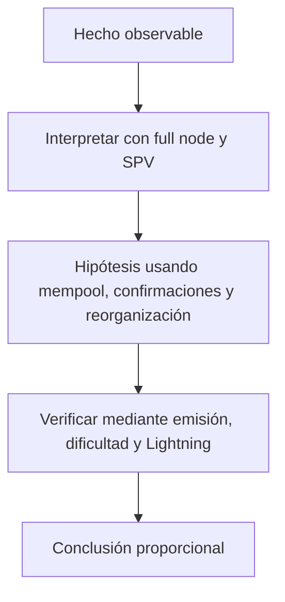

# Clase 10 · Verificación, minería y operación segura

> **Clase independiente 10 de 66** · **Nivel:** Intermedio · **Fuente base:** *Mastering Bitcoin* (Antonopoulos) y *Mastering the Lightning Network* (Antonopoulos, Osuntokun, Pickhardt)
>
> [⬅️ Clase anterior](../04-bitcoin/clase-09-utxo-y-anatomia-de-una-transaccion.md) · [📚 Índice de las 66 clases](../README.md) · [🗂️ Mapa del tema](README.md) · [➡️ Clase siguiente](../05-ethereum-evm/clase-11-cuentas-estado-y-transacciones-ethereum.md)

## Punto de partida

**Pregunta guía:** ¿Qué comprueba un nodo propio y qué delega un cliente ligero?

**Caso que abre la clase:** Un comercio decide cuántas confirmaciones exigir según importe y riesgo.

El estudiante genera bloques y observa cómo una operación acumula confirmaciones. Después ajusta una política de aceptación según valor, amenaza y tolerancia a reorganizaciones.

## Trabajo práctico

**Método propio:** laboratorio regtest con política de riesgo.

**Actividad:** Generar bloques, observar confirmaciones y provocar gasto de cambio en regtest.

Trabaja en entorno local, regtest, signet o testnet según corresponda. Conserva entradas, comandos, salidas y bloque o instante de corte. Una captura aislada no demuestra reproducibilidad.

## Fundamentos que sostienen la respuesta

1. **full node y SPV.** En esta clase delimita qué objeto o relación estamos observando antes de sacar conclusiones. Localízalo explícitamente en «Un comercio decide cuántas confirmaciones exigir según importe y riesgo.» y anota qué dato faltaría para refutar tu lectura.
2. **mempool, confirmaciones y reorganización.** En esta clase explica el mecanismo que conecta la situación inicial con el cambio observable. Localízalo explícitamente en «Un comercio decide cuántas confirmaciones exigir según importe y riesgo.» y anota qué dato faltaría para refutar tu lectura.
3. **emisión, dificultad y Lightning.** En esta clase permite contrastar el resultado y formular el límite de la evidencia. Localízalo explícitamente en «Un comercio decide cuántas confirmaciones exigir según importe y riesgo.» y anota qué dato faltaría para refutar tu lectura.

### Emisión: halvings y el límite de 21 millones

El subsidio por bloque se reduce a la mitad cada 210 000 bloques (≈ 4 años): 50 BTC en 2009, 25 tras el halving de noviembre de 2012, 12,5 en julio de 2016, 6,25 en mayo de 2020 y **3,125 BTC desde abril de 2024**, el subsidio vigente. El siguiente halving se espera hacia 2028.

Como cada término de la serie es la mitad del anterior, la suma converge: 210 000 × 50 × (1 + 1/2 + 1/4 + …) ≈ 21 millones de BTC, que nunca se alcanzan exactamente por el redondeo a satoshis. Más del 94 % del suministro ya fue emitido; la emisión restante se extiende hasta aproximadamente el año 2140, cuando la seguridad dependerá solo de las comisiones.

### Qué verifica realmente un nodo

Un nodo completo recibe bloques y transacciones, ejecuta las reglas de consenso y rechaza por sí mismo lo inválido. No pregunta a un explorador cuál es el saldo: deriva el estado desde el historial que validó. Un cliente ligero reduce costo al verificar encabezados y pruebas, pero depende de pares o servidores para descubrir transacciones relevantes. Esa diferencia no vuelve inútil al cliente ligero; obliga a declarar el modelo de confianza.

La política de confirmaciones conecta amenaza y operación. Una transacción en mempool puede ser reemplazada o desaparecer; una incluida puede quedar fuera por reorganización. El riesgo depende del valor, la capacidad adversarial, la latencia tolerable y la posibilidad de revertir el servicio entregado. «Seis confirmaciones» es una decisión conservadora frecuente, no una constante que el protocolo garantice para todo pago.

### Wallets dentro del problema

La operación segura conecta wallet y nodo: transmitir no equivale a confirmar. La política declara qué verifica localmente y qué delega a proveedores o clientes ligeros.

## Gráfico pedagógico

Recorre el gráfico en voz alta: identifica supuestos, transformaciones y el punto exacto donde aparece evidencia.

## Errores que esta clase corrige

- Tratar **full node y SPV** como una etiqueta suficiente, sin identificar actores, dato y frontera.
- Usar **mempool, confirmaciones y reorganización** como explicación aunque el caso no aporte la evidencia necesaria.
- Dar por respondido «¿Qué comprueba un nodo propio y qué delega un cliente ligero?» sin contrastar **emisión, dificultad y Lightning**.

Vuelve al caso inicial, elige el error más peligroso y describe una comprobación concreta que lo detectaría.

## Demostración de aprendizaje

**Entregable:** Política de aceptación que relacione amenaza, monto y profundidad.

**Comprobación formativa:** ¿Por qué seis confirmaciones son una política y no una constante universal del protocolo?

Para aprobar debes conectar el hecho observado con el concepto correcto, descartar al menos una interpretación alternativa y redactar una conclusión cuyo alcance no exceda la prueba.

## Fuentes para comprobar y ampliar

- Antonopoulos, *Mastering Bitcoin*, 3.ª ed., cap. sobre transacciones y UTXO — <https://github.com/bitcoinbook/bitcoinbook>
- Antonopoulos, Osuntokun y Pickhardt, *Mastering the Lightning Network*, cap. introductorio — <https://github.com/lnbook/lnbook>
- Fuente primaria: whitepaper de Bitcoin — <https://bitcoin.org/bitcoin.pdf>
- Fuente primaria: repositorio de BIPs — <https://github.com/bitcoin/bips>

Consulta además la [bibliografía razonada](../../docs/bibliografia.md), que declara procedencia y uso.

## Cierre de la clase

Responde otra vez la pregunta guía sin mirar notas. Si tu respuesta no menciona evidencia, supuesto y límite, todavía describe el tema pero no lo domina. Continúa solo cuando otra persona pueda reproducir tu entregable.
