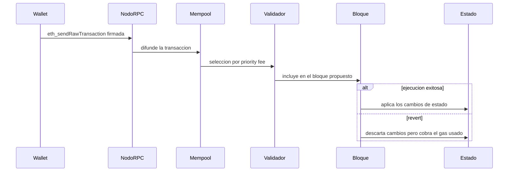
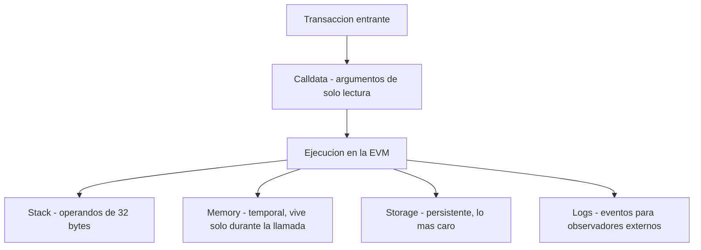

# 05 · Ethereum y EVM

> **Nivel:** Intermedio · ⏱️ **Duración estimada:** 150 min · **Fuente:** *Mastering Ethereum* (Antonopoulos, Wood) y *Ethereum Yellow Paper* (Wood)
> [⬅️ Currículo](../README.md) · [📚 Bibliografía](../../docs/bibliografia.md)
> 🧭 ⬅️ **Anterior:** [04 · Bitcoin](../04-bitcoin/README.md) · [📚 Índice](../README.md) · ➡️ **Siguiente:** [06 · Solidity y Foundry](../06-solidity-foundry/README.md)
> 📖 [Glosario de términos](../../docs/glosario.md) · 🌱 [¿Nuevo en esto? Empieza aquí](../../docs/empieza-aqui.md)

---

## 🎯 Objetivos

- Distinguir cuentas EOA y de contrato por su nonce, código y forma de iniciar transacciones.
- Explicar el modelo de gas y la estructura de comisiones EIP-1559 (base fee y priority fee).
- Codificar y decodificar una llamada mediante ABI y su selector de función.
- Diferenciar storage, memory y stack, y relacionar una variable de storage con un evento.
- Seguir una transacción desde la firma en la wallet hasta el cambio de estado, identificando dónde puede fallar.

## 📚 Resultados de aprendizaje

Al finalizar, el estudiante podrá:

1. **Clasificar** una cuenta como EOA o contrato a partir de sus atributos observables.
2. **Descomponer** la calldata de una llamada en selector y argumentos codificados.
3. **Calcular** el coste aproximado de una transacción con base fee y priority fee.
4. **Explicar** por qué la estimación de gas no es una promesa exacta del coste final.
5. **Relacionar** un cambio de estado en storage con el evento emitido que lo registra.
6. **Rastrear** el recorrido de una transacción y ubicar los puntos de fallo (revert, gas insuficiente, nonce).

## 🗺️ Temas

| # | Tema | Por qué importa |
|---|---|---|
| 1 | EOA vs. contrato | Define quién puede firmar y quién solo ejecuta código. |
| 2 | Nonce | Ordena las transacciones de una cuenta y evita repeticiones. |
| 3 | Gas y EIP-1559 | Determina el coste y la inclusión de una transacción. |
| 4 | Calldata y ABI | Es el contrato de interfaz entre quien llama y el código. |
| 5 | Eventos y logs | Permiten observar cambios de estado de forma barata e indexable. |
| 6 | Storage, memory y stack | Explican dónde vive cada dato y cuánto cuesta usarlo. |
| 7 | Llamadas y revert | Modelan la composición entre contratos y el manejo de errores. |
| 8 | Estado como Merkle-Patricia | Garantiza integridad y pruebas eficientes del estado global. |

## 🧠 Modelo mental

Imagina la EVM como una calculadora mundial compartida en la que cada operación tiene un precio en fichas (gas). Antes de ejecutar, cargas suficientes fichas; si se agotan a mitad de camino, la máquina deshace todo el trabajo pero se queda con las fichas gastadas. El estado global es un gran libro contable cuyo resumen (la raíz de Merkle-Patricia) cabe en una sola huella verificable.

La analogía se rompe en un punto clave: a diferencia de una calculadora aislada, aquí miles de nodos reejecutan la misma operación para acordar el resultado, y el precio por ficha varía en cada bloque según la demanda (la base fee). Por eso la estimación de gas es una previsión, no una garantía: el consumo real depende del estado en el momento exacto de la ejecución.

## 🧩 Esquema visual

Ciclo de vida de una transacción, desde la firma en la wallet hasta el cambio de estado, con el revert como camino alternativo.



Áreas de datos de la EVM durante una ejecución: cada una tiene un ciclo de vida y un coste distintos.



## 📖 Conceptos y definiciones

- **EOA**: cuenta controlada por una clave privada; es la única que puede iniciar y firmar transacciones.
- **Cuenta de contrato**: cuenta con código asociado que se ejecuta cuando la invocan; no firma por sí misma.
- **Nonce**: contador por cuenta que ordena las transacciones y previene su repetición.
- **Gas**: unidad que mide el trabajo computacional; cada operación de la EVM tiene un coste fijo en gas.
- **Base fee**: comisión por gas que se quema en cada bloque; se ajusta según la ocupación (EIP-1559).
- **Priority fee**: propina por gas para el validador que incentiva la inclusión rápida.
- **Calldata**: datos de entrada de una llamada; comienza con el selector de 4 bytes y sigue con los argumentos.
- **ABI**: especificación que describe funciones y tipos para codificar y decodificar llamadas y respuestas.
- **Evento (log)**: registro barato e indexable que un contrato emite para señalar un cambio de estado.
- **Storage / memory / stack**: almacenamiento persistente por contrato, memoria temporal por llamada y pila de trabajo de la EVM.
- **Revert**: aborto de una ejecución que deshace los cambios de estado pero consume el gas gastado.

## 🔬 Profundización

### Costos de gas reales: frío vs. caliente

Desde EIP-2929 (hard fork Berlín, 2021) el primer acceso a una cuenta o a un slot de storage dentro de una transacción es "frío" y paga un recargo; los accesos siguientes son "calientes" y resultan mucho más baratos. Cifras orientativas post-Berlín:

| Operación | Coste en gas |
|---|---|
| SLOAD frío (primer acceso al slot en la tx) | 2 100 |
| SLOAD caliente (accesos posteriores) | 100 |
| SSTORE de cero a distinto de cero, slot frío | 22 100 |
| SSTORE actualizando un valor no nulo, slot frío | 5 000 |
| SSTORE actualizando un valor no nulo, slot caliente | 2 900 |

De ahí la asimetría clásica: escribir por primera vez un contador cuesta ≈ 22 100 gas (20 000 del SSTORE inicial + 2 100 del acceso frío), mientras que incrementarlo en una transacción posterior cuesta ≈ 5 000 (2 900 + 2 100). Poner un slot de vuelta a cero genera además un reembolso parcial, limitado desde EIP-3529 (Londres, 2021).

### Layout de storage: slots, packing y mappings

El storage de un contrato es un arreglo direccionable de slots de 32 bytes. El compilador asigna variables de estado en orden de declaración y **empaqueta** en un mismo slot las que quepan juntas:

```solidity
uint128 a; // slot 0, bytes bajos
uint128 b; // slot 0, bytes altos: comparte slot con a
uint256 c; // slot 1: necesita los 32 bytes completos
```

Leer `a` y `b` en la misma transacción toca un solo slot, así que declarar variables pequeñas contiguas ahorra gas real. Los mappings no ocupan su slot de forma secuencial: el valor de `m[k]`, con el mapping declarado en el slot `p`, vive en `keccak256(abi.encode(k, p))`, lo que dispersa las claves por todo el espacio de storage sin colisiones prácticas.

### EIP-1559 en números

Cada bloque tiene un **objetivo de 15 millones de gas** y un **límite de 30 millones**. La base fee se ajusta según la ocupación del bloque anterior: hasta **+12,5 %** si vino completamente lleno y hasta **−12,5 %** si vino vacío. Con seis bloques llenos consecutivos la base fee aproximadamente se duplica (1,125⁶ ≈ 2,03), lo que hace muy caro sostener congestión artificial.

La base fee se **quema** (sale de circulación) y solo la priority fee llega al validador. El coste total por unidad de gas es:

```text
precio efectivo = min(max fee, base fee + priority fee)
```

Los valores vigentes de base fee cambian bloque a bloque: consúltalo en vivo antes de estimar costes.

### El coste de una transacción, desglosado

"¿Por qué me costó eso?" es la pregunta más repetida del módulo, y tiene respuesta exacta: se suma.

Antes de los números, la idea. En Ethereum hay **dos cosas separadas** que se suelen confundir en una:

- **El gas** mide *cuánto trabajo* pide tu transacción. Es una cantidad fija para una operación dada: escribir en el estado siempre cuesta lo mismo, esté la red vacía o saturada.
- **El precio del gas** es *cuánto vale ese trabajo ahora mismo*, y sí cambia con la demanda.

> Analogía: el gas son los kilómetros del viaje; el precio del gas, lo que cuesta el litro hoy. La factura es el producto de ambos. Si la red está cara, no es que tu transacción haga más trabajo: es que el litro subió.

El trabajo (el gas) se reparte en tres partidas: **base**, **datos** y **estado**. Vamos con una transferencia ERC-20 corriente.

**1. Coste base.** Toda transacción paga **21 000 gas** por existir, aunque no haga nada. Es el precio de verificar la firma, actualizar el nonce y mover el saldo.

**2. Calldata.** Los datos de entrada se cobran por byte, y **no todos los bytes cuestan igual**: un byte cero vale 4 gas y uno distinto de cero vale 16 (EIP-2028). El calldata de un `transfer(address,uint256)` son 68 bytes: 4 de selector + 32 de dirección + 32 de monto.

```text
selector  a9059cbb                          →  4 bytes, ninguno cero      = 4 × 16 =  64
dirección 000…0d8dA6BF26964aF9D7eEd9e03E53415D37aA96045 → 32 bytes, 12 en cero
                                                → 12×4 + 20×16 = 48 + 320 = 368
monto     000…00000000000000000000000f4240  → 32 bytes, 29 en cero
                                                → 29×4 + 3×16 = 116 + 48   = 164
                                                                      ──────────
                                                                calldata ≈ 596 gas
```

Esto explica una rareza que se ve en la práctica: **las direcciones con muchos ceros al principio son literalmente más baratas de usar**, y por eso existen contratos con direcciones "vanity" llenas de ceros en protocolos de alto volumen.

**3. Estado.** Es la parte cara, y depende de algo que no controlas: si el destinatario **ya tenía** saldo de ese token.

¿Por qué importa tanto? Porque escribir un dato **nuevo** obliga a cada uno de los miles de nodos de la red a guardarlo para siempre; sobrescribir uno que ya existía solo cambia un valor que ya ocupaba sitio. La EVM cobra esa diferencia de forma explícita:

| Operación | Cuándo | Gas |
|---|---|---:|
| `SSTORE` de slot que pasa de 0 a distinto de 0 | el destinatario recibe el token por primera vez | 20 000 |
| `SSTORE` de slot que ya era distinto de 0 | el destinatario ya tenía saldo | 2 900 |
| Acceso "frío" a un slot (primera vez en la transacción) | siempre, la primera lectura | 2 100 |
| Acceso "templado" (ya tocado en esta transacción) | lecturas siguientes | 100 |

De ahí sale la horquilla que verás en cualquier explorador: el mismo `transfer` consume **≈ 65 000 gas** cuando el destinatario estrena saldo y **≈ 51 000** cuando ya lo tenía. No es que la red esté más cara: es que escribir un cero donde no había nada obliga a la red a guardar una entrada nueva para siempre.

**4. Y ahora el precio.** El gas es *trabajo*; el precio de ese trabajo se fija aparte, y desde EIP-1559 son dos números:

```text
coste total = gas usado × (base fee + priority fee)

  65 000 gas × (12 gwei base + 1 gwei propina)
= 65 000 × 13 gwei
= 845 000 gwei
= 0,000845 ETH
```

De esos, `65 000 × 12 = 780 000 gwei` **se queman** (desaparecen de la circulación) y solo `65 000 × 1 = 65 000 gwei` van al validador. Mezclar ambas es el error tabulado en este módulo: si sumas la base fee al ingreso del validador, te sale un número que no corresponde a nadie.

El `maxFeePerGas` que fija tu cartera es un **techo**, no un precio: si la base fee sube por encima, la transacción espera; si baja, pagas menos de lo autorizado y te devuelven la diferencia.

### Por qué la estimación no es una promesa

`eth_estimateGas` ejecuta la transacción contra el estado **actual** y te dice cuánto consumió. Pero se incluirá en un bloque futuro, con otro estado.

El caso canónico: estimas un `transfer` a una dirección que ya tiene saldo → 51 000. Antes de que te incluyan, esa dirección retira todo y su saldo queda en cero. Tu transacción ahora hace un `SSTORE` de 0 a distinto de 0 → necesita 65 000, y con un límite de 51 000 revierte por *out of gas*… **consumiendo igualmente todo el gas del límite**.

Por eso las carteras añaden un margen sobre la estimación, y por eso un revert cuesta dinero: el trabajo de cómputo se hizo y hay que pagarlo; lo que se deshace son los efectos, no el gasto.

> 💡 **En una frase:** el gas mide trabajo y no cambia; el precio del gas mide la demanda y sí cambia. Escribir un dato nuevo cuesta ~7 veces más que sobrescribir uno existente, y esa diferencia explica casi toda la variación que verás.

<details>
<summary><strong>🎓 Si ya dominas esto</strong> — lo que suele fallar en producción</summary>

- **El reembolso por liberar estado tiene tope.** Poner un slot a cero devuelve gas, pero desde EIP-3529 el reembolso está limitado al 20 % del gas consumido. Los patrones de "gas token" que explotaban esto dejaron de funcionar en Londres.
- **Las listas de acceso (EIP-2930) pre-pagan lo frío.** Declarar de antemano las direcciones y slots que tocarás convierte accesos de 2 100 en 100 gas, pagando 1 900 por adelantado. Merece la pena cuando el contrato toca muchos slots conocidos; es contraproducente si te sobra la lista.
- **`gasUsed` no es `gasLimit`.** Lo no consumido se devuelve, salvo en un revert por *out of gas*, donde se pierde todo el límite. Por eso un límite exageradamente alto es gratis si la transacción va bien y caro si se queda sin gas.
- **El blob gas de EIP-4844 es un mercado aparte**, con su propia base fee y su propio ajuste. Un rollup no compite por el gas de ejecución para publicar sus datos, y por eso el coste por transacción de L2 se desacopló de la congestión de L1 en Dencun.
- **La base fee se ajusta ±12,5 % por bloque** según la desviación respecto al objetivo (la mitad del límite). Eso acota la velocidad a la que puede subir: de un pico a otro hay varios bloques de margen, que es justo lo que hace viable fijar un `maxFeePerGas` razonable.

</details>

## 🧪 Laboratorio guiado

> 🧪 Estas prácticas están catalogadas y **resueltas paso a paso** en el [catálogo de laboratorios](../../labs/CATALOG.md).

1. Inicia un nodo local de desarrollo con Foundry en una terminal aparte.

```bash
anvil
```

2. Consulta bloque actual, chain id y el balance de una cuenta con `cast`.

```bash
cast block-number
cast chain-id
cast balance 0xf39Fd6e51aad88F6F4ce6aB8827279cffFb92266
```

3. Ejecuta el laboratorio de selector ABI para codificar una llamada y decodificar su respuesta.

```bash
pnpm lab:abi
```

4. Compara el valor de una variable en storage con el evento que se emitió al modificarla.
5. Estima el gas de una llamada y explica por qué el coste final puede diferir.
6. Ejecuta la batería de pruebas del repositorio con `pnpm test` para validar tu entorno.

## 📝 Reto verificable

Sigue una transacción de principio a fin: firma en la wallet, propagación, inclusión en bloque y cambio de estado. Redacta el recorrido señalando dónde podría fallar.

**Criterio de aceptación:** el recorrido nombra el selector y los argumentos de la calldata, muestra el desglose base fee más priority fee y enumera al menos tres puntos de fallo posibles (revert, gas insuficiente y nonce incorrecto).

## ⚠️ Errores frecuentes

| Síntoma | Causa y cómo comprobarlo |
|---|---|
| "La transacción se quedó pendiente" | Nonce con hueco o gas price bajo; revisa el nonce esperado y la base fee actual. |
| El coste no coincide con la estimación | Confundiste estimación con promesa; el consumo depende del estado en ejecución. |
| No encuentras el cambio de estado | Buscaste en logs en vez de storage; el evento describe, el storage guarda. |
| La llamada revierte sin motivo claro | Argumentos mal codificados; verifica selector y tipos contra la ABI. |
| Mezclas base fee y priority fee | Sumaste mal la comisión; sepáralas y recuerda que la base fee se quema. |

## 🛡️ Seguridad y ética

- Trabaja en local con Anvil o en testnet; nunca uses fondos ni claves reales.
- No pegues claves privadas de mainnet en scripts ni variables de entorno del laboratorio.
- Trata la estimación de gas como orientación, no como compromiso, al diseñar interfaces.
- Los valores de base fee y de red varían minuto a minuto: consúltalo en vivo antes de concluir.
- Recuerda que Ethereum opera bajo Proof of Stake desde The Merge; describe el consenso con precisión.

## 🔗 Referencias

- Antonopoulos y Wood, *Mastering Ethereum*, caps. sobre la EVM y transacciones — <https://github.com/ethereumbook/ethereumbook>
- Wood, *Ethereum Yellow Paper*, secciones de ejecución y estado — <https://ethereum.github.io/yellowpaper/paper.pdf>
- Documentación para desarrolladores de ethereum.org — <https://ethereum.org/developers/docs/>
- Fuente primaria: EIP-1559 — <https://eips.ethereum.org/EIPS/eip-1559>

## ✅ Criterio de dominio

- Explicas el recorrido completo de una transacción y ubicas sus puntos de fallo.
- Codificas y decodificas una llamada por su selector y argumentos ABI.
- Justificas la diferencia entre estimación y coste final de gas con base fee y priority fee.

---

## 🧭 Navegación

⬅️ [Módulo 04 · Bitcoin](../04-bitcoin/README.md) · [📚 Índice del currículo](../README.md) · ➡️ [Módulo 06 · Solidity y Foundry](../06-solidity-foundry/README.md)
