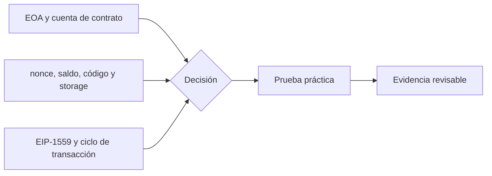

# Clase 11 · Cuentas, estado y transacciones Ethereum

> **Clase independiente 11 de 66** · **Nivel:** Intermedio · **Fuente base:** *Mastering Ethereum* (Antonopoulos, Wood) y *Ethereum Yellow Paper* (Wood)
>
> [⬅️ Clase anterior](../04-bitcoin/clase-10-verificacion-mineria-y-operacion-segura.md) · [📚 Índice de las 66 clases](../README.md) · [🗂️ Mapa del tema](README.md) · [➡️ Clase siguiente](../05-ethereum-evm/clase-12-evm-abi-y-costo-de-ejecucion.md)

## Punto de partida

**Pregunta guía:** ¿Cómo cambia el estado global cuando una cuenta firma una operación?

**Caso que abre la clase:** Dos transacciones con el mismo nonce compiten con tarifas distintas.

Dos transacciones compiten por el mismo nonce y una tercera queda bloqueada. Así se conectan cuenta, mempool, reemplazo y estado sin confundir envío con ejecución.

## Gráfico pedagógico

Recorre el gráfico en voz alta: identifica supuestos, transformaciones y el punto exacto donde aparece evidencia.



## Trabajo práctico

**Método propio:** línea temporal de nonces.

**Actividad:** Inspeccionar cuentas y reemplazar una transacción en una red local.

Trabaja en entorno local, regtest, signet o testnet según corresponda. Conserva entradas, comandos, salidas y bloque o instante de corte. Una captura aislada no demuestra reproducibilidad.

## Fundamentos que sostienen la respuesta

1. **EOA y cuenta de contrato.** En esta clase delimita qué objeto o relación estamos observando antes de sacar conclusiones. Localízalo explícitamente en «Dos transacciones con el mismo nonce compiten con tarifas distintas.» y anota qué dato faltaría para refutar tu lectura.
2. **nonce, saldo, código y storage.** En esta clase explica el mecanismo que conecta la situación inicial con el cambio observable. Localízalo explícitamente en «Dos transacciones con el mismo nonce compiten con tarifas distintas.» y anota qué dato faltaría para refutar tu lectura.
3. **EIP-1559 y ciclo de transacción.** En esta clase permite contrastar el resultado y formular el límite de la evidencia. Localízalo explícitamente en «Dos transacciones con el mismo nonce compiten con tarifas distintas.» y anota qué dato faltaría para refutar tu lectura.

### Costos de gas reales: frío vs. caliente

Desde EIP-2929 (hard fork Berlín, 2021) el primer acceso a una cuenta o a un slot de storage dentro de una transacción es "frío" y paga un recargo; los accesos siguientes son "calientes" y resultan mucho más baratos. Cifras orientativas post-Berlín:

| Operación | Coste en gas |
|---|---|
| SLOAD frío (primer acceso al slot en la tx) | 2 100 |
| SLOAD caliente (accesos posteriores) | 100 |
| SSTORE de cero a distinto de cero, slot frío | 22 100 |
| SSTORE actualizando un valor no nulo, slot frío | 5 000 |
| SSTORE actualizando un valor no nulo, slot caliente | 2 900 |

De ahí la asimetría clásica: escribir por primera vez un contador cuesta ≈ 22 100 gas (20 000 del SSTORE inicial + 2 100 del acceso frío), mientras que incrementarlo en una transacción posterior cuesta ≈ 5 000 (2 900 + 2 100). Poner un slot de vuelta a cero genera además un reembolso parcial, limitado desde EIP-3529 (Londres, 2021).

### EIP-1559 en números

Cada bloque tiene un **objetivo de 15 millones de gas** y un **límite de 30 millones**. La base fee se ajusta según la ocupación del bloque anterior: hasta **+12,5 %** si vino completamente lleno y hasta **−12,5 %** si vino vacío. Con seis bloques llenos consecutivos la base fee aproximadamente se duplica (1,125⁶ ≈ 2,03), lo que hace muy caro sostener congestión artificial.

La base fee se **quema** (sale de circulación) y solo la priority fee llega al validador. El coste total por unidad de gas es:

```text
precio efectivo = min(max fee, base fee + priority fee)
```

Los valores vigentes de base fee cambian bloque a bloque: consúltalo en vivo antes de estimar costes.

### El coste de una transacción, desglosado

"¿Por qué me costó eso?" es la pregunta más repetida de la unidad, y tiene respuesta exacta: se suma.

Antes de los números, la idea. En Ethereum hay **dos cosas separadas** que se suelen confundir en una:

- **El gas** mide *cuánto trabajo* pide tu transacción. Es una cantidad fija para una operación dada: escribir en el estado siempre cuesta lo mismo, esté la red vacía o saturada.
- **El precio del gas** es *cuánto vale ese trabajo ahora mismo*, y sí cambia con la demanda.

> Analogía: el gas son los kilómetros del viaje; el precio del gas, lo que cuesta el litro hoy. La factura es el producto de ambos. Si la red está cara, no es que tu transacción haga más trabajo: es que el litro subió.

El trabajo (el gas) se reparte en tres partidas: **base**, **datos** y **estado**. Vamos con una transferencia ERC-20 corriente.

**1. Coste base.** Toda transacción paga **21 000 gas** por existir, aunque no haga nada. Es el precio de verificar la firma, actualizar el nonce y mover el saldo.

**2. Calldata.** Los datos de entrada se cobran por byte, y **no todos los bytes cuestan igual**: un byte cero vale 4 gas y uno distinto de cero vale 16 (EIP-2028). El calldata de un `transfer(address,uint256)` son 68 bytes: 4 de selector + 32 de dirección + 32 de monto.

```text
selector  a9059cbb                          →  4 bytes, ninguno cero      = 4 × 16 =  64
dirección 000…0d8dA6BF26964aF9D7eEd9e03E53415D37aA96045 → 32 bytes, 12 en cero
                                                → 12×4 + 20×16 = 48 + 320 = 368
monto     000…00000000000000000000000f4240  → 32 bytes, 29 en cero
                                                → 29×4 + 3×16 = 116 + 48   = 164
                                                                      ──────────
                                                                calldata ≈ 596 gas
```

Esto explica una rareza que se ve en la práctica: **las direcciones con muchos ceros al principio son literalmente más baratas de usar**, y por eso existen contratos con direcciones "vanity" llenas de ceros en protocolos de alto volumen.

**3. Estado.** Es la parte cara, y depende de algo que no controlas: si el destinatario **ya tenía** saldo de ese token.

¿Por qué importa tanto? Porque escribir un dato **nuevo** obliga a cada uno de los miles de nodos de la red a guardarlo para siempre; sobrescribir uno que ya existía solo cambia un valor que ya ocupaba sitio. La EVM cobra esa diferencia de forma explícita:

| Operación | Cuándo | Gas |
|---|---|---:|
| `SSTORE` de slot que pasa de 0 a distinto de 0 | el destinatario recibe el token por primera vez | 20 000 |
| `SSTORE` de slot que ya era distinto de 0 | el destinatario ya tenía saldo | 2 900 |
| Acceso "frío" a un slot (primera vez en la transacción) | siempre, la primera lectura | 2 100 |
| Acceso "templado" (ya tocado en esta transacción) | lecturas siguientes | 100 |

De ahí sale la horquilla que verás en cualquier explorador: el mismo `transfer` consume **≈ 65 000 gas** cuando el destinatario estrena saldo y **≈ 51 000** cuando ya lo tenía. No es que la red esté más cara: es que escribir un cero donde no había nada obliga a la red a guardar una entrada nueva para siempre.

**4. Y ahora el precio.** El gas es *trabajo*; el precio de ese trabajo se fija aparte, y desde EIP-1559 son dos números:

```text
coste total = gas usado × (base fee + priority fee)

  65 000 gas × (12 gwei base + 1 gwei propina)
= 65 000 × 13 gwei
= 845 000 gwei
= 0,000845 ETH
```

De esos, `65 000 × 12 = 780 000 gwei` **se queman** (desaparecen de la circulación) y solo `65 000 × 1 = 65 000 gwei` van al validador. Mezclar ambas es el error tabulado en esta unidad de clases: si sumas la base fee al ingreso del validador, te sale un número que no corresponde a nadie.

El `maxFeePerGas` que fija tu cartera es un **techo**, no un precio: si la base fee sube por encima, la transacción espera; si baja, pagas menos de lo autorizado y te devuelven la diferencia.

### Por qué la estimación no es una promesa

`eth_estimateGas` ejecuta la transacción contra el estado **actual** y te dice cuánto consumió. Pero se incluirá en un bloque futuro, con otro estado.

El caso canónico: estimas un `transfer` a una dirección que ya tiene saldo → 51 000. Antes de que te incluyan, esa dirección retira todo y su saldo queda en cero. Tu transacción ahora hace un `SSTORE` de 0 a distinto de 0 → necesita 65 000, y con un límite de 51 000 revierte por *out of gas*… **consumiendo igualmente todo el gas del límite**.

Por eso las carteras añaden un margen sobre la estimación, y por eso un revert cuesta dinero: el trabajo de cómputo se hizo y hay que pagarlo; lo que se deshace son los efectos, no el gasto.

> 💡 **En una frase:** el gas mide trabajo y no cambia; el precio del gas mide la demanda y sí cambia. Escribir un dato nuevo cuesta ~7 veces más que sobrescribir uno existente, y esa diferencia explica casi toda la variación que verás.

<details>
<summary><strong>🎓 Si ya dominas esto</strong> — lo que suele fallar en producción</summary>

- **El reembolso por liberar estado tiene tope.** Poner un slot a cero devuelve gas, pero desde EIP-3529 el reembolso está limitado al 20 % del gas consumido. Los patrones de "gas token" que explotaban esto dejaron de funcionar en Londres.
- **Las listas de acceso (EIP-2930) pre-pagan lo frío.** Declarar de antemano las direcciones y slots que tocarás convierte accesos de 2 100 en 100 gas, pagando 1 900 por adelantado. Merece la pena cuando el contrato toca muchos slots conocidos; es contraproducente si te sobra la lista.
- **`gasUsed` no es `gasLimit`.** Lo no consumido se devuelve, salvo en un revert por *out of gas*, donde se pierde todo el límite. Por eso un límite exageradamente alto es gratis si la transacción va bien y caro si se queda sin gas.
- **El blob gas de EIP-4844 es un mercado aparte**, con su propia base fee y su propio ajuste. Un rollup no compite por el gas de ejecución para publicar sus datos, y por eso el coste por transacción de L2 se desacopló de la congestión de L1 en Dencun.
- **La base fee se ajusta ±12,5 % por bloque** según la desviación respecto al objetivo (la mitad del límite). Eso acota la velocidad a la que puede subir: de un pico a otro hay varios bloques de margen, que es justo lo que hace viable fijar un `maxFeePerGas` razonable.

</details>

### Wallets dentro del problema

La wallet gestiona una cuenta Ethereum y su nonce; la cuenta no vive dentro de la aplicación. Cambiar de interfaz no cambia el estado canónico, pero sí las dependencias para observarlo y transmitir.

## Demostración de aprendizaje

**Entregable:** Secuencia firmada que explique pending, reemplazo, inclusión y finalidad.

**Comprobación formativa:** Predice qué ocurre con los nonces siguientes si el primero queda pendiente.

Para aprobar debes conectar el hecho observado con el concepto correcto, descartar al menos una interpretación alternativa y redactar una conclusión cuyo alcance no exceda la prueba.

## Errores que esta clase corrige

- Tratar **EOA y cuenta de contrato** como una etiqueta suficiente, sin identificar actores, dato y frontera.
- Usar **nonce, saldo, código y storage** como explicación aunque el caso no aporte la evidencia necesaria.
- Dar por respondido «¿Cómo cambia el estado global cuando una cuenta firma una operación?» sin contrastar **EIP-1559 y ciclo de transacción**.

Vuelve al caso inicial, elige el error más peligroso y describe una comprobación concreta que lo detectaría.

## Fuentes para comprobar y ampliar

- Antonopoulos y Wood, *Mastering Ethereum*, caps. sobre la EVM y transacciones — <https://github.com/ethereumbook/ethereumbook>
- Wood, *Ethereum Yellow Paper*, secciones de ejecución y estado — <https://ethereum.github.io/yellowpaper/paper.pdf>
- Documentación para desarrolladores de ethereum.org — <https://ethereum.org/developers/docs/>
- Fuente primaria: EIP-1559 — <https://eips.ethereum.org/EIPS/eip-1559>

Consulta además la [bibliografía razonada](../../docs/bibliografia.md), que declara procedencia y uso.

## Cierre de la clase

Responde otra vez la pregunta guía sin mirar notas. Si tu respuesta no menciona evidencia, supuesto y límite, todavía describe el tema pero no lo domina. Continúa solo cuando otra persona pueda reproducir tu entregable.
