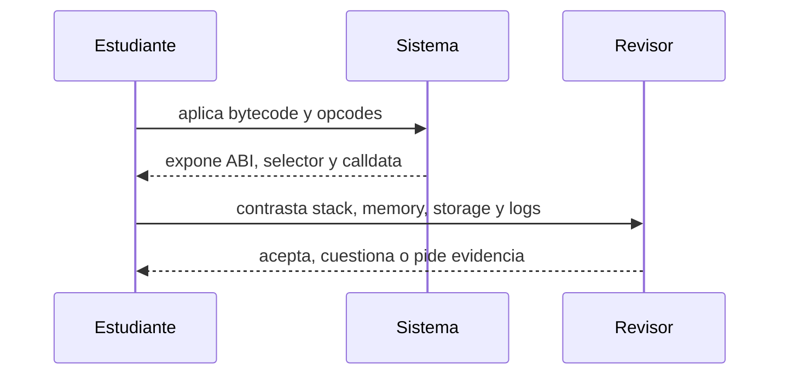

# Clase 12 · EVM, ABI y costo de ejecución

> **Clase independiente 12 de 66** · **Nivel:** Intermedio · **Fuente base:** *Mastering Ethereum* (Antonopoulos, Wood) y *Ethereum Yellow Paper* (Wood)
>
> [⬅️ Clase anterior](../05-ethereum-evm/clase-11-cuentas-estado-y-transacciones-ethereum.md) · [📚 Índice de las 66 clases](../README.md) · [🗂️ Mapa del tema](README.md) · [➡️ Clase siguiente](../06-solidity-foundry/clase-13-diseno-de-contratos-e-invariantes.md)

## Punto de partida

**Pregunta guía:** ¿Cómo convierte la EVM una llamada en cambios de estado y consumo de gas?

**Caso que abre la clase:** Una llamada revierte después de escribir temporalmente en memoria y storage.

La clase decodifica calldata y sigue una llamada por stack, memory, storage y logs. Un revert permite comprobar qué efectos sobreviven y cuáles se deshacen.

## Fundamentos que sostienen la respuesta

1. **bytecode y opcodes.** En esta clase delimita qué objeto o relación estamos observando antes de sacar conclusiones. Localízalo explícitamente en «Una llamada revierte después de escribir temporalmente en memoria y storage.» y anota qué dato faltaría para refutar tu lectura.
2. **ABI, selector y calldata.** En esta clase explica el mecanismo que conecta la situación inicial con el cambio observable. Localízalo explícitamente en «Una llamada revierte después de escribir temporalmente en memoria y storage.» y anota qué dato faltaría para refutar tu lectura.
3. **stack, memory, storage y logs.** En esta clase permite contrastar el resultado y formular el límite de la evidencia. Localízalo explícitamente en «Una llamada revierte después de escribir temporalmente en memoria y storage.» y anota qué dato faltaría para refutar tu lectura.

### Layout de storage: slots, packing y mappings

El storage de un contrato es un arreglo direccionable de slots de 32 bytes. El compilador asigna variables de estado en orden de declaración y **empaqueta** en un mismo slot las que quepan juntas:

```solidity
uint128 a; // slot 0, bytes bajos
uint128 b; // slot 0, bytes altos: comparte slot con a
uint256 c; // slot 1: necesita los 32 bytes completos
```

Leer `a` y `b` en la misma transacción toca un solo slot, así que declarar variables pequeñas contiguas ahorra gas real. Los mappings no ocupan su slot de forma secuencial: el valor de `m[k]`, con el mapping declarado en el slot `p`, vive en `keccak256(abi.encode(k, p))`, lo que dispersa las claves por todo el espacio de storage sin colisiones prácticas.

### De calldata a efecto persistente

La ABI define cómo una intención se serializa en bytes: cuatro bytes de selector seguidos de argumentos codificados. La EVM no ve nombres de funciones; recibe esos bytes, carga opcodes y opera sobre una pila. `memory` vive durante la llamada, `storage` persiste en el estado y los logs quedan en el recibo para consumidores externos. Seguir una traza consiste en localizar dónde entró el dato, qué salto eligió el bytecode, qué slot cambió y cuánto gas consumió.

Un `revert` deshace cambios de estado de la llamada, pero no devuelve el gas ya usado ni borra que la transacción fue incluida. Por eso «falló» puede significar rechazo previo, revert durante ejecución o interfaz que interpretó mal un recibo. La evidencia debe distinguir esos puntos.

## Gráfico pedagógico

Recorre el gráfico en voz alta: identifica supuestos, transformaciones y el punto exacto donde aparece evidencia.



## Demostración de aprendizaje

**Entregable:** Mapa de la llamada con opcode relevante, gas y efecto persistente o revertido.

**Comprobación formativa:** Distingue un dato persistente, uno temporal y uno observable sólo fuera de cadena.

Para aprobar debes conectar el hecho observado con el concepto correcto, descartar al menos una interpretación alternativa y redactar una conclusión cuyo alcance no exceda la prueba.

## Trabajo práctico

**Método propio:** lectura guiada de una traza EVM.

**Actividad:** Decodificar calldata y seguir una traza de ejecución en Anvil.

Trabaja en entorno local, regtest, signet o testnet según corresponda. Conserva entradas, comandos, salidas y bloque o instante de corte. Una captura aislada no demuestra reproducibilidad.

## Errores que esta clase corrige

- Tratar **bytecode y opcodes** como una etiqueta suficiente, sin identificar actores, dato y frontera.
- Usar **ABI, selector y calldata** como explicación aunque el caso no aporte la evidencia necesaria.
- Dar por respondido «¿Cómo convierte la EVM una llamada en cambios de estado y consumo de gas?» sin contrastar **stack, memory, storage y logs**.

Vuelve al caso inicial, elige el error más peligroso y describe una comprobación concreta que lo detectaría.

## Fuentes para comprobar y ampliar

- Antonopoulos y Wood, *Mastering Ethereum*, caps. sobre la EVM y transacciones — <https://github.com/ethereumbook/ethereumbook>
- Wood, *Ethereum Yellow Paper*, secciones de ejecución y estado — <https://ethereum.github.io/yellowpaper/paper.pdf>
- Documentación para desarrolladores de ethereum.org — <https://ethereum.org/developers/docs/>
- Fuente primaria: EIP-1559 — <https://eips.ethereum.org/EIPS/eip-1559>

Consulta además la [bibliografía razonada](../../docs/bibliografia.md), que declara procedencia y uso.

## Cierre de la clase

Responde otra vez la pregunta guía sin mirar notas. Si tu respuesta no menciona evidencia, supuesto y límite, todavía describe el tema pero no lo domina. Continúa solo cuando otra persona pueda reproducir tu entregable.
