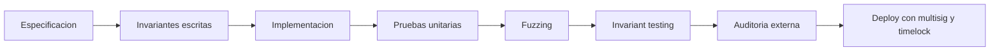
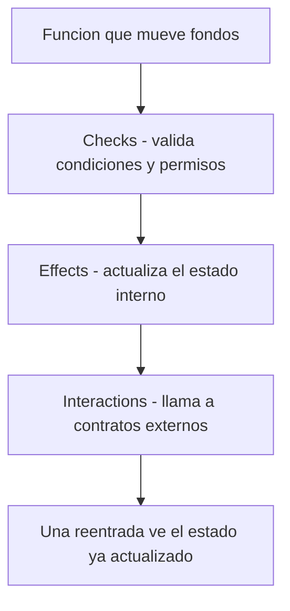

# 06 · Solidity y Foundry

> **Nivel:** Intermedio-Avanzado · ⏱️ **Duración estimada:** 180 min · **Fuente:** documentación de Solidity y *The Foundry Book*
> [⬅️ Currículo](../README.md) · [📚 Bibliografía](../../docs/bibliografia.md)
> 🧭 ⬅️ **Anterior:** [05 · Ethereum y EVM](../05-ethereum-evm/README.md) · [📚 Índice](../README.md) · ➡️ **Siguiente:** [07 · Aplicaciones descentralizadas](../07-dapps/README.md)
> 📖 [Glosario de términos](../../docs/glosario.md) · 🌱 [¿Nuevo en esto? Empieza aquí](../../docs/empieza-aqui.md)

---

## 🎯 Objetivos

- Escribir un contrato en Solidity con tipos, visibilidad, modifiers, custom errors y eventos correctos.
- Diseñar invariantes de una bóveda antes de implementar su lógica.
- Ejecutar el flujo de Foundry: compilar, probar con detalle y aplicar fuzzing e invariantes.
- Aplicar el patrón checks-effects-interactions y control de acceso para prevenir reentrancy.
- Razonar sobre transferencias forzadas (selfdestruct/force-send) y su efecto en la contabilidad interna.

## 📚 Resultados de aprendizaje

Al finalizar, el estudiante podrá:

1. **Estructurar** un contrato con herencia, interfaces y librerías de forma clara.
2. **Formular** invariantes verificables antes de escribir la implementación.
3. **Ejecutar** pruebas unitarias, de fuzzing y de invariantes con Foundry.
4. **Aplicar** checks-effects-interactions para ordenar validaciones, efectos e interacciones externas.
5. **Distinguir** el saldo real del contrato de su contabilidad interna ante force-send.
6. **Justificar** el uso de custom errors y de patrones de control de acceso.

## 🗺️ Temas

| # | Tema | Por qué importa |
|---|---|---|
| 1 | Tipos y visibilidad | Definen qué es accesible y cómo se comporta cada dato. |
| 2 | Modifiers y control de acceso | Centralizan las precondiciones y protegen funciones sensibles. |
| 3 | Custom errors y eventos | Abaratan el manejo de errores y hacen auditable el estado. |
| 4 | Herencia, interfaces y librerías | Permiten componer y reutilizar código de forma segura. |
| 5 | receive / fallback | Controlan cómo el contrato recibe ether y llamadas sin datos. |
| 6 | Layout de storage | Determina el coste y la seguridad de las variables persistentes. |
| 7 | Fuzzing e invariantes | Exploran estados inesperados que las pruebas de ejemplo no cubren. |
| 8 | checks-effects-interactions | Es la defensa base contra reentrancy. |

## 🧠 Modelo mental

Trata el contrato como la caja fuerte de un banco con reglas grabadas en acero: una vez desplegado, nadie cambia las reglas, así que deben ser correctas desde el primer día. Antes de instalar la cerradura defines las promesas que jamás pueden romperse (las invariantes): "nadie retira más de lo que depositó" y "la suma de las cuentas cuadra con el dinero administrado". Luego el fuzzing actúa como un ladrón incansable que prueba millones de combinaciones buscando una promesa rota.

El límite de la analogía está en el force-send: alguien puede empujar ether al contrato sin pasar por la puerta (por ejemplo, mediante selfdestruct), de modo que el saldo real puede superar la contabilidad interna. Por eso una invariante nunca debe confiar en que `address(this).balance` iguale la suma contable; hay que separar lo que el contrato registra de lo que físicamente contiene.

## 🧩 Esquema visual

Pipeline profesional de un contrato: las invariantes se escriben antes que el código y cada etapa de prueba amplía la cobertura de la anterior.



El patrón checks-effects-interactions ordena cada función que mueve fondos para que una reentrada tardía ya no encuentre estado desactualizado.



## 📖 Conceptos y definiciones

- **Visibilidad**: `public`, `external`, `internal` o `private`; define quién puede invocar una función o leer una variable.
- **Modifier**: bloque reutilizable de precondiciones que envuelve a una función, por ejemplo un `onlyOwner`.
- **Custom error**: error tipado y barato declarado con `error`; reemplaza cadenas de `require` en revert.
- **Evento**: registro indexable que documenta cambios de estado para observadores externos.
- **Interfaz**: declaración sin implementación que fija cómo interactuar con otro contrato.
- **Librería**: código sin estado propio, reutilizable, que se enlaza o incrusta en contratos.
- **receive / fallback**: funciones especiales que gestionan ether entrante y llamadas sin coincidencia de selector.
- **Layout de storage**: disposición de variables en ranuras de 32 bytes; un orden incorrecto encarece o rompe upgrades.
- **Invariante**: propiedad que debe mantenerse cierta en todo estado alcanzable, verificada por Foundry.
- **checks-effects-interactions**: patrón que valida primero, actualiza el estado después e interactúa con el exterior al final.

## 🔬 Profundización

### Inmutable vs. upgradeable: trade-offs reales

Un contrato inmutable es la promesa más fuerte que puedes dar; un proxy la relaja a cambio de poder corregir errores. Elegir es una decisión de gobernanza, no solo técnica.

| Estrategia | Ventaja principal | Riesgo principal |
|---|---|---|
| Inmutable | Garantías máximas; sin admin que comprometer | Un bug es permanente; solo queda migrar a un contrato nuevo |
| Transparent Proxy | Patrón maduro; separa admin de usuarios | Más gas por llamada; el admin es un punto de confianza |
| UUPS | Lógica de upgrade en la implementación; llamadas más baratas | Si una versión olvida `_authorizeUpgrade`, el contrato queda congelado o secuestrable |

El riesgo transversal de cualquier proxy es la **colisión de storage**: la implementación nueva debe respetar exactamente el orden y tipo de las variables previas (solo añadir al final). Cambiar `uint256 total` por `address owner` en el mismo slot reinterpreta bytes existentes como otro tipo, corrompiendo el estado sin ningún error de compilación. Por eso los patrones modernos usan slots deterministas separados (ERC-1967) y herramientas que comparan layouts entre versiones.

### Fuzzing e invariantes en Foundry

En una prueba fuzz, Foundry genera cientos de valores para los argumentos de la función de test. Sin acotar, la mayoría de entradas revierten por triviales (montos absurdos, direcciones cero) y el fuzzing pierde potencia; con `bound(monto, 1, saldoMaximo)` concentras las corridas en el rango interesante.

Para invariantes, el **handler** es un contrato intermedio que envuelve a la bóveda y expone solo secuencias de acciones válidas (depositar, retirar, forzar envío de ether), además de llevar contadores fantasma. La invariante contable típica de un vault:

```solidity
function invariant_contabilidadCuadra() public view {
    // el balance real puede EXCEDER lo registrado (force-send),
    // pero nunca ser menor que la suma de depósitos netos
    assertGe(address(vault).balance, handler.sumaDepositos() - handler.sumaRetiros());
}
```

Nota el `>=` en lugar de `==`: es exactamente la lección del force-send aplicada a una invariante ejecutable.

### Gas y errores: custom errors y el optimizador

Un `require(cond, "mensaje largo de error")` incrusta la cadena en el bytecode (cada 32 bytes de string son bytecode adicional en el deploy) y al revertir codifica `Error(string)` con su overhead de memoria. Un custom error (`error Unauthorized();` + `revert Unauthorized();`) viaja como un selector de 4 bytes: como cifras orientativas, ahorra cientos de gas por revert y reduce el tamaño de despliegue en decenas de bytes por cada mensaje reemplazado, además de permitir parámetros tipados (`error InsufficientBalance(uint256 pedido, uint256 disponible)`).

El optimizador de Solidity se configura con `runs`: es una estimación de cuántas veces se ejecutará cada función a lo largo de la vida del contrato. `runs = 1` minimiza el tamaño del bytecode (deploy barato, llamadas algo más caras); `runs = 1000000` hace lo contrario. El valor por defecto de 200 es un compromiso; para un contrato que recibirá millones de llamadas, subir `runs` suele pagarse solo.

### Leer una traza de Foundry (la habilidad que desatasca)

Cuando un test falla, la diferencia entre media hora y dos minutos es saber leer la traza. Ejecuta con `-vvvv` y Foundry imprime cada llamada, su gas y su resultado:

```text
[FAIL. Reason: revert: saldo insuficiente] test_retiro() (gas: 34218)
Traces:
  [34218] VaultTest::test_retiro()
    ├─ [0] VM::prank(alice: [0x1234…])
    │   └─ ← ()
    ├─ [22431] Vault::depositar{value: 1000000000000000000}()
    │   ├─ emit Deposito(quien: alice, monto: 1000000000000000000)
    │   └─ ← ()
    ├─ [2553] Vault::retirar(2000000000000000000)
    │   └─ ← revert: saldo insuficiente
    └─ ← revert: saldo insuficiente
```

Cómo se lee, de arriba abajo:

- **`[34218]`** al inicio es el gas total del test; los `[…]` de cada línea, el de esa llamada. Un número desproporcionado en una línea señala dónde se va el gas.
- **La sangría es la pila de llamadas.** `Vault::retirar` está dentro del test; si un contrato llamara a otro, aparecería anidado un nivel más. Ahí se ve la reentrancia: la misma función apareciendo dos veces anidada.
- **`←`** es lo que devolvió. `← ()` es éxito sin retorno; `← revert: …` es el fallo.
- **El primer `revert` de abajo hacia arriba es la causa**; los de encima son la propagación. Buscar el más profundo, no el primero que se lee.
- **Los eventos** (`emit`) aparecen en su sitio exacto: si esperabas un evento y no está, la línea te dice si la función llegó a ejecutarse.

Tres banderas de `forge test` que resuelven casi todo:

| Bandera | Para qué |
|---|---|
| `-vvvv` | Traza completa con llamadas internas y eventos |
| `--match-test test_retiro` | Ejecuta solo ese test mientras lo depuras |
| `--gas-report` | Tabla de gas por función: dónde optimizar de verdad |

Y dentro del test, `console2.log("saldo", saldo);` imprime en la traza sin romper nada, tras `import {console2} from "forge-std/console2.sol";`.

### El storage por dentro: dónde vive cada variable

El *storage layout* deja de ser abstracto cuando cuentas las ranuras. La EVM da a cada contrato ranuras de 32 bytes numeradas desde 0, y Solidity las asigna **en el orden de declaración**, empaquetando variables pequeñas si caben juntas.

```solidity
contract Ejemplo {
    uint256 public total;      // ranura 0  (32 bytes, ocupa una entera)
    uint128 public techo;      // ranura 1, bytes 0–15   ┐ comparten
    uint128 public piso;       // ranura 1, bytes 16–31  ┘ la ranura 1
    address public duenio;     // ranura 2 (20 bytes)  ┐ comparten
    bool    public pausado;    // ranura 2 (1 byte)    ┘ la ranura 2
    mapping(address => uint256) public saldos;  // ranura 3 (reserva)
}
```

Dos consecuencias prácticas:

**1. El orden de declaración cambia el gas.** Si intercalas `uint256` entre los dos `uint128`, dejan de empaquetarse y el contrato usa una ranura más: un `SSTORE` extra cada vez que se escriben juntos. Ordenar de mayor a menor tamaño no es cosmética.

**2. Los mappings no guardan nada en su ranura.** La ranura 3 queda reservada pero vacía; el valor de `saldos[alice]` vive en `keccak256(abi.encode(alice, 3))`. Por eso un mapping no se puede recorrer y por eso no "cabe" en un slot: sus entradas están dispersas por todo el espacio de direcciones.

Ahora se entiende exactamente por qué un upgrade que **inserta** una variable en medio corrompe los datos: si añades un `uint256 nuevo;` entre `total` y `techo`, `techo` y `piso` pasan a la ranura 2 — pero ahí siguen los bytes de `duenio` y `pausado` de la versión anterior. El contrato leerá una dirección como si fueran dos enteros. No hay error de compilación: solo datos que dejaron de significar lo que decían.

Compruébalo tú mismo con `forge inspect Ejemplo storageLayout`, que imprime la tabla de ranuras. Comparar esa salida entre dos versiones es exactamente la revisión que impide el fallo.

> 💡 **En una frase:** el storage son cajones numerados de 32 bytes que Solidity reparte por orden de declaración. Todo lo raro de los upgrades sale de ahí, y `forge inspect … storageLayout` te lo enseña sin adivinar.

<details>
<summary><strong>🎓 Si ya dominas esto</strong> — los bordes que muerden</summary>

- **`forge inspect` compara, pero no protege.** OpenZeppelin Upgrades valida el layout automáticamente en el despliegue; hacerlo a ojo funciona hasta la versión en que alguien tiene prisa. Los *storage gaps* (`uint256[50] private __gap;`) reservan espacio para que una clase base pueda crecer sin desplazar a las derivadas.
- **ERC-7201 (namespaced storage) elimina el problema de raíz.** En vez de confiar en el orden, cada módulo ancla su struct en un slot derivado de un hash de su nombre. Dos módulos independientes ya no pueden colisionar por mucho que cambien.
- **`immutable` y `constant` no ocupan storage:** se incrustan en el bytecode. Leerlos cuesta ~3 gas en vez de 2 100, y por eso una dirección de token que no va a cambiar debe ser `immutable`, no una variable de estado.
- **El empaquetado solo ayuda si escribes juntas las variables.** Dos `uint128` en la misma ranura ahorran cuando se actualizan en la misma transacción; si se escriben por separado, cada una paga un `SSTORE` de lectura-modificación-escritura y el ahorro desaparece.
- **`--gas-report` mide el caso que ejecutaste**, no el peor. Una función con rama fría cara puede parecer barata si tus tests solo pasan por la templada; el fuzzing con `--gas-report` da una foto más honesta.

</details>

## 🧪 Laboratorio guiado

1. Antes de programar, redacta por escrito las dos invariantes de la bóveda: retiros nunca superiores al saldo del usuario y suma contable igual a los fondos administrados, considerando force-send.
2. Sitúate en el laboratorio, compila y ejecuta las pruebas con detalle, luego aumenta el fuzzing.

```bash
cd labs/06-solidity-vault
forge build
forge test -vv
forge test --fuzz-runs 1000
```

3. Observa la salida del fuzzing y anota qué entradas exploró el motor.
4. Añade o revisa una prueba de invariante que modele transferencias forzadas al contrato.
5. Revisa que cada función que toca fondos siga el orden checks-effects-interactions.
6. Consulta el catálogo de laboratorios en [`../../labs/CATALOG.md`](../../labs/CATALOG.md) y la guía en [`../../labs/guides/README.md`](../../labs/guides/README.md) para contexto adicional.

## 📝 Reto verificable

Implementa (o corrige) la bóveda para que respete ambas invariantes y pase el fuzzing con al menos 1000 corridas, incluyendo un escenario de force-send.

**Criterio de aceptación:** `forge test --fuzz-runs 1000` termina sin fallos, existe una prueba de invariante que introduce fondos por force-send y ninguna función viola el orden checks-effects-interactions.

## ⚠️ Errores frecuentes

| Síntoma | Causa y cómo comprobarlo |
|---|---|
| El fuzzing rompe la invariante de saldo | La contabilidad confía en `address(this).balance`; sepárala del registro interno. |
| Reentrancy vacía la bóveda | Interactúas antes de actualizar estado; reordena a checks-effects-interactions. |
| El upgrade corrompe datos | Cambiaste el orden del layout de storage; compara las ranuras antes y después. |
| El revert no informa nada útil | Usas cadenas caras o vacías; declara custom errors descriptivos. |
| Cualquiera ejecuta una función crítica | Falta control de acceso; añade un modifier y verifica el propietario. |

## 🛡️ Seguridad y ética

- Trabaja siempre en local o testnet; nunca despliegues con fondos ni claves reales.
- Reutiliza componentes auditados como los de OpenZeppelin antes de reinventar primitivas de seguridad.
- Escribe las invariantes antes que el código para no ajustar las pruebas a errores existentes.
- Considera siempre las transferencias forzadas: el saldo real puede exceder la contabilidad interna.
- No publiques como seguro un contrato sin fuzzing ni revisión; los costes de gas y las prácticas cambian, consúltalo en vivo.

## 🔗 Referencias

- Documentación de Solidity, secciones de tipos, contratos y patrones — <https://docs.soliditylang.org/>
- *The Foundry Book*, capítulos de testing, fuzzing e invariantes — <https://book.getfoundry.sh/>
- OpenZeppelin Contracts, guía de control de acceso y seguridad — <https://docs.openzeppelin.com/contracts/>
- Fuente primaria: EIP-4626, estándar de bóvedas tokenizadas — <https://eips.ethereum.org/EIPS/eip-4626>

## ✅ Criterio de dominio

- Enuncias las invariantes de la bóveda antes de implementarla y las verificas con Foundry.
- Justificas el orden checks-effects-interactions en cada función que mueve fondos.
- Explicas cómo el force-send desacopla el saldo real de la contabilidad interna.

---

## 🧭 Navegación

⬅️ [Módulo 05 · Ethereum y EVM](../05-ethereum-evm/README.md) · [📚 Índice del currículo](../README.md) · ➡️ [Módulo 07 · Aplicaciones descentralizadas](../07-dapps/README.md)
