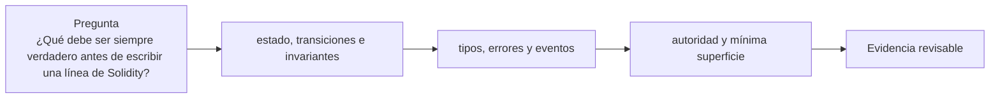

# Clase 13 · Diseño de contratos e invariantes

> **Clase independiente 13 de 66** · **Nivel:** Intermedio-Avanzado · **Fuente base:** documentación de Solidity y *The Foundry Book*
>
> [⬅️ Clase anterior](../05-ethereum-evm/clase-12-evm-abi-y-costo-de-ejecucion.md) · [📚 Índice de las 66 clases](../README.md) · [🗂️ Mapa del tema](README.md) · [➡️ Clase siguiente](../06-solidity-foundry/clase-14-pruebas-profundas-con-foundry.md)

## Punto de partida

**Pregunta guía:** ¿Qué debe ser siempre verdadero antes de escribir una línea de Solidity?

**Caso que abre la clase:** Una bóveda acepta depósitos pero pierde correspondencia entre shares y activos.

Primero se escriben estados permitidos, transiciones e invariantes; después aparece Solidity. Esta inversión evita que la implementación dicte accidentalmente las reglas del sistema.

## Fundamentos que sostienen la respuesta

1. **estado, transiciones e invariantes.** En esta clase delimita qué objeto o relación estamos observando antes de sacar conclusiones. Localízalo explícitamente en «Una bóveda acepta depósitos pero pierde correspondencia entre shares y activos.» y anota qué dato faltaría para refutar tu lectura.
2. **tipos, errores y eventos.** En esta clase explica el mecanismo que conecta la situación inicial con el cambio observable. Localízalo explícitamente en «Una bóveda acepta depósitos pero pierde correspondencia entre shares y activos.» y anota qué dato faltaría para refutar tu lectura.
3. **autoridad y mínima superficie.** En esta clase permite contrastar el resultado y formular el límite de la evidencia. Localízalo explícitamente en «Una bóveda acepta depósitos pero pierde correspondencia entre shares y activos.» y anota qué dato faltaría para refutar tu lectura.

### Inmutable vs. upgradeable: trade-offs reales

Un contrato inmutable es la promesa más fuerte que puedes dar; un proxy la relaja a cambio de poder corregir errores. Elegir es una decisión de gobernanza, no solo técnica.

| Estrategia | Ventaja principal | Riesgo principal |
|---|---|---|
| Inmutable | Garantías máximas; sin admin que comprometer | Un bug es permanente; solo queda migrar a un contrato nuevo |
| Transparent Proxy | Patrón maduro; separa admin de usuarios | Más gas por llamada; el admin es un punto de confianza |
| UUPS | Lógica de upgrade en la implementación; llamadas más baratas | Si una versión olvida `_authorizeUpgrade`, el contrato queda congelado o secuestrable |

El riesgo transversal de cualquier proxy es la **colisión de storage**: la implementación nueva debe respetar exactamente el orden y tipo de las variables previas (solo añadir al final). Cambiar `uint256 total` por `address owner` en el mismo slot reinterpreta bytes existentes como otro tipo, corrompiendo el estado sin ningún error de compilación. Por eso los patrones modernos usan slots deterministas separados (ERC-1967) y herramientas que comparan layouts entre versiones.

### Gas y errores: custom errors y el optimizador

Un `require(cond, "mensaje largo de error")` incrusta la cadena en el bytecode (cada 32 bytes de string son bytecode adicional en el deploy) y al revertir codifica `Error(string)` con su overhead de memoria. Un custom error (`error Unauthorized();` + `revert Unauthorized();`) viaja como un selector de 4 bytes: como cifras orientativas, ahorra cientos de gas por revert y reduce el tamaño de despliegue en decenas de bytes por cada mensaje reemplazado, además de permitir parámetros tipados (`error InsufficientBalance(uint256 pedido, uint256 disponible)`).

El optimizador de Solidity se configura con `runs`: es una estimación de cuántas veces se ejecutará cada función a lo largo de la vida del contrato. `runs = 1` minimiza el tamaño del bytecode (deploy barato, llamadas algo más caras); `runs = 1000000` hace lo contrario. El valor por defecto de 200 es un compromiso; para un contrato que recibirá millones de llamadas, subir `runs` suele pagarse solo.

## Gráfico pedagógico

Recorre el gráfico en voz alta: identifica supuestos, transformaciones y el punto exacto donde aparece evidencia.

## Trabajo práctico

**Método propio:** taller de especificación antes del código.

**Actividad:** Escribir especificación e invariantes antes de implementar el contrato.

Trabaja en entorno local, regtest, signet o testnet según corresponda. Conserva entradas, comandos, salidas y bloque o instante de corte. Una captura aislada no demuestra reproducibilidad.

## Demostración de aprendizaje

**Entregable:** Contrato mínimo con pruebas unitarias que demuestren transiciones válidas.

**Comprobación formativa:** Formula una propiedad que deba cumplirse tras cualquier depósito y retiro.

Para aprobar debes conectar el hecho observado con el concepto correcto, descartar al menos una interpretación alternativa y redactar una conclusión cuyo alcance no exceda la prueba.

## Errores que esta clase corrige

- Tratar **estado, transiciones e invariantes** como una etiqueta suficiente, sin identificar actores, dato y frontera.
- Usar **tipos, errores y eventos** como explicación aunque el caso no aporte la evidencia necesaria.
- Dar por respondido «¿Qué debe ser siempre verdadero antes de escribir una línea de Solidity?» sin contrastar **autoridad y mínima superficie**.

Vuelve al caso inicial, elige el error más peligroso y describe una comprobación concreta que lo detectaría.

## Fuentes para comprobar y ampliar

- Documentación de Solidity, secciones de tipos, contratos y patrones — <https://docs.soliditylang.org/>
- *The Foundry Book*, capítulos de testing, fuzzing e invariantes — <https://book.getfoundry.sh/>
- OpenZeppelin Contracts, guía de control de acceso y seguridad — <https://docs.openzeppelin.com/contracts/>
- Fuente primaria: EIP-4626, estándar de bóvedas tokenizadas — <https://eips.ethereum.org/EIPS/eip-4626>

Consulta además la [bibliografía razonada](../../docs/bibliografia.md), que declara procedencia y uso.

## Cierre de la clase

Responde otra vez la pregunta guía sin mirar notas. Si tu respuesta no menciona evidencia, supuesto y límite, todavía describe el tema pero no lo domina. Continúa solo cuando otra persona pueda reproducir tu entregable.
