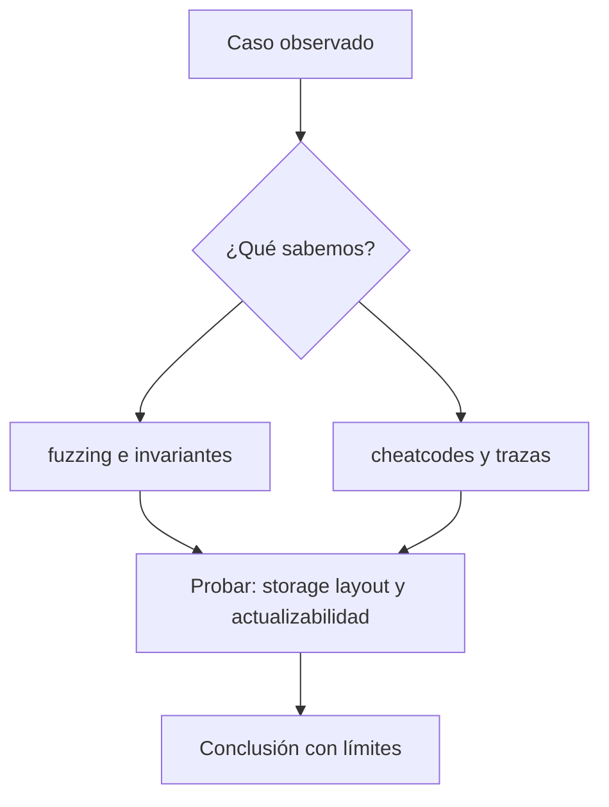

# Clase 14 · Pruebas profundas con Foundry

> **Clase independiente 14 de 66** · **Nivel:** Intermedio-Avanzado · **Fuente base:** documentación de Solidity y *The Foundry Book*
>
> [⬅️ Clase anterior](../06-solidity-foundry/clase-13-diseno-de-contratos-e-invariantes.md) · [📚 Índice de las 66 clases](../README.md) · [🗂️ Mapa del tema](README.md) · [➡️ Clase siguiente](../07-dapps/clase-15-lecturas-rpc-y-estado-de-interfaz.md)

## Punto de partida

**Pregunta guía:** ¿Cómo encontramos secuencias que una prueba feliz nunca ejecuta?

**Caso que abre la clase:** Una secuencia depósito-retiro-donación rompe una aserción contable.

Las pruebas felices se reemplazan por actores y llamadas aleatorias. El estudiante reduce el fallo hasta una secuencia mínima y sólo entonces corrige.

## Gráfico pedagógico

Recorre el gráfico en voz alta: identifica supuestos, transformaciones y el punto exacto donde aparece evidencia.



## Fundamentos que sostienen la respuesta

1. **fuzzing e invariantes.** En esta clase delimita qué objeto o relación estamos observando antes de sacar conclusiones. Localízalo explícitamente en «Una secuencia depósito-retiro-donación rompe una aserción contable.» y anota qué dato faltaría para refutar tu lectura.
2. **cheatcodes y trazas.** En esta clase explica el mecanismo que conecta la situación inicial con el cambio observable. Localízalo explícitamente en «Una secuencia depósito-retiro-donación rompe una aserción contable.» y anota qué dato faltaría para refutar tu lectura.
3. **storage layout y actualizabilidad.** En esta clase permite contrastar el resultado y formular el límite de la evidencia. Localízalo explícitamente en «Una secuencia depósito-retiro-donación rompe una aserción contable.» y anota qué dato faltaría para refutar tu lectura.

### Fuzzing e invariantes en Foundry

En una prueba fuzz, Foundry genera cientos de valores para los argumentos de la función de test. Sin acotar, la mayoría de entradas revierten por triviales (montos absurdos, direcciones cero) y el fuzzing pierde potencia; con `bound(monto, 1, saldoMaximo)` concentras las corridas en el rango interesante.

Para invariantes, el **handler** es un contrato intermedio que envuelve a la bóveda y expone solo secuencias de acciones válidas (depositar, retirar, forzar envío de ether), además de llevar contadores fantasma. La invariante contable típica de un vault:

```solidity
function invariant_contabilidadCuadra() public view {
    // el balance real puede EXCEDER lo registrado (force-send),
    // pero nunca ser menor que la suma de depósitos netos
    assertGe(address(vault).balance, handler.sumaDepositos() - handler.sumaRetiros());
}
```

Nota el `>=` en lugar de `==`: es exactamente la lección del force-send aplicada a una invariante ejecutable.

### Leer una traza de Foundry (la habilidad que desatasca)

Cuando un test falla, la diferencia entre media hora y dos minutos es saber leer la traza. Ejecuta con `-vvvv` y Foundry imprime cada llamada, su gas y su resultado:

```text
[FAIL. Reason: revert: saldo insuficiente] test_retiro() (gas: 34218)
Traces:
  [34218] VaultTest::test_retiro()
    ├─ [0] VM::prank(alice: [0x1234…])
    │   └─ ← ()
    ├─ [22431] Vault::depositar{value: 1000000000000000000}()
    │   ├─ emit Deposito(quien: alice, monto: 1000000000000000000)
    │   └─ ← ()
    ├─ [2553] Vault::retirar(2000000000000000000)
    │   └─ ← revert: saldo insuficiente
    └─ ← revert: saldo insuficiente
```

Cómo se lee, de arriba abajo:

- **`[34218]`** al inicio es el gas total del test; los `[…]` de cada línea, el de esa llamada. Un número desproporcionado en una línea señala dónde se va el gas.
- **La sangría es la pila de llamadas.** `Vault::retirar` está dentro del test; si un contrato llamara a otro, aparecería anidado un nivel más. Ahí se ve la reentrancia: la misma función apareciendo dos veces anidada.
- **`←`** es lo que devolvió. `← ()` es éxito sin retorno; `← revert: …` es el fallo.
- **El primer `revert` de abajo hacia arriba es la causa**; los de encima son la propagación. Buscar el más profundo, no el primero que se lee.
- **Los eventos** (`emit`) aparecen en su sitio exacto: si esperabas un evento y no está, la línea te dice si la función llegó a ejecutarse.

Tres banderas de `forge test` que resuelven casi todo:

| Bandera | Para qué |
|---|---|
| `-vvvv` | Traza completa con llamadas internas y eventos |
| `--match-test test_retiro` | Ejecuta solo ese test mientras lo depuras |
| `--gas-report` | Tabla de gas por función: dónde optimizar de verdad |

Y dentro del test, `console2.log("saldo", saldo);` imprime en la traza sin romper nada, tras `import {console2} from "forge-std/console2.sol";`.

### El storage por dentro: dónde vive cada variable

El *storage layout* deja de ser abstracto cuando cuentas las ranuras. La EVM da a cada contrato ranuras de 32 bytes numeradas desde 0, y Solidity las asigna **en el orden de declaración**, empaquetando variables pequeñas si caben juntas.

```solidity
contract Ejemplo {
    uint256 public total;      // ranura 0  (32 bytes, ocupa una entera)
    uint128 public techo;      // ranura 1, bytes 0–15   ┐ comparten
    uint128 public piso;       // ranura 1, bytes 16–31  ┘ la ranura 1
    address public duenio;     // ranura 2 (20 bytes)  ┐ comparten
    bool    public pausado;    // ranura 2 (1 byte)    ┘ la ranura 2
    mapping(address => uint256) public saldos;  // ranura 3 (reserva)
}
```

Dos consecuencias prácticas:

**1. El orden de declaración cambia el gas.** Si intercalas `uint256` entre los dos `uint128`, dejan de empaquetarse y el contrato usa una ranura más: un `SSTORE` extra cada vez que se escriben juntos. Ordenar de mayor a menor tamaño no es cosmética.

**2. Los mappings no guardan nada en su ranura.** La ranura 3 queda reservada pero vacía; el valor de `saldos[alice]` vive en `keccak256(abi.encode(alice, 3))`. Por eso un mapping no se puede recorrer y por eso no "cabe" en un slot: sus entradas están dispersas por todo el espacio de direcciones.

Ahora se entiende exactamente por qué un upgrade que **inserta** una variable en medio corrompe los datos: si añades un `uint256 nuevo;` entre `total` y `techo`, `techo` y `piso` pasan a la ranura 2 — pero ahí siguen los bytes de `duenio` y `pausado` de la versión anterior. El contrato leerá una dirección como si fueran dos enteros. No hay error de compilación: solo datos que dejaron de significar lo que decían.

Compruébalo tú mismo con `forge inspect Ejemplo storageLayout`, que imprime la tabla de ranuras. Comparar esa salida entre dos versiones es exactamente la revisión que impide el fallo.

> 💡 **En una frase:** el storage son cajones numerados de 32 bytes que Solidity reparte por orden de declaración. Todo lo raro de los upgrades sale de ahí, y `forge inspect … storageLayout` te lo enseña sin adivinar.

<details>
<summary><strong>🎓 Si ya dominas esto</strong> — los bordes que muerden</summary>

- **`forge inspect` compara, pero no protege.** OpenZeppelin Upgrades valida el layout automáticamente en el despliegue; hacerlo a ojo funciona hasta la versión en que alguien tiene prisa. Los *storage gaps* (`uint256[50] private __gap;`) reservan espacio para que una clase base pueda crecer sin desplazar a las derivadas.
- **ERC-7201 (namespaced storage) elimina el problema de raíz.** En vez de confiar en el orden, cada componente ancla su struct en un slot derivado de un hash de su nombre. Dos componentes independientes ya no pueden colisionar por mucho que cambien.
- **`immutable` y `constant` no ocupan storage:** se incrustan en el bytecode. Leerlos cuesta ~3 gas en vez de 2 100, y por eso una dirección de token que no va a cambiar debe ser `immutable`, no una variable de estado.
- **El empaquetado solo ayuda si escribes juntas las variables.** Dos `uint128` en la misma ranura ahorran cuando se actualizan en la misma transacción; si se escriben por separado, cada una paga un `SSTORE` de lectura-modificación-escritura y el ahorro desaparece.
- **`--gas-report` mide el caso que ejecutaste**, no el peor. Una función con rama fría cara puede parecer barata si tus tests solo pasan por la templada; el fuzzing con `--gas-report` da una foto más honesta.

</details>

## Trabajo práctico

**Método propio:** caza de secuencias con fuzzing.

**Actividad:** Crear handlers y ejecutar pruebas de invariantes sobre estados aleatorios.

Trabaja en entorno local, regtest, signet o testnet según corresponda. Conserva entradas, comandos, salidas y bloque o instante de corte. Una captura aislada no demuestra reproducibilidad.

## Errores que esta clase corrige

- Tratar **fuzzing e invariantes** como una etiqueta suficiente, sin identificar actores, dato y frontera.
- Usar **cheatcodes y trazas** como explicación aunque el caso no aporte la evidencia necesaria.
- Dar por respondido «¿Cómo encontramos secuencias que una prueba feliz nunca ejecuta?» sin contrastar **storage layout y actualizabilidad**.

Vuelve al caso inicial, elige el error más peligroso y describe una comprobación concreta que lo detectaría.

## Demostración de aprendizaje

**Entregable:** Fallo mínimo reproducible, corrección y prueba de regresión.

**Comprobación formativa:** ¿Qué aporta una prueba de invariantes que no aporta repetir cientos de casos unitarios?

Para aprobar debes conectar el hecho observado con el concepto correcto, descartar al menos una interpretación alternativa y redactar una conclusión cuyo alcance no exceda la prueba.

## Fuentes para comprobar y ampliar

- Documentación de Solidity, secciones de tipos, contratos y patrones — <https://docs.soliditylang.org/>
- *The Foundry Book*, capítulos de testing, fuzzing e invariantes — <https://book.getfoundry.sh/>
- OpenZeppelin Contracts, guía de control de acceso y seguridad — <https://docs.openzeppelin.com/contracts/>
- Fuente primaria: EIP-4626, estándar de bóvedas tokenizadas — <https://eips.ethereum.org/EIPS/eip-4626>

Consulta además la [bibliografía razonada](../../docs/bibliografia.md), que declara procedencia y uso.

## Cierre de la clase

Responde otra vez la pregunta guía sin mirar notas. Si tu respuesta no menciona evidencia, supuesto y límite, todavía describe el tema pero no lo domina. Continúa solo cuando otra persona pueda reproducir tu entregable.
