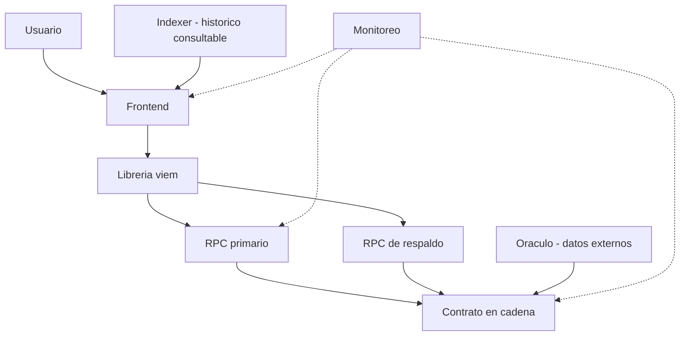
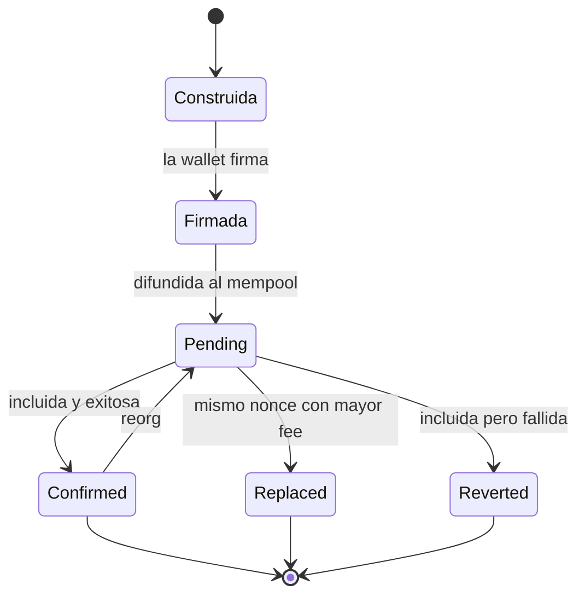
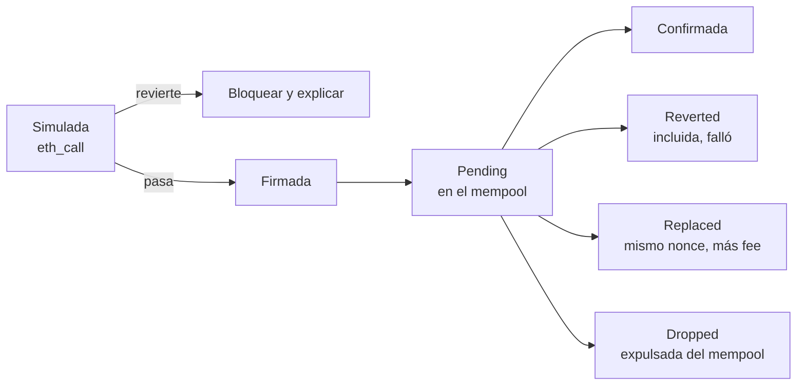

# 07 · Aplicaciones descentralizadas

> **Nivel:** Intermedio-Avanzado · ⏱️ **Duración estimada:** 150 min · **Fuente:** documentación de ethereum.org y de viem
> [⬅️ Currículo](../README.md) · [📚 Bibliografía](../../docs/bibliografia.md)
> 🧭 ⬅️ **Anterior:** [06 · Solidity y Foundry](../06-solidity-foundry/README.md) · [📚 Índice](../README.md) · ➡️ **Siguiente:** [08 · Tokens y estándares](../08-tokens/README.md)
> 📖 [Glosario de términos](../../docs/glosario.md) · 🌱 [¿Nuevo en esto? Empieza aquí](../../docs/empieza-aqui.md)

---

## 🎯 Objetivos

- Describir las partes de una dApp: interfaz, proveedor RPC, wallet, contratos, indexación y servicios externos.
- Distinguir lecturas públicas de escrituras firmadas y cuándo cada una requiere una wallet.
- Simular una transacción antes de enviarla para anticipar su efecto y sus fallos.
- Interpretar los estados de una transacción: pending, confirmed, replaced y reverted.
- Construir una interfaz que muestre contrato, red, valor y efecto esperado antes de pedir la firma.

## 📚 Resultados de aprendizaje

Al finalizar, el estudiante podrá:

1. **Diagramar** el flujo de datos de una dApp y ubicar dónde vive la fuente de verdad.
2. **Separar** llamadas de solo lectura de transacciones que modifican estado.
3. **Simular** una operación con una llamada previa antes de solicitar la firma.
4. **Mostrar** al usuario el efecto esperado, la red y el contrato antes de firmar.
5. **Gestionar** decimales, unidades y approvals con una UX que evite errores.
6. **Mitigar** la dependencia de un RPC no confiable mediante redundancia y verificación.

## 🗺️ Temas

| # | Tema | Por qué importa |
|---|---|---|
| 1 | Anatomía de una dApp | La interfaz no es fuente de verdad; el estado vive en la cadena. |
| 2 | Conexión y cambio de red | Firmar en la red equivocada arruina la operación. |
| 3 | Lectura vs. escritura | Diferencia lo gratuito y sin riesgo de lo que gasta y compromete. |
| 4 | Simulación previa | Anticipa reverts y efectos antes de gastar gas. |
| 5 | Estados de transacción | Permite dar feedback honesto y manejar reemplazos. |
| 6 | Decimales y approvals | Un error de unidades o un approval abierto expone fondos. |
| 7 | RPC no confiable | Un proveedor único puede mentir o caerse; la redundancia protege. |
| 8 | Firmas legibles (EIP-712) | Muestran al usuario qué está firmando en lenguaje comprensible. |

## 🧠 Modelo mental

Piensa en la dApp como el mostrador de un banco y en la blockchain como la bóveda del fondo. El cajero (la interfaz) te enseña saldos y formularios, pero no guarda el dinero: solo transmite tus órdenes firmadas a la bóveda, donde ocurre lo real. Si el cajero muestra una cifra bonita pero la bóveda dice otra cosa, la bóveda siempre gana. Antes de firmar, un buen mostrador te lee en voz alta a quién pagas, cuánto y en qué red.

La analogía tiene un límite importante: en la banca tradicional confías en una sola sucursal, mientras que aquí el "cajero" consulta a través de un proveedor RPC que podría estar equivocado o ser malicioso. Por eso la interfaz debe tratar sus propios datos como provisionales, simular antes de enviar y, cuando importa, contrastar con más de una fuente en lugar de creer ciegamente a un único RPC.

## 🧩 Esquema visual

Arquitectura de una dApp en producción: el frontend nunca habla "directo" con la cadena, sino a través de una librería y RPC redundantes, con indexer y oráculo como fuentes laterales y monitoreo transversal.



Estados por los que pasa una transacción desde que la interfaz la construye; nota que un reorg puede devolver una transacción confirmada a pending.



## 📖 Conceptos y definiciones

- **Proveedor RPC**: servicio que la dApp consulta para leer estado y difundir transacciones; puede ser no confiable.
- **Lectura pública**: consulta de solo lectura que no cuesta gas ni requiere firma, por ejemplo un `eth_call`.
- **Escritura firmada**: transacción que modifica estado, requiere firma de la wallet y consume gas.
- **Simulación**: ejecución previa (mediante `eth_call` o simulate) que predice el resultado sin enviarlo.
- **Estado pending**: transacción difundida y aún no incluida en un bloque.
- **Estado replaced**: transacción sustituida por otra con el mismo nonce y mayor comisión.
- **Estado reverted**: transacción incluida pero cuya ejecución falló y deshizo sus efectos.
- **Approval**: permiso que autoriza a un contrato a mover tus tokens; un límite abierto es un riesgo.
- **Decimales y unidades**: los tokens usan enteros escalados; confundir unidades altera el monto real.
- **EIP-712**: estándar de firma de datos estructurados que hace legible para el usuario qué está firmando.

## 🔬 Profundización

### Reorgs y finalidad: qué mostrar al usuario

Antes de The Merge la única defensa contra reorganizaciones era esperar N confirmaciones y cruzar los dedos. Desde 2022 el consenso Proof of Stake de Ethereum ofrece garantías explícitas que la interfaz puede consultar por el tag del bloque:

- **latest**: la cabeza de la cadena; puede reorganizarse en los siguientes slots.
- **safe**: bloque justificado por la mayoría de validadores; un reorg es ya muy improbable.
- **finalized**: bloque finalizado tras dos épocas (≈ 12,8 minutos, con épocas de 6,4 minutos); revertirlo exigiría destruir al menos un tercio del stake total.

Una UX honesta refleja esto en capas: "incluida" al ver el recibo sobre `latest`, "confirmada" tras algunos bloques o al alcanzar `safe`, y "definitiva" solo en `finalized` para montos altos. Un mini-caso real: en mayo de 2022 la beacon chain sufrió un reorg de 7 bloques; toda interfaz que hubiera marcado como definitiva una transacción con 5 confirmaciones habría mentido al usuario. Para pagos pequeños, `safe` suele ser el equilibrio razonable entre latencia y riesgo.

### EIP-1193 y EIP-6963: cómo la dApp encuentra la wallet

**EIP-1193** define la interfaz estándar del provider inyectado: un objeto con `request({ method, params })` y eventos como `accountsChanged` y `chainChanged`. Gracias a ese contrato único, viem o wagmi funcionan con cualquier wallet que lo implemente.

Su punto débil era el descubrimiento: todas las wallets peleaban por el mismo `window.ethereum` y la última en inyectarse "ganaba". **EIP-6963** (2023) lo resuelve con un protocolo de anuncio por eventos del DOM: cada wallet emite `eip6963:announceProvider` con sus metadatos (nombre, icono, identificador) y la dApp las lista todas, dejando elegir al usuario. Toda interfaz moderna debería soportar EIP-6963 con EIP-1193 como respaldo.

### Patrones de robustez RPC

| Patrón | Problema que resuelve |
|---|---|
| Fallback transport de viem | Un RPC caído o lento no tumba la dApp; las peticiones rotan al siguiente proveedor configurado |
| Multicall (lecturas agregadas) | Cien `eth_call` individuales saturan el rate limit; un solo contrato multicall las resuelve en una petición |
| Simulación con `eth_call` previa | Enviar sin simular quema gas en reverts previsibles; la simulación anticipa el fallo gratis |
| Verificación cruzada de datos críticos | Un RPC único puede mentir u ofrecer estado desactualizado; contrastar dos proveedores lo detecta |

En viem, el fallback se declara al crear el cliente (`fallback([http(rpcA), http(rpcB)])`) y el multicall está integrado como batching automático de lecturas de contrato: activarlo suele ser un cambio de configuración, no una reescritura. La regla operativa: toda escritura pasa antes por una simulación, y toda lectura que dispare decisiones de dinero se verifica contra más de una fuente.

### El ciclo de vida de una transacción, y qué mostrar en cada estado

La mayoría de las dApps que confunden al usuario cometen el mismo error: tratan "enviada" como "hecha". Una transacción atraviesa estados que la interfaz debe distinguir, porque cada uno exige una acción distinta.



| Estado | Qué pasó | Qué debe hacer la interfaz |
|---|---|---|
| **Simulada** | `eth_call` con el mismo calldata, sin enviar | Si revierte, **no pedir la firma**: mostrar el motivo. Firmar algo que sabes que falla es cobrarle gas al usuario por nada |
| **Pending** | Difundida, sin bloque | Mostrar el hash y que se puede acelerar o cancelar. **No** decir "completado" |
| **Confirmada** | En un bloque, `status = 1` | Releer el estado desde el RPC, no asumirlo |
| **Reverted** | En un bloque, `status = 0` | Se pagó el gas y no pasó nada. Decirlo así: el usuario ve el cobro y no ve el efecto |
| **Replaced** | Otra transacción con el mismo nonce y más comisión ocupó su lugar | Seguir el **nonce**, no el hash. Si sigues el hash, la transacción "desaparece" |
| **Dropped** | El mempool la descartó (llevaba demasiado tiempo o subió el mínimo) | Ofrecer reenviar. No se quedará pendiente para siempre |

La regla que se deriva: **la fuente de verdad es la cadena, no tu estado local**. Tras confirmar, vuelve a leer el saldo desde el RPC. Si la interfaz suma el monto a su copia en memoria, cualquier divergencia (un revert, otra transacción del mismo usuario en otra pestaña) deja al usuario mirando un número que no existe.

### Decimales: el error de tres ceros

Es el fallo más caro que comete un principiante y el más fácil de evitar. **Los tokens no tienen decimales: tienen enteros y un número que dice dónde imaginar la coma.**

```text
USDC  → decimals = 6      1 USDC  = 1 000 000 unidades
WETH  → decimals = 18     1 WETH  = 1 000 000 000 000 000 000 unidades
WBTC  → decimals = 8      1 WBTC  = 100 000 000 unidades
```

Si asumes 18 porque "todos usan 18" y el token es USDC, enviar "5" da:

```text
lo que pretendías:  5 USDC     =         5 000 000 unidades
lo que enviaste:    5×10¹⁸     = 5 000 000 000 000 000 000 unidades
                                = 5 000 000 000 000 USDC
```

Un factor de 10¹². No hay confirmación que te salve: la transacción es válida y el token se movió.

Tres reglas que lo cierran:

1. **Nunca escribas el factor a mano.** `parseUnits("5", decimals)` y `formatUnits(valor, decimals)`; el `parseEther` de viem asume 18 y solo vale para ETH.
2. **Lee `decimals()` del contrato**, no de una lista. Un token puede tener el `decimals` que quiera.
3. **Nada de flotantes.** `0.1 + 0.2 !== 0.3` en JavaScript, y aquí eso es dinero. Los montos van en `BigInt` de punta a punta; el formateo a texto es lo último que se hace, solo para mostrar.

El mismo razonamiento aplica a los feeds de precio: un oráculo con `decimals = 8` que devuelve `312450000000` son 3 124,50, no 312 450 000 000. Normaliza antes de comparar cualquier cosa con cualquier cosa.

> 💡 **En una frase:** los tokens solo manejan enteros, y `decimals` dice dónde imaginar la coma. Lee ese número del contrato, convierte con `parseUnits`/`formatUnits` y no dejes que un flotante toque un monto.

<details>
<summary><strong>🎓 Si ya dominas esto</strong> — el detalle que rompe integraciones</summary>

- **`decimals()` es opcional en el ERC-20.** Está en la extensión de metadatos, no en el estándar obligatorio. Un token puede no implementarlo, y tu código debe decidir si asume 18 o se niega a operar — negarse suele ser lo correcto.
- **Hay tokens que mienten en el retorno.** USDT no devuelve `bool` en `transfer` pese a la firma del estándar; por eso existe `SafeERC20`, que trata "sin retorno" como éxito y "retorno false" como fallo.
- **Los tokens con comisión de transferencia rompen la aritmética ingenua.** Envías 100 y llegan 98. Si tu contrato apunta 100, la contabilidad queda descuadrada desde el primer día: mide el saldo antes y después, no confíes en el argumento.
- **`approve` tiene una condición de carrera conocida.** Cambiar una allowance no nula por otra permite al gastador consumir ambas si se adelanta. La mitigación clásica es poner a cero primero; la moderna, usar `permit` con su nonce.
- **Los rebasing tokens (stETH y similares) cambian el saldo sin ninguna transferencia.** Cachear un balance y asumirlo estable produce diferencias que parecen un bug de tu código y son el comportamiento del token.

</details>

## 🧪 Laboratorio guiado

> 🧪 Estas prácticas están catalogadas y **resueltas paso a paso** en el [catálogo de laboratorios](../../labs/CATALOG.md).

1. Levanta el panel del repositorio para navegar los recursos del curso.

```bash
pnpm serve
```

2. Compila la aplicación web del repositorio, ubicada en `apps/community-funding-web`.

```bash
pnpm build:web
```

3. En la interfaz del Vault construida con TypeScript y viem, conecta una wallet y verifica la red activa.
4. Realiza una lectura pública del estado del contrato y muéstrala sin pedir firma.
5. Simula una escritura y presenta al usuario contrato, red, valor y efecto esperado antes de firmar.
6. Provoca un caso de revert en la simulación y confirma que la interfaz lo comunica con claridad.

## 📝 Reto verificable

Entrega una interfaz para el Vault que, antes de solicitar cualquier firma, muestre la dirección del contrato, la red, el valor y el efecto esperado, y que simule la operación previamente.

**Criterio de aceptación:** la interfaz bloquea la firma si la red no coincide, muestra el efecto simulado con unidades correctas y comunica explícitamente los estados pending, confirmed y reverted.

## ⚠️ Errores frecuentes

| Síntoma | Causa y cómo comprobarlo |
|---|---|
| La UI muestra un saldo que la cadena desmiente | Tratas la interfaz como fuente de verdad; relee el estado desde el RPC. |
| El usuario firma en la red equivocada | No validas chain id antes de firmar; bloquea la acción hasta cambiar de red. |
| El monto enviado es mil veces mayor | Confundiste decimales/unidades; convierte con la función adecuada y verifica. |
| Approval deja fondos expuestos | Autorizaste un límite abierto; usa montos acotados y revócalos tras usarlos. |
| La transacción "desaparece" | Fue replaced por mismo nonce y mayor fee; sigue el nonce, no solo el hash. |

## 🛡️ Seguridad y ética

- Trabaja en local o testnet; nunca uses fondos ni claves reales en los laboratorios.
- Simula siempre antes de enviar y muestra el efecto esperado antes de pedir la firma.
- No confíes en un único RPC: contrasta datos críticos y prevé su indisponibilidad.
- Prefiere firmas legibles con EIP-712 para que el usuario entienda qué autoriza.
- Evita approvals ilimitados y explica sus riesgos; las condiciones de red cambian, consúltalo en vivo.

## 🔗 Referencias

- Documentación de ethereum.org sobre dApps — <https://ethereum.org/developers/docs/dapps/>
- Documentación de viem, guías de clientes y acciones — <https://viem.sh/>
- Documentación de wagmi, hooks para interfaces React — <https://wagmi.sh/>
- Fuente primaria: EIP-712, firma de datos estructurados — <https://eips.ethereum.org/EIPS/eip-712>

## ✅ Criterio de dominio

- Explicas por qué la interfaz no es fuente de verdad y dónde vive el estado real.
- Muestras contrato, red, valor y efecto esperado antes de solicitar una firma.
- Manejas los estados de una transacción y justificas la redundancia de RPC.

---

## 🧭 Navegación

⬅️ [Módulo 06 · Solidity y Foundry](../06-solidity-foundry/README.md) · [📚 Índice del currículo](../README.md) · ➡️ [Módulo 08 · Tokens y estándares](../08-tokens/README.md)
