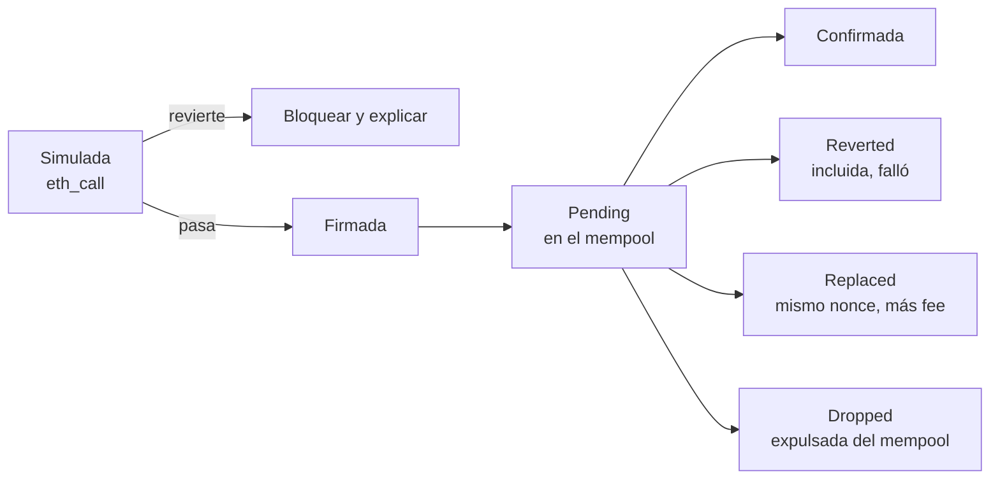
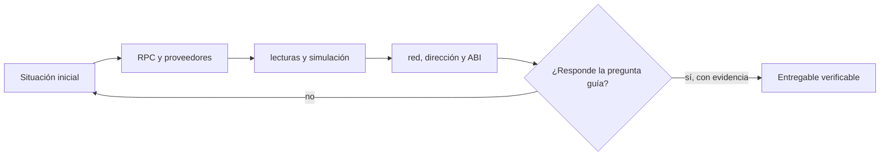

# Clase 15 · Lecturas, RPC y estado de interfaz

> **Clase independiente 15 de 66** · **Nivel:** Intermedio-Avanzado · **Fuente base:** documentación de ethereum.org y de viem
>
> [⬅️ Clase anterior](../06-solidity-foundry/clase-14-pruebas-profundas-con-foundry.md) · [📚 Índice de las 66 clases](../README.md) · [🗂️ Mapa del tema](README.md) · [➡️ Clase siguiente](../07-dapps/clase-16-firmas-y-experiencia-transaccional.md)

## Punto de partida

**Pregunta guía:** ¿Qué puede mostrar una dApp sin pedir permiso ni firma al usuario?

**Caso que abre la clase:** La interfaz consulta un contrato correcto en la red equivocada.

Una pantalla aparentemente correcta consulta red o contrato equivocados. La clase rastrea procedencia, bloque y ABI para convertir errores silenciosos en estados visibles.

## Fundamentos que sostienen la respuesta

1. **RPC y proveedores.** En esta clase delimita qué objeto o relación estamos observando antes de sacar conclusiones. Localízalo explícitamente en «La interfaz consulta un contrato correcto en la red equivocada.» y anota qué dato faltaría para refutar tu lectura.
2. **lecturas y simulación.** En esta clase explica el mecanismo que conecta la situación inicial con el cambio observable. Localízalo explícitamente en «La interfaz consulta un contrato correcto en la red equivocada.» y anota qué dato faltaría para refutar tu lectura.
3. **red, dirección y ABI.** En esta clase permite contrastar el resultado y formular el límite de la evidencia. Localízalo explícitamente en «La interfaz consulta un contrato correcto en la red equivocada.» y anota qué dato faltaría para refutar tu lectura.

### Reorgs y finalidad: qué mostrar al usuario

Antes de The Merge la única defensa contra reorganizaciones era esperar N confirmaciones y cruzar los dedos. Desde 2022 el consenso Proof of Stake de Ethereum ofrece garantías explícitas que la interfaz puede consultar por el tag del bloque:

- **latest**: la cabeza de la cadena; puede reorganizarse en los siguientes slots.
- **safe**: bloque justificado por la mayoría de validadores; un reorg es ya muy improbable.
- **finalized**: bloque finalizado tras dos épocas (≈ 12,8 minutos, con épocas de 6,4 minutos); revertirlo exigiría destruir al menos un tercio del stake total.

Una UX honesta refleja esto en capas: "incluida" al ver el recibo sobre `latest`, "confirmada" tras algunos bloques o al alcanzar `safe`, y "definitiva" solo en `finalized` para montos altos. Un mini-caso real: en mayo de 2022 la beacon chain sufrió un reorg de 7 bloques; toda interfaz que hubiera marcado como definitiva una transacción con 5 confirmaciones habría mentido al usuario. Para pagos pequeños, `safe` suele ser el equilibrio razonable entre latencia y riesgo.

### Patrones de robustez RPC

| Patrón | Problema que resuelve |
|---|---|
| Fallback transport de viem | Un RPC caído o lento no tumba la dApp; las peticiones rotan al siguiente proveedor configurado |
| Multicall (lecturas agregadas) | Cien `eth_call` individuales saturan el rate limit; un solo contrato multicall las resuelve en una petición |
| Simulación con `eth_call` previa | Enviar sin simular quema gas en reverts previsibles; la simulación anticipa el fallo gratis |
| Verificación cruzada de datos críticos | Un RPC único puede mentir u ofrecer estado desactualizado; contrastar dos proveedores lo detecta |

En viem, el fallback se declara al crear el cliente (`fallback([http(rpcA), http(rpcB)])`) y el multicall está integrado como batching automático de lecturas de contrato: activarlo suele ser un cambio de configuración, no una reescritura. La regla operativa: toda escritura pasa antes por una simulación, y toda lectura que dispare decisiones de dinero se verifica contra más de una fuente.

### El ciclo de vida de una transacción, y qué mostrar en cada estado

La mayoría de las dApps que confunden al usuario cometen el mismo error: tratan "enviada" como "hecha". Una transacción atraviesa estados que la interfaz debe distinguir, porque cada uno exige una acción distinta.



| Estado | Qué pasó | Qué debe hacer la interfaz |
|---|---|---|
| **Simulada** | `eth_call` con el mismo calldata, sin enviar | Si revierte, **no pedir la firma**: mostrar el motivo. Firmar algo que sabes que falla es cobrarle gas al usuario por nada |
| **Pending** | Difundida, sin bloque | Mostrar el hash y que se puede acelerar o cancelar. **No** decir "completado" |
| **Confirmada** | En un bloque, `status = 1` | Releer el estado desde el RPC, no asumirlo |
| **Reverted** | En un bloque, `status = 0` | Se pagó el gas y no pasó nada. Decirlo así: el usuario ve el cobro y no ve el efecto |
| **Replaced** | Otra transacción con el mismo nonce y más comisión ocupó su lugar | Seguir el **nonce**, no el hash. Si sigues el hash, la transacción "desaparece" |
| **Dropped** | El mempool la descartó (llevaba demasiado tiempo o subió el mínimo) | Ofrecer reenviar. No se quedará pendiente para siempre |

La regla que se deriva: **la fuente de verdad es la cadena, no tu estado local**. Tras confirmar, vuelve a leer el saldo desde el RPC. Si la interfaz suma el monto a su copia en memoria, cualquier divergencia (un revert, otra transacción del mismo usuario en otra pestaña) deja al usuario mirando un número que no existe.

### Decimales: el error de tres ceros

Es el fallo más caro que comete un principiante y el más fácil de evitar. **Los tokens no tienen decimales: tienen enteros y un número que dice dónde imaginar la coma.**

```text
USDC  → decimals = 6      1 USDC  = 1 000 000 unidades
WETH  → decimals = 18     1 WETH  = 1 000 000 000 000 000 000 unidades
WBTC  → decimals = 8      1 WBTC  = 100 000 000 unidades
```

Si asumes 18 porque "todos usan 18" y el token es USDC, enviar "5" da:

```text
lo que pretendías:  5 USDC     =         5 000 000 unidades
lo que enviaste:    5×10¹⁸     = 5 000 000 000 000 000 000 unidades
                                = 5 000 000 000 000 USDC
```

Un factor de 10¹². No hay confirmación que te salve: la transacción es válida y el token se movió.

Tres reglas que lo cierran:

1. **Nunca escribas el factor a mano.** `parseUnits("5", decimals)` y `formatUnits(valor, decimals)`; el `parseEther` de viem asume 18 y solo vale para ETH.
2. **Lee `decimals()` del contrato**, no de una lista. Un token puede tener el `decimals` que quiera.
3. **Nada de flotantes.** `0.1 + 0.2 !== 0.3` en JavaScript, y aquí eso es dinero. Los montos van en `BigInt` de punta a punta; el formateo a texto es lo último que se hace, solo para mostrar.

El mismo razonamiento aplica a los feeds de precio: un oráculo con `decimals = 8` que devuelve `312450000000` son 3 124,50, no 312 450 000 000. Normaliza antes de comparar cualquier cosa con cualquier cosa.

> 💡 **En una frase:** los tokens solo manejan enteros, y `decimals` dice dónde imaginar la coma. Lee ese número del contrato, convierte con `parseUnits`/`formatUnits` y no dejes que un flotante toque un monto.

<details>
<summary><strong>🎓 Si ya dominas esto</strong> — el detalle que rompe integraciones</summary>

- **`decimals()` es opcional en el ERC-20.** Está en la extensión de metadatos, no en el estándar obligatorio. Un token puede no implementarlo, y tu código debe decidir si asume 18 o se niega a operar — negarse suele ser lo correcto.
- **Hay tokens que mienten en el retorno.** USDT no devuelve `bool` en `transfer` pese a la firma del estándar; por eso existe `SafeERC20`, que trata "sin retorno" como éxito y "retorno false" como fallo.
- **Los tokens con comisión de transferencia rompen la aritmética ingenua.** Envías 100 y llegan 98. Si tu contrato apunta 100, la contabilidad queda descuadrada desde el primer día: mide el saldo antes y después, no confíes en el argumento.
- **`approve` tiene una condición de carrera conocida.** Cambiar una allowance no nula por otra permite al gastador consumir ambas si se adelanta. La mitigación clásica es poner a cero primero; la moderna, usar `permit` con su nonce.
- **Los rebasing tokens (stETH y similares) cambian el saldo sin ninguna transferencia.** Cachear un balance y asumirlo estable produce diferencias que parecen un bug de tu código y son el comportamiento del token.

</details>

## Trabajo práctico

**Método propio:** depuración desde la interfaz hasta RPC.

**Actividad:** Construir lecturas tipadas y validar cadena, contrato y formato de datos.

Trabaja en entorno local, regtest, signet o testnet según corresponda. Conserva entradas, comandos, salidas y bloque o instante de corte. Una captura aislada no demuestra reproducibilidad.

## Gráfico pedagógico

Recorre el gráfico en voz alta: identifica supuestos, transformaciones y el punto exacto donde aparece evidencia.



## Demostración de aprendizaje

**Entregable:** Pantalla que exponga procedencia, bloque consultado y estados de error.

**Comprobación formativa:** Enumera tres datos que la interfaz debe mostrar para que una lectura sea verificable.

Para aprobar debes conectar el hecho observado con el concepto correcto, descartar al menos una interpretación alternativa y redactar una conclusión cuyo alcance no exceda la prueba.

## Errores que esta clase corrige

- Tratar **RPC y proveedores** como una etiqueta suficiente, sin identificar actores, dato y frontera.
- Usar **lecturas y simulación** como explicación aunque el caso no aporte la evidencia necesaria.
- Dar por respondido «¿Qué puede mostrar una dApp sin pedir permiso ni firma al usuario?» sin contrastar **red, dirección y ABI**.

Vuelve al caso inicial, elige el error más peligroso y describe una comprobación concreta que lo detectaría.

## Fuentes para comprobar y ampliar

- Documentación de ethereum.org sobre dApps — <https://ethereum.org/developers/docs/dapps/>
- Documentación de viem, guías de clientes y acciones — <https://viem.sh/>
- Documentación de wagmi, hooks para interfaces React — <https://wagmi.sh/>
- Fuente primaria: EIP-712, firma de datos estructurados — <https://eips.ethereum.org/EIPS/eip-712>

Consulta además la [bibliografía razonada](../../docs/bibliografia.md), que declara procedencia y uso.

## Cierre de la clase

Responde otra vez la pregunta guía sin mirar notas. Si tu respuesta no menciona evidencia, supuesto y límite, todavía describe el tema pero no lo domina. Continúa solo cuando otra persona pueda reproducir tu entregable.
