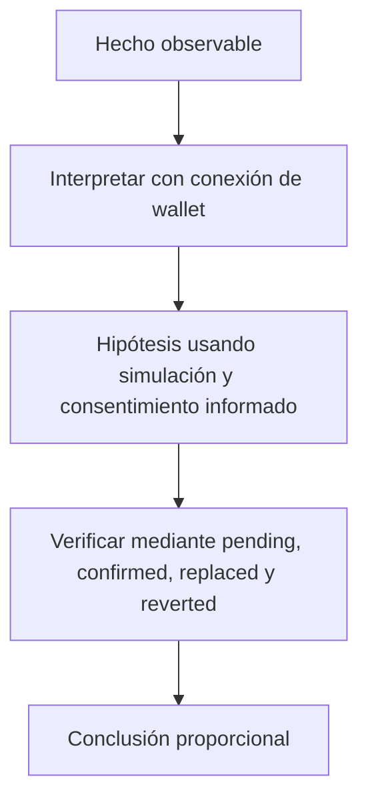

# Clase 16 · Firmas y experiencia transaccional

> **Clase independiente 16 de 66** · **Nivel:** Intermedio-Avanzado · **Fuente base:** documentación de ethereum.org y de viem
>
> [⬅️ Clase anterior](../07-dapps/clase-15-lecturas-rpc-y-estado-de-interfaz.md) · [📚 Índice de las 66 clases](../README.md) · [🗂️ Mapa del tema](README.md) · [➡️ Clase siguiente](../08-tokens/clase-17-estandares-y-derechos-del-token.md)

## Punto de partida

**Pregunta guía:** ¿Cómo entiende el usuario lo que firmará y qué ocurrió después?

**Caso que abre la clase:** Una aprobación ilimitada parece una compra simple en la interfaz.

Se parte de una aprobación peligrosa presentada como acción inocua. El grupo rediseña preflight, simulación y estados posteriores para que el usuario entienda efecto y riesgo.

## Trabajo práctico

**Método propio:** diseño de consentimiento transaccional.

**Actividad:** Diseñar un preflight que muestre contrato, valor, permisos y efecto esperado.

Trabaja en entorno local, regtest, signet o testnet según corresponda. Conserva entradas, comandos, salidas y bloque o instante de corte. Una captura aislada no demuestra reproducibilidad.

## Fundamentos que sostienen la respuesta

1. **conexión de wallet.** En esta clase delimita qué objeto o relación estamos observando antes de sacar conclusiones. Localízalo explícitamente en «Una aprobación ilimitada parece una compra simple en la interfaz.» y anota qué dato faltaría para refutar tu lectura.
2. **simulación y consentimiento informado.** En esta clase explica el mecanismo que conecta la situación inicial con el cambio observable. Localízalo explícitamente en «Una aprobación ilimitada parece una compra simple en la interfaz.» y anota qué dato faltaría para refutar tu lectura.
3. **pending, confirmed, replaced y reverted.** En esta clase permite contrastar el resultado y formular el límite de la evidencia. Localízalo explícitamente en «Una aprobación ilimitada parece una compra simple en la interfaz.» y anota qué dato faltaría para refutar tu lectura.

### EIP-1193 y EIP-6963: cómo la dApp encuentra la wallet

**EIP-1193** define la interfaz estándar del provider inyectado: un objeto con `request({ method, params })` y eventos como `accountsChanged` y `chainChanged`. Gracias a ese contrato único, viem o wagmi funcionan con cualquier wallet que lo implemente.

Su punto débil era el descubrimiento: todas las wallets peleaban por el mismo `window.ethereum` y la última en inyectarse "ganaba". **EIP-6963** (2023) lo resuelve con un protocolo de anuncio por eventos del DOM: cada wallet emite `eip6963:announceProvider` con sus metadatos (nombre, icono, identificador) y la dApp las lista todas, dejando elegir al usuario. Toda interfaz moderna debería soportar EIP-6963 con EIP-1193 como respaldo.

### Consentimiento antes, durante y después de firmar

Conectar una wallet permite a la dApp conocer una cuenta y red; no autoriza por sí mismo a mover activos. `personal_sign`, datos tipados y una transacción ejecutable producen compromisos diferentes. La pantalla previa debe mostrar dominio o contrato, función, destinatario, activo, monto, red, comisión y permisos persistentes. En una aprobación, el riesgo relevante puede ocurrir días después cuando otro contrato usa el allowance.

La experiencia tampoco termina al pulsar confirmar. `pending`, reemplazada, incluida, revertida y final son estados distintos. Una interfaz honesta conserva el hash, detecta cambio de red o cuenta, permite reanudar seguimiento y evita celebrar éxito antes del recibo. La seguridad aquí no es un modal: es hacer visible el efecto que el usuario está autorizando.

### Wallets dentro del problema

La wallet es una frontera de consentimiento. Conectar, firmar un mensaje, enviar valor y aprobar tokens son actos distintos; la interfaz debe explicar los efectos presentes y futuros.

## Gráfico pedagógico

Recorre el gráfico en voz alta: identifica supuestos, transformaciones y el punto exacto donde aparece evidencia.

## Errores que esta clase corrige

- Tratar **conexión de wallet** como una etiqueta suficiente, sin identificar actores, dato y frontera.
- Usar **simulación y consentimiento informado** como explicación aunque el caso no aporte la evidencia necesaria.
- Dar por respondido «¿Cómo entiende el usuario lo que firmará y qué ocurrió después?» sin contrastar **pending, confirmed, replaced y reverted**.

Vuelve al caso inicial, elige el error más peligroso y describe una comprobación concreta que lo detectaría.

## Demostración de aprendizaje

**Entregable:** Flujo con estados recuperables y enlace verificable a la transacción.

**Comprobación formativa:** ¿Qué debe explicarse antes de una firma aunque la simulación termine correctamente?

Para aprobar debes conectar el hecho observado con el concepto correcto, descartar al menos una interpretación alternativa y redactar una conclusión cuyo alcance no exceda la prueba.

## Fuentes para comprobar y ampliar

- Documentación de ethereum.org sobre dApps — <https://ethereum.org/developers/docs/dapps/>
- Documentación de viem, guías de clientes y acciones — <https://viem.sh/>
- Documentación de wagmi, hooks para interfaces React — <https://wagmi.sh/>
- Fuente primaria: EIP-712, firma de datos estructurados — <https://eips.ethereum.org/EIPS/eip-712>

Consulta además la [bibliografía razonada](../../docs/bibliografia.md), que declara procedencia y uso.

## Cierre de la clase

Responde otra vez la pregunta guía sin mirar notas. Si tu respuesta no menciona evidencia, supuesto y límite, todavía describe el tema pero no lo domina. Continúa solo cuando otra persona pueda reproducir tu entregable.
