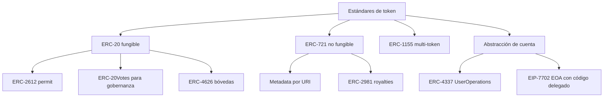
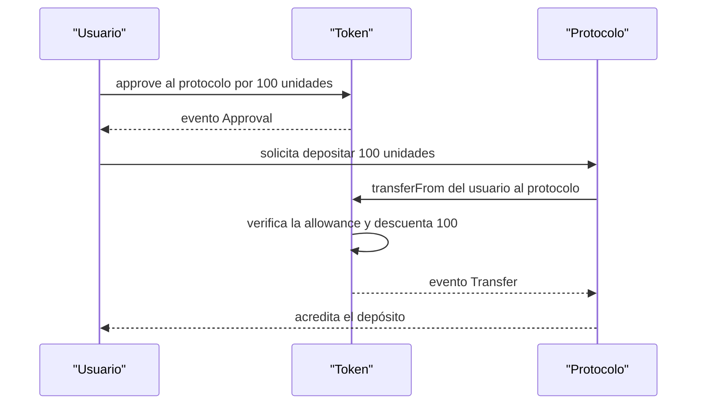

# 08 · Tokens y estándares

> **Nivel:** Intermedio-Avanzado · ⏱️ **Duración estimada:** 150 min · **Fuente:** EIPs de Ethereum y OpenZeppelin Contracts
> [⬅️ Currículo](../README.md) · [📚 Bibliografía](../../docs/bibliografia.md)
> 🧭 ⬅️ **Anterior:** [07 · Aplicaciones descentralizadas](../07-dapps/README.md) · [📚 Índice](../README.md) · ➡️ **Siguiente:** [09 · Seguridad y auditoría](../09-seguridad/README.md)
> 📖 [Glosario de términos](../../docs/glosario.md) · 🌱 [¿Nuevo en esto? Empieza aquí](../../docs/empieza-aqui.md)

---

## 🎯 Objetivos

- Distinguir con precisión los estándares ERC-20, ERC-721, ERC-1155 y ERC-4626, y cuándo elegir cada uno.
- Explicar el modelo de allowances, el riesgo del approve infinito y la alternativa de firmas con ERC-2612 (`permit`).
- Implementar un token educativo apoyado en una biblioteca auditada, documentando autoridad de mint/burn, suministro máximo y controles de emergencia.
- Analizar la distribución y concentración inicial de un suministro y justificar por qué el token debe existir.
- Ubicar la abstracción de cuenta (ERC-4337 y EIP-7702, activo desde Pectra en 2025) dentro de la experiencia de usuario de un token.

## 📚 Resultados de aprendizaje

Al finalizar, el estudiante podrá:

1. **Comparar** los estándares fungibles y no fungibles según interfaz, casos de uso y coste de gas.
2. **Implementar** un token ERC-20 con suministro máximo, pausa y recuperación usando OpenZeppelin.
3. **Justificar** la política de mint/burn y de allowances frente a los riesgos de concentración y approve infinito.
4. **Diseñar** metadata coherente para un ERC-721/1155 y explicar las royalties con ERC-2981.
5. **Explicar** cómo `permit` (ERC-2612) y la abstracción de cuenta mejoran la UX sin sacrificar seguridad.
6. **Modelar** un escenario de emisión con el simulador de tokenomics del repositorio.

## 🗺️ Temas

| # | Tema | Por qué importa |
|---|------|-----------------|
| 1 | ERC-20 y allowances | Es el estándar fungible base; sus allowances concentran el riesgo de aprobaciones. |
| 2 | ERC-721 y metadata | Define la unicidad y la referencia a atributos fuera de cadena. |
| 3 | ERC-1155 multi-token | Un solo contrato gestiona fungibles y no fungibles con transferencias por lotes. |
| 4 | ERC-2612 `permit` | Elimina la transacción de `approve` mediante firma, reduciendo fricción y coste. |
| 5 | Royalties ERC-2981 | Estandariza cómo se señala una regalía, aunque su cumplimiento sea voluntario. |
| 6 | Bóvedas ERC-4626 | Unifica la contabilidad de bóvedas tokenizadas y evita errores de conversión. |
| 7 | Abstracción de cuenta | ERC-4337 y EIP-7702 permiten cuentas programables y patrocinio de gas. |
| 8 | Autoridad y suministro | Quién puede mintar, quemar o pausar determina el poder real sobre el token. |

## 🧠 Modelo mental

Un estándar de token es como el formato de un enchufe eléctrico: no dice qué aparato conectas ni cuánta energía consume, solo garantiza que cualquier billetera o protocolo pueda "enchufarse" y hablar el mismo idioma de funciones y eventos. Gracias a esa interfaz común, un token ERC-20 recién creado ya es visible en billeteras y exploradores sin que nadie lo haya integrado a mano.

El límite de la analogía es importante: el enchufe no juzga la calidad del aparato. Que un contrato implemente correctamente `transfer` y `balanceOf` no dice nada sobre si su suministro está concentrado en una dirección, si el dueño puede mintar sin tope o si el token tiene alguna utilidad real. Crear un token es trivial; crear utilidad, seguridad y gobernanza responsable es el trabajo difícil.

## 🧩 Esquema visual

El mapa de estándares parte de dos preguntas: si las unidades son intercambiables entre sí y qué extensiones exige el caso de uso.



El patrón `approve` + `transferFrom` requiere dos transacciones y deja viva una autorización que conviene acotar en monto y en tiempo.



## 📖 Conceptos y definiciones

- **Allowance**: monto que una dirección autoriza a que otra gaste en su nombre; el approve infinito lo fija en el máximo y expone todo el saldo si el gastador se ve comprometido.
- **Mint / burn**: creación y destrucción de unidades; su autoridad debe estar acotada por roles, tope de suministro y, si es posible, renuncia verificable.
- **Suministro máximo (cap)**: límite superior de unidades emitibles; sin él, la dilución queda a discreción del emisor.
- **`permit` (ERC-2612)**: aprobación mediante firma off-chain con `nonce` y `deadline`, que evita una transacción separada de `approve`.
- **Metadata**: descripción de un token (nombre, imagen, atributos) referenciada por URI; en NFT suele apuntar a IPFS para direccionamiento por contenido.
- **Royalty (ERC-2981)**: interfaz que indica beneficiario y porcentaje de regalía, cuyo pago depende de que el mercado decida respetarlo.
- **Bóveda ERC-4626**: estándar que tokeniza depósitos en un activo subyacente unificando `deposit`, `mint`, `withdraw` y `redeem` y su contabilidad de `shares`.
- **Abstracción de cuenta**: capacidad de que una cuenta ejecute lógica programable; ERC-4337 usa UserOperations y EIP-7702 permite a una EOA delegar temporalmente en código.
- **Hook**: función que se ejecuta antes o después de una transferencia para añadir lógica como pausas o listas de bloqueo.

## 🔬 Profundización

### Contabilidad de una bóveda ERC-4626: shares vs. assets

Una bóveda ERC-4626 no guarda "saldos en USDC" por usuario: emite *shares* que representan una fracción proporcional del total de activos. El tipo de cambio es `assets / shares` y crece cuando la bóveda gana rendimiento. Ejemplo numérico: una bóveda con 12 500 USDC y 10 000 shares tiene un tipo de cambio de 1.25; si depositas 500 USDC recibes `500 / 1.25 = 400` shares, y si más tarde el total sube a 15 000 USDC, tus 400 shares valen `400 × 1.5 = 600` USDC.

Esa aritmética habilita el **ataque de inflación del primer depósito**: en una bóveda vacía, el atacante deposita 1 unidad mínima y recibe 1 share; luego "dona" 10 000 USDC transfiriéndolos directamente al contrato, sin pasar por `deposit`. Cuando la víctima deposita 19 999 USDC, la fórmula `shares = 19 999 × 1 / 10 000` redondea hacia abajo a 1 share: víctima y atacante quedan con la mitad de una bóveda de casi 30 000 USDC, y el atacante retira ~15 000 USDC habiendo aportado ~10 000. Las mitigaciones estándar son los *virtual shares/assets* (un offset interno que usa OpenZeppelin desde la versión 4.9 y encarece el ataque hasta hacerlo antieconómico) o un depósito inicial del propio protocolo cuyas shares se queman o quedan bloqueadas.

### El riesgo real de las approvals: del approve infinito a Permit2

El `approve` por el máximo (`type(uint256).max`) es cómodo, pero convierte cada allowance en una llave permanente: si el contrato aprobado se ve comprometido, o si el usuario firma ante un *drainer* de phishing, todo el saldo queda expuesto sin necesidad de robar la clave privada. Los kits de drenado que operan desde 2022 explotan justamente firmas de `approve`, `permit` y `Permit2` obtenidas con interfaces engañosas, y han causado pérdidas acumuladas de cientos de millones de dólares; la cifra exacta varía por informe, consúltala en vivo.

| Mecanismo | Cómo autoriza | Ventaja | Riesgo característico |
|-----------|---------------|---------|-----------------------|
| `approve` clásico | Transacción on-chain por gastador | Universal, soportado por todo ERC-20 | Allowances infinitas olvidadas durante años |
| `permit` (ERC-2612) | Firma off-chain EIP-712 con `nonce` y `deadline` | Sin transacción previa; caducidad explícita | Solo lo implementan tokens que adoptaron el estándar; una firma robada vale hasta su `deadline` |
| Permit2 (Uniswap) | Un `approve` único a Permit2 + firmas por protocolo con monto y expiración | Lleva `permit` a cualquier ERC-20; permisos granulares y revocables | Permit2 se vuelve punto de concentración: una firma engañosa autoriza a un tercero |

La higiene mínima: aprobar montos acotados, revisar y revocar allowances periódicamente y desconfiar de cualquier firma cuyo contenido la interfaz no muestre con claridad.

### Decimales y aritmética: por qué USDC usa 6 y casi todo lo demás 18

`decimals` es solo metadato de presentación: el contrato opera siempre con enteros. USDC y USDT usan 6 decimales por herencia de sus sistemas contables originales, mientras que ETH (18) fijó la convención que la mayoría de tokens copia. Mezclarlos sin normalizar produce errores de factor 10¹²: 1 USDC son `1 000 000` unidades base, pero 1 DAI son `1 000 000 000 000 000 000`. Un contrato que compara ambos crudos concluiría que 1 DAI "vale" un billón de veces más que 1 USDC.

Además, la división entera siempre trunca: convertir 1 unidad base de USDC a un token de 18 decimales y de vuelta puede perder el resto del redondeo. La regla profesional es redondear siempre en contra del usuario que retira y a favor del protocolo (como exige ERC-4626 en `previewWithdraw` y `previewRedeem`), porque los restos acumulados a favor del usuario son exactamente la grieta que explota el ataque de inflación descrito arriba.

### Cómo se vacía una cartera con una firma

El titular "firmó algo y perdió todo" suena a descuido. Casi nunca lo es: es una cadena de decisiones razonables que termina mal. Verla completa es lo que enseña a cortarla.

**El montaje.** Un sitio ofrece reclamar un airdrop. Para "verificar que eres titular" pide una firma. No pide dinero, no pide la clave privada, no envía ninguna transacción — por eso parece inofensivo.

**Los tres pasos:**

1. **La víctima firma un `permit` (ERC-2612).** Es una firma off-chain: no cuesta gas, no aparece en el explorador y la wallet la muestra como un texto que casi nadie lee. Lo que autoriza es una allowance por el máximo posible.
2. **El atacante lleva esa firma a la cadena.** Llama a `permit` en el contrato del token con la firma de la víctima. La allowance queda registrada, y **la paga él**: para la víctima no hay ni una transacción sospechosa en su historial.
3. **Llama a `transferFrom`** y se lleva el saldo entero. Legítimo desde el punto de vista del contrato: hay una autorización válida firmada por la titular.

**Dónde se corta la cadena.** Fíjate en que cada eslabón tiene una defensa distinta:

| Eslabón | Defensa | Quién la implementa |
|---|---|---|
| La firma parece inofensiva | EIP-712 muestra **qué** se autoriza en texto legible | La wallet |
| La allowance es infinita | Autorizar solo lo necesario | La dApp, al construir la petición |
| El plazo es eterno | `deadline` corto: minutos, no años | La dApp |
| La autorización sobrevive al uso | Revocar tras operar | La persona usuaria |

**El detalle que lo hace peligroso:** una firma no aparece en el historial de transacciones. Alguien puede revisar su cartera, no ver nada raro, y tener una autorización activa firmada hace semanas esperando el momento. Por eso la revisión periódica de allowances no es paranoia: es la única forma de ver lo que el historial no muestra.

> 💡 **En una frase:** una firma sin gas no es una firma inofensiva. Lo que autoriza puede ejecutarlo otro, cuando quiera, y pagándolo él.

<details>
<summary><strong>🎓 Si ya dominas esto</strong> — el detalle que separa un token correcto de uno que rompe integraciones</summary>

- **`permit` no está en todos los tokens y su ausencia se detecta tarde.** USDC en Ethereum lo implementa; muchos tokens antiguos no. Un contrato que asume `permit` falla con esos tokens en producción, no en los tests, donde se usa un mock que sí lo tiene.
- **Los tokens con hooks reintroducen la reentrancia en el estándar.** ERC-777 y ERC-1155 llaman al receptor durante la transferencia; si tu contrato actualiza estado después de transferir, ese hook puede reentrar. Es la lección del módulo 09 llegando por la puerta de los estándares.
- **ERC-4626 tiene un ataque de inflación conocido.** El primer depositante puede donar activos directamente a la bóveda para inflar el precio por *share* y hacer que los depósitos pequeños siguientes redondeen a cero shares. Las mitigaciones son los *virtual shares* o sembrar un depósito inicial en el despliegue.
- **`decimals` no forma parte del núcleo del ERC-20**, es de la extensión de metadatos. Tratarlo como garantizado es la causa del error de escala más caro que se comete en integraciones.
- **Renunciar a la propiedad no siempre es más seguro.** Un `renounceOwnership` deja el contrato sin nadie que pueda pausar ante un incidente. La decisión correcta depende de si el mayor riesgo es el administrador o el bug — y conviene argumentarla, no imitarla.

</details>

## 🧪 Laboratorio guiado

> 🧪 Estas prácticas están catalogadas y **resueltas paso a paso** en el [catálogo de laboratorios](../../labs/CATALOG.md).

1. Explora el simulador de suministro para ver el efecto de distintas políticas de emisión.

```bash
pnpm lab:tokenomics
```

2. Modela dos escenarios: uno con suministro máximo fijo y otro con emisión continua, y compara la concentración resultante en las primeras direcciones.

3. Abre los contratos del módulo en `labs/08-protocols` y ejecuta la suite de pruebas con trazas para observar transferencias, allowances y eventos.

```bash
forge test -vv
```

4. Localiza en el código de prueba una llamada a `permit` y verifica cómo la firma sustituye a una transacción de `approve`.

## 📝 Reto verificable

Implementa un token educativo ERC-20 apoyado en OpenZeppelin con: suministro máximo fijo, roles separados para mint y pausa, función de recuperación de tokens enviados por error y documentación de la autoridad de cada rol.

**Criterio de aceptación:** `forge test -vv` pasa en verde; el suministro no puede superar el cap ni siquiera por el rol de mint; existe una prueba que demuestra que una cuenta sin rol no puede mintar ni pausar; y el README del token justifica en un párrafo por qué el token debe existir y cómo se distribuye.

## ⚠️ Errores frecuentes

| Síntoma | Causa y cómo comprobarlo |
|---------|--------------------------|
| El saldo de un usuario se vacía tras firmar en un sitio | Approve infinito a un contrato malicioso; revisa las allowances activas y revócalas. |
| El `permit` falla siempre | `deadline` vencido o `nonce` reutilizado; imprime ambos valores en la prueba y compáralos. |
| La imagen del NFT desaparece | Metadata en un servidor no persistente; usa un CID de IPFS con pinning verificado. |
| Las regalías no se pagan | ERC-2981 solo señala la regalía; comprueba si el mercado la respeta antes de asumir ingresos. |
| El suministro crece sin control | Falta de `cap` o mint sin restricción; añade una prueba que intente superar el tope y espere revert. |
| Confundir `shares` con activos en la bóveda | Conversión ERC-4626 mal interpretada; valida con `convertToAssets` y `convertToShares`. |

## 🛡️ Seguridad y ética

- Trabaja siempre en local o testnet; nunca uses fondos ni claves privadas reales en los laboratorios.
- Prefiere bibliotecas auditadas (OpenZeppelin) antes que reimplementar estándares desde cero.
- Documenta y minimiza los privilegios: quién puede mintar, quemar, pausar o recuperar, y cómo se renuncia a ellos.
- Advierte sobre el approve infinito en cualquier interfaz y ofrece aprobaciones acotadas o mediante `permit`.
- Evalúa la concentración del suministro: un token con utilidad real y distribución transparente es más defendible que uno especulativo.

## 🔗 Referencias

- Ethereum Foundation, *EIPs — Ethereum Improvement Proposals* — <https://eips.ethereum.org/>
- ERC-20, *Token Standard* — <https://eips.ethereum.org/EIPS/eip-20>
- ERC-721, *Non-Fungible Token Standard* — <https://eips.ethereum.org/EIPS/eip-721>
- ERC-1155, *Multi Token Standard* — <https://eips.ethereum.org/EIPS/eip-1155>
- ERC-4626, *Tokenized Vaults* — <https://eips.ethereum.org/EIPS/eip-4626>
- OpenZeppelin, *Contracts — documentación* — <https://docs.openzeppelin.com/contracts/>
- Antonopoulos & Wood, *Mastering Ethereum*, cap. sobre tokens — <https://github.com/ethereumbook/ethereumbook>
- Fuente primaria: ERC-2612, *`permit` — aprobaciones firmadas (712)* — <https://eips.ethereum.org/EIPS/eip-2612>

## ✅ Criterio de dominio

- Entregas un token ERC-20 con cap, roles y pruebas en verde, más un README que justifica su existencia y distribución.
- Explicas sin apoyo el riesgo del approve infinito y cómo `permit` lo mitiga.
- Eliges de forma razonada entre ERC-20, ERC-721, ERC-1155 y ERC-4626 para un caso dado.

---

## 🧭 Navegación

⬅️ [Módulo 07 · Aplicaciones descentralizadas](../07-dapps/README.md) · [📚 Índice del currículo](../README.md) · ➡️ [Módulo 09 · Seguridad y auditoría](../09-seguridad/README.md)
