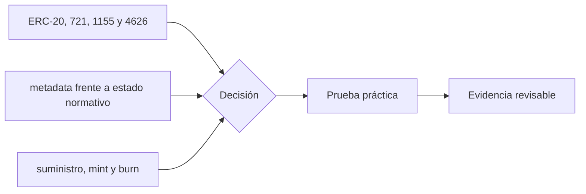

# Clase 17 · Estándares y derechos del token

> **Clase independiente 17 de 66** · **Nivel:** Intermedio-Avanzado · **Fuente base:** EIPs de Ethereum y OpenZeppelin Contracts
>
> [⬅️ Clase anterior](../07-dapps/clase-16-firmas-y-experiencia-transaccional.md) · [📚 Índice de las 66 clases](../README.md) · [🗂️ Mapa del tema](README.md) · [➡️ Clase siguiente](../08-tokens/clase-18-permisos-distribucion-y-necesidad.md)

## Punto de partida

**Pregunta guía:** ¿Qué interfaz garantiza un ERC y qué derechos económicos quedan fuera?

**Caso que abre la clase:** Dos tokens cumplen ERC-20, pero sólo uno representa un derecho exigible.

Dos tokens cumplen el mismo ERC pero representan promesas distintas. El estándar se aprende como compatibilidad técnica, no como garantía económica o jurídica.

## Gráfico pedagógico

Recorre el gráfico en voz alta: identifica supuestos, transformaciones y el punto exacto donde aparece evidencia.

## Trabajo práctico

**Método propio:** comparación de contratos con igual interfaz.

**Actividad:** Comparar interfaces, autoridad administrativa y promesa externa.

Trabaja en entorno local, regtest, signet o testnet según corresponda. Conserva entradas, comandos, salidas y bloque o instante de corte. Una captura aislada no demuestra reproducibilidad.

## Fundamentos que sostienen la respuesta

1. **ERC-20, 721, 1155 y 4626.** En esta clase delimita qué objeto o relación estamos observando antes de sacar conclusiones. Localízalo explícitamente en «Dos tokens cumplen ERC-20, pero sólo uno representa un derecho exigible.» y anota qué dato faltaría para refutar tu lectura.
2. **metadata frente a estado normativo.** En esta clase explica el mecanismo que conecta la situación inicial con el cambio observable. Localízalo explícitamente en «Dos tokens cumplen ERC-20, pero sólo uno representa un derecho exigible.» y anota qué dato faltaría para refutar tu lectura.
3. **suministro, mint y burn.** En esta clase permite contrastar el resultado y formular el límite de la evidencia. Localízalo explícitamente en «Dos tokens cumplen ERC-20, pero sólo uno representa un derecho exigible.» y anota qué dato faltaría para refutar tu lectura.

### Contabilidad de una bóveda ERC-4626: shares vs. assets

Una bóveda ERC-4626 no guarda "saldos en USDC" por usuario: emite *shares* que representan una fracción proporcional del total de activos. El tipo de cambio es `assets / shares` y crece cuando la bóveda gana rendimiento. Ejemplo numérico: una bóveda con 12 500 USDC y 10 000 shares tiene un tipo de cambio de 1.25; si depositas 500 USDC recibes `500 / 1.25 = 400` shares, y si más tarde el total sube a 15 000 USDC, tus 400 shares valen `400 × 1.5 = 600` USDC.

Esa aritmética habilita el **ataque de inflación del primer depósito**: en una bóveda vacía, el atacante deposita 1 unidad mínima y recibe 1 share; luego "dona" 10 000 USDC transfiriéndolos directamente al contrato, sin pasar por `deposit`. Cuando la víctima deposita 19 999 USDC, la fórmula `shares = 19 999 × 1 / 10 000` redondea hacia abajo a 1 share: víctima y atacante quedan con la mitad de una bóveda de casi 30 000 USDC, y el atacante retira ~15 000 USDC habiendo aportado ~10 000. Las mitigaciones estándar son los *virtual shares/assets* (un offset interno que usa OpenZeppelin desde la versión 4.9 y encarece el ataque hasta hacerlo antieconómico) o un depósito inicial del propio protocolo cuyas shares se queman o quedan bloqueadas.

### Decimales y aritmética: por qué USDC usa 6 y casi todo lo demás 18

`decimals` es solo metadato de presentación: el contrato opera siempre con enteros. USDC y USDT usan 6 decimales por herencia de sus sistemas contables originales, mientras que ETH (18) fijó la convención que la mayoría de tokens copia. Mezclarlos sin normalizar produce errores de factor 10¹²: 1 USDC son `1 000 000` unidades base, pero 1 DAI son `1 000 000 000 000 000 000`. Un contrato que compara ambos crudos concluiría que 1 DAI "vale" un billón de veces más que 1 USDC.

Además, la división entera siempre trunca: convertir 1 unidad base de USDC a un token de 18 decimales y de vuelta puede perder el resto del redondeo. La regla profesional es redondear siempre en contra del usuario que retira y a favor del protocolo (como exige ERC-4626 en `previewWithdraw` y `previewRedeem`), porque los restos acumulados a favor del usuario son exactamente la grieta que explota el ataque de inflación descrito arriba.

### Cómo se vacía una cartera con una firma

El titular "firmó algo y perdió todo" suena a descuido. Casi nunca lo es: es una cadena de decisiones razonables que termina mal. Verla completa es lo que enseña a cortarla.

**El montaje.** Un sitio ofrece reclamar un airdrop. Para "verificar que eres titular" pide una firma. No pide dinero, no pide la clave privada, no envía ninguna transacción — por eso parece inofensivo.

**Los tres pasos:**

1. **La víctima firma un `permit` (ERC-2612).** Es una firma off-chain: no cuesta gas, no aparece en el explorador y la wallet la muestra como un texto que casi nadie lee. Lo que autoriza es una allowance por el máximo posible.
2. **El atacante lleva esa firma a la cadena.** Llama a `permit` en el contrato del token con la firma de la víctima. La allowance queda registrada, y **la paga él**: para la víctima no hay ni una transacción sospechosa en su historial.
3. **Llama a `transferFrom`** y se lleva el saldo entero. Legítimo desde el punto de vista del contrato: hay una autorización válida firmada por la titular.

**Dónde se corta la cadena.** Fíjate en que cada eslabón tiene una defensa distinta:

| Eslabón | Defensa | Quién la implementa |
|---|---|---|
| La firma parece inofensiva | EIP-712 muestra **qué** se autoriza en texto legible | La wallet |
| La allowance es infinita | Autorizar solo lo necesario | La dApp, al construir la petición |
| El plazo es eterno | `deadline` corto: minutos, no años | La dApp |
| La autorización sobrevive al uso | Revocar tras operar | La persona usuaria |

**El detalle que lo hace peligroso:** una firma no aparece en el historial de transacciones. Alguien puede revisar su cartera, no ver nada raro, y tener una autorización activa firmada hace semanas esperando el momento. Por eso la revisión periódica de allowances no es paranoia: es la única forma de ver lo que el historial no muestra.

> 💡 **En una frase:** una firma sin gas no es una firma inofensiva. Lo que autoriza puede ejecutarlo otro, cuando quiera, y pagándolo él.

<strong>🎓 Si ya dominas esto</strong> — el detalle que separa un token correcto de uno que rompe integraciones

- **`permit` no está en todos los tokens y su ausencia se detecta tarde.** USDC en Ethereum lo implementa; muchos tokens antiguos no. Un contrato que asume `permit` falla con esos tokens en producción, no en los tests, donde se usa un mock que sí lo tiene.
- **Los tokens con hooks reintroducen la reentrancia en el estándar.** ERC-777 y ERC-1155 llaman al receptor durante la transferencia; si tu contrato actualiza estado después de transferir, ese hook puede reentrar. Es la lección de las clases 19–20 llegando por la puerta de los estándares.
- **ERC-4626 tiene un ataque de inflación conocido.** El primer depositante puede donar activos directamente a la bóveda para inflar el precio por *share* y hacer que los depósitos pequeños siguientes redondeen a cero shares. Las mitigaciones son los *virtual shares* o sembrar un depósito inicial en el despliegue.
- **`decimals` no forma parte del núcleo del ERC-20**, es de la extensión de metadatos. Tratarlo como garantizado es la causa del error de escala más caro que se comete en integraciones.
- **Renunciar a la propiedad no siempre es más seguro.** Un `renounceOwnership` deja el contrato sin nadie que pueda pausar ante un incidente. La decisión correcta depende de si el mayor riesgo es el administrador o el bug — y conviene argumentarla, no imitarla.

## Demostración de aprendizaje

**Entregable:** Ficha de token con estándar, invariantes, poderes y riesgos explícitos.

**Comprobación formativa:** Nombra una propiedad que ERC-20 garantiza y dos que deja fuera.

Para aprobar debes conectar el hecho observado con el concepto correcto, descartar al menos una interpretación alternativa y redactar una conclusión cuyo alcance no exceda la prueba.

## Errores que esta clase corrige

- Tratar **ERC-20, 721, 1155 y 4626** como una etiqueta suficiente, sin identificar actores, dato y frontera.
- Usar **metadata frente a estado normativo** como explicación aunque el caso no aporte la evidencia necesaria.
- Dar por respondido «¿Qué interfaz garantiza un ERC y qué derechos económicos quedan fuera?» sin contrastar **suministro, mint y burn**.

Vuelve al caso inicial, elige el error más peligroso y describe una comprobación concreta que lo detectaría.

## Fuentes para comprobar y ampliar

- Ethereum Foundation, *EIPs — Ethereum Improvement Proposals* — <https://eips.ethereum.org/>
- ERC-20, *Token Standard* — <https://eips.ethereum.org/EIPS/eip-20>
- ERC-721, *Non-Fungible Token Standard* — <https://eips.ethereum.org/EIPS/eip-721>
- ERC-1155, *Multi Token Standard* — <https://eips.ethereum.org/EIPS/eip-1155>
- ERC-4626, *Tokenized Vaults* — <https://eips.ethereum.org/EIPS/eip-4626>
- OpenZeppelin, *Contracts — documentación* — <https://docs.openzeppelin.com/contracts/>
- Antonopoulos & Wood, *Mastering Ethereum*, cap. sobre tokens — <https://github.com/ethereumbook/ethereumbook>
- Fuente primaria: ERC-2612, *`permit` — aprobaciones firmadas (712)* — <https://eips.ethereum.org/EIPS/eip-2612>

Consulta además la [bibliografía razonada](../../docs/bibliografia.md), que declara procedencia y uso.

## Cierre de la clase

Responde otra vez la pregunta guía sin mirar notas. Si tu respuesta no menciona evidencia, supuesto y límite, todavía describe el tema pero no lo domina. Continúa solo cuando otra persona pueda reproducir tu entregable.
