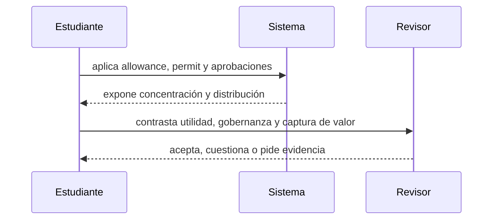

# Clase 18 · Permisos, distribución y necesidad

> **Clase independiente 18 de 66** · **Nivel:** Intermedio-Avanzado · **Fuente base:** EIPs de Ethereum y OpenZeppelin Contracts
>
> [⬅️ Clase anterior](../08-tokens/clase-17-estandares-y-derechos-del-token.md) · [📚 Índice de las 66 clases](../README.md) · [🗂️ Mapa del tema](README.md) · [➡️ Clase siguiente](../09-seguridad/clase-19-modelado-de-amenazas-y-revision-manual.md)

## Punto de partida

**Pregunta guía:** ¿Por qué un token técnicamente correcto puede ser un mal producto?

**Caso que abre la clase:** Un protocolo emite token antes de demostrar que necesita transferibilidad.

Cada propuesta debe sobrevivir alternativas de puntos, base de datos y pagos existentes. La distribución y los poderes administrativos se evalúan antes de celebrar la transferibilidad.

## Fundamentos que sostienen la respuesta

1. **allowance, permit y aprobaciones.** En esta clase delimita qué objeto o relación estamos observando antes de sacar conclusiones. Localízalo explícitamente en «Un protocolo emite token antes de demostrar que necesita transferibilidad.» y anota qué dato faltaría para refutar tu lectura.
2. **concentración y distribución.** En esta clase explica el mecanismo que conecta la situación inicial con el cambio observable. Localízalo explícitamente en «Un protocolo emite token antes de demostrar que necesita transferibilidad.» y anota qué dato faltaría para refutar tu lectura.
3. **utilidad, gobernanza y captura de valor.** En esta clase permite contrastar el resultado y formular el límite de la evidencia. Localízalo explícitamente en «Un protocolo emite token antes de demostrar que necesita transferibilidad.» y anota qué dato faltaría para refutar tu lectura.

### El riesgo real de las approvals: del approve infinito a Permit2

El `approve` por el máximo (`type(uint256).max`) es cómodo, pero convierte cada allowance en una llave permanente: si el contrato aprobado se ve comprometido, o si el usuario firma ante un *drainer* de phishing, todo el saldo queda expuesto sin necesidad de robar la clave privada. Los kits de drenado que operan desde 2022 explotan justamente firmas de `approve`, `permit` y `Permit2` obtenidas con interfaces engañosas, y han causado pérdidas acumuladas de cientos de millones de dólares; la cifra exacta varía por informe, consúltala en vivo.

| Mecanismo | Cómo autoriza | Ventaja | Riesgo característico |
|-----------|---------------|---------|-----------------------|
| `approve` clásico | Transacción on-chain por gastador | Universal, soportado por todo ERC-20 | Allowances infinitas olvidadas durante años |
| `permit` (ERC-2612) | Firma off-chain EIP-712 con `nonce` y `deadline` | Sin transacción previa; caducidad explícita | Solo lo implementan tokens que adoptaron el estándar; una firma robada vale hasta su `deadline` |
| Permit2 (Uniswap) | Un `approve` único a Permit2 + firmas por protocolo con monto y expiración | Lleva `permit` a cualquier ERC-20; permisos granulares y revocables | Permit2 se vuelve punto de concentración: una firma engañosa autoriza a un tercero |

La higiene mínima: aprobar montos acotados, revisar y revocar allowances periódicamente y desconfiar de cualquier firma cuyo contenido la interfaz no muestre con claridad.

### Poderes y necesidad antes de distribuir

Allowance y `permit` resuelven autorización delegada, no justifican que exista un token. Antes de emitir se pregunta qué derecho representa, por qué necesita transferibilidad y qué alternativa más simple fue descartada. Después se enumeran poderes del contrato: mint, burn, pausa, bloqueo, upgrade y rescate. Un ERC correcto puede concentrar todos esos poderes en una clave.

La distribución cambia la seguridad económica. Concentración, calendarios de desbloqueo, liquidez y delegación pueden convertir una gobernanza formalmente abierta en control efectivo de pocos actores. La evidencia de utilidad no es volumen de mercado; es una función que el sistema no podría cumplir con una cuenta interna o un derecho contractual convencional.

## Gráfico pedagógico

Recorre el gráfico en voz alta: identifica supuestos, transformaciones y el punto exacto donde aparece evidencia.

## Demostración de aprendizaje

**Entregable:** Recomendación defendible con métricas, alternativas off-chain y controles.

**Comprobación formativa:** ¿Qué evidencia demostraría que el token resuelve algo que una cuenta interna no resuelve?

Para aprobar debes conectar el hecho observado con el concepto correcto, descartar al menos una interpretación alternativa y redactar una conclusión cuyo alcance no exceda la prueba.

## Trabajo práctico

**Método propio:** comité de diseño token/no-token.

**Actividad:** Auditar allowances y construir una matriz token/no-token.

Trabaja en entorno local, regtest, signet o testnet según corresponda. Conserva entradas, comandos, salidas y bloque o instante de corte. Una captura aislada no demuestra reproducibilidad.

## Errores que esta clase corrige

- Tratar **allowance, permit y aprobaciones** como una etiqueta suficiente, sin identificar actores, dato y frontera.
- Usar **concentración y distribución** como explicación aunque el caso no aporte la evidencia necesaria.
- Dar por respondido «¿Por qué un token técnicamente correcto puede ser un mal producto?» sin contrastar **utilidad, gobernanza y captura de valor**.

Vuelve al caso inicial, elige el error más peligroso y describe una comprobación concreta que lo detectaría.

## Fuentes para comprobar y ampliar

- Ethereum Foundation, *EIPs — Ethereum Improvement Proposals* — <https://eips.ethereum.org/>
- ERC-20, *Token Standard* — <https://eips.ethereum.org/EIPS/eip-20>
- ERC-721, *Non-Fungible Token Standard* — <https://eips.ethereum.org/EIPS/eip-721>
- ERC-1155, *Multi Token Standard* — <https://eips.ethereum.org/EIPS/eip-1155>
- ERC-4626, *Tokenized Vaults* — <https://eips.ethereum.org/EIPS/eip-4626>
- OpenZeppelin, *Contracts — documentación* — <https://docs.openzeppelin.com/contracts/>
- Antonopoulos & Wood, *Mastering Ethereum*, cap. sobre tokens — <https://github.com/ethereumbook/ethereumbook>
- Fuente primaria: ERC-2612, *`permit` — aprobaciones firmadas (712)* — <https://eips.ethereum.org/EIPS/eip-2612>

Consulta además la [bibliografía razonada](../../docs/bibliografia.md), que declara procedencia y uso.

## Cierre de la clase

Responde otra vez la pregunta guía sin mirar notas. Si tu respuesta no menciona evidencia, supuesto y límite, todavía describe el tema pero no lo domina. Continúa solo cuando otra persona pueda reproducir tu entregable.
