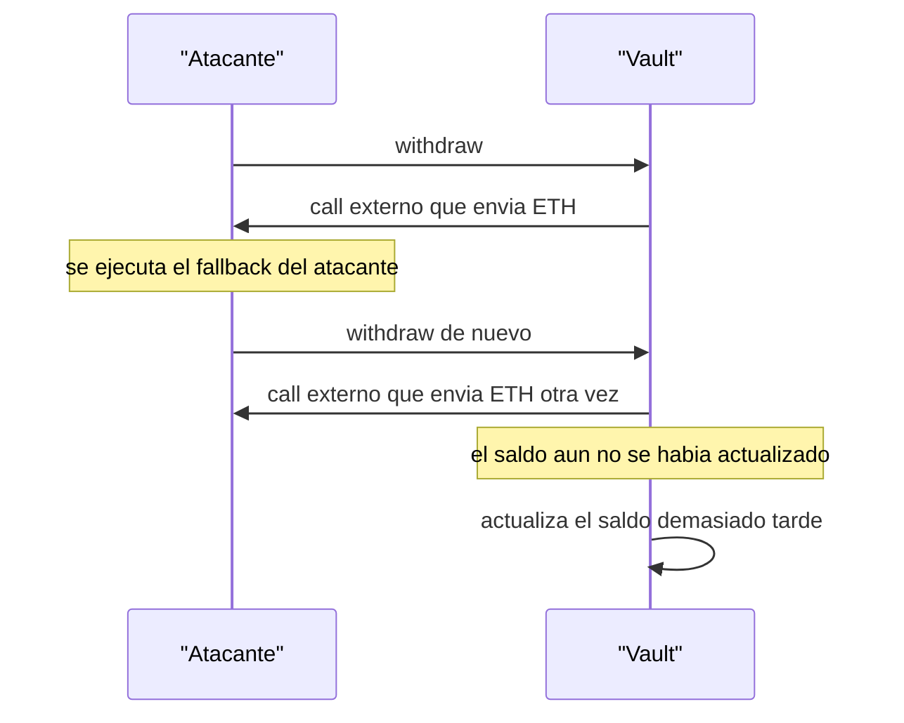
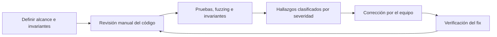

# 09 · Seguridad y auditoría

> **Nivel:** Avanzado · ⏱️ **Duración estimada:** 180 min · **Fuente:** Trail of Bits *Building Secure Contracts* y ConsenSys *Smart Contract Best Practices*
> [⬅️ Currículo](../README.md) · [📚 Bibliografía](../../docs/bibliografia.md)
> 🧭 ⬅️ **Anterior:** [08 · Tokens y estándares](../08-tokens/README.md) · [📚 Índice](../README.md) · ➡️ **Siguiente:** [10 · Oráculos, almacenamiento e indexación](../10-oraculos-indexacion/README.md)

---

## 🎯 Objetivos

- Reconocer las clases de vulnerabilidad más frecuentes en contratos y sus señales típicas en el código.
- Aplicar un proceso de auditoría reproducible de siete pasos, desde el alcance hasta la verificación de la corrección.
- Combinar revisión manual con pruebas unitarias, fuzzing, pruebas de invariantes y análisis estático.
- Reproducir un hallazgo con una prueba mínima y clasificarlo por impacto y probabilidad.
- Practicar la seguridad respetando límites éticos y legales, sin atacar sistemas ajenos.

## 📚 Resultados de aprendizaje

Al finalizar, el estudiante podrá:

1. **Identificar** reentrancia, fallos de control de acceso, lógica económica y manipulación de oráculo en código real.
2. **Ejecutar** un ciclo de auditoría con alcance, actores, activos e invariantes documentados.
3. **Construir** pruebas de fuzzing e invariantes que expongan una vulnerabilidad concreta.
4. **Reproducir** un exploit con una prueba mínima y explicar la corrección que lo neutraliza.
5. **Clasificar** hallazgos por impacto y probabilidad para priorizar su remediación.
6. **Aplicar** herramientas de análisis estático como Slither dentro del flujo de revisión.

## 🗺️ Temas

| # | Tema | Por qué importa |
|---|------|-----------------|
| 1 | Reentrancia | Permite reentrar antes de actualizar estado y drenar fondos; patrón clásico y aún vigente. |
| 2 | Control de acceso | Un `onlyOwner` faltante o mal aplicado entrega el contrato a cualquiera. |
| 3 | Lógica económica | Errores de precisión, redondeo y flujos de valor generan pérdidas silenciosas. |
| 4 | Front-running y MEV | El orden de las transacciones es manipulable y afecta a subastas y liquidaciones. |
| 5 | Manipulación de oráculo | Un precio spot barato de mover habilita ataques, a veces vía flash loan. |
| 6 | `delegatecall` y upgrades | Ejecutar código externo sobre el propio almacenamiento puede corromper el estado. |
| 7 | DoS y agotamiento de gas | Bucles no acotados o dependencias externas pueden bloquear funciones críticas. |
| 8 | Firmas y replay | Firmas sin `nonce` o sin `chainId` se reutilizan en otra cadena o transacción. |

## 🧠 Modelo mental

Auditar un contrato se parece a inspeccionar un edificio antes de abrirlo al público: no basta con que las luces enciendan. Recorres cada puerta preguntando quién puede abrirla, qué pasa si alguien fuerza el orden de entrada y salida, y qué ocurre si un proveedor externo, como el ascensor, deja de responder. El código "funciona" en la ruta feliz; el auditor busca las rutas que nadie quiso recorrer.

El límite de la analogía: un edificio es estático y su inspector confía en normas maduras, mientras que un contrato opera en un entorno adversarial y componible donde otros contratos pueden llamarlo en cualquier orden y un atacante puede pedir prestado capital enorme por unos segundos. Por eso la seguridad no termina en una lista de comprobación: exige razonar sobre invariantes que deben cumplirse pase lo que pase.

## 🧩 Esquema visual

La reentrancia clásica explota que el contrato envía valor antes de actualizar su estado: el fallback del atacante reingresa mientras el saldo sigue intacto.



Una auditoría profesional es un ciclo con verificación final, no una lectura única del código.



## 📖 Conceptos y definiciones

- **Invariante**: propiedad que siempre debe ser cierta (por ejemplo, la suma de saldos igual al suministro); es la base de las pruebas de invariantes.
- **Reentrancia**: reingreso a una función antes de que actualice su estado; se mitiga con el patrón checks-effects-interactions y guardas.
- **Front-running / MEV**: extracción de valor reordenando, insertando o censurando transacciones en el mempool.
- **Manipulación de oráculo**: distorsión temporal de un precio de referencia para engañar la lógica del contrato.
- **`delegatecall`**: llamada que ejecuta código ajeno usando el almacenamiento del llamante; base de los proxies actualizables y de riesgos graves.
- **Fuzzing**: generación de entradas aleatorias para violar una propiedad; Echidna y el fuzzer de Foundry son herramientas habituales.
- **Análisis estático**: inspección del código sin ejecutarlo para detectar patrones peligrosos; Slither y Mythril son ejemplos.
- **Impacto y probabilidad**: dimensiones para clasificar un hallazgo y priorizar su corrección.

## 🔬 Profundización

### Severidad: la matriz impacto × probabilidad

Las firmas de auditoría no reportan "bugs" sueltos: clasifican cada hallazgo cruzando cuánto daño causaría (fondos perdidos, protocolo congelado, dato incorrecto) con qué tan plausible es que ocurra (¿lo dispara cualquiera, o exige condiciones improbables y capital enorme?). Una matriz típica:

| Impacto \ Probabilidad | Alta | Media | Baja |
|------------------------|------|-------|------|
| **Alto** (pérdida de fondos) | Crítica | Alta | Media |
| **Medio** (funcionalidad degradada) | Alta | Media | Baja |
| **Bajo** (molestia o gas extra) | Media | Baja | Informativa |

Trail of Bits, OpenZeppelin y las plataformas de concursos como Code4rena o Sherlock usan variantes de este esquema; lo importante no es la etiqueta exacta sino que la clasificación sea argumentada y reproducible. Un hallazgo "crítico pero teórico" mal justificado destruye la credibilidad de un informe tanto como uno real que se pasó por alto.

### Mini-casos históricos: la misma lección, distinta década

| Caso | Año | Pérdida histórica | Causa raíz | Lección |
|------|-----|-------------------|------------|---------|
| The DAO | 2016 | ~3.6 M ETH | Reentrancia: enviaba ETH antes de actualizar el saldo | Checks-effects-interactions no es opcional; el incidente motivó el fork que separó Ethereum de Ethereum Classic |
| Ronin Bridge | 2022 | ~624 M USD | Claves de 5 de 9 validadores comprometidas vía ingeniería social | La criptografía perfecta no protege un quorum de confianza demasiado pequeño y mal custodiado |
| Wormhole | 2022 | ~326 M USD | Verificación de firma defectuosa: aceptaba una función de validación obsoleta | Todo lo que "verifica" debe probarse con entradas hostiles, no solo con las válidas |
| Euler Finance | 2023 | ~197 M USD | Una función de donación rompía el invariante de solvencia usado por la liquidación | Cada función nueva debe evaluarse contra los invariantes de todo el sistema; los fondos fueron devueltos tras negociación |

Nótese el patrón: solo uno de los cuatro es "un bug de Solidity" clásico. Los otros tres son fallos de diseño, de custodia de claves o de interacción entre módulos correctos por separado.

### Qué detecta cada técnica (y qué no)

Ninguna herramienta cubre todo el espectro; una auditoría seria las apila porque sus puntos ciegos son complementarios:

| Clase de bug | Análisis estático (Slither) | Fuzzing (Foundry/Echidna) | Invariantes | Revisión manual |
|--------------|------------------------------|---------------------------|-------------|-----------------|
| Reentrancia por patrón de código | ✅ detecta el patrón | ⚠️ solo si la prueba lo ejercita | ✅ si el invariante de saldos está definido | ✅ |
| Control de acceso faltante | ✅ parcial | ✅ con llamadas desde cuentas aleatorias | ✅ | ✅ |
| Redondeo y precisión | ❌ | ✅ excelente con entradas extremas | ✅ | ⚠️ fácil de pasar por alto |
| Lógica económica multi-contrato | ❌ | ⚠️ requiere entorno completo | ✅ la técnica más fuerte | ✅ |
| Error de diseño del protocolo | ❌ | ❌ | ❌ | ✅ única técnica que lo ve |

La consecuencia práctica: un `slither .` limpio y un fuzzing en verde acotan clases enteras de errores, pero el caso Euler demuestra que el fallo puede vivir en la interacción entre funciones individualmente correctas, territorio exclusivo de los invariantes bien elegidos y de la revisión humana.

## 🧪 Laboratorio guiado

1. Abre los retos del repositorio en `security-challenges` y compila los contratos para partir de una base limpia.

```bash
forge build
```

2. Ejecuta las pruebas con trazas para observar el flujo de un exploit reproducido paso a paso.

```bash
forge test -vv
```

3. Pasa el análisis estático sobre los contratos y contrasta cada alerta de `slither` con una revisión manual del flujo señalado.

4. Consulta el catálogo de [laboratorios](../../labs/CATALOG.md) para elegir el reto adecuado a la vulnerabilidad que estudias.

## 📝 Reto verificable

Toma un contrato vulnerable de `security-challenges`, escribe una prueba mínima que reproduzca el exploit, corrige la causa raíz y documenta el hallazgo con su clasificación de impacto y probabilidad.

**Criterio de aceptación:** existe una prueba que falla contra el contrato vulnerable y pasa contra el corregido; el informe describe alcance, activos, invariante violado y la corrección; y `forge test -vv` queda en verde tras el arreglo sin desactivar la prueba del exploit.

## ⚠️ Errores frecuentes

| Síntoma | Causa y cómo comprobarlo |
|---------|--------------------------|
| Fondos drenados en una sola transacción | Reentrancia; busca llamadas externas antes de actualizar estado y añade una prueba de reingreso. |
| Cualquiera ejecuta una función privilegiada | Falta o mal uso de modificadores de acceso; prueba llamando desde una cuenta sin rol. |
| El precio usado es absurdo por un instante | Oráculo spot manipulable; valida antigüedad, rango y considera TWAP. |
| Un proxy queda inutilizable tras actualizar | Colisión de almacenamiento en `delegatecall`; compara los layouts antes y después. |
| Una firma vale en otra cadena | Falta de `chainId`/`nonce`; revisa el dominio EIP-712 y añade protección de replay. |
| El análisis estático "no encuentra nada" | Falsa sensación de seguridad; ninguna herramienta sustituye la revisión manual de invariantes. |

## 🛡️ Seguridad y ética

- Nunca pruebes exploits contra sistemas en producción ni contra contratos de terceros sin autorización explícita.
- Trabaja solo en local o testnet, con contratos propios o de laboratorio, y sin fondos ni claves reales.
- Practica la divulgación responsable: si descubres una vulnerabilidad real, repórtala de forma privada al equipo afectado.
- Documenta cada hallazgo de forma reproducible para que la corrección pueda verificarse de manera independiente.
- Recuerda que las herramientas automáticas complementan, pero no reemplazan, el razonamiento sobre invariantes y privilegios.

## 🔗 Referencias

- Trail of Bits, *Building Secure Contracts* — <https://secure-contracts.com/>
- ConsenSys, *Smart Contract Best Practices* — <https://consensysdiligence.github.io/smart-contract-best-practices/>
- SWC Registry, *Smart Contract Weakness Classification* — <https://swcregistry.io/>
- *Damn Vulnerable DeFi* — <https://www.damnvulnerabledefi.xyz/>
- Fuente primaria: EIP-155, *Simple replay attack protection* — <https://eips.ethereum.org/EIPS/eip-155>

## ✅ Criterio de dominio

- Reproduces y corriges al menos una vulnerabilidad con una prueba que documenta el antes y el después.
- Redactas un informe con alcance, invariantes y clasificación de impacto y probabilidad.
- Justificas por qué la revisión manual sigue siendo imprescindible pese al análisis estático y el fuzzing.

---

## 🧭 Navegación

⬅️ [Módulo 08 · Tokens y estándares](../08-tokens/README.md) · [📚 Índice del currículo](../README.md) · ➡️ [Módulo 10 · Oráculos, almacenamiento e indexación](../10-oraculos-indexacion/README.md)
