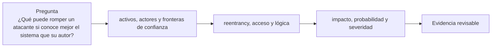

# Clase 19 · Modelado de amenazas y revisión manual

> **Clase independiente 19 de 66** · **Nivel:** Avanzado · **Fuente base:** Trail of Bits *Building Secure Contracts* y ConsenSys *Smart Contract Best Practices*
>
> [⬅️ Clase anterior](../08-tokens/clase-18-permisos-distribucion-y-necesidad.md) · [📚 Índice de las 66 clases](../README.md) · [🗂️ Mapa del tema](README.md) · [➡️ Clase siguiente](../09-seguridad/clase-20-auditoria-reproducible-y-remediacion.md)

## Punto de partida

**Pregunta guía:** ¿Qué puede romper un atacante si conoce mejor el sistema que su autor?

**Caso que abre la clase:** Una función correcta aislada falla al combinarse con un token malicioso.

La clase comienza por activos y actores, no por una lista de bugs. Después sigue entradas maliciosas a través de llamadas y dependencias hasta formular un hallazgo causal.

## Fundamentos que sostienen la respuesta

1. **activos, actores y fronteras de confianza.** En esta clase delimita qué objeto o relación estamos observando antes de sacar conclusiones. Localízalo explícitamente en «Una función correcta aislada falla al combinarse con un token malicioso.» y anota qué dato faltaría para refutar tu lectura.
2. **reentrancy, acceso y lógica.** En esta clase explica el mecanismo que conecta la situación inicial con el cambio observable. Localízalo explícitamente en «Una función correcta aislada falla al combinarse con un token malicioso.» y anota qué dato faltaría para refutar tu lectura.
3. **impacto, probabilidad y severidad.** En esta clase permite contrastar el resultado y formular el límite de la evidencia. Localízalo explícitamente en «Una función correcta aislada falla al combinarse con un token malicioso.» y anota qué dato faltaría para refutar tu lectura.

### Severidad: la matriz impacto × probabilidad

Las firmas de auditoría no reportan "bugs" sueltos: clasifican cada hallazgo cruzando cuánto daño causaría (fondos perdidos, protocolo congelado, dato incorrecto) con qué tan plausible es que ocurra (¿lo dispara cualquiera, o exige condiciones improbables y capital enorme?). Una matriz típica:

| Impacto \ Probabilidad | Alta | Media | Baja |
|------------------------|------|-------|------|
| **Alto** (pérdida de fondos) | Crítica | Alta | Media |
| **Medio** (funcionalidad degradada) | Alta | Media | Baja |
| **Bajo** (molestia o gas extra) | Media | Baja | Informativa |

Trail of Bits, OpenZeppelin y las plataformas de concursos como Code4rena o Sherlock usan variantes de este esquema; lo importante no es la etiqueta exacta sino que la clasificación sea argumentada y reproducible. Un hallazgo "crítico pero teórico" mal justificado destruye la credibilidad de un informe tanto como uno real que se pasó por alto.

### Mini-casos históricos: la misma lección, distinta década

| Caso | Año | Pérdida histórica | Causa raíz | Lección |
|------|-----|-------------------|------------|---------|
| The DAO | 2016 | ~3.6 M ETH | Reentrancia: enviaba ETH antes de actualizar el saldo | Checks-effects-interactions no es opcional; el incidente motivó el fork que separó Ethereum de Ethereum Classic |
| Ronin Bridge | 2022 | ~624 M USD | Claves de 5 de 9 validadores comprometidas vía ingeniería social | La criptografía perfecta no protege un quorum de confianza demasiado pequeño y mal custodiado |
| Wormhole | 2022 | ~326 M USD | Verificación de firma defectuosa: aceptaba una función de validación obsoleta | Todo lo que "verifica" debe probarse con entradas hostiles, no solo con las válidas |
| Euler Finance | 2023 | ~197 M USD | Una función de donación rompía el invariante de solvencia usado por la liquidación | Cada función nueva debe evaluarse contra los invariantes de todo el sistema; los fondos fueron devueltos tras negociación |

Nótese el patrón: solo uno de los cuatro es "un bug de Solidity" clásico. Los otros tres son fallos de diseño, de custodia de claves o de interacción entre componentes correctos por separado.

### Anatomía de un ataque de préstamo relámpago

Los retos de esta unidad de clases se entienden mejor viendo cómo se combinan. Un *flash loan* no es una vulnerabilidad: es una herramienta que **elimina el capital como barrera de entrada**. Quien no tiene un millón puede operar como si lo tuviera, siempre que lo devuelva en la misma transacción.

Eso convierte ataques que eran teóricos en ataques que cualquiera puede ejecutar.

**El ataque completo, en una sola transacción atómica:**

```text
1. Pedir prestados 10 000 000 USDC          ← sin colateral: se devuelve al final o revierte todo
2. Comprar TOKEN en un pool pequeño         ← el precio spot de ese pool se dispara
3. Depositar TOKEN como garantía en el      ← el protocolo lee el precio del pool manipulado
   protocolo víctima, que lo valora caro       y concede un préstamo desproporcionado
4. Retirar el préstamo en USDC
5. Deshacer la compra: el precio vuelve
6. Devolver los 10 000 000 + comisión
7. Quedarse la diferencia
```

**Lo que hay que ver:** el atacante no rompió ninguna criptografía ni encontró un desbordamiento. **Usó cada contrato exactamente como estaba escrito.** El fallo está en un supuesto: que el precio de un pool refleja el valor de mercado. Es cierto en condiciones normales y falso durante un bloque con liquidez prestada.

**Por qué la atomicidad lo hace posible:** si algo sale mal en cualquier paso, toda la transacción revierte y el préstamo nunca existió. El atacante no arriesga capital, solo gas. Un intento fallido cuesta unos céntimos.

**Las tres defensas, por orden de eficacia:**

| Defensa | Qué logra | Límite |
|---|---|---|
| **TWAP** en lugar de spot | Manipular la media exige sostener el precio muchos bloques, lo que multiplica el coste | Reacciona con retraso: en un movimiento real de mercado, va por detrás |
| **Agregar varias fuentes** | Un solo pool manipulado no mueve la mediana | Añade dependencia de más proveedores, cada uno con su riesgo |
| **Circuit breaker** | Detiene la operación si el precio se sale de rango | Alguien tiene que definir "rango razonable", y ese alguien es un punto de confianza |

> 💡 **En una frase:** los ataques caros de verdad no rompen el código, rompen un supuesto. Escribe los supuestos de tu contrato antes de escribir el contrato.

<details>
<summary><strong>🎓 Si ya dominas esto</strong> — método de auditoría, más allá del catálogo de bugs</summary>

- **Empieza por las invariantes, no por el código.** "La suma de saldos iguala el suministro", "nadie retira más de lo que depositó". Un catálogo de vulnerabilidades encuentra lo conocido; una invariante bien escrita encuentra lo que nadie ha catalogado todavía.
- **La reentrancia entre funciones distintas evade el guard ingenuo.** `nonReentrant` en `retirar()` no protege si el reingreso ocurre por `transferir()`. Hay que razonar sobre el estado compartido, no sobre la función.
- **La reentrancia de solo lectura fue la sorpresa de 2022.** Una función `view` consultada a mitad de una transferencia devuelve un estado inconsistente; un tercero que confía en ese `view` toma decisiones sobre datos que no representan ningún estado real. No hay escritura, y aun así hay agujero.
- **`tx.origin` no es control de acceso.** Distingue quién inició la cadena de llamadas de quién llama directamente; usarlo para autorizar permite que un contrato intermedio actúe en nombre de la víctima. Se usa `msg.sender`, siempre.
- **La severidad no es una etiqueta, es impacto × probabilidad.** Un fallo que drena todo con una condición irrepetible puede ser menos urgente que uno que filtra poco de forma continua. Un informe que no argumenta ambos ejes no ayuda a priorizar.
- **Ninguna herramienta sustituye la revisión manual.** Slither y Echidna encuentran patrones y violaciones de propiedades que tú definiste. Que la lógica de negocio permita retirar el doble no es un patrón: es una propiedad que solo detecta quien entendió el negocio.

</details>

## Gráfico pedagógico

Recorre el gráfico en voz alta: identifica supuestos, transformaciones y el punto exacto donde aparece evidencia.



## Trabajo práctico

**Método propio:** revisión ofensiva por fronteras de confianza.

**Actividad:** Trazar superficie de ataque y revisar una función línea por línea.

Trabaja en entorno local, regtest, signet o testnet según corresponda. Conserva entradas, comandos, salidas y bloque o instante de corte. Una captura aislada no demuestra reproducibilidad.

## Demostración de aprendizaje

**Entregable:** Hallazgo con condición, impacto, prueba mínima y recomendación.

**Comprobación formativa:** Describe condición, impacto y actor necesario para explotar el caso revisado.

Para aprobar debes conectar el hecho observado con el concepto correcto, descartar al menos una interpretación alternativa y redactar una conclusión cuyo alcance no exceda la prueba.

## Errores que esta clase corrige

- Tratar **activos, actores y fronteras de confianza** como una etiqueta suficiente, sin identificar actores, dato y frontera.
- Usar **reentrancy, acceso y lógica** como explicación aunque el caso no aporte la evidencia necesaria.
- Dar por respondido «¿Qué puede romper un atacante si conoce mejor el sistema que su autor?» sin contrastar **impacto, probabilidad y severidad**.

Vuelve al caso inicial, elige el error más peligroso y describe una comprobación concreta que lo detectaría.

## Límite ético y legal de esta clase

El modelado de amenazas autoriza a imaginar rutas de abuso, no a ejecutarlas contra sistemas ajenos. Convierte cada escenario en un test local, una revisión o una simulación con alcance aprobado.

Aplica la guía transversal [¿Y si cruzas la línea?](../../docs/y-si-cruzas-la-linea-blockchain.md) antes de proponer una intervención.

## Fuentes para comprobar y ampliar

- Trail of Bits, *Building Secure Contracts* — <https://secure-contracts.com/>
- ConsenSys, *Smart Contract Best Practices* — <https://consensysdiligence.github.io/smart-contract-best-practices/>
- SWC Registry, *Smart Contract Weakness Classification* — <https://swcregistry.io/>
- *Damn Vulnerable DeFi* — <https://www.damnvulnerabledefi.xyz/>
- Fuente primaria: EIP-155, *Simple replay attack protection* — <https://eips.ethereum.org/EIPS/eip-155>

Consulta además la [bibliografía razonada](../../docs/bibliografia.md), que declara procedencia y uso.

## Cierre de la clase

Responde otra vez la pregunta guía sin mirar notas. Si tu respuesta no menciona evidencia, supuesto y límite, todavía describe el tema pero no lo domina. Continúa solo cuando otra persona pueda reproducir tu entregable.
