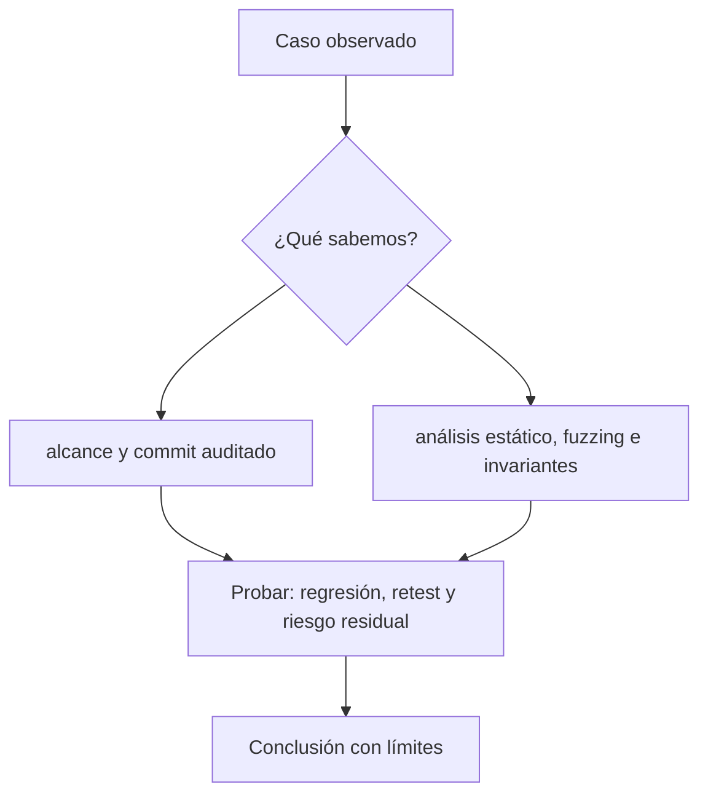

# Clase 20 · Auditoría reproducible y remediación

> **Clase independiente 20 de 66** · **Nivel:** Avanzado · **Fuente base:** Trail of Bits *Building Secure Contracts* y ConsenSys *Smart Contract Best Practices*
>
> [⬅️ Clase anterior](../09-seguridad/clase-19-modelado-de-amenazas-y-revision-manual.md) · [📚 Índice de las 66 clases](../README.md) · [🗂️ Mapa del tema](README.md) · [➡️ Clase siguiente](../10-oraculos-indexacion/clase-21-oraculos-y-calidad-del-dato.md)

## Punto de partida

**Pregunta guía:** ¿Cómo se demuestra que un hallazgo fue corregido sin introducir otro?

**Caso que abre la clase:** Un parche bloquea el exploit conocido pero deja otra ruta equivalente.

Un exploit local obliga a reproducir antes de opinar. El parche se somete a regresión y a una ruta alternativa para separar corrección aparente de remediación completa.

## Gráfico pedagógico

Recorre el gráfico en voz alta: identifica supuestos, transformaciones y el punto exacto donde aparece evidencia.

## Fundamentos que sostienen la respuesta

1. **alcance y commit auditado.** En esta clase delimita qué objeto o relación estamos observando antes de sacar conclusiones. Localízalo explícitamente en «Un parche bloquea el exploit conocido pero deja otra ruta equivalente.» y anota qué dato faltaría para refutar tu lectura.
2. **análisis estático, fuzzing e invariantes.** En esta clase explica el mecanismo que conecta la situación inicial con el cambio observable. Localízalo explícitamente en «Un parche bloquea el exploit conocido pero deja otra ruta equivalente.» y anota qué dato faltaría para refutar tu lectura.
3. **regresión, retest y riesgo residual.** En esta clase permite contrastar el resultado y formular el límite de la evidencia. Localízalo explícitamente en «Un parche bloquea el exploit conocido pero deja otra ruta equivalente.» y anota qué dato faltaría para refutar tu lectura.

### Qué detecta cada técnica (y qué no)

Ninguna herramienta cubre todo el espectro; una auditoría seria las apila porque sus puntos ciegos son complementarios:

| Clase de bug | Análisis estático (Slither) | Fuzzing (Foundry/Echidna) | Invariantes | Revisión manual |
|--------------|------------------------------|---------------------------|-------------|-----------------|
| Reentrancia por patrón de código | ✅ detecta el patrón | ⚠️ solo si la prueba lo ejercita | ✅ si el invariante de saldos está definido | ✅ |
| Control de acceso faltante | ✅ parcial | ✅ con llamadas desde cuentas aleatorias | ✅ | ✅ |
| Redondeo y precisión | ❌ | ✅ excelente con entradas extremas | ✅ | ⚠️ fácil de pasar por alto |
| Lógica económica multi-contrato | ❌ | ⚠️ requiere entorno completo | ✅ la técnica más fuerte | ✅ |
| Error de diseño del protocolo | ❌ | ❌ | ❌ | ✅ única técnica que lo ve |

La consecuencia práctica: un `slither .` limpio y un fuzzing en verde acotan clases enteras de errores, pero el caso Euler demuestra que el fallo puede vivir en la interacción entre funciones individualmente correctas, territorio exclusivo de los invariantes bien elegidos y de la revisión humana.

### Alcance, reproducción y cierre de hallazgos

Una auditoría empieza por fijar repositorio, commit, contratos, dependencias, compilador y supuestos excluidos. Sin ese corte, un informe correcto puede aplicarse a código distinto. Cada hallazgo contiene condición, recorrido explotable, impacto, severidad y prueba mínima. Herramientas estáticas amplían cobertura, pero no sustituyen revisar lógica económica, privilegios y composición.

Remediar exige algo más que cambiar la línea señalada: se reproduce el exploit, se aplica el parche, se ejecuta una regresión y se busca una ruta equivalente. El cierre registra qué versión fue reexaminada y qué riesgo residual permanece. Un test verde demuestra una propiedad codificada; no demuestra que el equipo haya formulado todas las propiedades importantes.

## Trabajo práctico

**Método propio:** laboratorio exploit-parche-retest.

**Actividad:** Explotar en local, corregir y ejecutar una prueba de regresión.

Trabaja en entorno local, regtest, signet o testnet según corresponda. Conserva entradas, comandos, salidas y bloque o instante de corte. Una captura aislada no demuestra reproducibilidad.

## Errores que esta clase corrige

- Tratar **alcance y commit auditado** como una etiqueta suficiente, sin identificar actores, dato y frontera.
- Usar **análisis estático, fuzzing e invariantes** como explicación aunque el caso no aporte la evidencia necesaria.
- Dar por respondido «¿Cómo se demuestra que un hallazgo fue corregido sin introducir otro?» sin contrastar **regresión, retest y riesgo residual**.

Vuelve al caso inicial, elige el error más peligroso y describe una comprobación concreta que lo detectaría.

## Demostración de aprendizaje

**Entregable:** Informe versionado con evidencia, corrección y resultado del retest.

**Comprobación formativa:** ¿Qué evidencia permite cerrar un hallazgo y qué riesgo puede permanecer?

Para aprobar debes conectar el hecho observado con el concepto correcto, descartar al menos una interpretación alternativa y redactar una conclusión cuyo alcance no exceda la prueba.

## Límite ético y legal de esta clase

El alcance de auditoría define repositorio, commit, entorno, técnicas permitidas y canal de escalamiento. Encontrar una debilidad no amplía por sí solo esa autorización.

Aplica la guía transversal [¿Y si cruzas la línea?](../../docs/y-si-cruzas-la-linea-blockchain.md) antes de proponer una intervención.

## Fuentes para comprobar y ampliar

- Trail of Bits, *Building Secure Contracts* — <https://secure-contracts.com/>
- ConsenSys, *Smart Contract Best Practices* — <https://consensysdiligence.github.io/smart-contract-best-practices/>
- SWC Registry, *Smart Contract Weakness Classification* — <https://swcregistry.io/>
- *Damn Vulnerable DeFi* — <https://www.damnvulnerabledefi.xyz/>
- Fuente primaria: EIP-155, *Simple replay attack protection* — <https://eips.ethereum.org/EIPS/eip-155>

Consulta además la [bibliografía razonada](../../docs/bibliografia.md), que declara procedencia y uso.

## Cierre de la clase

Responde otra vez la pregunta guía sin mirar notas. Si tu respuesta no menciona evidencia, supuesto y límite, todavía describe el tema pero no lo domina. Continúa solo cuando otra persona pueda reproducir tu entregable.
