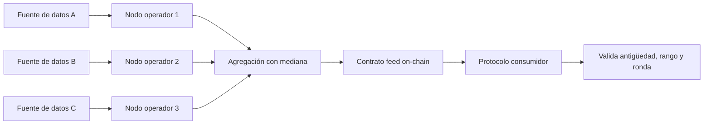
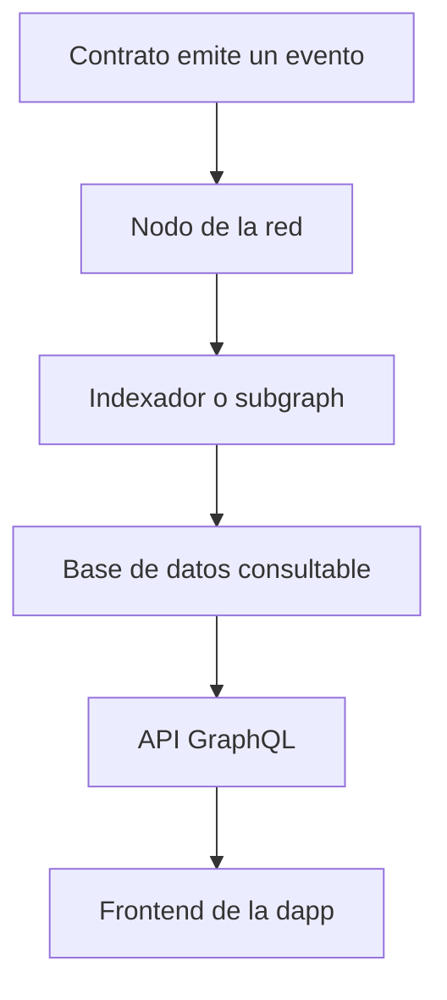

# 10 · Oráculos, almacenamiento e indexación

> **Nivel:** Avanzado · ⏱️ **Duración estimada:** 150 min · **Fuente:** documentación de Chainlink y de The Graph
> [⬅️ Currículo](../README.md) · [📚 Bibliografía](../../docs/bibliografia.md)
> 🧭 ⬅️ **Anterior:** [09 · Seguridad y auditoría](../09-seguridad/README.md) · [📚 Índice](../README.md) · ➡️ **Siguiente:** [11 · DAO y gobernanza](../11-dao-gobernanza/README.md)

---

## 🎯 Objetivos

- Explicar el "problema del oráculo" y por qué introducir datos externos añade un modelo de confianza.
- Diseñar un consumo de oráculo robusto que valide antigüedad, rango, decimales y ronda completa, con fallback y circuit breaker.
- Distinguir precio spot, TWAP y agregación de múltiples fuentes según su resistencia a manipulación.
- Usar eventos e indexadores para consultar historial sin confundirlos con estado verificable en cadena.
- Comprender el direccionamiento por contenido de IPFS (CID) y las estrategias de persistencia y disponibilidad.

## 📚 Resultados de aprendizaje

Al finalizar, el estudiante podrá:

1. **Explicar** por qué la blockchain no conoce datos del mundo real y qué garantiza un oráculo.
2. **Implementar** validaciones de antigüedad, rango y ronda al leer un feed de precios.
3. **Comparar** precio spot, TWAP y agregación frente a un ataque de manipulación por flash loan.
4. **Diseñar** un subgraph o indexador que exponga eventos históricos de un contrato.
5. **Justificar** cuándo un dato debe vivir como estado en cadena y cuándo basta con un evento indexado.
6. **Evaluar** una estrategia de pinning para asegurar la disponibilidad de contenido en IPFS.

## 🗺️ Temas

| # | Tema | Por qué importa |
|---|------|-----------------|
| 1 | El problema del oráculo | Todo dato externo importa su propio modelo de confianza a la cadena. |
| 2 | Validación de feeds | Antigüedad, rango, decimales y ronda completa evitan usar precios inválidos. |
| 3 | Spot vs. TWAP | El precio instantáneo es fácil de mover; el promedio temporal encarece el ataque. |
| 4 | Agregación de fuentes | Combinar proveedores reduce el impacto de una fuente comprometida. |
| 5 | Eventos e indexación | Permiten reconstruir historial off-chain con The Graph y subgraphs. |
| 6 | Estado vs. evento | Un evento no es verificable por otro contrato; el estado sí. |
| 7 | IPFS y CID | El direccionamiento por contenido garantiza integridad, no disponibilidad. |
| 8 | Aleatoriedad (VRF) | El azar verificable evita que un validador manipule sorteos y loterías. |

## 🧠 Modelo mental

Un contrato inteligente es como una persona encerrada en una habitación sin ventanas: puede razonar con impecable lógica, pero solo conoce lo que alguien desliza por debajo de la puerta. El oráculo es ese mensajero. Por muy correcta que sea la lógica interna, si el papel que entra dice un precio falso, la decisión será igual de falsa. Por eso la pregunta clave nunca es "¿el contrato calcula bien?", sino "¿puedo confiar en quién y cómo entró el dato?".

El límite de la analogía: un solo mensajero es un punto único de fallo, así que en la práctica se usan varios mensajeros y se descartan los que llegan tarde o con cifras fuera de rango. Además, distinguir estado de evento es clave: los eventos son como las notas que el mensajero deja apiladas fuera de la habitación (útiles para reconstruir la historia desde afuera), pero el ocupante no puede leerlas ni actuar sobre ellas; solo el estado en cadena está dentro de la habitación.

## 🧩 Esquema visual

En un oráculo *push*, varios nodos independientes leen múltiples fuentes, agregan el valor y lo publican en un contrato feed que el protocolo consume con sus propias validaciones.



La indexación recorre el camino inverso: convierte eventos emitidos en cadena en datos consultables fuera de ella.



## 📖 Conceptos y definiciones

- **Oráculo**: mecanismo que introduce datos externos en la cadena; su seguridad depende del modelo de confianza que impone.
- **Staleness (antigüedad)**: tiempo desde la última actualización de un feed; un dato viejo puede ser tan peligroso como uno falso.
- **TWAP**: precio medio ponderado en el tiempo, como el de Uniswap v3, mucho más costoso de manipular que el spot.
- **Agregación**: combinación de varias fuentes en un solo valor para reducir la dependencia de un proveedor único.
- **Circuit breaker**: mecanismo que detiene operaciones cuando un dato sale de límites razonables.
- **Evento**: registro emitido por un contrato para consumo off-chain; no puede leerse desde otro contrato.
- **Subgraph**: definición de indexación de The Graph que transforma eventos en datos consultables por GraphQL.
- **CID**: identificador de contenido de IPFS derivado del hash; garantiza integridad pero no que alguien conserve el archivo.
- **Pinning**: acción de mantener un contenido disponible en IPFS; alternativas de persistencia incluyen Arweave y Filecoin.
- **VRF**: función aleatoria verificable que aporta azar con prueba criptográfica de imparcialidad.

## 🔬 Profundización

### Parámetros reales de un feed: heartbeat y deviation threshold

Un feed push de Chainlink no publica un precio nuevo en cada bloque: se actualiza cuando se cumple cualquiera de dos condiciones. El *deviation threshold* dispara una actualización si el precio observado off-chain se desvía del último publicado más de un porcentaje dado; el *heartbeat* fuerza una actualización si pasó demasiado tiempo desde la anterior, aunque el precio no se haya movido. Un feed mayor como ETH/USD en Ethereum mainnet opera típicamente con una desviación de ±0.5 % y un heartbeat de 3600 s, mientras que feeds de activos menos líquidos usan umbrales más laxos — verifica siempre los parámetros del feed concreto en vivo, porque cambian por activo y por red.

La consecuencia para el consumidor es directa: tu validación de antigüedad debe tolerar al menos el heartbeat (un dato de 50 minutos puede ser normal en un feed de 3600 s), y tu lógica debe asumir que el precio on-chain puede diferir del de mercado hasta el umbral de desviación. Un contrato que trate esa banda como error se detendrá en operación normal; uno que la ignore por completo subestima su margen de error económico.

### Manipulación de precio spot con flash loan: los números

Supón un pool AMM de producto constante con 100 ETH y 200 000 USDC (`k = 20 000 000`), es decir, un precio spot de 2000 USDC/ETH. Un atacante pide un flash loan de 200 000 USDC y los mete al pool: las reservas pasan a 400 000 USDC y 50 ETH, y el precio spot instantáneo salta a 8000 USDC/ETH — se cuadruplicó dentro de una sola transacción. Si un protocolo de préstamos lee ese spot como oráculo, el atacante deposita ETH "valorado" a 8000, pide prestado contra ese colateral inflado, deshace el swap, devuelve el flash loan y se queda con la diferencia.

Un TWAP encarece esto radicalmente: si la ventana es de 1800 s y un bloque dura ~12 s, un pico de un solo bloque pesa apenas `12 / 1800 ≈ 0.7 %` del promedio, así que sostener un precio falso exige mantener el capital en riesgo durante muchos bloques, expuesto al arbitraje. El caso ilustrativo es Mango Markets (octubre de 2022, ~114 M USD): el atacante infló el precio del token MNGO —de baja liquidez— en los mercados que alimentaban el oráculo y usó su posición revalorizada como colateral para vaciar la plataforma. La lección no es "los oráculos fallan", sino que el coste de manipular la fuente debe superar siempre al botín alcanzable con ella.

### Oráculos push vs. pull

El modelo push (Chainlink Data Feeds) publica proactivamente en cadena y todos los consumidores leen el mismo valor; el modelo pull u on-demand (Pyth) mantiene los precios firmados off-chain y es el usuario quien los sube en la misma transacción que los consume.

| Dimensión | Push (Chainlink feeds) | Pull (Pyth on-demand) |
|-----------|------------------------|-----------------------|
| Quién paga el gas de actualizar | Los operadores del feed, de forma continua | El consumidor, solo cuando necesita el dato |
| Frescura | Limitada por heartbeat y deviation | Precio de hace segundos, firmado off-chain |
| Coste para el protocolo | Lectura barata de un valor ya publicado | Verificación de la firma y publicación en cada uso |
| Riesgo característico | Dato añejo dentro de la banda permitida | El consumidor puede elegir qué actualización sube; hay que validar el timestamp |
| Encaja mejor en | Préstamos y colateral en L1 | Perps y trading de alta frecuencia en L2 |

Ninguno domina: el push amortiza el coste entre todos los usuarios y simplifica el consumo; el pull ofrece latencia mínima a cambio de trasladar validaciones al integrador.

## 🧪 Laboratorio guiado

> 🧪 Estas prácticas están catalogadas y **resueltas paso a paso** en el [catálogo de laboratorios](../../labs/CATALOG.md).

1. Revisa el indexador de eventos del repositorio, ubicado en `apps/event-indexer`, y observa cómo transforma eventos en datos consultables.

2. Ejecuta su suite de pruebas para validar que la indexación reproduce el historial esperado.

```bash
pnpm test:indexer
```

3. En los datos indexados, identifica un evento y razona por qué otro contrato no podría depender de él como fuente de verdad.

4. Diseña sobre papel el consumo de un feed de precios con validación de antigüedad, rango, ronda y un fallback, y compáralo con un TWAP.

## 📝 Reto verificable

Especifica el consumo seguro de un oráculo de precios para un contrato hipotético: define validaciones de antigüedad, rango y ronda completa, una fuente de respaldo y un circuit breaker, y explica cómo un TWAP mitigaría un ataque de manipulación por flash loan.

**Criterio de aceptación:** el diseño enumera cada validación con su umbral y su comportamiento ante fallo; distingue explícitamente cuándo usar spot, TWAP o agregación; y justifica por qué el dato crítico se maneja como estado verificable y no como simple evento.

## ⚠️ Errores frecuentes

| Síntoma | Causa y cómo comprobarlo |
|---------|--------------------------|
| El contrato usa un precio congelado | No se valida la antigüedad; comprueba el timestamp de la última ronda antes de usarla. |
| Un ataque mueve el precio por un bloque | Uso de precio spot manipulable; sustitúyelo por un TWAP o por agregación de fuentes. |
| Los decimales dan resultados absurdos | Se ignoran los `decimals` del feed; normaliza siempre antes de operar. |
| Otro contrato "lee" un evento | Confusión entre evento y estado; los eventos solo se consumen off-chain. |
| El NFT pierde su imagen | El CID apunta a contenido sin pinning; asegura persistencia con un servicio o con Arweave/Filecoin. |
| El sorteo parece amañado | Aleatoriedad predecible en cadena; usa un VRF con prueba verificable. |

## 🛡️ Seguridad y ética

- Trabaja en local o testnet; nunca uses fondos ni claves reales al integrar oráculos o indexadores.
- Trata todo dato externo como no confiable hasta validarlo: antigüedad, rango, decimales y ronda completa.
- Prefiere TWAP o agregación frente al spot en cualquier decisión con valor económico relevante.
- No expongas datos personales en metadata pública ni en contenido subido a IPFS, que es difícil de retirar.
- Documenta el modelo de confianza de cada fuente para que un tercero pueda auditarlo.

## 🔗 Referencias

- Chainlink, *Documentación* — <https://docs.chain.link/>
- Chainlink, *Whitepaper 2.0* — <https://chain.link/whitepaper>
- The Graph, *Documentación* — <https://thegraph.com/docs/>
- IPFS, *Documentación* — <https://docs.ipfs.tech/>
- Fuente primaria: Uniswap v3, *Oracle (TWAP)* — <https://docs.uniswap.org/concepts/protocol/oracle>

## ✅ Criterio de dominio

- Diseñas el consumo de un feed con todas sus validaciones y su comportamiento ante fallo.
- Explicas sin apoyo la diferencia entre spot, TWAP y agregación y cuándo usar cada uno.
- Justificas cuándo un dato debe ser estado en cadena y cuándo basta con un evento indexado.

---

## 🧭 Navegación

⬅️ [Módulo 09 · Seguridad y auditoría](../09-seguridad/README.md) · [📚 Índice del currículo](../README.md) · ➡️ [Módulo 11 · DAO y gobernanza](../11-dao-gobernanza/README.md)
