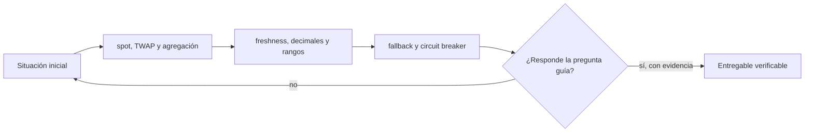

# Clase 21 · Oráculos y calidad del dato

> **Clase independiente 21 de 66** · **Nivel:** Avanzado · **Fuente base:** documentación de Chainlink y de The Graph
>
> [⬅️ Clase anterior](../09-seguridad/clase-20-auditoria-reproducible-y-remediacion.md) · [📚 Índice de las 66 clases](../README.md) · [🗂️ Mapa del tema](README.md) · [➡️ Clase siguiente](../10-oraculos-indexacion/clase-22-eventos-indexacion-y-disponibilidad.md)

## Punto de partida

**Pregunta guía:** ¿Qué confianza entra al contrato cuando importamos un precio externo?

**Caso que abre la clase:** Un precio válido pero antiguo habilita una liquidación incorrecta.

El contrato recibe precios viejos, extremos y con decimales distintos. Cada falla revela una validación y el costo de operar en modo degradado.

## Fundamentos que sostienen la respuesta

1. **spot, TWAP y agregación.** En esta clase delimita qué objeto o relación estamos observando antes de sacar conclusiones. Localízalo explícitamente en «Un precio válido pero antiguo habilita una liquidación incorrecta.» y anota qué dato faltaría para refutar tu lectura.
2. **freshness, decimales y rangos.** En esta clase explica el mecanismo que conecta la situación inicial con el cambio observable. Localízalo explícitamente en «Un precio válido pero antiguo habilita una liquidación incorrecta.» y anota qué dato faltaría para refutar tu lectura.
3. **fallback y circuit breaker.** En esta clase permite contrastar el resultado y formular el límite de la evidencia. Localízalo explícitamente en «Un precio válido pero antiguo habilita una liquidación incorrecta.» y anota qué dato faltaría para refutar tu lectura.

### Parámetros reales de un feed: heartbeat y deviation threshold

Un feed push de Chainlink no publica un precio nuevo en cada bloque: se actualiza cuando se cumple cualquiera de dos condiciones. El *deviation threshold* dispara una actualización si el precio observado off-chain se desvía del último publicado más de un porcentaje dado; el *heartbeat* fuerza una actualización si pasó demasiado tiempo desde la anterior, aunque el precio no se haya movido. Un feed mayor como ETH/USD en Ethereum mainnet opera típicamente con una desviación de ±0.5 % y un heartbeat de 3600 s, mientras que feeds de activos menos líquidos usan umbrales más laxos — verifica siempre los parámetros del feed concreto en vivo, porque cambian por activo y por red.

La consecuencia para el consumidor es directa: tu validación de antigüedad debe tolerar al menos el heartbeat (un dato de 50 minutos puede ser normal en un feed de 3600 s), y tu lógica debe asumir que el precio on-chain puede diferir del de mercado hasta el umbral de desviación. Un contrato que trate esa banda como error se detendrá en operación normal; uno que la ignore por completo subestima su margen de error económico.

### Manipulación de precio spot con flash loan: los números

Supón un pool AMM de producto constante con 100 ETH y 200 000 USDC (`k = 20 000 000`), es decir, un precio spot de 2000 USDC/ETH. Un atacante pide un flash loan de 200 000 USDC y los mete al pool: las reservas pasan a 400 000 USDC y 50 ETH, y el precio spot instantáneo salta a 8000 USDC/ETH — se cuadruplicó dentro de una sola transacción. Si un protocolo de préstamos lee ese spot como oráculo, el atacante deposita ETH "valorado" a 8000, pide prestado contra ese colateral inflado, deshace el swap, devuelve el flash loan y se queda con la diferencia.

Un TWAP encarece esto radicalmente: si la ventana es de 1800 s y un bloque dura ~12 s, un pico de un solo bloque pesa apenas `12 / 1800 ≈ 0.7 %` del promedio, así que sostener un precio falso exige mantener el capital en riesgo durante muchos bloques, expuesto al arbitraje. El caso ilustrativo es Mango Markets (octubre de 2022, ~114 M USD): el atacante infló el precio del token MNGO —de baja liquidez— en los mercados que alimentaban el oráculo y usó su posición revalorizada como colateral para vaciar la plataforma. La lección no es "los oráculos fallan", sino que el coste de manipular la fuente debe superar siempre al botín alcanzable con ella.

### Oráculos push vs. pull

El modelo push (Chainlink Data Feeds) publica proactivamente en cadena y todos los consumidores leen el mismo valor; el modelo pull u on-demand (Pyth) mantiene los precios firmados off-chain y es el usuario quien los sube en la misma transacción que los consume.

| Dimensión | Push (Chainlink feeds) | Pull (Pyth on-demand) |
|-----------|------------------------|-----------------------|
| Quién paga el gas de actualizar | Los operadores del feed, de forma continua | El consumidor, solo cuando necesita el dato |
| Frescura | Limitada por heartbeat y deviation | Precio de hace segundos, firmado off-chain |
| Coste para el protocolo | Lectura barata de un valor ya publicado | Verificación de la firma y publicación en cada uso |
| Riesgo característico | Dato añejo dentro de la banda permitida | El consumidor puede elegir qué actualización sube; hay que validar el timestamp |
| Encaja mejor en | Préstamos y colateral en L1 | Perps y trading de alta frecuencia en L2 |

Ninguno domina: el push amortiza el coste entre todos los usuarios y simplifica el consumo; el pull ofrece latencia mínima a cambio de trasladar validaciones al integrador.

## Trabajo práctico

**Método propio:** clínica de datos defectuosos.

**Actividad:** Evaluar respuestas de oráculo normales, atrasadas y fuera de rango.

Trabaja en entorno local, regtest, signet o testnet según corresponda. Conserva entradas, comandos, salidas y bloque o instante de corte. Una captura aislada no demuestra reproducibilidad.

## Gráfico pedagógico

Recorre el gráfico en voz alta: identifica supuestos, transformaciones y el punto exacto donde aparece evidencia.

## Demostración de aprendizaje

**Entregable:** Política de consumo con validaciones, umbrales y modo degradado.

**Comprobación formativa:** ¿Por qué una respuesta firmada por el oráculo todavía puede ser insegura para el caso de uso?

Para aprobar debes conectar el hecho observado con el concepto correcto, descartar al menos una interpretación alternativa y redactar una conclusión cuyo alcance no exceda la prueba.

## Errores que esta clase corrige

- Tratar **spot, TWAP y agregación** como una etiqueta suficiente, sin identificar actores, dato y frontera.
- Usar **freshness, decimales y rangos** como explicación aunque el caso no aporte la evidencia necesaria.
- Dar por respondido «¿Qué confianza entra al contrato cuando importamos un precio externo?» sin contrastar **fallback y circuit breaker**.

Vuelve al caso inicial, elige el error más peligroso y describe una comprobación concreta que lo detectaría.

## Fuentes para comprobar y ampliar

- Chainlink, *Documentación* — <https://docs.chain.link/>
- Chainlink, *Whitepaper 2.0* — <https://chain.link/whitepaper>
- The Graph, *Documentación* — <https://thegraph.com/docs/>
- IPFS, *Documentación* — <https://docs.ipfs.tech/>
- Fuente primaria: Uniswap v3, *Oracle (TWAP)* — <https://docs.uniswap.org/concepts/protocol/oracle>

Consulta además la [bibliografía razonada](../../docs/bibliografia.md), que declara procedencia y uso.

## Cierre de la clase

Responde otra vez la pregunta guía sin mirar notas. Si tu respuesta no menciona evidencia, supuesto y límite, todavía describe el tema pero no lo domina. Continúa solo cuando otra persona pueda reproducir tu entregable.
