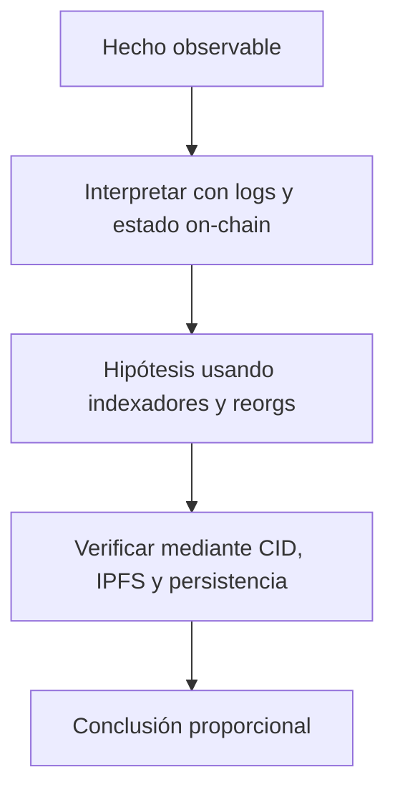

# Clase 22 · Eventos, indexación y disponibilidad

> **Clase independiente 22 de 66** · **Nivel:** Avanzado · **Fuente base:** documentación de Chainlink y de The Graph
>
> [⬅️ Clase anterior](../10-oraculos-indexacion/clase-21-oraculos-y-calidad-del-dato.md) · [📚 Índice de las 66 clases](../README.md) · [🗂️ Mapa del tema](README.md) · [➡️ Clase siguiente](../11-dao-gobernanza/clase-23-propuestas-voto-y-ejecucion.md)

## Punto de partida

**Pregunta guía:** ¿Cómo consultamos historia sin confundir un índice con la verdad del protocolo?

**Caso que abre la clase:** Un indexador pierde eventos durante una reorganización y muestra saldo incorrecto.

El índice pierde coherencia mientras el contrato conserva su estado. Reprocesar desde un checkpoint enseña que velocidad de consulta y autoridad del dato son funciones diferentes.

## Trabajo práctico

**Método propio:** reconstrucción después de una reorg.

**Actividad:** Reprocesar eventos desde un checkpoint y comparar contra estado RPC.

Trabaja en entorno local, regtest, signet o testnet según corresponda. Conserva entradas, comandos, salidas y bloque o instante de corte. Una captura aislada no demuestra reproducibilidad.

## Fundamentos que sostienen la respuesta

1. **logs y estado on-chain.** En esta clase delimita qué objeto o relación estamos observando antes de sacar conclusiones. Localízalo explícitamente en «Un indexador pierde eventos durante una reorganización y muestra saldo incorrecto.» y anota qué dato faltaría para refutar tu lectura.
2. **indexadores y reorgs.** En esta clase explica el mecanismo que conecta la situación inicial con el cambio observable. Localízalo explícitamente en «Un indexador pierde eventos durante una reorganización y muestra saldo incorrecto.» y anota qué dato faltaría para refutar tu lectura.
3. **CID, IPFS y persistencia.** En esta clase permite contrastar el resultado y formular el límite de la evidencia. Localízalo explícitamente en «Un indexador pierde eventos durante una reorganización y muestra saldo incorrecto.» y anota qué dato faltaría para refutar tu lectura.

### Los cuatro modos de fallo de un oráculo, con su defensa

"Usa un oráculo fiable" no es un diseño. Un oráculo puede fallar de cuatro maneras distintas y **cada una necesita una defensa diferente**; confundirlas es cómo se construye un sistema que parece protegido y no lo está.

| Modo de fallo | Qué ocurre | Lo que NO lo detecta | Lo que sí |
|---|---|---|---|
| **Se detiene** | El feed deja de actualizarse y devuelve el último precio, correcto en su día | Validar el valor: el número es plausible | Comprobar el **timestamp**: rechazar si supera `maxAge` |
| **Se manipula** | Alguien mueve el precio spot durante un bloque | Validar la antigüedad: el dato es de hace un segundo | **TWAP** o **agregación** de varias fuentes |
| **Se equivoca** | La fuente publica un valor real pero absurdo (un flash crash, un error del proveedor) | Ni antigüedad ni agregación si todas leen lo mismo | **Circuit breaker**: rango de cordura y pausa |
| **Desaparece** | El proveedor deja de operar el feed | Nada de lo anterior | **Fallback** a otra fuente y plan de migración |

La comprobación mínima de una lectura, con las dos primeras defensas juntas:

```solidity
(, int256 respuesta, , uint256 actualizadoEn, ) = feed.latestRoundData();

if (respuesta <= 0) revert PrecioInvalido();
if (block.timestamp - actualizadoEn > MAX_AGE) revert PrecioObsoleto();
// El feed tiene sus propios decimales: normalizar antes de comparar con nada.
uint256 precio = uint256(respuesta) * 1e18 / (10 ** feed.decimals());
```

Tres líneas que faltan en la mayoría de las integraciones improvisadas, y que cubren dos de los cuatro modos.

**El matiz que decide el diseño:** `MAX_AGE` no es un número universal. Depende del *heartbeat* del feed —cada cuánto se actualiza por contrato— y de la tolerancia de tu operación. Un feed que actualiza cada hora con un `MAX_AGE` de 10 minutos revierte constantemente; uno que actualiza cada minuto con un `MAX_AGE` de un día acepta datos inútiles. Ese número se saca de la documentación del feed, no de la intuición.

> 💡 **En una frase:** un oráculo puede darte un dato viejo, manipulado, erróneo o ninguno. Si tu contrato solo se defiende de uno, está protegido contra una cuarta parte del problema.

<details>
<summary><strong>🎓 Si ya dominas esto</strong> — lo que decide la arquitectura de datos</summary>

- **Push y pull tienen modelos de coste opuestos.** Los feeds push (Chainlink Data Feeds) actualizan cuando se desvía un umbral o vence el heartbeat, y el coste lo asume la red. Los pull (Pyth, API3) exigen que la transacción traiga el dato firmado, lo que da frescura a cambio de complicar el flujo del cliente.
- **El TWAP de Uniswap v3 no es gratis en precisión.** Una ventana corta es manipulable; una larga va por detrás en mercados volátiles y puede liquidar mal en un movimiento real. Elegir la ventana es elegir a qué ataque te expones.
- **Los eventos no son un registro permanente.** Los nodos pueden podarlos según su política de retención. Si tu sistema depende de reconstruir el estado desde el evento cero, depende de que alguien conserve ese historial: por eso los indexadores mantienen su propia base y no reconsultan la cadena entera.
- **Las reorganizaciones rompen los indexadores ingenuos.** Un subgraph que aplica eventos sin gestionar reorgs proyecta estado que la cadena luego descarta. Hay que esperar confirmaciones o implementar deshacer por bloque.
- **Un CID de IPFS garantiza integridad, nunca disponibilidad.** El *pinning* es un contrato de servicio con alguien. Arweave y Filecoin convierten la persistencia en un pago explícito, que es lo honesto: alguien tiene que pagar el almacenamiento perpetuo.
- **La aleatoriedad on-chain no existe sin ayuda.** `block.timestamp` y `blockhash` los influye quien propone el bloque. Un VRF aporta una prueba criptográfica de que el número no se eligió a conveniencia, y ese es el punto entero.

</details>

## Gráfico pedagógico

Recorre el gráfico en voz alta: identifica supuestos, transformaciones y el punto exacto donde aparece evidencia.



## Errores que esta clase corrige

- Tratar **logs y estado on-chain** como una etiqueta suficiente, sin identificar actores, dato y frontera.
- Usar **indexadores y reorgs** como explicación aunque el caso no aporte la evidencia necesaria.
- Dar por respondido «¿Cómo consultamos historia sin confundir un índice con la verdad del protocolo?» sin contrastar **CID, IPFS y persistencia**.

Vuelve al caso inicial, elige el error más peligroso y describe una comprobación concreta que lo detectaría.

## Demostración de aprendizaje

**Entregable:** Índice reconstruible con bloque de corte, procedencia y manejo de reorg.

**Comprobación formativa:** ¿Qué comparación detecta que el índice ya no representa el estado canónico?

Para aprobar debes conectar el hecho observado con el concepto correcto, descartar al menos una interpretación alternativa y redactar una conclusión cuyo alcance no exceda la prueba.

## Fuentes para comprobar y ampliar

- Chainlink, *Documentación* — <https://docs.chain.link/>
- Chainlink, *Whitepaper 2.0* — <https://chain.link/whitepaper>
- The Graph, *Documentación* — <https://thegraph.com/docs/>
- IPFS, *Documentación* — <https://docs.ipfs.tech/>
- Fuente primaria: Uniswap v3, *Oracle (TWAP)* — <https://docs.uniswap.org/concepts/protocol/oracle>

Consulta además la [bibliografía razonada](../../docs/bibliografia.md), que declara procedencia y uso.

## Cierre de la clase

Responde otra vez la pregunta guía sin mirar notas. Si tu respuesta no menciona evidencia, supuesto y límite, todavía describe el tema pero no lo domina. Continúa solo cuando otra persona pueda reproducir tu entregable.
