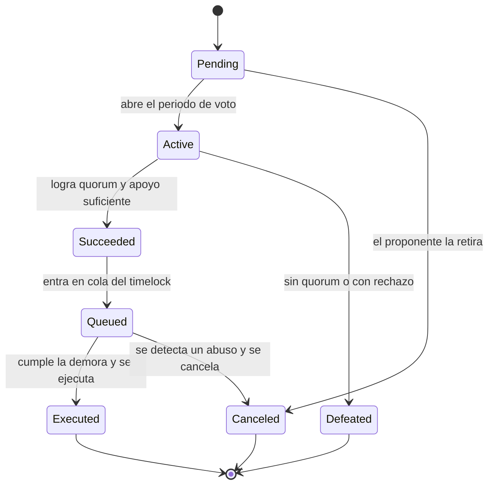
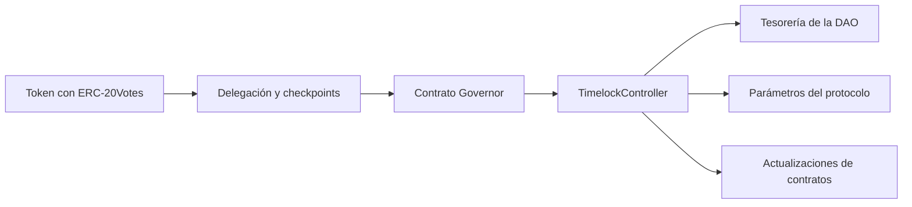

# 11 · DAO y gobernanza

> **Nivel:** Avanzado · ⏱️ **Duración estimada:** 150 min · **Fuente:** OpenZeppelin Governor y Compound Governance
> [⬅️ Currículo](../README.md) · [📚 Bibliografía](../../docs/bibliografia.md)

---

## 🎯 Objetivos

- Describir el ciclo de vida de una propuesta: creación, votación, quorum, cola en timelock y ejecución.
- Explicar la delegación y los snapshots de poder de voto y por qué se mide en un bloque pasado.
- Comparar el voto on-chain con el off-chain (Snapshot) y sus implicaciones de coste y confianza.
- Diseñar una DAO donde una propuesta crítica exija votación, demora y ejecución verificable.
- Identificar amenazas de gobernanza, como el flash-loan governance o la captura por delegados, y sus mitigaciones.

## 📚 Resultados de aprendizaje

Al finalizar, el estudiante podrá:

1. **Explicar** cómo un snapshot de poder de voto impide comprar votos justo antes de la votación.
2. **Configurar** un Governor de OpenZeppelin con quorum, periodo de votación y `TimelockController`.
3. **Justificar** el uso de un timelock como demora entre la aprobación y la ejecución.
4. **Analizar** un ataque de flash-loan governance y las defensas que lo neutralizan.
5. **Diseñar** un mecanismo de emergencia acotado, transparente y con límites explícitos.
6. **Distinguir** el voto on-chain del off-chain según coste, participación y verificabilidad.

## 🗺️ Temas

| # | Tema | Por qué importa |
|---|------|-----------------|
| 1 | Propuestas y ciclo de vida | Estructuran cómo la comunidad decide y ejecuta cambios. |
| 2 | Delegación de voto | Permite a titulares delegar su poder sin transferir tokens. |
| 3 | Snapshots de poder | Fijan el poder en un bloque pasado para evitar compra de última hora. |
| 4 | Quorum y participación | Sin participación mínima, una minoría decide por todos. |
| 5 | Timelock y ejecución | La demora da tiempo a reaccionar ante una propuesta maliciosa. |
| 6 | On-chain vs. off-chain | Snapshot abarata el voto pero traslada la confianza fuera de la cadena. |
| 7 | Tesorería multisig | Un Safe con múltiples firmantes protege los fondos de la DAO. |
| 8 | Amenazas de gobernanza | Flash loans, captura y baja participación erosionan la legitimidad. |

## 🧠 Modelo mental

Una DAO bien diseñada se parece a un parlamento con reglas de procedimiento: no basta con que una mayoría levante la mano una vez. Hay un registro de quién tiene derecho a voto en cierto momento (el snapshot), un debate con quorum, y un periodo obligatorio entre la aprobación y la entrada en vigor de la ley. Ese retraso no es burocracia inútil: es la ventana en la que la comunidad puede leer la letra pequeña y, si detecta un abuso, retirar sus fondos o reaccionar antes de que el cambio se aplique.

El límite de la analogía: en un parlamento tradicional el poder de voto no se puede alquilar por diez segundos, pero en cadena sí. Un atacante puede pedir prestado un capital enorme vía flash loan, votar y devolverlo en la misma transacción. Por eso el snapshot de poder en un bloque anterior y el timelock no son adornos, sino defensas centrales: separan el momento en que se mide el poder del momento en que se vota, y el momento en que se decide del momento en que se ejecuta.

## 🧩 Esquema visual

El ciclo de vida de una propuesta en un Governor de OpenZeppelin impone etapas obligatorias entre la creación y la ejecución.



La arquitectura separa quién mide el poder de voto, quién decide y quién ejecuta: solo el timelock es dueño de los contratos administrados.



## 📖 Conceptos y definiciones

- **Propuesta**: conjunto de acciones que la DAO somete a votación y, si se aprueba, ejecuta de forma verificable.
- **Delegación**: acto de asignar el poder de voto de los propios tokens a una dirección, sin transferir la propiedad.
- **Snapshot de poder**: registro del poder de voto en un bloque pasado, base de ERC-20Votes y los checkpoints de ERC-6372.
- **Quorum**: participación mínima requerida para que una votación sea válida.
- **Timelock**: contrato que impone una demora obligatoria entre la aprobación y la ejecución; en OpenZeppelin es `TimelockController`.
- **Voto off-chain**: señalización de voto fuera de la cadena, como en Snapshot, que ahorra gas pero no ejecuta por sí misma.
- **Tesorería multisig**: fondo gobernado por varias firmas, típicamente con un Safe, para evitar un único punto de control.
- **Flash-loan governance**: ataque que toma poder de voto prestado por instantes para forzar una decisión.
- **ERC-6372**: estándar de reloj que permite a un Governor usar bloques o marcas de tiempo para sus checkpoints.

## 🔬 Profundización

### Anatomía de un ataque de gobernanza: Beanstalk (2022)

En abril de 2022, el protocolo Beanstalk perdió unos 182 M USD en el mayor ataque de gobernanza con préstamo relámpago registrado. El atacante había creado una propuesta maliciosa días antes (disfrazada, con ironía, de donación benéfica) y luego, en una sola transacción, pidió prestados cientos de millones de dólares en stablecoins vía flash loan, los depositó para obtener la supermayoría de poder de voto, ejecutó la propuesta mediante un mecanismo de *emergency commit* que no exigía demora, transfirió la tesorería a su propia dirección y devolvió el préstamo. Beneficio neto para el atacante: alrededor de 76 M USD.

El ataque funcionó porque fallaron a la vez las tres defensas canónicas:

- **Snapshot de voto en bloque pasado**: si el poder se mide con `getPastVotes` en un bloque anterior a la propuesta, los tokens prestados dentro de la misma transacción valen cero votos.
- **Timelock obligatorio**: una demora entre aprobación y ejecución impide que voto y ejecución convivan en una transacción, y da a la comunidad tiempo de auditar la propuesta y reaccionar.
- **Quorum y umbral de propuesta**: elevan el capital que hay que reunir y hacen que el ataque sea visible antes de consumarse.

Ninguna defensa aislada basta: el snapshot sin timelock deja pasar propuestas maliciosas votadas con poder legítimo comprado barato, y el timelock sin snapshot solo retrasa el saqueo.

### Parámetros de diseño de un Governor

| Parámetro | Qué protege | Trade-off al subirlo |
|-----------|-------------|----------------------|
| Voting delay (entre propuesta e inicio de votación) | Da tiempo a delegar, informarse y detectar propuestas hostiles | Retrasa decisiones urgentes legítimas |
| Voting period (duración de la votación) | Participación real en distintas zonas horarias y contextos | Alarga todo el ciclo; más exposición a campañas de compra de votos |
| Proposal threshold (poder mínimo para proponer) | Filtra spam y propuestas triviales de atacantes sin capital | Concentra la iniciativa en ballenas y grandes delegados |
| Quorum (participación mínima) | Impide que una minoría diminuta decida por todos | Con apatía alta, ningún cambio legítimo alcanza el umbral |
| Timelock delay (demora antes de ejecutar) | Ventana de reacción y salida ante una propuesta aprobada maliciosa | Ralentiza correcciones de emergencia; exige un mecanismo de guardián acotado |

No existen valores universales: un protocolo con tesorería enorme y comunidad madura tolera ciclos largos; uno joven que necesita iterar rápido suele empezar con parámetros bajos y endurecerlos a medida que crece el valor en juego.

### veTokens y delegación líquida

El modelo *vote-escrowed* (veToken), popularizado por Curve con veCRV, ataca dos males crónicos: el capital mercenario que vota hoy y se va mañana, y la apatía del votante pequeño. El titular bloquea sus tokens por un plazo elegido (hasta 4 años en Curve) y recibe poder de voto proporcional al monto y al tiempo restante de bloqueo, que decae linealmente: quien más se compromete a largo plazo, más pesa. La delegación líquida (el patrón de ERC-20Votes) resuelve el otro flanco: permite ceder el poder de voto a delegados activos sin transferir la propiedad, elevando la participación efectiva.

Las críticas también son serias: el bloqueo prolongado ilíquido concentra el poder en quienes pueden permitirse inmovilizar capital años; alrededor de los veTokens surgieron mercados de sobornos de voto (*bribes*) y capas como Convex que re-concentran el poder que el diseño quería dispersar; y la delegación líquida tiende a oligarquías de delegados profesionales con baja rendición de cuentas. La lección de diseño: ningún mecanismo de tokenomics sustituye a una comunidad que vigila la concentración de poder — solo cambia dónde hay que mirar.

## 🧪 Laboratorio guiado

1. Abre los contratos de gobernanza y timelock del módulo, ubicados en `labs/08-protocols`, y revisa cómo se enlaza el Governor con el `TimelockController`.

2. Ejecuta la suite de pruebas con trazas para seguir una propuesta desde su creación hasta su ejecución.

```bash
forge test -vv
```

3. En las trazas, localiza el snapshot de poder de voto y comprueba que corresponde a un bloque anterior al inicio de la votación.

4. Sigue el paso por el timelock e identifica la demora obligatoria entre la aprobación y la ejecución.

## 📝 Reto verificable

Diseña e implementa una DAO en la que una propuesta crítica requiera votación con quorum, una demora en `TimelockController` y una ejecución verificable, más un mecanismo de emergencia acotado y transparente.

**Criterio de aceptación:** `forge test -vv` pasa en verde; una prueba demuestra que una propuesta no puede ejecutarse antes de cumplir la demora del timelock; otra prueba demuestra que el poder de voto se mide por snapshot en un bloque pasado; y el mecanismo de emergencia tiene límites explícitos y deja rastro on-chain.

## ⚠️ Errores frecuentes

| Síntoma | Causa y cómo comprobarlo |
|---------|--------------------------|
| Alguien aprueba una propuesta con tokens prestados | Falta de snapshot en bloque pasado; verifica que el poder se lea con `getPastVotes`. |
| Una propuesta se ejecuta al instante | No hay timelock entre aprobación y ejecución; comprueba la demora en `TimelockController`. |
| Casi nadie vota y una minoría decide | Quorum demasiado bajo o apatía; revisa el umbral y los incentivos de participación. |
| El poder de voto no aparece | Titular no delegó, ni siquiera a sí mismo; recuerda que ERC-20Votes exige delegación explícita. |
| Un delegado concentra el control | Captura por delegación; monitoriza la distribución del poder delegado. |
| El "botón de emergencia" hace demasiado | Mecanismo sin límites; acótalo, hazlo transparente y auditable. |

## 🛡️ Seguridad y ética

- Trabaja en local o testnet; nunca uses fondos ni claves reales al desplegar contratos de gobernanza.
- Mide el poder de voto por snapshot en un bloque pasado para neutralizar la compra o el préstamo temporal de poder.
- Impón un timelock entre aprobación y ejecución para dar a la comunidad tiempo de reaccionar.
- Diseña cualquier mecanismo de emergencia con alcance mínimo, transparencia total y rastro on-chain.
- Vigila la concentración de poder delegado y la baja participación, que erosionan la legitimidad de la DAO.

## 🔗 Referencias

- OpenZeppelin, *Governance* — <https://docs.openzeppelin.com/contracts/governance>
- Compound, *Governance* — <https://docs.compound.finance/governance/>
- Snapshot, *Documentación* — <https://docs.snapshot.org/>
- Voshmgir, *Token Economy* — <https://tokeneconomy.co/>
- Fuente primaria: OpenZeppelin Governor y Compound Governor Bravo (documentación enlazada arriba) — <https://docs.openzeppelin.com/contracts/governance>

## ✅ Criterio de dominio

- Entregas una DAO cuyas pruebas demuestran snapshot de poder y demora obligatoria en el timelock.
- Explicas sin apoyo cómo un flash loan podría atacar la gobernanza y qué lo impide.
- Justificas la elección entre voto on-chain y off-chain para un caso concreto.

---

## 🧭 Navegación

⬅️ [Módulo 10 · Oráculos, almacenamiento e indexación](../10-oraculos-indexacion/README.md) · [📚 Índice del currículo](../README.md) · ➡️ [Módulo 12 · Escalabilidad y capas 2](../12-escalabilidad/README.md)
