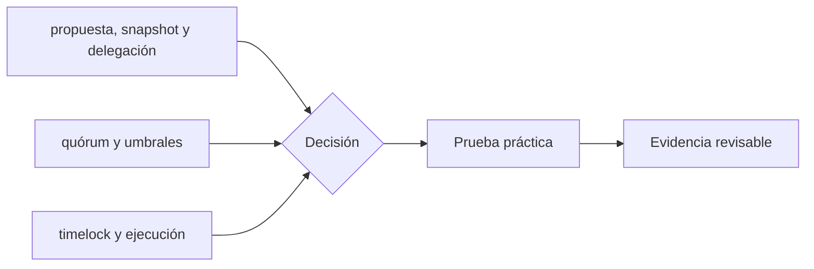

# Clase 23 · Propuestas, voto y ejecución

> **Clase independiente 23 de 66** · **Nivel:** Avanzado · **Fuente base:** OpenZeppelin Governor y Compound Governance
>
> [⬅️ Clase anterior](../10-oraculos-indexacion/clase-22-eventos-indexacion-y-disponibilidad.md) · [📚 Índice de las 66 clases](../README.md) · [🗂️ Mapa del tema](README.md) · [➡️ Clase siguiente](../11-dao-gobernanza/clase-24-captura-y-gobernanza-de-emergencia.md)

## Punto de partida

**Pregunta guía:** ¿Cómo pasa una intención colectiva a un cambio ejecutable y demorado?

**Caso que abre la clase:** Una propuesta aprobada intenta ejecutar una llamada distinta de la votada.

Una propuesta atraviesa snapshot, voto, cola y ejecución con calldata visible. El tiempo se trata como control de seguridad y no como fricción accidental.

## Gráfico pedagógico

Recorre el gráfico en voz alta: identifica supuestos, transformaciones y el punto exacto donde aparece evidencia.

## Trabajo práctico

**Método propio:** simulación completa de gobernanza.

**Actividad:** Recorrer el ciclo completo de una propuesta en entorno local.

Trabaja en entorno local, regtest, signet o testnet según corresponda. Conserva entradas, comandos, salidas y bloque o instante de corte. Una captura aislada no demuestra reproducibilidad.

## Fundamentos que sostienen la respuesta

1. **propuesta, snapshot y delegación.** En esta clase delimita qué objeto o relación estamos observando antes de sacar conclusiones. Localízalo explícitamente en «Una propuesta aprobada intenta ejecutar una llamada distinta de la votada.» y anota qué dato faltaría para refutar tu lectura.
2. **quórum y umbrales.** En esta clase explica el mecanismo que conecta la situación inicial con el cambio observable. Localízalo explícitamente en «Una propuesta aprobada intenta ejecutar una llamada distinta de la votada.» y anota qué dato faltaría para refutar tu lectura.
3. **timelock y ejecución.** En esta clase permite contrastar el resultado y formular el límite de la evidencia. Localízalo explícitamente en «Una propuesta aprobada intenta ejecutar una llamada distinta de la votada.» y anota qué dato faltaría para refutar tu lectura.

### Parámetros de diseño de un Governor

| Parámetro | Qué protege | Trade-off al subirlo |
|-----------|-------------|----------------------|
| Voting delay (entre propuesta e inicio de votación) | Da tiempo a delegar, informarse y detectar propuestas hostiles | Retrasa decisiones urgentes legítimas |
| Voting period (duración de la votación) | Participación real en distintas zonas horarias y contextos | Alarga todo el ciclo; más exposición a campañas de compra de votos |
| Proposal threshold (poder mínimo para proponer) | Filtra spam y propuestas triviales de atacantes sin capital | Concentra la iniciativa en ballenas y grandes delegados |
| Quorum (participación mínima) | Impide que una minoría diminuta decida por todos | Con apatía alta, ningún cambio legítimo alcanza el umbral |
| Timelock delay (demora antes de ejecutar) | Ventana de reacción y salida ante una propuesta aprobada maliciosa | Ralentiza correcciones de emergencia; exige un mecanismo de guardián acotado |

No existen valores universales: un protocolo con tesorería enorme y comunidad madura tolera ciclos largos; uno joven que necesita iterar rápido suele empezar con parámetros bajos y endurecerlos a medida que crece el valor en juego.

### veTokens y delegación líquida

El modelo *vote-escrowed* (veToken), popularizado por Curve con veCRV, ataca dos males crónicos: el capital mercenario que vota hoy y se va mañana, y la apatía del votante pequeño. El titular bloquea sus tokens por un plazo elegido (hasta 4 años en Curve) y recibe poder de voto proporcional al monto y al tiempo restante de bloqueo, que decae linealmente: quien más se compromete a largo plazo, más pesa. La delegación líquida (el patrón de ERC-20Votes) resuelve el otro flanco: permite ceder el poder de voto a delegados activos sin transferir la propiedad, elevando la participación efectiva.

Las críticas también son serias: el bloqueo prolongado ilíquido concentra el poder en quienes pueden permitirse inmovilizar capital años; alrededor de los veTokens surgieron mercados de sobornos de voto (*bribes*) y capas como Convex que re-concentran el poder que el diseño quería dispersar; y la delegación líquida tiende a oligarquías de delegados profesionales con baja rendición de cuentas. La lección de diseño: ningún mecanismo de tokenomics sustituye a una comunidad que vigila la concentración de poder — solo cambia dónde hay que mirar.

## Demostración de aprendizaje

**Entregable:** Línea de tiempo con estados, responsables y calldata ejecutada.

**Comprobación formativa:** ¿Cómo compruebas que la llamada ejecutada coincide exactamente con la votada?

Para aprobar debes conectar el hecho observado con el concepto correcto, descartar al menos una interpretación alternativa y redactar una conclusión cuyo alcance no exceda la prueba.

## Errores que esta clase corrige

- Tratar **propuesta, snapshot y delegación** como una etiqueta suficiente, sin identificar actores, dato y frontera.
- Usar **quórum y umbrales** como explicación aunque el caso no aporte la evidencia necesaria.
- Dar por respondido «¿Cómo pasa una intención colectiva a un cambio ejecutable y demorado?» sin contrastar **timelock y ejecución**.

Vuelve al caso inicial, elige el error más peligroso y describe una comprobación concreta que lo detectaría.

## Fuentes para comprobar y ampliar

- OpenZeppelin, *Governance* — <https://docs.openzeppelin.com/contracts/governance>
- Compound, *Governance* — <https://docs.compound.finance/governance/>
- Snapshot, *Documentación* — <https://docs.snapshot.org/>
- Voshmgir, *Token Economy* — <https://github.com/Token-Economy-Book/3rdEdition-English>
- Fuente primaria: OpenZeppelin Governor y Compound Governor Bravo (documentación enlazada arriba) — <https://docs.openzeppelin.com/contracts/governance>

Consulta además la [bibliografía razonada](../../docs/bibliografia.md), que declara procedencia y uso.

## Cierre de la clase

Responde otra vez la pregunta guía sin mirar notas. Si tu respuesta no menciona evidencia, supuesto y límite, todavía describe el tema pero no lo domina. Continúa solo cuando otra persona pueda reproducir tu entregable.
