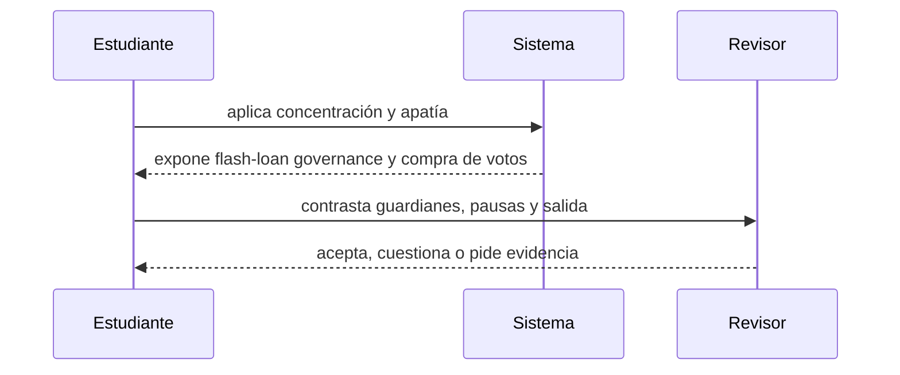

# Clase 24 · Captura y gobernanza de emergencia

> **Clase independiente 24 de 66** · **Nivel:** Avanzado · **Fuente base:** OpenZeppelin Governor y Compound Governance
>
> [⬅️ Clase anterior](../11-dao-gobernanza/clase-23-propuestas-voto-y-ejecucion.md) · [📚 Índice de las 66 clases](../README.md) · [🗂️ Mapa del tema](README.md) · [➡️ Clase siguiente](../12-escalabilidad/clase-25-familias-de-escalabilidad.md)

## Punto de partida

**Pregunta guía:** ¿Quién puede detener el sistema y quién controla a quien controla?

**Caso que abre la clase:** Una minoría coordinada aprueba un cambio mientras la mayoría no participa.

Una minoría coordinada aprovecha apatía y concentración. El resto diseña límites temporales para guardianes sin crear una autoridad permanente sin control.

## Fundamentos que sostienen la respuesta

1. **concentración y apatía.** En esta clase delimita qué objeto o relación estamos observando antes de sacar conclusiones. Localízalo explícitamente en «Una minoría coordinada aprueba un cambio mientras la mayoría no participa.» y anota qué dato faltaría para refutar tu lectura.
2. **flash-loan governance y compra de votos.** En esta clase explica el mecanismo que conecta la situación inicial con el cambio observable. Localízalo explícitamente en «Una minoría coordinada aprueba un cambio mientras la mayoría no participa.» y anota qué dato faltaría para refutar tu lectura.
3. **guardianes, pausas y salida.** En esta clase permite contrastar el resultado y formular el límite de la evidencia. Localízalo explícitamente en «Una minoría coordinada aprueba un cambio mientras la mayoría no participa.» y anota qué dato faltaría para refutar tu lectura.

### Anatomía de un ataque de gobernanza: Beanstalk (2022)

En abril de 2022, el protocolo Beanstalk perdió unos 182 M USD en el mayor ataque de gobernanza con préstamo relámpago registrado. El atacante había creado una propuesta maliciosa días antes (disfrazada, con ironía, de donación benéfica) y luego, en una sola transacción, pidió prestados cientos de millones de dólares en stablecoins vía flash loan, los depositó para obtener la supermayoría de poder de voto, ejecutó la propuesta mediante un mecanismo de *emergency commit* que no exigía demora, transfirió la tesorería a su propia dirección y devolvió el préstamo. Beneficio neto para el atacante: alrededor de 76 M USD.

El ataque funcionó porque fallaron a la vez las tres defensas canónicas:

- **Snapshot de voto en bloque pasado**: si el poder se mide con `getPastVotes` en un bloque anterior a la propuesta, los tokens prestados dentro de la misma transacción valen cero votos.
- **Timelock obligatorio**: una demora entre aprobación y ejecución impide que voto y ejecución convivan en una transacción, y da a la comunidad tiempo de auditar la propuesta y reaccionar.
- **Quorum y umbral de propuesta**: elevan el capital que hay que reunir y hacen que el ataque sea visible antes de consumarse.

Ninguna defensa aislada basta: el snapshot sin timelock deja pasar propuestas maliciosas votadas con poder legítimo comprado barato, y el timelock sin snapshot solo retrasa el saqueo.

### Un ataque de gobernanza, y por qué cada defensa existe

Las piezas de un Governor (snapshot, quorum, timelock) parecen burocracia hasta que se ve el ataque que cada una impide. Sigamos uno completo.

**El objetivo:** una DAO con una tesorería de 50 millones y un token de gobernanza que cotiza en mercado.

**Sin ninguna defensa, el ataque cuesta una transacción:**

```text
1. Flash loan de 20 millones          ← sin colateral, se devuelve al final
2. Comprar tokens de gobernanza
3. Crear la propuesta "transferir la tesorería a esta dirección"
4. Votar a favor con los tokens recién comprados
5. Ejecutar
6. Vender los tokens, devolver el préstamo
```

Todo en un bloque. Y ahora, dónde se rompe la cadena según qué defensa esté puesta:

| Defensa | En qué paso muerde | Qué impide exactamente |
|---|---|---|
| **Snapshot en bloque pasado** (`getPastVotes`) | 4 | Los tokens comprados en el paso 2 tienen **cero** poder de voto: el peso se leyó de un bloque anterior a la compra. Mata el ataque entero |
| **Retraso de votación** | 3→4 | Entre crear la propuesta y poder votar pasan bloques, así que ninguna operación atómica los abarca |
| **Periodo de votación** (días) | 4 | Sostener un préstamo relámpago durante días es imposible por definición |
| **Quorum** | 4 | Obliga a movilizar una fracción real del suministro, no solo mayoría de los que votaron |
| **Timelock** | 5 | Aunque todo lo anterior fallara, la ejecución se retrasa: da tiempo a ver la propuesta y salir |

**Lo importante:** el snapshot solo por sí mismo ya cierra este ataque. Las demás no son redundancia inútil: cada una cubre un camino distinto (compra progresiva, colusión de delegados, propuesta maliciosa disfrazada). Un diseño con snapshot pero sin timelock es vulnerable a un ataque más lento y más difícil de detectar.

**La consecuencia práctica que sorprende:** con `ERC20Votes`, tener tokens **no da poder de voto**. Hay que delegar explícitamente, aunque sea a uno mismo. Es la causa número uno de participación baja en DAOs recién lanzadas, y no es un bug: es lo que permite que el snapshot funcione.

> 💡 **En una frase:** cada pieza de un Governor existe porque alguien ya ejecutó el ataque que impide. El snapshot es la que hace inviable comprar la votación en el último segundo.

<details>
<summary><strong>🎓 Si ya dominas esto</strong> — donde la gobernanza se rompe de verdad</summary>

- **El voto ponderado por tokens es plutocracia con pasos extra.** Quien más capital tiene, más decide. La votación cuadrática mitiga la concentración pero es vulnerable a Sybil sin identidad, lo que traslada el problema a "cómo pruebas que eres una persona" — que no está resuelto.
- **La apatía es el estado por defecto y es racional.** Votar cuesta tiempo y gas; el efecto de un voto pequeño es nulo. Por eso la delegación es la solución de facto, y por eso los delegados profesionales concentran poder de forma silenciosa: revisa la distribución del voto delegado, no solo la del token.
- **La ejecución en varias cadenas rompe la atomicidad de la decisión.** Una propuesta aprobada en L1 que debe aplicarse en varias L2 puede quedar a medias si un mensaje falla. Hay que diseñar la reversión antes que la ejecución.
- **El timelock protege y expone a la vez.** La ventana que da a los usuarios para salir se la da también a un atacante para preparar la explotación de un cambio que ya conoce. La duración correcta equilibra ambas cosas; copiarla de otro protocolo sin ese análisis es copiar su modelo de amenazas.
- **ERC-6372 permite anclar los checkpoints al tiempo en vez de al número de bloque.** Es lo correcto en L2 con tiempos de bloque variables, donde "dentro de 40 320 bloques" puede significar cualquier cosa.

</details>

## Gráfico pedagógico

Recorre el gráfico en voz alta: identifica supuestos, transformaciones y el punto exacto donde aparece evidencia.



## Demostración de aprendizaje

**Entregable:** Constitución mínima que explicite poderes, demoras, revocación y transparencia.

**Comprobación formativa:** ¿Quién puede revocar al actor de emergencia y cuánto tarda esa revocación?

Para aprobar debes conectar el hecho observado con el concepto correcto, descartar al menos una interpretación alternativa y redactar una conclusión cuyo alcance no exceda la prueba.

## Trabajo práctico

**Método propio:** juego de captura y respuesta.

**Actividad:** Diseñar controles ordinarios y de emergencia con límites temporales.

Trabaja en entorno local, regtest, signet o testnet según corresponda. Conserva entradas, comandos, salidas y bloque o instante de corte. Una captura aislada no demuestra reproducibilidad.

## Errores que esta clase corrige

- Tratar **concentración y apatía** como una etiqueta suficiente, sin identificar actores, dato y frontera.
- Usar **flash-loan governance y compra de votos** como explicación aunque el caso no aporte la evidencia necesaria.
- Dar por respondido «¿Quién puede detener el sistema y quién controla a quien controla?» sin contrastar **guardianes, pausas y salida**.

Vuelve al caso inicial, elige el error más peligroso y describe una comprobación concreta que lo detectaría.

## Fuentes para comprobar y ampliar

- OpenZeppelin, *Governance* — <https://docs.openzeppelin.com/contracts/governance>
- Compound, *Governance* — <https://docs.compound.finance/governance/>
- Snapshot, *Documentación* — <https://docs.snapshot.org/>
- Voshmgir, *Token Economy* — <https://github.com/Token-Economy-Book/3rdEdition-English>
- Fuente primaria: OpenZeppelin Governor y Compound Governor Bravo (documentación enlazada arriba) — <https://docs.openzeppelin.com/contracts/governance>

Consulta además la [bibliografía razonada](../../docs/bibliografia.md), que declara procedencia y uso.

## Cierre de la clase

Responde otra vez la pregunta guía sin mirar notas. Si tu respuesta no menciona evidencia, supuesto y límite, todavía describe el tema pero no lo domina. Continúa solo cuando otra persona pueda reproducir tu entregable.
