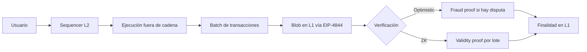
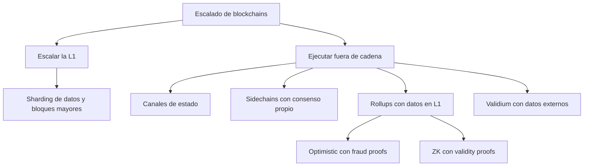

# 12 · Escalabilidad y capas 2

> **Nivel:** Avanzado · ⏱️ **Duración estimada:** 150 min · **Fuente:** *An Incomplete Guide to Rollups* (Buterin) y L2BEAT
> [⬅️ Currículo](../README.md) · [📚 Bibliografía](../../docs/bibliografia.md)
> 🧭 ⬅️ **Anterior:** [11 · DAO y gobernanza](../11-dao-gobernanza/README.md) · [📚 Índice](../README.md) · ➡️ **Siguiente:** [13 · Interoperabilidad y ecosistemas](../13-interoperabilidad/README.md)
> 📖 [Glosario de términos](../../docs/glosario.md) · 🌱 [¿Nuevo en esto? Empieza aquí](../../docs/empieza-aqui.md)

---

## 🎯 Objetivos

- Distinguir seis familias de escalado (canales, sidechains, optimistic rollups, ZK rollups, validiums y appchains) según dónde ejecutan y dónde publican datos.
- Comparar mecanismos de prueba de estado inválido: fraud proofs frente a validity/ZK proofs, con sus implicaciones de latencia y confianza.
- Evaluar la disponibilidad de datos (DA) de un diseño y explicar cómo EIP-4844 redujo su costo desde 2024.
- Analizar el riesgo de secuenciación, censura y retiro, incluyendo el challenge period y los mecanismos de escape.
- Argumentar por qué el TPS aislado no mide seguridad ni experiencia de usuario.

## 📚 Resultados de aprendizaje

Al finalizar, el estudiante podrá:

1. **Clasificar** una solución de capa 2 real según ejecución, publicación de datos y modelo de prueba.
2. **Comparar** optimistic y ZK rollups en tiempo de retiro, supuestos criptográficos y costo.
3. **Explicar** el papel de los blobs de EIP-4844 en el costo de DA y por qué el danksharding completo aún es roadmap.
4. **Identificar** los vectores de censura asociados a un secuenciador centralizado y sus mitigaciones.
5. **Evaluar** un puente L1↔L2 distinguiendo mensajes canónicos de puentes de liquidez de terceros.
6. **Justificar** por qué la seguridad de un rollup depende de la capa 1 y de la disponibilidad de datos, no solo del rendimiento.

## 🗺️ Temas

| # | Tema | Por qué importa |
|---|------|-----------------|
| 1 | Ejecución fuera de cadena vs. publicación en L1 | Define cuánta seguridad se hereda de Ethereum |
| 2 | Optimistic rollups y fraud proofs | El challenge period (~7 días) determina el tiempo de retiro seguro |
| 3 | ZK rollups y validity proofs | La prueba de validez habilita finalidad rápida sin periodo de disputa |
| 4 | Validiums y DA fuera de cadena | Sacrifican garantías de datos por costo; cambian el modelo de confianza |
| 5 | Disponibilidad de datos y EIP-4844 | Los blobs abarataron drásticamente publicar datos de rollup en 2024 |
| 6 | Secuenciador y riesgo de censura | Quién ordena las transacciones condiciona neutralidad y liveness |
| 7 | Puentes, forced inclusion y escape hatch | Determinan si el usuario puede salir sin permiso del operador |
| 8 | Appchains y soberanía | Ceden componibilidad a cambio de control y espacio de bloque propio |

## 🧠 Modelo mental

Piensa en la capa 1 como un juzgado lento pero incorruptible y en cada capa 2 como una oficina que tramita miles de acuerdos y solo lleva al juzgado un resumen. Un optimistic rollup entrega ese resumen dando por buena la palabra del operador, salvo que alguien presente pruebas de fraude dentro del plazo de impugnación; un ZK rollup adjunta un certificado matemático que el juzgado verifica de inmediato. En ambos casos, los datos que respaldan el resumen deben quedar disponibles para que cualquiera pueda reconstruir el estado y ejercer su defensa.

La analogía tiene límites: el "juzgado" no revisa cada caso, solo verifica pruebas o espera impugnaciones, y su garantía se evapora si los datos no están disponibles. Por eso la disponibilidad de datos es el eje del diseño, y por eso comparar cadenas solo por TPS es como juzgar un tribunal por cuántos papeles archiva sin mirar si sus sentencias son ejecutables.

## 🧩 Esquema visual

El ciclo de vida de una transacción en un rollup, desde que el usuario la envía hasta que alcanza finalidad en la capa 1:



Taxonomía de las estrategias de escalado según dónde ejecutan y dónde publican los datos:



## 📖 Conceptos y definiciones

- **Rollup**: esquema que ejecuta transacciones fuera de la L1 y publica en ella datos y compromisos de estado; hereda seguridad si los datos están disponibles.
- **Optimistic rollup**: asume que las transiciones son válidas y las revierte solo si un fraud proof lo demuestra dentro del challenge period (~7 días).
- **ZK rollup**: acompaña cada lote con una validity proof (SNARK/STARK) que la L1 verifica, habilitando finalidad sin periodo de disputa.
- **Validium**: como un ZK rollup pero con datos fuera de la L1; reduce costo a cambio de un supuesto adicional de disponibilidad de datos.
- **Disponibilidad de datos (DA)**: garantía de que los datos de cada lote son recuperables por cualquiera para reconstruir y auditar el estado.
- **EIP-4844 (blobs)**: mecanismo de Dencun (2024) que añadió espacio de datos efímero y barato para rollups; el danksharding completo lo amplía y sigue en roadmap.
- **Secuenciador (sequencer)**: componente que ordena y agrupa transacciones; si es único puede censurar o reordenar, salvo mecanismos de inclusión forzada.
- **Challenge period**: ventana durante la cual se pueden impugnar transiciones de un optimistic rollup; retrasa los retiros hacia la L1.
- **Forced inclusion / escape hatch**: rutas que permiten al usuario incluir transacciones o retirar fondos aun si el operador se niega a cooperar.
- **Appchain**: cadena dedicada a una aplicación; gana control y capacidad a cambio de componibilidad y, a veces, de seguridad compartida.

## 🔬 Profundización

### El impacto medible de EIP-4844: blobs frente a calldata

Antes de Dencun (marzo de 2024), los rollups publicaban sus datos como *calldata* en transacciones normales de Ethereum, compitiendo por gas con todas las demás transacciones: cada byte distinto de cero costaba 16 gas y ese coste dominaba la factura de un rollup, llegando a representar más del 90% de sus gastos operativos. EIP-4844 introdujo las *blob-carrying transactions*: cada blob aporta ~128 KB de datos con un mercado de tarifas propio e independiente (fee market separado con su propio precio base), y los blobs se podan de los nodos tras ~18 días, porque solo necesitan estar disponibles durante la ventana de verificación, no para siempre.

El efecto fue inmediato y medible: en las semanas posteriores a Dencun, las comisiones de usuario en los principales L2 cayeron en más de un orden de magnitud (reducciones superiores a 10x fue el patrón general; en varios rollups una transacción pasó de decenas de centavos a fracciones de centavo). Un ejemplo numérico orientativo del mecanismo: si un batch de 100 000 bytes costaba en calldata unos 1 600 000 gas solo en datos, con blobs ese mismo volumen se paga en un mercado que, cuando hay poca demanda de blobs, tiende al precio mínimo (1 wei por gas de blob), es decir, prácticamente gratis en términos relativos. Las cifras actuales de tarifas por L2 son volátiles: consúltalo en vivo en [L2BEAT](https://l2beat.com/) y en [Dune](https://dune.com/). El siguiente paso del roadmap, el danksharding completo, ampliará el número de blobs por bloque con *data availability sampling*; a 2025 sigue siendo trabajo en curso.

### Las etapas de madurez de L2BEAT: Stage 0, 1 y 2

L2BEAT clasifica los rollups por cuánto dependen todavía de sus operadores, no por su rendimiento. La pregunta de fondo es: ¿puede el usuario salir con sus fondos aunque el equipo del rollup desaparezca o se vuelva hostil?

| Etapa | Exigencia principal | Qué significa para el usuario |
|-------|---------------------|-------------------------------|
| Stage 0 | Publica datos en L1 y existe software para reconstruir el estado | La seguridad descansa casi por completo en el operador |
| Stage 1 | Sistema de pruebas activo (fraud o validity), salidas sin el operador, y un consejo de seguridad con umbral alto solo para emergencias | El usuario puede salir por sí mismo salvo bug crítico |
| Stage 2 | Pruebas totalmente permissionless, ventana de salida amplia ante upgrades y consejo limitado a errores demostrables en cadena | La confianza en el operador es residual |

La mayoría de los rollups en producción aún no alcanza Stage 2 por razones prácticas: mantener un consejo de seguridad con poderes amplios es un seguro frente a bugs en sistemas de prueba jóvenes, los fraud proofs permissionless son difíciles de blindar contra ataques de espameo y griefing, y renunciar al upgrade rápido implica que un fallo crítico no se puede parchear de inmediato. Es un compromiso deliberado entre inmadurez del software y minimización de confianza; el estado de cada rollup cambia con el tiempo, consúltalo en vivo en L2BEAT.

### Fraud proof interactiva frente a validity proof

Los dos modelos de prueba responden a la misma pregunta —¿es válida esta transición de estado?— con filosofías opuestas. La *fraud proof* interactiva (el diseño de bisección usado por los optimistic rollups modernos) no verifica nada por defecto: solo si un retador afirma que el resultado es incorrecto, retador y operador juegan un protocolo de bisección sobre la traza de ejecución. Si la traza tiene, por ejemplo, 2^30 pasos (~mil millones de instrucciones), cada ronda divide el rango en disputa por la mitad: en unas 30 rondas las partes quedan en desacuerdo sobre una única instrucción, y la L1 solo ejecuta esa instrucción para decidir quién miente. El coste en cadena es minúsculo, pero el proceso exige que exista al menos un verificador honesto y vigilante, y justifica el challenge period de ~7 días.

La *validity proof* invierte la carga: el operador demuestra criptográficamente la validez de cada lote antes de que la L1 lo acepte, sin depender de vigilantes ni de plazos de disputa. El contrato verificador comprueba la prueba (SNARK o STARK) en un solo paso, con coste de verificación casi constante aunque el lote contenga miles de transacciones. El precio se paga fuera de la cadena: generar la prueba requiere hardware y tiempo significativos. En resumen: la fraud proof es barata mientras nadie ataque y lenta para salir; la validity proof es cara de producir y rápida para finalizar.

### De dónde sale realmente el ahorro de una L2

"Las L2 son más baratas" es cierto, pero la razón que suele darse —"porque procesan fuera de la cadena"— es incompleta. El ahorro tiene dos fuentes de tamaño muy distinto, y saber cuál es cuál explica por qué las comisiones de L2 bajaron de golpe en marzo de 2024.

**El coste de una transacción en un rollup son dos partidas:**

```text
coste total = ejecución en L2  +  parte proporcional de publicar el lote en L1
              (baratísima)        (la que domina la factura)
```

La ejecución en L2 es barata porque la hace un secuenciador con hardware normal, sin miles de nodos replicando. Pero eso es la parte pequeña. **Lo que de verdad se paga es el espacio en L1**, y ahí está la clave: el coste se reparte entre todas las transacciones del lote.

| Transacciones en el lote | Coste de publicar por transacción |
|---:|---|
| 1 | el lote entero |
| 100 | 1/100 |
| 1 000 | 1/1 000 |

De ahí sale una propiedad contraintuitiva: **una L2 es más barata cuanto más se usa**. Con poca actividad, cada usuario carga con una porción mayor del coste fijo de publicar.

**Y por eso EIP-4844 cambió tanto las cosas.** Antes de Dencun (marzo de 2024), los rollups publicaban sus datos como `calldata`, compitiendo por el mismo espacio de bloque que todas las transacciones de L1. Los *blobs* crearon un espacio de datos separado, con su propio mercado de precios y **efímero** (se borra a las pocas semanas, que es tiempo de sobra para que cualquiera descargue y verifique). Resultado: el coste de publicar cayó de forma drástica y las comisiones de L2 se desacoplaron de la congestión de L1.

**La pregunta que hay que saber responder:** si los blobs se borran, ¿sigue siendo seguro? Sí, y por una razón concreta: la disponibilidad de datos solo necesita ser suficiente para que **cualquiera pueda descargarlos y reconstruir el estado o impugnar un fraude**. Pasada la ventana de disputa, guardar esos datos para siempre en todos los nodos ya no aporta seguridad, solo coste.

> 💡 **En una frase:** en un rollup no pagas por computar, pagas por publicar; por eso se abarata al llenarse y por eso los blobs cambiaron la ecuación entera.

<details>
<summary><strong>🎓 Si ya dominas esto</strong> — lo que separa un rollup de algo que se llama rollup</summary>

- **La pregunta que ordena la taxonomía es "¿dónde viven los datos?".** Rollup = en L1; validium = fuera, con un comité; optimium = fuera, con pruebas de fraude. Si los datos no están en L1, la seguridad depende de que alguien te los entregue, y eso es un supuesto de confianza adicional que hay que enunciar.
- **Casi todas las L2 conservan claves de actualización.** L2BEAT las clasifica por etapas (0, 1, 2) según cuánta capacidad tiene el usuario de salir sin permiso del operador. Una "L2" en etapa 0 con un multisig que puede cambiar la lógica del puente es, en la práctica, un sistema custodiado con muy buena criptografía.
- **La descentralización del secuenciador está sin resolver.** Casi todas operan uno solo, lo que permite censurar y extraer MEV. La mitigación es la **inclusión forzada** desde L1: comprueba si existe y con qué retraso, porque es la diferencia entre poder salir y depender de la buena voluntad del operador.
- **Los puentes de liquidez no son el puente canónico.** Salir "al instante" de un optimistic rollup significa que alguien te adelanta fondos en L1 y se queda esperando el retiro real: pagas una prima y asumes el riesgo de ese tercero, no el del protocolo.
- **Comparar cadenas por TPS es comparar por la métrica equivocada.** El TPS depende del límite de gas y del tipo de transacción, y no dice nada del modelo de seguridad. Dos números honestos: coste por transacción y qué hace falta para que te roben.

</details>

## 🧪 Laboratorio guiado

Este módulo es un ejercicio comparativo de análisis, sin código de repositorio. Consulta el índice de prácticas del curso en [laboratorios](../../labs/CATALOG.md).

1. Elige tres soluciones de capa 2 reales de distinta familia (por ejemplo un optimistic rollup, un ZK rollup y un validium).
2. Para cada una, abre L2BEAT y anota su categoría, su modelo de datos y sus riesgos declarados; recuerda que las cifras cambian, consúltalo en vivo.

```text
Dimensión            | L2 A        | L2 B        | L2 C
---------------------+-------------+-------------+-------------
Dónde ejecuta        | ...         | ...         | ...
Dónde publica datos  | ...         | ...         | ...
Prueba de estado     | fraude/ZK   | fraude/ZK   | fraude/ZK
Secuenciador         | ...         | ...         | ...
Tiempo de retiro     | ...         | ...         | ...
Escape hatch         | sí/no       | sí/no       | sí/no
```

3. Registra el tipo de prueba (fraud vs. validity) y el tiempo de retiro estimado de cada opción.
4. Verifica en L2BEAT si la DA es on-chain (blobs/calldata) o externa, e indica el supuesto de confianza que introduce.
5. Redacta una conclusión de un párrafo sobre cuál ofrece mejores garantías de salida sin permiso y por qué.

## 📝 Reto verificable

Entrega una tabla comparativa de las tres soluciones más un informe breve que responda, para cada una: dónde se ejecuta, dónde se publican los datos, cómo se prueba un estado inválido, quién secuencia y cuánto tarda un retiro seguro.

**Criterio de aceptación:** la tabla incluye las seis dimensiones del laboratorio para las tres soluciones, cada afirmación de datos en vivo se marca como "consúltalo en vivo" con su fuente (L2BEAT), y el informe justifica por qué el TPS no basta para evaluar seguridad.

## ⚠️ Errores frecuentes

| Síntoma | Causa y cómo comprobarlo |
|---------|--------------------------|
| Afirmar que un rollup es seguro "porque usa ZK" | Se ignora la DA; comprueba en L2BEAT si los datos están on-chain o en un comité externo |
| Comparar cadenas solo por TPS | Se confunde rendimiento con seguridad; contrasta modelo de prueba y de datos, no solo throughput |
| Suponer retiros instantáneos en optimistic rollups | Existe un challenge period (~7 días); revísalo en la documentación del proyecto |
| Tratar un puente de liquidez como el puente canónico | Son distintos; verifica si el retiro pasa por el contrato oficial de la L1 |
| Dar por hecho el danksharding completo | Hoy solo hay blobs (EIP-4844); el sharding de datos completo sigue en roadmap |
| Ignorar la centralización del secuenciador | Un secuenciador único puede censurar; busca si existe inclusión forzada |

## 🛡️ Seguridad y ética

- Trabaja siempre en local o testnet; no muevas fondos reales ni uses claves privadas reales durante el análisis.
- No firmes transacciones ni conectes wallets con activos a exploradores o dApps mientras investigas.
- Cita las cifras de rendimiento y coste como observaciones datadas ("consúltalo en vivo"); nunca las presentes como constantes.
- Distingue el marketing del proyecto de sus garantías verificables; apóyate en fuentes independientes como L2BEAT.
- Reconoce el conflicto de interés: quien opera un secuenciador puede extraer valor del orden de las transacciones.

## 🔗 Referencias

- Buterin, V., *An Incomplete Guide to Rollups* — <https://vitalik.eth.limo/general/2021/01/05/rollup.html>
- ethereum.org, documentación de escalado — <https://ethereum.org/developers/docs/scaling/>
- L2BEAT, riesgos y estado de las capas 2 (datos en vivo) — <https://l2beat.com/>
- Fuente primaria: EIP-4844 (Shard Blob Transactions) — <https://eips.ethereum.org/EIPS/eip-4844>

## ✅ Criterio de dominio

- Explicas, sin notas, cómo un optimistic y un ZK rollup prueban su estado y por qué difieren en tiempo de retiro.
- Argumentas el papel de la disponibilidad de datos y de EIP-4844 en la seguridad y el coste de un rollup.
- Detectas cuándo una comparación por TPS oculta diferencias reales de confianza.

---

## 🧭 Navegación

⬅️ [Módulo 11 · DAO y gobernanza](../11-dao-gobernanza/README.md) · [📚 Índice del currículo](../README.md) · ➡️ [Módulo 13 · Interoperabilidad y ecosistemas](../13-interoperabilidad/README.md)
