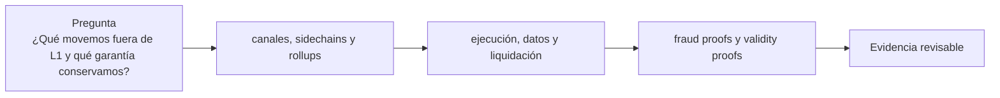

# Clase 25 · Familias de escalabilidad

> **Clase independiente 25 de 66** · **Nivel:** Avanzado · **Fuente base:** *An Incomplete Guide to Rollups* (Buterin) y L2BEAT
>
> [⬅️ Clase anterior](../11-dao-gobernanza/clase-24-captura-y-gobernanza-de-emergencia.md) · [📚 Índice de las 66 clases](../README.md) · [🗂️ Mapa del tema](README.md) · [➡️ Clase siguiente](../12-escalabilidad/clase-26-riesgo-operativo-de-una-l2.md)

## Punto de partida

**Pregunta guía:** ¿Qué movemos fuera de L1 y qué garantía conservamos?

**Caso que abre la clase:** Dos redes anuncian el mismo TPS pero publican datos y pruebas distintas.

Las soluciones se ordenan por dónde ejecutan, publican datos y liquidan. El TPS se deja para el final, cuando ya se conocen las garantías sacrificadas.

## Fundamentos que sostienen la respuesta

1. **canales, sidechains y rollups.** En esta clase delimita qué objeto o relación estamos observando antes de sacar conclusiones. Localízalo explícitamente en «Dos redes anuncian el mismo TPS pero publican datos y pruebas distintas.» y anota qué dato faltaría para refutar tu lectura.
2. **ejecución, datos y liquidación.** En esta clase explica el mecanismo que conecta la situación inicial con el cambio observable. Localízalo explícitamente en «Dos redes anuncian el mismo TPS pero publican datos y pruebas distintas.» y anota qué dato faltaría para refutar tu lectura.
3. **fraud proofs y validity proofs.** En esta clase permite contrastar el resultado y formular el límite de la evidencia. Localízalo explícitamente en «Dos redes anuncian el mismo TPS pero publican datos y pruebas distintas.» y anota qué dato faltaría para refutar tu lectura.

### Las etapas de madurez de L2BEAT: Stage 0, 1 y 2

L2BEAT clasifica los rollups por cuánto dependen todavía de sus operadores, no por su rendimiento. La pregunta de fondo es: ¿puede el usuario salir con sus fondos aunque el equipo del rollup desaparezca o se vuelva hostil?

| Etapa | Exigencia principal | Qué significa para el usuario |
|-------|---------------------|-------------------------------|
| Stage 0 | Publica datos en L1 y existe software para reconstruir el estado | La seguridad descansa casi por completo en el operador |
| Stage 1 | Sistema de pruebas activo (fraud o validity), salidas sin el operador, y un consejo de seguridad con umbral alto solo para emergencias | El usuario puede salir por sí mismo salvo bug crítico |
| Stage 2 | Pruebas totalmente permissionless, ventana de salida amplia ante upgrades y consejo limitado a errores demostrables en cadena | La confianza en el operador es residual |

La mayoría de los rollups en producción aún no alcanza Stage 2 por razones prácticas: mantener un consejo de seguridad con poderes amplios es un seguro frente a bugs en sistemas de prueba jóvenes, los fraud proofs permissionless son difíciles de blindar contra ataques de espameo y griefing, y renunciar al upgrade rápido implica que un fallo crítico no se puede parchear de inmediato. Es un compromiso deliberado entre inmadurez del software y minimización de confianza; el estado de cada rollup cambia con el tiempo, consúltalo en vivo en L2BEAT.

### Fraud proof interactiva frente a validity proof

Los dos modelos de prueba responden a la misma pregunta —¿es válida esta transición de estado?— con filosofías opuestas. La *fraud proof* interactiva (el diseño de bisección usado por los optimistic rollups modernos) no verifica nada por defecto: solo si un retador afirma que el resultado es incorrecto, retador y operador juegan un protocolo de bisección sobre la traza de ejecución. Si la traza tiene, por ejemplo, 2^30 pasos (~mil millones de instrucciones), cada ronda divide el rango en disputa por la mitad: en unas 30 rondas las partes quedan en desacuerdo sobre una única instrucción, y la L1 solo ejecuta esa instrucción para decidir quién miente. El coste en cadena es minúsculo, pero el proceso exige que exista al menos un verificador honesto y vigilante, y justifica el challenge period de ~7 días.

La *validity proof* invierte la carga: el operador demuestra criptográficamente la validez de cada lote antes de que la L1 lo acepte, sin depender de vigilantes ni de plazos de disputa. El contrato verificador comprueba la prueba (SNARK o STARK) en un solo paso, con coste de verificación casi constante aunque el lote contenga miles de transacciones. El precio se paga fuera de la cadena: generar la prueba requiere hardware y tiempo significativos. En resumen: la fraud proof es barata mientras nadie ataque y lenta para salir; la validity proof es cara de producir y rápida para finalizar.

## Gráfico pedagógico

Recorre el gráfico en voz alta: identifica supuestos, transformaciones y el punto exacto donde aparece evidencia.

## Trabajo práctico

**Método propio:** clasificación por capas de garantía.

**Actividad:** Clasificar arquitecturas por lugar de ejecución, DA y salida.

Trabaja en entorno local, regtest, signet o testnet según corresponda. Conserva entradas, comandos, salidas y bloque o instante de corte. Una captura aislada no demuestra reproducibilidad.

## Demostración de aprendizaje

**Entregable:** Matriz que compare seguridad heredada, latencia, costo y operador.

**Comprobación formativa:** Compara dos diseños con igual rendimiento pero distinta disponibilidad de datos.

Para aprobar debes conectar el hecho observado con el concepto correcto, descartar al menos una interpretación alternativa y redactar una conclusión cuyo alcance no exceda la prueba.

## Errores que esta clase corrige

- Tratar **canales, sidechains y rollups** como una etiqueta suficiente, sin identificar actores, dato y frontera.
- Usar **ejecución, datos y liquidación** como explicación aunque el caso no aporte la evidencia necesaria.
- Dar por respondido «¿Qué movemos fuera de L1 y qué garantía conservamos?» sin contrastar **fraud proofs y validity proofs**.

Vuelve al caso inicial, elige el error más peligroso y describe una comprobación concreta que lo detectaría.

## Fuentes para comprobar y ampliar

- Buterin, V., *An Incomplete Guide to Rollups* — <https://vitalik.eth.limo/general/2021/01/05/rollup.html>
- ethereum.org, documentación de escalado — <https://ethereum.org/developers/docs/scaling/>
- L2BEAT, riesgos y estado de las capas 2 (datos en vivo) — <https://l2beat.com/>
- Fuente primaria: EIP-4844 (Shard Blob Transactions) — <https://eips.ethereum.org/EIPS/eip-4844>

Consulta además la [bibliografía razonada](../../docs/bibliografia.md), que declara procedencia y uso.

## Cierre de la clase

Responde otra vez la pregunta guía sin mirar notas. Si tu respuesta no menciona evidencia, supuesto y límite, todavía describe el tema pero no lo domina. Continúa solo cuando otra persona pueda reproducir tu entregable.
