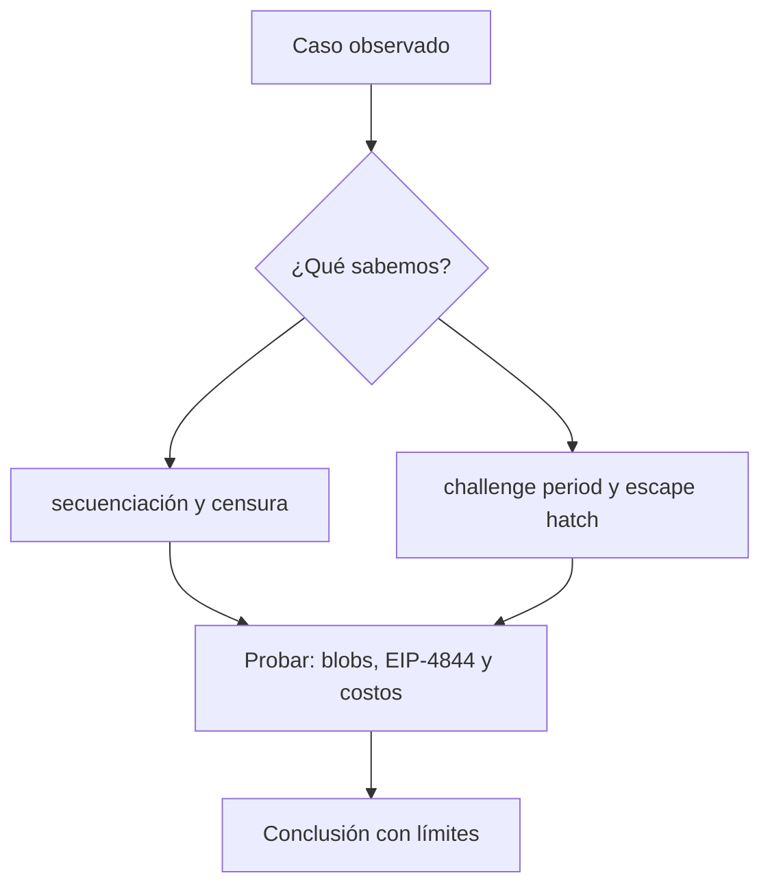

# Clase 26 · Riesgo operativo de una L2

> **Clase independiente 26 de 66** · **Nivel:** Avanzado · **Fuente base:** *An Incomplete Guide to Rollups* (Buterin) y L2BEAT
>
> [⬅️ Clase anterior](../12-escalabilidad/clase-25-familias-de-escalabilidad.md) · [📚 Índice de las 66 clases](../README.md) · [🗂️ Mapa del tema](README.md) · [➡️ Clase siguiente](../13-interoperabilidad/clase-27-mensajes-y-activos-entre-cadenas.md)

## Punto de partida

**Pregunta guía:** ¿Puede el usuario recuperar fondos si el secuenciador o el portal fallan?

**Caso que abre la clase:** Un secuenciador se detiene y el usuario necesita forzar una salida.

El usuario intenta consultar, enviar y retirar mientras componentes dejan de responder. La clase verifica rutas de escape en contratos y no sólo en documentación comercial.

## Gráfico pedagógico

Recorre el gráfico en voz alta: identifica supuestos, transformaciones y el punto exacto donde aparece evidencia.



## Fundamentos que sostienen la respuesta

1. **secuenciación y censura.** En esta clase delimita qué objeto o relación estamos observando antes de sacar conclusiones. Localízalo explícitamente en «Un secuenciador se detiene y el usuario necesita forzar una salida.» y anota qué dato faltaría para refutar tu lectura.
2. **challenge period y escape hatch.** En esta clase explica el mecanismo que conecta la situación inicial con el cambio observable. Localízalo explícitamente en «Un secuenciador se detiene y el usuario necesita forzar una salida.» y anota qué dato faltaría para refutar tu lectura.
3. **blobs, EIP-4844 y costos.** En esta clase permite contrastar el resultado y formular el límite de la evidencia. Localízalo explícitamente en «Un secuenciador se detiene y el usuario necesita forzar una salida.» y anota qué dato faltaría para refutar tu lectura.

### El impacto medible de EIP-4844: blobs frente a calldata

Antes de Dencun (marzo de 2024), los rollups publicaban sus datos como *calldata* en transacciones normales de Ethereum, compitiendo por gas con todas las demás transacciones: cada byte distinto de cero costaba 16 gas y ese coste dominaba la factura de un rollup, llegando a representar más del 90% de sus gastos operativos. EIP-4844 introdujo las *blob-carrying transactions*: cada blob aporta ~128 KB de datos con un mercado de tarifas propio e independiente (fee market separado con su propio precio base), y los blobs se podan de los nodos tras ~18 días, porque solo necesitan estar disponibles durante la ventana de verificación, no para siempre.

El efecto fue inmediato y medible: en las semanas posteriores a Dencun, las comisiones de usuario en los principales L2 cayeron en más de un orden de magnitud (reducciones superiores a 10x fue el patrón general; en varios rollups una transacción pasó de decenas de centavos a fracciones de centavo). Un ejemplo numérico orientativo del mecanismo: si un batch de 100 000 bytes costaba en calldata unos 1 600 000 gas solo en datos, con blobs ese mismo volumen se paga en un mercado que, cuando hay poca demanda de blobs, tiende al precio mínimo (1 wei por gas de blob), es decir, prácticamente gratis en términos relativos. Las cifras actuales de tarifas por L2 son volátiles: consúltalo en vivo en [L2BEAT](https://l2beat.com/) y en [Dune](https://dune.com/). El siguiente paso del roadmap, el danksharding completo, ampliará el número de blobs por bloque con *data availability sampling*; a 2025 sigue siendo trabajo en curso.

### De dónde sale realmente el ahorro de una L2

"Las L2 son más baratas" es cierto, pero la razón que suele darse —"porque procesan fuera de la cadena"— es incompleta. El ahorro tiene dos fuentes de tamaño muy distinto, y saber cuál es cuál explica por qué las comisiones de L2 bajaron de golpe en marzo de 2024.

**El coste de una transacción en un rollup son dos partidas:**

```text
coste total = ejecución en L2  +  parte proporcional de publicar el lote en L1
              (baratísima)        (la que domina la factura)
```

La ejecución en L2 es barata porque la hace un secuenciador con hardware normal, sin miles de nodos replicando. Pero eso es la parte pequeña. **Lo que de verdad se paga es el espacio en L1**, y ahí está la clave: el coste se reparte entre todas las transacciones del lote.

| Transacciones en el lote | Coste de publicar por transacción |
|---:|---|
| 1 | el lote entero |
| 100 | 1/100 |
| 1 000 | 1/1 000 |

De ahí sale una propiedad contraintuitiva: **una L2 es más barata cuanto más se usa**. Con poca actividad, cada usuario carga con una porción mayor del coste fijo de publicar.

**Y por eso EIP-4844 cambió tanto las cosas.** Antes de Dencun (marzo de 2024), los rollups publicaban sus datos como `calldata`, compitiendo por el mismo espacio de bloque que todas las transacciones de L1. Los *blobs* crearon un espacio de datos separado, con su propio mercado de precios y **efímero** (se borra a las pocas semanas, que es tiempo de sobra para que cualquiera descargue y verifique). Resultado: el coste de publicar cayó de forma drástica y las comisiones de L2 se desacoplaron de la congestión de L1.

**La pregunta que hay que saber responder:** si los blobs se borran, ¿sigue siendo seguro? Sí, y por una razón concreta: la disponibilidad de datos solo necesita ser suficiente para que **cualquiera pueda descargarlos y reconstruir el estado o impugnar un fraude**. Pasada la ventana de disputa, guardar esos datos para siempre en todos los nodos ya no aporta seguridad, solo coste.

> 💡 **En una frase:** en un rollup no pagas por computar, pagas por publicar; por eso se abarata al llenarse y por eso los blobs cambiaron la ecuación entera.

<details>
<summary><strong>🎓 Si ya dominas esto</strong> — lo que separa un rollup de algo que se llama rollup</summary>

- **La pregunta que ordena la taxonomía es "¿dónde viven los datos?".** Rollup = en L1; validium = fuera, con un comité; optimium = fuera, con pruebas de fraude. Si los datos no están en L1, la seguridad depende de que alguien te los entregue, y eso es un supuesto de confianza adicional que hay que enunciar.
- **Casi todas las L2 conservan claves de actualización.** L2BEAT las clasifica por etapas (0, 1, 2) según cuánta capacidad tiene el usuario de salir sin permiso del operador. Una "L2" en etapa 0 con un multisig que puede cambiar la lógica del puente es, en la práctica, un sistema custodiado con muy buena criptografía.
- **La descentralización del secuenciador está sin resolver.** Casi todas operan uno solo, lo que permite censurar y extraer MEV. La mitigación es la **inclusión forzada** desde L1: comprueba si existe y con qué retraso, porque es la diferencia entre poder salir y depender de la buena voluntad del operador.
- **Los puentes de liquidez no son el puente canónico.** Salir "al instante" de un optimistic rollup significa que alguien te adelanta fondos en L1 y se queda esperando el retiro real: pagas una prima y asumes el riesgo de ese tercero, no el del protocolo.
- **Comparar cadenas por TPS es comparar por la métrica equivocada.** El TPS depende del límite de gas y del tipo de transacción, y no dice nada del modelo de seguridad. Dos números honestos: coste por transacción y qué hace falta para que te roben.

</details>

## Trabajo práctico

**Método propio:** simulacro de caída del secuenciador.

**Actividad:** Construir un mapa de dependencias y verificar mecanismos de escape.

Trabaja en entorno local, regtest, signet o testnet según corresponda. Conserva entradas, comandos, salidas y bloque o instante de corte. Una captura aislada no demuestra reproducibilidad.

## Errores que esta clase corrige

- Tratar **secuenciación y censura** como una etiqueta suficiente, sin identificar actores, dato y frontera.
- Usar **challenge period y escape hatch** como explicación aunque el caso no aporte la evidencia necesaria.
- Dar por respondido «¿Puede el usuario recuperar fondos si el secuenciador o el portal fallan?» sin contrastar **blobs, EIP-4844 y costos**.

Vuelve al caso inicial, elige el error más peligroso y describe una comprobación concreta que lo detectaría.

## Demostración de aprendizaje

**Entregable:** Evaluación de riesgo basada en contratos, claves y estado de madurez.

**Comprobación formativa:** ¿Puede salir el usuario sin cooperación del operador y bajo qué demora?

Para aprobar debes conectar el hecho observado con el concepto correcto, descartar al menos una interpretación alternativa y redactar una conclusión cuyo alcance no exceda la prueba.

## Fuentes para comprobar y ampliar

- Buterin, V., *An Incomplete Guide to Rollups* — <https://vitalik.eth.limo/general/2021/01/05/rollup.html>
- ethereum.org, documentación de escalado — <https://ethereum.org/developers/docs/scaling/>
- L2BEAT, riesgos y estado de las capas 2 (datos en vivo) — <https://l2beat.com/>
- Fuente primaria: EIP-4844 (Shard Blob Transactions) — <https://eips.ethereum.org/EIPS/eip-4844>

Consulta además la [bibliografía razonada](../../docs/bibliografia.md), que declara procedencia y uso.

## Cierre de la clase

Responde otra vez la pregunta guía sin mirar notas. Si tu respuesta no menciona evidencia, supuesto y límite, todavía describe el tema pero no lo domina. Continúa solo cuando otra persona pueda reproducir tu entregable.
