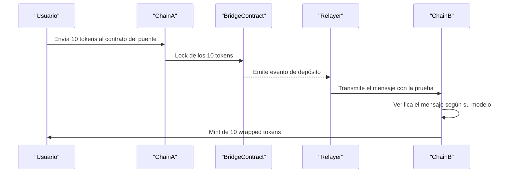
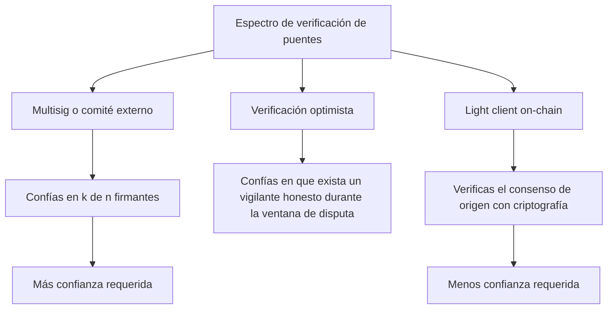

# 13 · Interoperabilidad y ecosistemas

> **Nivel:** Avanzado · ⏱️ **Duración estimada:** 150 min · **Fuente:** documentación de Cosmos IBC y de Polkadot (XCM)
> [⬅️ Currículo](../README.md) · [📚 Bibliografía](../../docs/bibliografia.md)
> 🧭 ⬅️ **Anterior:** [12 · Escalabilidad y capas 2](../12-escalabilidad/README.md) · [📚 Índice](../README.md) · ➡️ **Siguiente:** [14 · Privacidad y zero knowledge](../14-privacidad-zk/README.md)

---

## 🎯 Objetivos

- Distinguir los mecanismos de puente (lock-and-mint, burn-and-mint), los light clients, la mensajería y los atomic swaps (HTLC).
- Comparar los modelos de interoperabilidad de EVM, Solana, Cosmos/IBC, Polkadot/XCM y redes empresariales como Hyperledger Fabric.
- Construir el modelo de amenazas de un puente identificando cada confianza añadida.
- Explicar por qué los puentes concentran riesgo y han sido el mayor vector de pérdidas del sector.
- Situar enfoques de mensajería como CCIP y LayerZero dentro del espectro confianza/verificación.

## 📚 Resultados de aprendizaje

Al finalizar, el estudiante podrá:

1. **Clasificar** un puente según su mecanismo de custodia y su método de verificación de mensajes.
2. **Comparar** IBC (verificación por light client) con puentes basados en un conjunto externo de validadores.
3. **Enumerar** los vectores de ataque de un puente y asociarlos a controles concretos.
4. **Evaluar** cómo la diferencia de finalidad entre cadenas habilita ataques de reorganización o replay.
5. **Justificar** cuándo conviene mensajería genérica frente a puentes de activos dedicados.
6. **Modelar** la confianza añadida de una arquitectura cross-chain y proponer su reducción.

## 🗺️ Temas

| # | Tema | Por qué importa |
|---|------|-----------------|
| 1 | Lock-and-mint vs. burn-and-mint | Definen dónde queda la custodia y cómo se conserva el suministro |
| 2 | Light clients y verificación nativa | Sustituyen la confianza en terceros por verificación criptográfica |
| 3 | Message passing (IBC, XCM) | Permiten transferir datos, no solo activos, entre cadenas |
| 4 | Atomic swaps y HTLC | Intercambian valor sin custodio, con garantías de atomicidad |
| 5 | Diferencia de finalidad entre cadenas | Una cadena reorganizable puede invalidar mensajes ya aceptados |
| 6 | Validadores/guardianes de puente | Su compromiso es el mayor riesgo histórico del sector |
| 7 | Replay y verificación incompleta | Mensajes repetidos o mal validados permiten acuñar de más |
| 8 | Interoperabilidad empresarial (Fabric) | Muestra otro modelo: permisos, canales y confianza acotada |

## 🧠 Modelo mental

Un puente es como una casa de cambio entre dos países con leyes distintas: deposita moneda en un país y recibe un pagaré canjeable en el otro. La seguridad no depende de la moneda, sino de quién custodia el depósito y de cómo se verifica que el pagaré es legítimo. Un light client es un notario que revisa por sí mismo las pruebas del país de origen; un conjunto de validadores externos es un grupo de firmantes en quien hay que confiar. Cuanto más se parezca el puente a "confiar en firmantes" y menos a "verificar pruebas", más superficie de ataque introduce.

La analogía se rompe en dos puntos: los países no se reorganizan, pero una cadena con finalidad probabilística sí puede revertir bloques, invalidando un pagaré ya emitido; y un pagaré físico no se puede "reproducir", mientras que un mensaje mal protegido puede reejecutarse (replay) para acuñar de más. Por eso modelar interoperabilidad es, ante todo, enumerar cada confianza añadida y cada supuesto de finalidad.

## 🧩 Esquema visual

Flujo completo de un puente lock-and-mint: el activo queda bloqueado en origen y una representación se acuña en destino.



Espectro de verificación de los puentes, ordenado de mayor a menor confianza requerida en terceros:



## 📖 Conceptos y definiciones

- **Lock-and-mint**: bloquea el activo en la cadena de origen y acuña una representación en destino; el custodio del bloqueo es el punto crítico.
- **Burn-and-mint**: quema la representación en una cadena y acuña la equivalente en otra, conservando el suministro total sin custodia acumulada.
- **Light client**: verificador ligero que comprueba pruebas de consenso de otra cadena sin confiar en intermediarios; base de IBC.
- **Message passing**: transporte verificable de datos arbitrarios entre cadenas; IBC en Cosmos y XCM en Polkadot son ejemplos.
- **Atomic swap (HTLC)**: intercambio condicionado por un secreto y un tiempo límite que garantiza que ambas partes cumplen o ninguna lo hace.
- **Replay**: reejecución de un mensaje válido para obtener un efecto repetido, como acuñar dos veces; se evita con nonces y pruebas de consumo.
- **Finalidad**: momento en que un bloque se considera irreversible; su diferencia entre cadenas condiciona cuándo es seguro actuar sobre un mensaje.
- **Guardianes/validadores de puente**: conjunto externo que atestigua mensajes; su compromiso permite falsificar acuñaciones.
- **CCIP**: protocolo de mensajería de Chainlink con verificación y una red de riesgo independiente para transferencias cross-chain.
- **LayerZero**: enfoque de mensajería que separa el envío del mensaje de su verificación mediante componentes configurables.

## 🔬 Profundización

### Los grandes hacks de puentes: anatomía de un patrón común

Los tres mayores incidentes de puentes de 2022 suman más de mil millones de dólares y comparten diagnóstico: la verificación del mensaje se degradó, en la práctica, a confiar en muy pocas partes o en ninguna.

| Incidente | Año | Pérdida aprox. | Fallo raíz | Lección |
|-----------|-----|----------------|------------|---------|
| Ronin (Axie Infinity) | 2022 | ~624 M USD | El atacante comprometió 5 de las 9 claves de validadores (4 de Sky Mavis más una delegada) y firmó retiros falsos | Un multisig pequeño y correlacionado es un punto único de fallo; el hack tardó días en detectarse |
| Wormhole | 2022 | ~326 M USD | La verificación de firmas en Solana usaba una función deprecada que permitió falsificar la comprobación y acuñar 120 000 wETH sin respaldo | La verificación es tan fuerte como su implementación; una dependencia obsoleta anula todo el diseño |
| Nomad | 2022 | ~190 M USD | Una actualización dejó la raíz de confianza inicializada en cero, de modo que cualquier mensaje se daba por probado; cientos de imitadores copiaron el exploit | Un valor por defecto inseguro convirtió la verificación en un "acepta todo"; los errores de configuración también son criptográficos |

El patrón común: en los tres casos el sistema *decía* verificar mensajes, pero la verificación efectiva se había reducido a un puñado de claves (Ronin), a una comprobación falsificable (Wormhole) o a nada (Nomad). Al modelar un puente, la pregunta correcta no es "¿verifica?" sino "¿qué es lo mínimo que hay que comprometer para que acepte un mensaje falso?".

### Verificación por light client: el sync committee de Ethereum

Un light client on-chain sustituye a los firmantes externos por la verificación directa del consenso de la cadena de origen. En Ethereum, el mecanismo práctico es el *sync committee* introducido en Altair: un comité de 512 validadores seleccionados aleatoriamente que rota cada ~27 horas y firma cada cabecera de bloque con firmas BLS agregables. Un contrato light client desplegado en la cadena destino guarda el comité vigente, verifica la firma agregada de cada nueva cabecera (basta con que firmen 2/3 del comité) y actualiza el comité siguiente a partir de la propia cabecera firmada. Con una cabecera verificada, cualquier hecho de la cadena de origen —un depósito, un evento— se demuestra con una prueba de Merkle contra su raíz de estado.

El coste es real: verificar firmas BLS y mantener el estado del light client en cadena consume mucho más gas que comprobar k firmas de un multisig, y por eso varios proyectos comprimen esa verificación dentro de una prueba ZK (los llamados *ZK light clients*). A cambio, el supuesto de confianza se reduce de "estos n firmantes del puente son honestos" a "el consenso de Ethereum es honesto", que es exactamente el supuesto que el usuario ya aceptaba al usar Ethereum. IBC en Cosmos aplica el mismo principio entre cadenas Tendermint, donde la finalidad instantánea hace los light clients especialmente baratos.

### Clasificación de la mensajería cross-chain

| Protocolo | Quién verifica el mensaje | Supuesto de confianza | Madurez y ámbito |
|-----------|---------------------------|------------------------|------------------|
| IBC (Cosmos) | Light client on-chain de la cadena de origen | El consenso de origen es honesto; sin terceros añadidos | En producción desde 2021 entre decenas de cadenas Tendermint; expansión fuera de Cosmos en curso |
| CCIP (Chainlink) | Redes de oráculos descentralizadas más una Risk Management Network independiente | Honestidad de mayorías en dos redes separadas entre sí | En producción desde 2023, orientado a adopción institucional y transferencias de valor |
| LayerZero | Componentes configurables por la aplicación (DVNs en v2) que atestiguan el mensaje | Depende de la configuración elegida: desde un solo verificador hasta comités múltiples | En producción y ampliamente integrado; la seguridad efectiva varía por aplicación |

La tabla deja una conclusión incómoda: no existe "el estándar" de interoperabilidad, sino un espectro donde cada diseño intercambia coste, generalidad y confianza. La verificación por light client es el patrón oro en minimización de confianza, pero su coste y su acoplamiento al consenso de origen explican por qué los modelos intermedios dominan el mercado. El estado de adopción de cada protocolo cambia rápido: consúltalo en vivo en sus documentaciones y en agregadores independientes.

## 🧪 Laboratorio guiado

Este módulo es un ejercicio de modelado de amenazas, sin código de repositorio. Consulta el índice de prácticas del curso en [laboratorios](../../labs/CATALOG.md).

1. Elige un puente real o de referencia y describe su flujo: origen, custodia, atestación del mensaje y acuñación en destino.
2. Dibuja el diagrama de actores y confía cada paso a alguien; marca dónde aparece una confianza añadida.

```text
Vector                        | ¿Aplica? | Control / mitigación
------------------------------+----------+---------------------
Validadores comprometidos     | ...      | ...
Replay de mensajes            | ...      | ...
Verificación incompleta       | ...      | ...
Actualización administrativa  | ...      | ...
Diferencia de finalidad       | ...      | ...
Liquidez insuficiente         | ...      | ...
```

3. Para cada vector, indica cómo se detectaría un ataque y quién asume la pérdida.
4. Contrasta el diseño con uno basado en light client (IBC) y señala qué confianza desaparece.
5. Redacta una recomendación de un párrafo sobre si usar mensajería genérica (CCIP/LayerZero) o un puente dedicado.

## 📝 Reto verificable

Entrega el modelo de amenazas de un puente concreto: diagrama de flujo, tabla de los seis vectores con su mitigación y una conclusión que compare el diseño con una alternativa verificada por light client.

**Criterio de aceptación:** la tabla cubre los seis vectores (validadores comprometidos, replay, verificación incompleta, actualización administrativa, diferencia de finalidad y liquidez insuficiente), cada uno con un control explícito, y la conclusión identifica al menos una confianza añadida que la alternativa elimina.

## ⚠️ Errores frecuentes

| Síntoma | Causa y cómo comprobarlo |
|---------|--------------------------|
| Suponer que todos los puentes son igual de seguros | Se ignora el método de verificación; comprueba si usa light client o firmantes externos |
| Olvidar la protección anti-replay | Falta de nonce o de prueba de consumo; revisa si el mensaje puede reejecutarse |
| Actuar sobre un mensaje antes de la finalidad | La cadena de origen se reorganiza; verifica el tipo de finalidad de cada extremo |
| Confiar en una clave administrativa "temporal" | El upgrade admin permite drenar fondos; audita quién controla el proxy |
| Confundir liquidez con seguridad | Un puente con fondos puede seguir siendo vulnerable; separa TVL de modelo de confianza |
| Asumir que "cross-chain" equivale a "sin confianza" | Todo puente añade supuestos; enumera cada uno explícitamente |

## 🛡️ Seguridad y ética

- Realiza todo el análisis en local o testnet; no transfieras fondos reales ni utilices claves privadas reales.
- No conectes wallets con activos a puentes o dApps durante el estudio, ni firmes mensajes que no comprendas.
- Reconoce que los puentes han causado las mayores pérdidas del sector; comunica el riesgo con honestidad, sin minimizarlo.
- Documenta cada supuesto de confianza; ocultarlo es una omisión ética, no un detalle técnico.
- Respeta las licencias y avisos de las cadenas empresariales (por ejemplo Fabric) al modelar escenarios permisionados.

## 🔗 Referencias

- Cosmos, documentación de IBC (Inter-Blockchain Communication) — <https://ibc.cosmos.network/>
- Polkadot Wiki, XCM (Cross-Consensus Messaging) — <https://wiki.polkadot.network/docs/learn-xcm>
- Chainlink, documentación de CCIP — <https://docs.chain.link/ccip>
- Hyperledger Fabric, documentación oficial — <https://hyperledger-fabric.readthedocs.io/>
- Fuente primaria: Cosmos IBC, especificación del protocolo y su verificación por light client — <https://ibc.cosmos.network/>

## ✅ Criterio de dominio

- Reconstruyes el flujo de un puente y señalas cada confianza añadida sin ayuda.
- Explicas cómo la finalidad y el replay afectan la seguridad de un mensaje cross-chain.
- Justificas cuándo un diseño por light client reduce riesgo frente a un conjunto de validadores externos.

---

## 🧭 Navegación

⬅️ [Módulo 12 · Escalabilidad y capas 2](../12-escalabilidad/README.md) · [📚 Índice del currículo](../README.md) · ➡️ [Módulo 14 · Privacidad y zero knowledge](../14-privacidad-zk/README.md)
