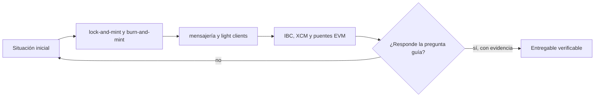

# Clase 27 · Mensajes y activos entre cadenas

> **Clase independiente 27 de 66** · **Nivel:** Avanzado · **Fuente base:** documentación de Cosmos IBC y de Polkadot (XCM)
>
> [⬅️ Clase anterior](../12-escalabilidad/clase-26-riesgo-operativo-de-una-l2.md) · [📚 Índice de las 66 clases](../README.md) · [🗂️ Mapa del tema](README.md) · [➡️ Clase siguiente](../13-interoperabilidad/clase-28-modelo-de-amenazas-de-puentes.md)

## Punto de partida

**Pregunta guía:** ¿Qué significa mover un activo si cada red mantiene su propio estado?

**Caso que abre la clase:** Un token envuelto conserva oferta mientras el activo bloqueado desaparece.

Cada bloqueo, emisión, quema y liberación se registra en una misma tabla. El movimiento se entiende como coordinación de estados, no como transporte físico de tokens.

## Fundamentos que sostienen la respuesta

1. **lock-and-mint y burn-and-mint.** En esta clase delimita qué objeto o relación estamos observando antes de sacar conclusiones. Localízalo explícitamente en «Un token envuelto conserva oferta mientras el activo bloqueado desaparece.» y anota qué dato faltaría para refutar tu lectura.
2. **mensajería y light clients.** En esta clase explica el mecanismo que conecta la situación inicial con el cambio observable. Localízalo explícitamente en «Un token envuelto conserva oferta mientras el activo bloqueado desaparece.» y anota qué dato faltaría para refutar tu lectura.
3. **IBC, XCM y puentes EVM.** En esta clase permite contrastar el resultado y formular el límite de la evidencia. Localízalo explícitamente en «Un token envuelto conserva oferta mientras el activo bloqueado desaparece.» y anota qué dato faltaría para refutar tu lectura.

### Verificación por light client: el sync committee de Ethereum

Un light client on-chain sustituye a los firmantes externos por la verificación directa del consenso de la cadena de origen. En Ethereum, el mecanismo práctico es el *sync committee* introducido en Altair: un comité de 512 validadores seleccionados aleatoriamente que rota cada ~27 horas y firma cada cabecera de bloque con firmas BLS agregables. Un contrato light client desplegado en la cadena destino guarda el comité vigente, verifica la firma agregada de cada nueva cabecera (basta con que firmen 2/3 del comité) y actualiza el comité siguiente a partir de la propia cabecera firmada. Con una cabecera verificada, cualquier hecho de la cadena de origen —un depósito, un evento— se demuestra con una prueba de Merkle contra su raíz de estado.

El coste es real: verificar firmas BLS y mantener el estado del light client en cadena consume mucho más gas que comprobar k firmas de un multisig, y por eso varios proyectos comprimen esa verificación dentro de una prueba ZK (los llamados *ZK light clients*). A cambio, el supuesto de confianza se reduce de "estos n firmantes del puente son honestos" a "el consenso de Ethereum es honesto", que es exactamente el supuesto que el usuario ya aceptaba al usar Ethereum. IBC en Cosmos aplica el mismo principio entre cadenas Tendermint, donde la finalidad instantánea hace los light clients especialmente baratos.

### Clasificación de la mensajería cross-chain

| Protocolo | Quién verifica el mensaje | Supuesto de confianza | Madurez y ámbito |
|-----------|---------------------------|------------------------|------------------|
| IBC (Cosmos) | Light client on-chain de la cadena de origen | El consenso de origen es honesto; sin terceros añadidos | En producción desde 2021 entre decenas de cadenas Tendermint; expansión fuera de Cosmos en curso |
| CCIP (Chainlink) | Redes de oráculos descentralizadas más una Risk Management Network independiente | Honestidad de mayorías en dos redes separadas entre sí | En producción desde 2023, orientado a adopción institucional y transferencias de valor |
| LayerZero | Componentes configurables por la aplicación (DVNs en v2) que atestiguan el mensaje | Depende de la configuración elegida: desde un solo verificador hasta comités múltiples | En producción y ampliamente integrado; la seguridad efectiva varía por aplicación |

La tabla deja una conclusión incómoda: no existe "el estándar" de interoperabilidad, sino un espectro donde cada diseño intercambia coste, generalidad y confianza. La verificación por light client es el patrón oro en minimización de confianza, pero su coste y su acoplamiento al consenso de origen explican por qué los modelos intermedios dominan el mercado. El estado de adopción de cada protocolo cambia rápido: consúltalo en vivo en sus documentaciones y en agregadores independientes.

### Por qué los puentes concentran los mayores robos del sector

No es casualidad ni mala suerte: es estructural. Un puente reúne tres condiciones que, juntas, lo convierten en el objetivo más rentable del ecosistema.

1. **Acumula valor en un punto.** En el esquema *lock-and-mint*, todo lo que se ha movido a la otra cadena está bloqueado en un contrato. Ese contrato es un solo objetivo con el valor de miles de usuarios.
2. **Suele verificar con firmantes, no con criptografía de consenso.** Si el puente acepta un mensaje porque *k* de *n* guardianes lo firmaron, comprometer esas *k* claves basta para acuñar de la nada.
3. **Es código nuevo y complejo** en un sitio donde el resto está muy auditado. La lógica de mensajería cross-chain no tiene décadas de escrutinio detrás.

**Los tres patrones que se repiten en los incidentes públicos:**

| Patrón | Qué falla | Cómo se ve en el código |
|---|---|---|
| **Claves comprometidas** | El atacante consigue las firmas necesarias del conjunto verificador | Umbral bajo, o firmantes que comparten infraestructura y por tanto no son independientes |
| **Verificación defectuosa** | El contrato acepta como válida una prueba que no lo es | La comprobación no valida todos los campos, o hay un valor por defecto que pasa el filtro |
| **Falta de anti-replay** | Un mensaje legítimo se reejecuta y acuña dos veces | No hay `nonce` consumido, o el registro de mensajes procesados se puede reiniciar |

**La pregunta que ordena el análisis de cualquier puente**, y que reemplaza a "¿es seguro?":

> ¿Qué tendría que ocurrir para que se acuñe un token en destino sin que exista el bloqueo correspondiente en origen?

La respuesta es su modelo de seguridad, dicho en una frase:

- *"Que se rompa el consenso de la cadena de origen"* → verificación por **light client**. El puente hereda la seguridad de la cadena, que es lo máximo alcanzable.
- *"Que se coludan k de n firmantes"* → verificación **externa**. La seguridad es la de esas k claves, sin importar el TVL ni la marca.
- *"Que el administrador del proxy lo decida"* → hay una **clave de actualización** que puede reemplazar toda la lógica. Es el escenario que hay que auditar primero, y el que más veces se pasa por alto.

> 💡 **En una frase:** todo puente añade supuestos de confianza; el análisis honesto consiste en enumerarlos, no en preguntar si es seguro.

<strong>🎓 Si ya dominas esto</strong> — el detalle operativo

- **La diferencia de finalidad entre extremos es un fallo silencioso.** Actuar sobre un mensaje antes de la finalidad de la cadena de origen permite acuñar contra un bloque que luego desaparece. Cada extremo necesita su propio número de confirmaciones, derivado de su tipo de finalidad, no un valor único copiado.
- **Los HTLC resuelven el intercambio, no la mensajería.** Sirven para un swap atómico entre dos partes con un secreto y un plazo, pero no transportan datos arbitrarios ni escalan a un puente de uso general. Confundirlos lleva a diseños que no cierran.
- **IBC funciona porque exige finalidad instantánea.** Los light clients de Tendermint pueden verificar el consenso ajeno de forma barata precisamente porque no hay finalidad probabilística. Trasladar el modelo a cadenas con finalidad probabilística es mucho más caro, y esa es la razón técnica de que no sea universal.
- **La representación acuñada no es fungible con el activo original.** Un "USDC puenteado" es un pagaré del puente. Si el puente cae, ese token vale lo que valga la recuperación de sus fondos, no un dólar. Los incidentes lo demuestran cada vez.
- **La mensajería con verificación configurable traslada la decisión al integrador.** Cuando el protocolo permite elegir quién verifica, la seguridad del puente pasa a depender de una configuración que el desarrollador puede dejar en su valor por defecto sin entenderla.

## Trabajo práctico

**Método propio:** contabilidad de un activo entre cadenas.

**Actividad:** Trazar emisión, bloqueo, mensaje, prueba y redención extremo a extremo.

Trabaja en entorno local, regtest, signet o testnet según corresponda. Conserva entradas, comandos, salidas y bloque o instante de corte. Una captura aislada no demuestra reproducibilidad.

## Gráfico pedagógico

Recorre el gráfico en voz alta: identifica supuestos, transformaciones y el punto exacto donde aparece evidencia.

## Demostración de aprendizaje

**Entregable:** Invariante de suministro y lista de verificadores en cada frontera.

**Comprobación formativa:** Formula la invariante que evita crear más representaciones que activos respaldantes.

Para aprobar debes conectar el hecho observado con el concepto correcto, descartar al menos una interpretación alternativa y redactar una conclusión cuyo alcance no exceda la prueba.

## Errores que esta clase corrige

- Tratar **lock-and-mint y burn-and-mint** como una etiqueta suficiente, sin identificar actores, dato y frontera.
- Usar **mensajería y light clients** como explicación aunque el caso no aporte la evidencia necesaria.
- Dar por respondido «¿Qué significa mover un activo si cada red mantiene su propio estado?» sin contrastar **IBC, XCM y puentes EVM**.

Vuelve al caso inicial, elige el error más peligroso y describe una comprobación concreta que lo detectaría.

## Fuentes para comprobar y ampliar

- Cosmos, documentación de IBC (Inter-Blockchain Communication) — <https://ibc.cosmos.network/>
- Polkadot Wiki, XCM (Cross-Consensus Messaging) — <https://wiki.polkadot.network/docs/learn-xcm>
- Chainlink, documentación de CCIP — <https://docs.chain.link/ccip>
- Hyperledger Fabric, documentación oficial — <https://hyperledger-fabric.readthedocs.io/>
- Fuente primaria: Cosmos IBC, especificación del protocolo y su verificación por light client — <https://ibc.cosmos.network/>

Consulta además la [bibliografía razonada](../../docs/bibliografia.md), que declara procedencia y uso.

## Cierre de la clase

Responde otra vez la pregunta guía sin mirar notas. Si tu respuesta no menciona evidencia, supuesto y límite, todavía describe el tema pero no lo domina. Continúa solo cuando otra persona pueda reproducir tu entregable.
