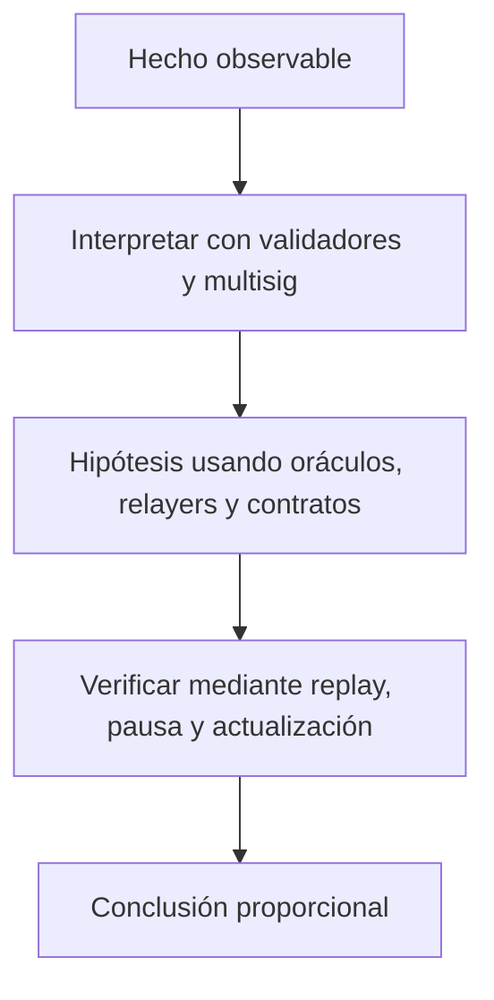

# Clase 28 · Modelo de amenazas de puentes

> **Clase independiente 28 de 66** · **Nivel:** Avanzado · **Fuente base:** documentación de Cosmos IBC y de Polkadot (XCM)
>
> [⬅️ Clase anterior](../13-interoperabilidad/clase-27-mensajes-y-activos-entre-cadenas.md) · [📚 Índice de las 66 clases](../README.md) · [🗂️ Mapa del tema](README.md) · [➡️ Clase siguiente](../14-privacidad-zk/clase-29-compromisos-y-pruebas-de-conocimiento-cero.md)

## Punto de partida

**Pregunta guía:** ¿Qué nueva confianza introduce cada capa de interoperabilidad?

**Caso que abre la clase:** Una clave administrativa actualiza el verificador y habilita retiros falsos.

Los equipos atacan relayer, verificador, claves, contratos y actualización por separado. La pérdida máxima obliga a priorizar controles en vez de enumerar amenazas.

## Trabajo práctico

**Método propio:** threat modeling de un puente.

**Actividad:** Atacar conceptualmente cinco puntos del flujo y proponer defensas.

Trabaja en entorno local, regtest, signet o testnet según corresponda. Conserva entradas, comandos, salidas y bloque o instante de corte. Una captura aislada no demuestra reproducibilidad.

## Fundamentos que sostienen la respuesta

1. **validadores y multisig.** En esta clase delimita qué objeto o relación estamos observando antes de sacar conclusiones. Localízalo explícitamente en «Una clave administrativa actualiza el verificador y habilita retiros falsos.» y anota qué dato faltaría para refutar tu lectura.
2. **oráculos, relayers y contratos.** En esta clase explica el mecanismo que conecta la situación inicial con el cambio observable. Localízalo explícitamente en «Una clave administrativa actualiza el verificador y habilita retiros falsos.» y anota qué dato faltaría para refutar tu lectura.
3. **replay, pausa y actualización.** En esta clase permite contrastar el resultado y formular el límite de la evidencia. Localízalo explícitamente en «Una clave administrativa actualiza el verificador y habilita retiros falsos.» y anota qué dato faltaría para refutar tu lectura.

### Los grandes hacks de puentes: anatomía de un patrón común

Los tres mayores incidentes de puentes de 2022 suman más de mil millones de dólares y comparten diagnóstico: la verificación del mensaje se degradó, en la práctica, a confiar en muy pocas partes o en ninguna.

| Incidente | Año | Pérdida aprox. | Fallo raíz | Lección |
|-----------|-----|----------------|------------|---------|
| Ronin (Axie Infinity) | 2022 | ~624 M USD | El atacante comprometió 5 de las 9 claves de validadores (4 de Sky Mavis más una delegada) y firmó retiros falsos | Un multisig pequeño y correlacionado es un punto único de fallo; el hack tardó días en detectarse |
| Wormhole | 2022 | ~326 M USD | La verificación de firmas en Solana usaba una función deprecada que permitió falsificar la comprobación y acuñar 120 000 wETH sin respaldo | La verificación es tan fuerte como su implementación; una dependencia obsoleta anula todo el diseño |
| Nomad | 2022 | ~190 M USD | Una actualización dejó la raíz de confianza inicializada en cero, de modo que cualquier mensaje se daba por probado; cientos de imitadores copiaron el exploit | Un valor por defecto inseguro convirtió la verificación en un "acepta todo"; los errores de configuración también son criptográficos |

El patrón común: en los tres casos el sistema *decía* verificar mensajes, pero la verificación efectiva se había reducido a un puñado de claves (Ronin), a una comprobación falsificable (Wormhole) o a nada (Nomad). Al modelar un puente, la pregunta correcta no es "¿verifica?" sino "¿qué es lo mínimo que hay que comprometer para que acepte un mensaje falso?".

### El puente como sistema de verificadores

Un puente no mueve el mismo objeto entre dos estados canónicos: bloquea, quema o custodia en un lado y provoca una emisión o liberación en el otro. La pregunta de seguridad es quién acepta el mensaje y con qué prueba. Puede ser un light client, un conjunto de firmas, un oráculo o una clave administrativa; cada opción cambia el costo de falsificar, censurar o retrasar.

El modelo de amenazas sigue cinco fronteras: contrato origen, observación, transporte, verificación destino y autoridad de actualización. Replay, firma comprometida, bug de validación y upgrade malicioso producen fallas distintas. La contención define pausa, límites de retiro, demora y coordinación entre cadenas, incluyendo qué ocurre con activos envueltos cuando el respaldo queda inmovilizado.

## Gráfico pedagógico

Recorre el gráfico en voz alta: identifica supuestos, transformaciones y el punto exacto donde aparece evidencia.

## Errores que esta clase corrige

- Tratar **validadores y multisig** como una etiqueta suficiente, sin identificar actores, dato y frontera.
- Usar **oráculos, relayers y contratos** como explicación aunque el caso no aporte la evidencia necesaria.
- Dar por respondido «¿Qué nueva confianza introduce cada capa de interoperabilidad?» sin contrastar **replay, pausa y actualización**.

Vuelve al caso inicial, elige el error más peligroso y describe una comprobación concreta que lo detectaría.

## Demostración de aprendizaje

**Entregable:** Threat model priorizado con pérdida máxima y plan de contención.

**Comprobación formativa:** Identifica la confianza dominante incluso si todos los contratos son correctos.

Para aprobar debes conectar el hecho observado con el concepto correcto, descartar al menos una interpretación alternativa y redactar una conclusión cuyo alcance no exceda la prueba.

## Fuentes para comprobar y ampliar

- Cosmos, documentación de IBC (Inter-Blockchain Communication) — <https://ibc.cosmos.network/>
- Polkadot Wiki, XCM (Cross-Consensus Messaging) — <https://wiki.polkadot.network/docs/learn-xcm>
- Chainlink, documentación de CCIP — <https://docs.chain.link/ccip>
- Hyperledger Fabric, documentación oficial — <https://hyperledger-fabric.readthedocs.io/>
- Fuente primaria: Cosmos IBC, especificación del protocolo y su verificación por light client — <https://ibc.cosmos.network/>

Consulta además la [bibliografía razonada](../../docs/bibliografia.md), que declara procedencia y uso.

## Cierre de la clase

Responde otra vez la pregunta guía sin mirar notas. Si tu respuesta no menciona evidencia, supuesto y límite, todavía describe el tema pero no lo domina. Continúa solo cuando otra persona pueda reproducir tu entregable.
