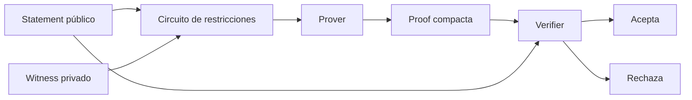
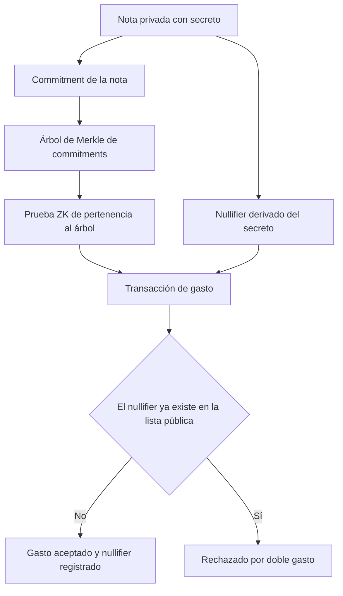

# 14 · Privacidad y zero knowledge

> **Nivel:** Avanzado · ⏱️ **Duración estimada:** 180 min · **Fuente:** *Proofs, Arguments, and Zero-Knowledge* (Thaler) y ZKProof Community Reference
> [⬅️ Currículo](../README.md) · [📚 Bibliografía](../../docs/bibliografia.md)
> 🧭 ⬅️ **Anterior:** [13 · Interoperabilidad y ecosistemas](../13-interoperabilidad/README.md) · [📚 Índice](../README.md) · ➡️ **Siguiente:** [15 · Arquitectura avanzada](../15-arquitectura-avanzada/README.md)
> 📖 [Glosario de términos](../../docs/glosario.md) · 🌱 [¿Nuevo en esto? Empieza aquí](../../docs/empieza-aqui.md)

---

## 🎯 Objetivos

- Definir con precisión compromiso, witness, circuito, prover y verifier dentro de un sistema de conocimiento cero.
- Diferenciar SNARK y STARK en tamaño de prueba, tiempo, setup, supuestos criptográficos y resistencia post-cuántica.
- Explicar qué garantiza y qué no garantiza un trusted setup, y qué aportan los setups universales o transparentes.
- Diseñar conceptualmente una prueba de "soy mayor de 18 años" que no revele la fecha de nacimiento.
- Reconocer que ZK protege el enunciado, pero no elimina automáticamente metadatos ni problemas del mundo real.

## 📚 Resultados de aprendizaje

Al finalizar, el estudiante podrá:

1. **Explicar** las propiedades de completitud, solidez y conocimiento cero en términos de prover y verifier.
2. **Comparar** SNARK y STARK y justificar cuál conviene según setup, tamaño y supuestos.
3. **Diseñar** el enunciado de un circuito de credencial de edad identificando entradas públicas y privadas.
4. **Identificar** quién certifica el dato inicial y qué información sigue expuesta como metadato.
5. **Distinguir** entre setup confiable, universal y transparente y sus implicaciones de confianza.
6. **Evaluar** cómo se revoca una credencial ZK sin comprometer la privacidad del titular.

## 🗺️ Temas

| # | Tema | Por qué importa |
|---|------|-----------------|
| 1 | Prover, verifier y las tres propiedades | Fijan qué significa "probar sin revelar" |
| 2 | Circuito, witness y entradas públicas/privadas | Definen qué se demuestra y qué queda oculto |
| 3 | Compromisos (commitments) | Permiten fijar un valor sin revelarlo hasta después |
| 4 | Trusted setup vs. universal vs. transparente | Determina cuánta confianza inicial exige el sistema |
| 5 | SNARK vs. STARK | Compensan tamaño, tiempo, supuestos y post-cuántico |
| 6 | Credenciales selectivas (prueba de edad) | Caso canónico de minimizar la información revelada |
| 7 | Metadatos y desanonimización | ZK no oculta patrones de red, tiempos ni montos por defecto |
| 8 | Aplicaciones: rollups ZK, privacidad, identidad | Muestran el alcance real y sus límites regulatorios |

## 🧠 Modelo mental

Una prueba de conocimiento cero es como demostrar que conoces la contraseña de una puerta abriéndola frente a un testigo, sin pronunciar la contraseña. El prover convence al verifier de que una afirmación es cierta —"esta persona tiene más de 18 años"— entregando solo una prueba compacta, mientras que el dato sensible (la fecha de nacimiento) permanece como witness privado del circuito. La completitud asegura que las afirmaciones ciertas se aceptan, la solidez que las falsas no, y el conocimiento cero que nada más se filtra del enunciado.

La analogía tiene un límite crucial: aunque no digas la contraseña, el testigo ve a qué hora llegaste, cuántas veces lo intentaste y qué puerta usaste. Igual ocurre con ZK: protege el contenido del enunciado, pero los metadatos —quién emitió la credencial, cuándo se usó, desde qué dirección— pueden seguir revelando información. Además, el sistema hereda un problema del mundo real: alguien debe certificar honestamente el dato inicial, y ZK no verifica esa verdad de origen.

## 🧩 Esquema visual

El recorrido de una prueba de conocimiento cero, desde el enunciado hasta el veredicto del verifier:



Esquema de nullifier para gastar una nota privada exactamente una vez, sin revelar cuál nota se gasta:



## 📖 Conceptos y definiciones

- **Zero knowledge**: propiedad por la cual una prueba convence de la verdad de un enunciado sin revelar nada más allá de su validez.
- **Prover**: parte que posee el witness y genera la prueba; carga el mayor coste computacional del sistema.
- **Verifier**: parte que comprueba la prueba con las entradas públicas; en cadena suele ser un contrato barato de ejecutar.
- **Circuito**: representación de la computación a probar como conjunto de restricciones que el witness debe satisfacer.
- **Witness**: entrada privada (por ejemplo la fecha de nacimiento) que satisface el circuito sin hacerse pública.
- **Compromiso (commitment)**: valor que fija un dato ocultándolo, con la posibilidad de abrirlo después de forma verificable.
- **Trusted setup**: fase que genera parámetros públicos; si los secretos ("toxic waste") no se destruyen, se podrían falsificar pruebas.
- **Setup universal/transparente**: alternativas que reutilizan el setup para muchos circuitos o lo eliminan usando solo aleatoriedad pública.
- **SNARK**: prueba sucinta y de verificación rápida; suele requerir setup y apoyarse en supuestos de curvas elípticas, no post-cuánticos.
- **STARK**: prueba transparente y post-cuántica basada en hashes, con pruebas mayores pero sin trusted setup.

## 🔬 Profundización

### SNARK vs. STARK en números orientativos

Las cifras exactas dependen del esquema concreto (Groth16, PLONK, FRI...), del circuito y del hardware, pero los órdenes de magnitud marcan la decisión de diseño:

| Dimensión | SNARK (p. ej. Groth16, PLONK) | STARK |
|-----------|-------------------------------|-------|
| Tamaño de prueba | Cientos de bytes (Groth16: ~128-200 bytes) | Decenas a cientos de KB |
| Verificación | Milisegundos; barata en cadena (unos pocos pairings) | Milisegundos a decenas de ms; más gas en cadena por el tamaño |
| Setup | Confiable por circuito (Groth16) o universal actualizable (PLONK, KZG) | Transparente: solo aleatoriedad pública, sin ceremonia |
| Supuestos criptográficos | Curvas elípticas con pairings; supuestos no estándar | Funciones hash resistentes a colisiones; supuestos mínimos |
| Resistencia post-cuántica | No: un computador cuántico rompería la curva | Sí, en la medida en que el hash resista |
| Coste del prover | Alto, pero pruebas pequeñas | Alto, con mejor paralelización y sin setup |

Regla práctica: si la verificación en cadena debe ser lo más barata posible y se acepta una ceremonia, un SNARK con setup universal es la opción común; si la transparencia y el post-cuántico pesan más que el tamaño de prueba, un STARK (o un STARK envuelto en un SNARK final para abaratar la verificación, patrón usado por varios rollups) es la elección. Los sistemas de producción evolucionan rápido: contrasta los números del esquema concreto en su documentación.

### Ceremonias de trusted setup: Powers of Tau y el modelo 1-de-N

Un trusted setup genera parámetros públicos a partir de un secreto que debe destruirse; si alguien lo conserva (el llamado *toxic waste*), puede falsificar pruebas indistinguibles de las válidas, sin romper nada más del sistema. Las ceremonias multi-participante mitigan este riesgo transformándolo en un supuesto *1-de-N honesto*: cada participante aporta su propia aleatoriedad secreta y la mezcla secuencialmente con la contribución acumulada; para comprometer el resultado, un atacante necesitaría que **todos** los participantes coludieran o fueran comprometidos, mientras que basta **uno solo** que destruya su secreto para que los parámetros sean seguros.

Powers of Tau es la ceremonia genérica más conocida: produce parámetros reutilizables por muchos circuitos (la "fase 1" común, seguida de una fase 2 específica por circuito en esquemas como Groth16). Ejemplos reales verificables: la ceremonia perpetua de Powers of Tau iniciada por la comunidad de Zcash y Ethereum acumuló cientos de contribuciones públicas y auditables, con participantes que llegaron a usar residuos radiactivos o rituales físicos de destrucción de hardware como evidencia teatral pero ilustrativa; la ceremonia KZG de Ethereum para EIP-4844 (2023) superó las 140 000 contribuciones, el mayor N de la historia, precisamente para que el supuesto "al menos uno fue honesto" resultara socialmente creíble. Los setups universales (PLONK) amortizan una sola ceremonia entre todos los circuitos futuros, y los sistemas transparentes (STARK) la eliminan por completo.

### El nullifier: anti doble gasto sin revelar qué se gasta

En un protocolo de privacidad, las notas no se marcan como "gastadas" —hacerlo revelaría cuál se gastó—. El nullifier resuelve el dilema: es un valor determinista derivado del secreto de la nota, imposible de vincular con su commitment sin conocer ese secreto, pero único por nota. Ejemplo conceptual numerado:

1. Alicia crea una nota con secreto `s` y publica su commitment `C = H(s, valor)` en el árbol de Merkle del protocolo; nadie sabe que `C` es de Alicia.
2. Para gastar, Alicia calcula el nullifier `NF = H'(s)` con una función distinta, y genera una prueba ZK de que conoce un `s` tal que su commitment está en el árbol **y** que `NF` se deriva de ese mismo `s`.
3. El contrato verifica la prueba, comprueba que `NF` no figura en la lista pública de nullifiers, lo añade y libera el gasto. La prueba no revela cuál de los miles de commitments del árbol se usó.
4. Si Alicia intenta gastar la misma nota otra vez, el circuito la obliga a producir el mismo `NF = H'(s)`, que ya está registrado: la transacción se rechaza. El doble gasto se detecta sin haber desanonimizado ningún gasto legítimo.

El mismo patrón aparece fuera de la privacidad de pagos: los rollups ZK y los sistemas de identidad (por ejemplo, votación anónima o airdrops de un solo uso) usan nullifiers para garantizar "una sola vez por secreto" sin correlacionar acciones con identidades. El diseño fino importa: si el nullifier se deriva también de un contexto (un identificador de votación), la misma credencial puede usarse una vez *por contexto* sin que dos usos en contextos distintos sean vinculables.

### Una prueba ZK contada sin matemáticas

La idea suena imposible: *demostrar que sabes algo sin revelar qué sabes*. La analogía clásica —la cueva de Ali Babá— explica el mecanismo mejor que cualquier fórmula.

**La cueva.** Un túnel circular con una puerta cerrada al fondo que solo se abre con una palabra secreta. Desde la entrada, el túnel se bifurca en dos caminos, A y B, que se juntan en la puerta.

**El protocolo:**

1. Tú entras y tomas el camino que quieras. La otra persona **no ve cuál**.
2. Desde la entrada, grita al azar: "¡sal por A!".
3. Si sabes la palabra, sales por A siempre — cruzando la puerta si hiciera falta. Si no la sabes, solo puedes salir por donde entraste.

Con una ronda, alguien sin el secreto acierta con probabilidad **1/2**. Repítelo:

```text
 1 ronda  → 1/2      = 50 %      de engañar
10 rondas → 1/2^10   ≈ 0,1 %
20 rondas → 1/2^20   ≈ 0,0001 %
```

Y ahí están las tres propiedades, sin una sola fórmula:

- **Completitud:** si sabes la palabra, siempre pasas la prueba.
- **Solidez:** si no la sabes, la probabilidad de colar se hace despreciable con las repeticiones. No cero: *despreciable*. Toda prueba ZK es probabilística.
- **Conocimiento cero:** quien observa ve salidas correctas por caminos aleatorios. **Podría haber grabado ese mismo vídeo sin conocer el secreto**, poniéndose de acuerdo de antemano — por eso la transcripción no le sirve para convencer a un tercero, y por eso no filtra nada.

**Qué cambia en la versión real.** Los SNARK sustituyen las rondas interactivas por una sola prueba (la transformación de Fiat–Shamir, que usa un hash como si fuera el gritador aleatorio) y el "secreto" es un **witness** que satisface un circuito de restricciones.

**Y el límite que hay que tener presente:** la prueba demuestra que *conoces un valor que satisface el circuito*. Si el circuito dice "esta fecha de nacimiento está firmada por una autoridad y es anterior a 2007", la prueba no garantiza que la fecha sea cierta: garantiza que **alguien la certificó**. La confianza no desaparece, se traslada al certificador.

> 💡 **En una frase:** una prueba ZK convence de que una afirmación es cierta sin revelar por qué. No convierte en verdad un dato falso: solo prueba que satisface el circuito que escribiste.

<details>
<summary><strong>🎓 Si ya dominas esto</strong> — donde se decide el diseño</summary>

- **La asimetría prover/verifier es el punto entero.** Generar la prueba puede tardar segundos o minutos y consumir mucha memoria; verificarla en cadena cuesta un gas casi constante. Toda la arquitectura de los ZK rollups sale de ese desequilibrio.
- **El trusted setup no es un ritual: es un riesgo con nombre.** Si el "toxic waste" sobrevive, se fabrican pruebas de enunciados falsos. Las ceremonias multiparte lo mitigan porque basta **un** participante honesto; PLONK aporta un setup universal reutilizable entre circuitos, y los STARK lo eliminan usando solo aleatoriedad pública.
- **Los bugs de circuito son el riesgo real, no la criptografía.** Una restricción que falta ("under-constrained") permite pruebas válidas de cosas falsas, y el sistema criptográfico funciona perfectamente mientras eso ocurre. Es el equivalente ZK de una invariante mal escrita.
- **El conjunto de anonimato manda sobre la criptografía.** Ser uno entre diez usuarios de un mezclador no te oculta; ser uno entre cien mil, sí. Los patrones temporales, los importes redondos y la reutilización de direcciones reidentifican sin romper una sola prueba.
- **STARK es post-cuántico porque solo se apoya en hashes**; los SNARK sobre curvas elípticas no lo son. Si el horizonte del sistema son décadas, eso deja de ser un detalle académico.

</details>

## 🧪 Laboratorio guiado

Este módulo es un diseño conceptual de circuito, sin código de repositorio. Consulta el índice de prácticas del curso en [laboratorios](../../labs/CATALOG.md).

1. Define el enunciado exacto a probar: "la persona nació antes de una fecha umbral" sin revelar la fecha real.
2. Separa las señales del circuito en públicas y privadas, y anota qué recibe el verifier.

```text
Elemento del circuito        | Tipo      | Visible para el verifier
-----------------------------+-----------+-------------------------
Fecha de nacimiento          | privada   | no
Fecha umbral (hoy - 18 años) | pública   | sí
Firma del emisor de la credencial | pública/compromiso | sí (compromiso)
Resultado (edad >= 18)       | pública   | sí
```

3. Identifica quién certifica el dato inicial (el emisor de la credencial) y cómo el circuito verifica su firma sin exponer la fecha.
4. Enumera qué metadatos siguen filtrando información (emisor, momento de uso, dirección) y cómo se revocaría la credencial.

## 📝 Reto verificable

Entrega el diseño conceptual completo de la prueba de mayoría de edad: enunciado, tabla de señales públicas/privadas, actor que certifica el dato, metadatos residuales y un mecanismo de revocación.

**Criterio de aceptación:** el documento indica explícitamente qué dato queda oculto (la fecha de nacimiento), qué recibe el verifier, quién certifica el dato inicial, al menos dos metadatos que siguen expuestos y un método de revocación que no revela la identidad del titular.

## ⚠️ Errores frecuentes

| Síntoma | Causa y cómo comprobarlo |
|---------|--------------------------|
| Creer que ZK anonimiza todo | Solo oculta el enunciado; revisa qué metadatos (tiempos, direcciones) siguen visibles |
| Ignorar el trusted setup | Si el toxic waste no se destruye, se falsifican pruebas; comprueba si el setup es transparente |
| Confundir witness con entrada pública | El witness debe ser privado; verifica qué señales expone el circuito al verifier |
| Suponer que ZK valida la verdad de origen | El circuito prueba una relación, no que el emisor certificó bien; identifica al certificador |
| Elegir SNARK/STARK por moda | Depende de setup, tamaño y post-cuántico; contrasta requisitos reales del caso |
| Olvidar la revocación | Una credencial sin revocación queda válida para siempre; diseña el mecanismo desde el inicio |

## 🛡️ Seguridad y ética

- Todo el diseño es conceptual y se realiza en local; no uses datos personales reales, fondos ni claves privadas reales.
- No proceses fechas de nacimiento u otros datos sensibles de personas reales; usa valores ficticios.
- Comunica con honestidad los límites de ZK: protege el enunciado, no elimina metadatos ni riesgos de correlación.
- Considera el marco legal de las credenciales de identidad; la privacidad técnica no exime del cumplimiento normativo.
- Documenta el modelo de confianza del setup; ocultar un trusted setup es una omisión relevante para el usuario.

## 🔗 Referencias

- Thaler, J., *Proofs, Arguments, and Zero-Knowledge* — <https://people.cs.georgetown.edu/jthaler/ProofsArgsAndZK.html>
- Least Authority, *The MoonMath Manual to zk-SNARKs* — <https://github.com/LeastAuthority/moonmath-manual>
- ZKProof, Community Reference — <https://zkproof.org/>
- circom, documentación del lenguaje de circuitos — <https://github.com/iden3/circom>
- Fuente primaria: Goldwasser, Micali y Rackoff, *The Knowledge Complexity of Interactive Proof-Systems* (1985), definición original de conocimiento cero.

## ✅ Criterio de dominio

- Enuncias las tres propiedades de una prueba ZK y las aplicas al caso de la mayoría de edad sin ayuda.
- Comparas SNARK y STARK y eliges uno justificando setup, tamaño y post-cuántico.
- Identificas los metadatos residuales y el mecanismo de revocación de una credencial ZK.

---

## 🧭 Navegación

⬅️ [Módulo 13 · Interoperabilidad y ecosistemas](../13-interoperabilidad/README.md) · [📚 Índice del currículo](../README.md) · ➡️ [Módulo 15 · Arquitectura avanzada](../15-arquitectura-avanzada/README.md)
