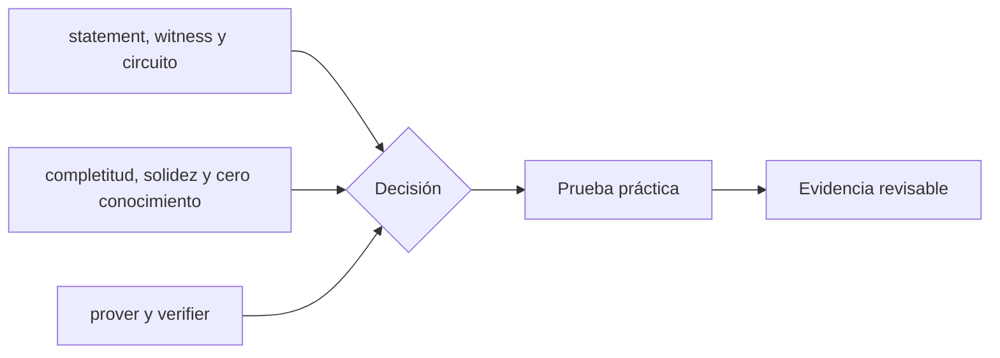

# Clase 29 · Compromisos y pruebas de conocimiento cero

> **Clase independiente 29 de 66** · **Nivel:** Avanzado · **Fuente base:** *Proofs, Arguments, and Zero-Knowledge* (Thaler) y ZKProof Community Reference
>
> [⬅️ Clase anterior](../13-interoperabilidad/clase-28-modelo-de-amenazas-de-puentes.md) · [📚 Índice de las 66 clases](../README.md) · [🗂️ Mapa del tema](README.md) · [➡️ Clase siguiente](../14-privacidad-zk/clase-30-snark-stark-y-privacidad-real.md)

## Punto de partida

**Pregunta guía:** ¿Cómo se demuestra una afirmación sin revelar el dato que la sostiene?

**Caso que abre la clase:** Demostrar mayoría de edad sin publicar fecha de nacimiento.

Una afirmación cotidiana se separa en entradas públicas, witness privado y restricciones. El estudiante descubre qué se demuestra exactamente antes de elegir una tecnología ZK.

## Gráfico pedagógico

Recorre el gráfico en voz alta: identifica supuestos, transformaciones y el punto exacto donde aparece evidencia.



## Trabajo práctico

**Método propio:** construcción de un circuito desde lenguaje natural.

**Actividad:** Separar datos públicos, privados y restricciones de un circuito sencillo.

Trabaja en entorno local, regtest, signet o testnet según corresponda. Conserva entradas, comandos, salidas y bloque o instante de corte. Una captura aislada no demuestra reproducibilidad.

## Fundamentos que sostienen la respuesta

1. **statement, witness y circuito.** En esta clase delimita qué objeto o relación estamos observando antes de sacar conclusiones. Localízalo explícitamente en «Demostrar mayoría de edad sin publicar fecha de nacimiento.» y anota qué dato faltaría para refutar tu lectura.
2. **completitud, solidez y cero conocimiento.** En esta clase explica el mecanismo que conecta la situación inicial con el cambio observable. Localízalo explícitamente en «Demostrar mayoría de edad sin publicar fecha de nacimiento.» y anota qué dato faltaría para refutar tu lectura.
3. **prover y verifier.** En esta clase permite contrastar el resultado y formular el límite de la evidencia. Localízalo explícitamente en «Demostrar mayoría de edad sin publicar fecha de nacimiento.» y anota qué dato faltaría para refutar tu lectura.

### El nullifier: anti doble gasto sin revelar qué se gasta

En un protocolo de privacidad, las notas no se marcan como "gastadas" —hacerlo revelaría cuál se gastó—. El nullifier resuelve el dilema: es un valor determinista derivado del secreto de la nota, imposible de vincular con su commitment sin conocer ese secreto, pero único por nota. Ejemplo conceptual numerado:

1. Alicia crea una nota con secreto `s` y publica su commitment `C = H(s, valor)` en el árbol de Merkle del protocolo; nadie sabe que `C` es de Alicia.
2. Para gastar, Alicia calcula el nullifier `NF = H'(s)` con una función distinta, y genera una prueba ZK de que conoce un `s` tal que su commitment está en el árbol **y** que `NF` se deriva de ese mismo `s`.
3. El contrato verifica la prueba, comprueba que `NF` no figura en la lista pública de nullifiers, lo añade y libera el gasto. La prueba no revela cuál de los miles de commitments del árbol se usó.
4. Si Alicia intenta gastar la misma nota otra vez, el circuito la obliga a producir el mismo `NF = H'(s)`, que ya está registrado: la transacción se rechaza. El doble gasto se detecta sin haber desanonimizado ningún gasto legítimo.

El mismo patrón aparece fuera de la privacidad de pagos: los rollups ZK y los sistemas de identidad (por ejemplo, votación anónima o airdrops de un solo uso) usan nullifiers para garantizar "una sola vez por secreto" sin correlacionar acciones con identidades. El diseño fino importa: si el nullifier se deriva también de un contexto (un identificador de votación), la misma credencial puede usarse una vez *por contexto* sin que dos usos en contextos distintos sean vinculables.

### Una prueba ZK contada sin matemáticas

La idea suena imposible: *demostrar que sabes algo sin revelar qué sabes*. La analogía clásica —la cueva de Ali Babá— explica el mecanismo mejor que cualquier fórmula.

**La cueva.** Un túnel circular con una puerta cerrada al fondo que solo se abre con una palabra secreta. Desde la entrada, el túnel se bifurca en dos caminos, A y B, que se juntan en la puerta.

**El protocolo:**

1. Tú entras y tomas el camino que quieras. La otra persona **no ve cuál**.
2. Desde la entrada, grita al azar: "¡sal por A!".
3. Si sabes la palabra, sales por A siempre — cruzando la puerta si hiciera falta. Si no la sabes, solo puedes salir por donde entraste.

Con una ronda, alguien sin el secreto acierta con probabilidad **1/2**. Repítelo:

```text
 1 ronda  → 1/2      = 50 %      de engañar
10 rondas → 1/2^10   ≈ 0,1 %
20 rondas → 1/2^20   ≈ 0,0001 %
```

Y ahí están las tres propiedades, sin una sola fórmula:

- **Completitud:** si sabes la palabra, siempre pasas la prueba.
- **Solidez:** si no la sabes, la probabilidad de colar se hace despreciable con las repeticiones. No cero: *despreciable*. Toda prueba ZK es probabilística.
- **Conocimiento cero:** quien observa ve salidas correctas por caminos aleatorios. **Podría haber grabado ese mismo vídeo sin conocer el secreto**, poniéndose de acuerdo de antemano — por eso la transcripción no le sirve para convencer a un tercero, y por eso no filtra nada.

**Qué cambia en la versión real.** Los SNARK sustituyen las rondas interactivas por una sola prueba (la transformación de Fiat–Shamir, que usa un hash como si fuera el gritador aleatorio) y el "secreto" es un **witness** que satisface un circuito de restricciones.

**Y el límite que hay que tener presente:** la prueba demuestra que *conoces un valor que satisface el circuito*. Si el circuito dice "esta fecha de nacimiento está firmada por una autoridad y es anterior a 2007", la prueba no garantiza que la fecha sea cierta: garantiza que **alguien la certificó**. La confianza no desaparece, se traslada al certificador.

> 💡 **En una frase:** una prueba ZK convence de que una afirmación es cierta sin revelar por qué. No convierte en verdad un dato falso: solo prueba que satisface el circuito que escribiste.

<details>
<summary><strong>🎓 Si ya dominas esto</strong> — donde se decide el diseño</summary>

- **La asimetría prover/verifier es el punto entero.** Generar la prueba puede tardar segundos o minutos y consumir mucha memoria; verificarla en cadena cuesta un gas casi constante. Toda la arquitectura de los ZK rollups sale de ese desequilibrio.
- **El trusted setup no es un ritual: es un riesgo con nombre.** Si el "toxic waste" sobrevive, se fabrican pruebas de enunciados falsos. Las ceremonias multiparte lo mitigan porque basta **un** participante honesto; PLONK aporta un setup universal reutilizable entre circuitos, y los STARK lo eliminan usando solo aleatoriedad pública.
- **Los bugs de circuito son el riesgo real, no la criptografía.** Una restricción que falta ("under-constrained") permite pruebas válidas de cosas falsas, y el sistema criptográfico funciona perfectamente mientras eso ocurre. Es el equivalente ZK de una invariante mal escrita.
- **El conjunto de anonimato manda sobre la criptografía.** Ser uno entre diez usuarios de un mezclador no te oculta; ser uno entre cien mil, sí. Los patrones temporales, los importes redondos y la reutilización de direcciones reidentifican sin romper una sola prueba.
- **STARK es post-cuántico porque solo se apoya en hashes**; los SNARK sobre curvas elípticas no lo son. Si el horizonte del sistema son décadas, eso deja de ser un detalle académico.

</details>

## Demostración de aprendizaje

**Entregable:** Especificación de circuito con amenaza y propiedad demostrada.

**Comprobación formativa:** Escribe una restricción cuya ausencia permitiría una prueba engañosa.

Para aprobar debes conectar el hecho observado con el concepto correcto, descartar al menos una interpretación alternativa y redactar una conclusión cuyo alcance no exceda la prueba.

## Errores que esta clase corrige

- Tratar **statement, witness y circuito** como una etiqueta suficiente, sin identificar actores, dato y frontera.
- Usar **completitud, solidez y cero conocimiento** como explicación aunque el caso no aporte la evidencia necesaria.
- Dar por respondido «¿Cómo se demuestra una afirmación sin revelar el dato que la sostiene?» sin contrastar **prover y verifier**.

Vuelve al caso inicial, elige el error más peligroso y describe una comprobación concreta que lo detectaría.

## Fuentes para comprobar y ampliar

- Thaler, J., *Proofs, Arguments, and Zero-Knowledge* — <https://people.cs.georgetown.edu/jthaler/ProofsArgsAndZK.html>
- Least Authority, *The MoonMath Manual to zk-SNARKs* — <https://github.com/LeastAuthority/moonmath-manual>
- ZKProof, Community Reference — <https://zkproof.org/>
- circom, documentación del lenguaje de circuitos — <https://github.com/iden3/circom>

Consulta además la [bibliografía razonada](../../docs/bibliografia.md), que declara procedencia y uso.

## Cierre de la clase

Responde otra vez la pregunta guía sin mirar notas. Si tu respuesta no menciona evidencia, supuesto y límite, todavía describe el tema pero no lo domina. Continúa solo cuando otra persona pueda reproducir tu entregable.
