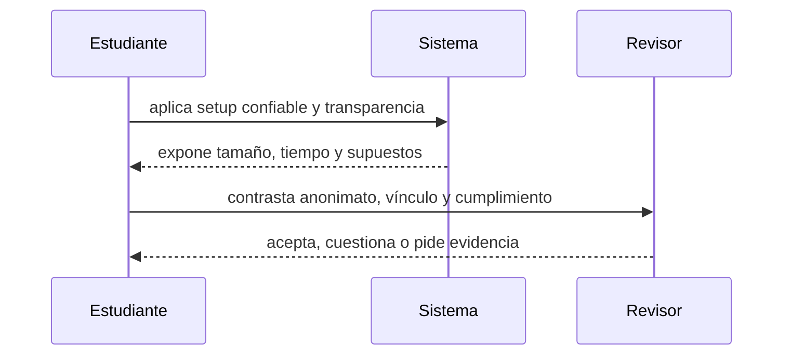

# Clase 30 · SNARK, STARK y privacidad real

> **Clase independiente 30 de 66** · **Nivel:** Avanzado · **Fuente base:** *Proofs, Arguments, and Zero-Knowledge* (Thaler) y ZKProof Community Reference
>
> [⬅️ Clase anterior](../14-privacidad-zk/clase-29-compromisos-y-pruebas-de-conocimiento-cero.md) · [📚 Índice de las 66 clases](../README.md) · [🗂️ Mapa del tema](README.md) · [➡️ Clase siguiente](../15-arquitectura-avanzada/clase-31-cuentas-programables-y-actualizaciones.md)

## Punto de partida

**Pregunta guía:** ¿Qué compromisos cambian entre sistemas y qué metadatos siguen visibles?

**Caso que abre la clase:** Una prueba oculta el monto, pero horarios y direcciones permiten correlación.

Después de comparar SNARK y STARK, el grupo intenta correlacionar horarios, direcciones y patrones. La privacidad se evalúa como sistema completo.

## Fundamentos que sostienen la respuesta

1. **setup confiable y transparencia.** En esta clase delimita qué objeto o relación estamos observando antes de sacar conclusiones. Localízalo explícitamente en «Una prueba oculta el monto, pero horarios y direcciones permiten correlación.» y anota qué dato faltaría para refutar tu lectura.
2. **tamaño, tiempo y supuestos.** En esta clase explica el mecanismo que conecta la situación inicial con el cambio observable. Localízalo explícitamente en «Una prueba oculta el monto, pero horarios y direcciones permiten correlación.» y anota qué dato faltaría para refutar tu lectura.
3. **anonimato, vínculo y cumplimiento.** En esta clase permite contrastar el resultado y formular el límite de la evidencia. Localízalo explícitamente en «Una prueba oculta el monto, pero horarios y direcciones permiten correlación.» y anota qué dato faltaría para refutar tu lectura.

### SNARK vs. STARK en números orientativos

Las cifras exactas dependen del esquema concreto (Groth16, PLONK, FRI...), del circuito y del hardware, pero los órdenes de magnitud marcan la decisión de diseño:

| Dimensión | SNARK (p. ej. Groth16, PLONK) | STARK |
|-----------|-------------------------------|-------|
| Tamaño de prueba | Cientos de bytes (Groth16: ~128-200 bytes) | Decenas a cientos de KB |
| Verificación | Milisegundos; barata en cadena (unos pocos pairings) | Milisegundos a decenas de ms; más gas en cadena por el tamaño |
| Setup | Confiable por circuito (Groth16) o universal actualizable (PLONK, KZG) | Transparente: solo aleatoriedad pública, sin ceremonia |
| Supuestos criptográficos | Curvas elípticas con pairings; supuestos no estándar | Funciones hash resistentes a colisiones; supuestos mínimos |
| Resistencia post-cuántica | No: un computador cuántico rompería la curva | Sí, en la medida en que el hash resista |
| Coste del prover | Alto, pero pruebas pequeñas | Alto, con mejor paralelización y sin setup |

Regla práctica: si la verificación en cadena debe ser lo más barata posible y se acepta una ceremonia, un SNARK con setup universal es la opción común; si la transparencia y el post-cuántico pesan más que el tamaño de prueba, un STARK (o un STARK envuelto en un SNARK final para abaratar la verificación, patrón usado por varios rollups) es la elección. Los sistemas de producción evolucionan rápido: contrasta los números del esquema concreto en su documentación.

### Ceremonias de trusted setup: Powers of Tau y el modelo 1-de-N

Un trusted setup genera parámetros públicos a partir de un secreto que debe destruirse; si alguien lo conserva (el llamado *toxic waste*), puede falsificar pruebas indistinguibles de las válidas, sin romper nada más del sistema. Las ceremonias multi-participante mitigan este riesgo transformándolo en un supuesto *1-de-N honesto*: cada participante aporta su propia aleatoriedad secreta y la mezcla secuencialmente con la contribución acumulada; para comprometer el resultado, un atacante necesitaría que **todos** los participantes coludieran o fueran comprometidos, mientras que basta **uno solo** que destruya su secreto para que los parámetros sean seguros.

Powers of Tau es la ceremonia genérica más conocida: produce parámetros reutilizables por muchos circuitos (la "fase 1" común, seguida de una fase 2 específica por circuito en esquemas como Groth16). Ejemplos reales verificables: la ceremonia perpetua de Powers of Tau iniciada por la comunidad de Zcash y Ethereum acumuló cientos de contribuciones públicas y auditables, con participantes que llegaron a usar residuos radiactivos o rituales físicos de destrucción de hardware como evidencia teatral pero ilustrativa; la ceremonia KZG de Ethereum para EIP-4844 (2023) superó las 140 000 contribuciones, el mayor N de la historia, precisamente para que el supuesto "al menos uno fue honesto" resultara socialmente creíble. Los setups universales (PLONK) amortizan una sola ceremonia entre todos los circuitos futuros, y los sistemas transparentes (STARK) la eliminan por completo.

## Gráfico pedagógico

Recorre el gráfico en voz alta: identifica supuestos, transformaciones y el punto exacto donde aparece evidencia.

## Demostración de aprendizaje

**Entregable:** Selección argumentada que incluya costo, confianza y límites de privacidad.

**Comprobación formativa:** ¿Qué dato permanece visible aunque el monto se pruebe en conocimiento cero?

Para aprobar debes conectar el hecho observado con el concepto correcto, descartar al menos una interpretación alternativa y redactar una conclusión cuyo alcance no exceda la prueba.

## Trabajo práctico

**Método propio:** comparación con fuga de metadatos.

**Actividad:** Comparar dos esquemas y enumerar canales laterales de información.

Trabaja en entorno local, regtest, signet o testnet según corresponda. Conserva entradas, comandos, salidas y bloque o instante de corte. Una captura aislada no demuestra reproducibilidad.

## Errores que esta clase corrige

- Tratar **setup confiable y transparencia** como una etiqueta suficiente, sin identificar actores, dato y frontera.
- Usar **tamaño, tiempo y supuestos** como explicación aunque el caso no aporte la evidencia necesaria.
- Dar por respondido «¿Qué compromisos cambian entre sistemas y qué metadatos siguen visibles?» sin contrastar **anonimato, vínculo y cumplimiento**.

Vuelve al caso inicial, elige el error más peligroso y describe una comprobación concreta que lo detectaría.

## Fuentes para comprobar y ampliar

- Thaler, J., *Proofs, Arguments, and Zero-Knowledge* — <https://people.cs.georgetown.edu/jthaler/ProofsArgsAndZK.html>
- Least Authority, *The MoonMath Manual to zk-SNARKs* — <https://github.com/LeastAuthority/moonmath-manual>
- ZKProof, Community Reference — <https://zkproof.org/>
- circom, documentación del lenguaje de circuitos — <https://github.com/iden3/circom>

Consulta además la [bibliografía razonada](../../docs/bibliografia.md), que declara procedencia y uso.

## Cierre de la clase

Responde otra vez la pregunta guía sin mirar notas. Si tu respuesta no menciona evidencia, supuesto y límite, todavía describe el tema pero no lo domina. Continúa solo cuando otra persona pueda reproducir tu entregable.
